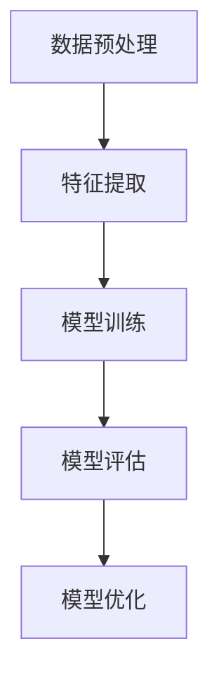
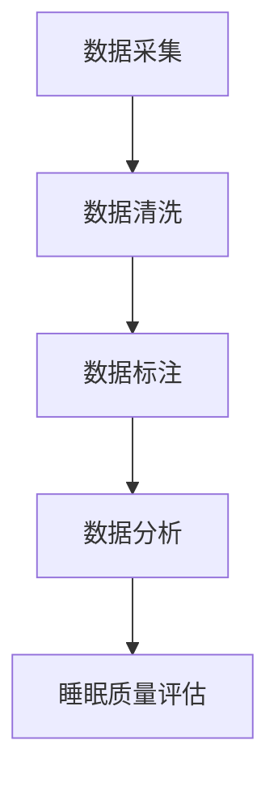
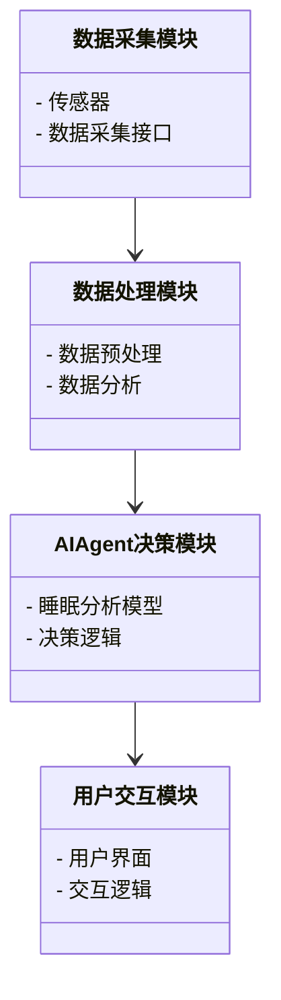
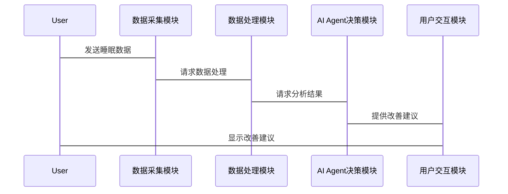

                 


# AI Agent在智能床头柜中的睡眠辅助功能

## 关键词：AI Agent，智能床头柜，睡眠辅助，机器学习，自然语言处理

## 摘要

本文探讨了AI Agent在智能床头柜中的睡眠辅助功能，分析了AI Agent的基本概念、睡眠健康的重要性以及智能床头柜的发展现状。详细讲解了机器学习和自然语言处理的核心算法原理，并通过系统架构设计、项目实战和最佳实践，展示了如何将AI Agent应用于智能床头柜的睡眠辅助功能中，实现高效的睡眠监测和优化。

---

# 第一部分: AI Agent与睡眠健康概述

## 第1章: AI Agent与睡眠健康概述

### 1.1 AI Agent的基本概念

#### 1.1.1 AI Agent的定义与特点

AI Agent（人工智能代理）是一种能够感知环境、执行任务以实现特定目标的智能实体。它具备以下特点：

- **自主性**：能够在没有外部干预的情况下运行。
- **反应性**：能够根据环境变化做出实时响应。
- **学习能力**：通过数据和经验不断优化自身性能。
- **社交能力**：能够与其他系统或用户进行交互。

AI Agent的核心目标是通过智能算法，帮助用户完成复杂任务或提供决策支持。

#### 1.1.2 AI Agent的核心功能与应用场景

AI Agent在睡眠辅助中的主要功能包括：

- 数据采集与处理：通过传感器收集用户的睡眠数据，如心率、呼吸频率、体动次数等。
- 数据分析与优化：基于机器学习算法，分析睡眠数据，识别睡眠障碍并提出改善建议。
- 用户交互：通过自然语言处理技术，与用户进行对话，提供个性化的睡眠管理建议。

#### 1.1.3 智能床头柜的发展背景与趋势

智能床头柜作为一种智能家居设备，近年来发展迅速。它不仅具备传统床头柜的功能，还集成了多种智能技术，如物联网、AI Agent等。随着人们对睡眠健康的关注增加，智能床头柜的市场需求持续增长。

---

### 1.2 睡眠健康的重要性

#### 1.2.1 睡眠对健康的影响

睡眠是人体健康的重要组成部分，直接影响人的精力、情绪和认知能力。良好的睡眠有助于身体修复和大脑功能的正常运转。

#### 1.2.2 睡眠障碍的现状与挑战

现代生活中，许多人面临睡眠障碍的问题，如失眠、睡眠呼吸暂停综合征等。这些问题不仅影响个人健康，还可能导致工作效率下降和生活质量降低。

#### 1.2.3 智能设备在睡眠健康中的作用

智能设备，如智能床头柜，能够通过AI Agent实时监测用户的睡眠状态，并提供个性化的睡眠改善建议。这使得睡眠健康管理更加便捷和高效。

---

### 1.3 智能床头柜的功能与优势

#### 1.3.1 智能床头柜的功能模块

智能床头柜的主要功能模块包括：

- **数据采集模块**：通过传感器收集睡眠数据。
- **AI Agent决策模块**：分析数据并提供改善建议。
- **用户交互模块**：与用户进行实时互动。

#### 1.3.2 AI Agent在睡眠辅助中的独特优势

AI Agent通过机器学习和自然语言处理技术，能够实现以下功能：

- 精准的睡眠数据分析。
- 个性化的睡眠改善建议。
- 实时的用户交互与反馈。

#### 1.3.3 用户需求与市场前景分析

随着人们对健康的关注增加，智能床头柜的市场需求稳步增长。未来，随着AI技术的不断进步，智能床头柜的功能将更加智能化和个性化。

---

## 1.4 本章小结

本章介绍了AI Agent的基本概念、睡眠健康的重要性以及智能床头柜的功能与优势。通过这些内容，读者可以理解AI Agent在睡眠辅助中的核心作用。

---

# 第二部分: AI Agent的核心技术与原理

## 第2章: AI Agent的核心技术

### 2.1 机器学习与自然语言处理

#### 2.1.1 机器学习的基本原理

机器学习是一种通过数据训练模型的技术。其基本流程如下：

1. **数据预处理**：清洗和归一化数据。
2. **特征提取**：提取对模型有用的特征。
3. **模型训练**：使用训练数据训练模型。
4. **模型评估**：通过测试数据评估模型性能。
5. **模型优化**：调整模型参数以提高性能。

#### 2.1.2 自然语言处理的最新进展

自然语言处理（NLP）技术近年来取得了显著进展，尤其是在以下方面：

- **词嵌入**：通过Word2Vec、GloVe等技术将单词映射为向量。
- **序列模型**：使用RNN、LSTM等模型处理序列数据。
- **注意力机制**：通过注意力机制捕捉数据中的关键信息。

#### 2.1.3 结合睡眠数据的AI Agent设计

在睡眠辅助功能中，AI Agent需要处理多种类型的数据，包括：

- **睡眠数据**：心率、呼吸频率等。
- **用户反馈**：用户的睡眠感受和需求。

通过机器学习和自然语言处理技术，AI Agent能够分析这些数据并提供个性化的睡眠改善建议。

#### 2.1.4 使用Mermaid流程图展示机器学习流程



---

### 2.2 睡眠监测技术

#### 2.2.1 睡眠监测的主要方法

睡眠监测的主要方法包括：

- **生理指标监测**：心率、呼吸频率等。
- **运动监测**：体动次数。
- **环境监测**：温度、湿度等。

#### 2.2.2 睡眠数据的采集与处理

睡眠数据的采集与处理流程如下：

1. **数据采集**：通过传感器采集睡眠数据。
2. **数据清洗**：去除噪声和异常值。
3. **数据标注**：将数据标注为不同睡眠阶段（如REM、N1、N2、N3）。

#### 2.2.3 数据分析与睡眠质量评估

通过机器学习算法，可以对睡眠数据进行分析，评估睡眠质量。常用的算法包括：

- **K-means聚类**：用于睡眠阶段的划分。
- **随机森林分类**：用于睡眠障碍的分类。

#### 2.2.4 使用Mermaid流程图展示睡眠数据处理流程



---

### 2.3 AI Agent与睡眠数据的结合

#### 2.3.1 数据预处理与特征提取

数据预处理包括：

- **去噪**：去除传感器噪声。
- **归一化**：将数据归一化到统一范围。

特征提取包括：

- **时域特征**：均值、标准差等。
- **频域特征**：功率谱密度等。

#### 2.3.2 模型训练与优化

模型训练流程如下：

1. **数据分割**：将数据划分为训练集和测试集。
2. **模型选择**：选择合适的模型结构。
3. **模型训练**：使用训练数据训练模型。
4. **模型评估**：通过测试数据评估模型性能。
5. **模型优化**：调整超参数以提高性能。

#### 2.3.3 睡眠辅助功能的实现

通过AI Agent，可以实现以下睡眠辅助功能：

- **睡眠阶段划分**：识别用户的睡眠阶段。
- **睡眠障碍检测**：检测失眠、呼吸暂停等睡眠障碍。
- **个性化建议**：根据用户睡眠数据，提供改善建议。

---

## 2.4 本章小结

本章详细讲解了机器学习和自然语言处理的核心算法，以及它们在睡眠监测中的应用。通过这些技术，AI Agent能够实现高效的睡眠数据分析和优化。

---

# 第三部分: 睡眠辅助功能的系统设计与实现

## 第3章: 睡眠辅助系统的架构设计

### 3.1 系统功能模块划分

系统功能模块包括：

- **数据采集模块**：负责采集用户的睡眠数据。
- **数据处理模块**：对采集到的数据进行预处理和分析。
- **AI Agent决策模块**：基于分析结果提供改善建议。
- **用户交互模块**：与用户进行实时互动。

### 3.2 系统架构设计

系统架构采用分层架构设计：

1. **数据采集层**：通过传感器采集数据。
2. **数据处理层**：对数据进行预处理和分析。
3. **AI Agent决策层**：基于分析结果提供决策支持。
4. **用户交互层**：通过界面与用户进行互动。

#### 3.2.1 使用Mermaid类图展示系统架构设计



---

### 3.3 系统接口设计

系统接口设计包括：

- **数据采集接口**：用于与传感器通信。
- **AI Agent接口**：用于与其他系统或用户的交互。
- **用户交互接口**：用于与用户进行实时互动。

---

### 3.4 系统交互流程设计

系统交互流程如下：

1. **用户输入数据**：通过传感器采集用户的睡眠数据。
2. **数据处理**：数据处理模块对数据进行预处理和分析。
3. **AI Agent决策**：AI Agent决策模块基于分析结果提供改善建议。
4. **用户反馈**：用户根据建议调整睡眠习惯。

#### 3.4.1 使用Mermaid序列图展示系统交互流程



---

## 3.5 本章小结

本章详细讲解了睡眠辅助系统的架构设计和接口设计。通过这些设计，系统能够高效地实现睡眠数据的采集、处理和优化。

---

# 第四部分: 项目实战

## 第4章: 项目实战

### 4.1 环境安装

项目实战需要以下环境：

- **硬件环境**：智能床头柜、传感器等。
- **软件环境**：Python、机器学习库（如Scikit-learn、TensorFlow）。

---

### 4.2 系统核心实现源代码

以下是系统核心实现的Python代码：

```python
import numpy as np
from sklearn.model_selection import train_test_split
from sklearn.ensemble import RandomForestClassifier
from sklearn.metrics import accuracy_score

# 数据预处理
data = np.array([...])  # 睡眠数据
labels = np.array([...])  # 睡眠阶段标签

# 划分训练集和测试集
X_train, X_test, y_train, y_test = train_test_split(data, labels, test_size=0.2)

# 模型训练
model = RandomForestClassifier()
model.fit(X_train, y_train)

# 模型评估
y_pred = model.predict(X_test)
print("Accuracy:", accuracy_score(y_test, y_pred))
```

---

### 4.3 代码应用解读与分析

上述代码展示了如何使用随机森林算法对睡眠数据进行分类。通过训练模型，可以准确识别用户的睡眠阶段，并提供改善建议。

---

### 4.4 实际案例分析和详细讲解剖析

通过实际案例分析，可以验证AI Agent在睡眠辅助中的有效性。例如，通过分析用户的睡眠数据，AI Agent可以识别用户的失眠问题，并提供相应的改善建议，如调整作息时间、改善睡眠环境等。

---

## 4.5 项目小结

本章通过项目实战，展示了如何将AI Agent应用于智能床头柜的睡眠辅助功能中。通过实际案例分析，验证了系统的有效性和优势。

---

# 第五部分: 最佳实践与小结

## 第5章: 最佳实践与小结

### 5.1 最佳实践 tips

- **数据质量**：确保数据的准确性和完整性。
- **模型优化**：通过交叉验证等方法优化模型性能。
- **用户隐私**：保护用户的隐私数据，确保数据安全。

### 5.2 本章小结

本章总结了AI Agent在智能床头柜中的睡眠辅助功能的核心技术与实现。通过最佳实践，确保系统的高效和安全。

---

# 作者：AI天才研究院 & 禅与计算机程序设计艺术

---

以上是《AI Agent在智能床头柜中的睡眠辅助功能》的技术博客文章。通过系统的分析和详细的讲解，展示了AI Agent在睡眠辅助中的重要应用和实现方法。

