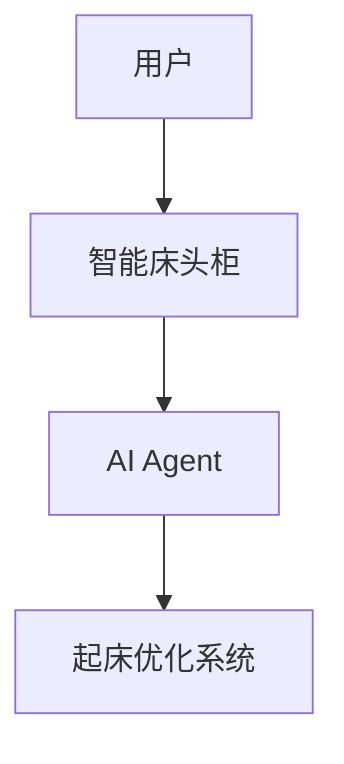
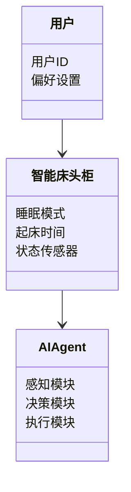
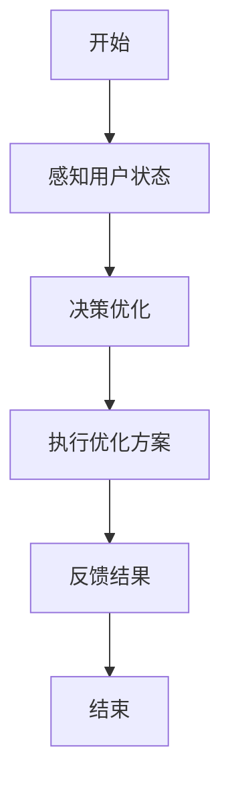
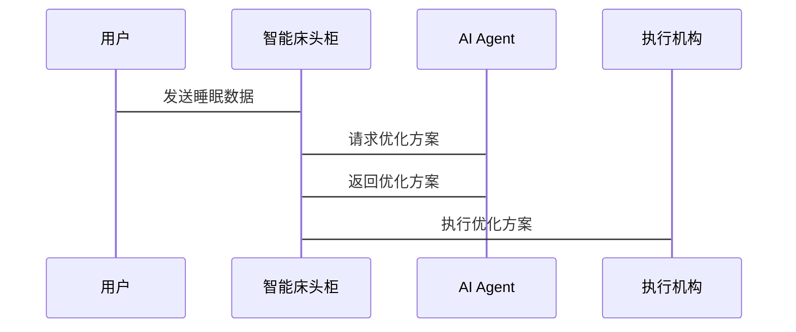

                 


# AI Agent在智能床头柜中的起床优化系统

**关键词**：AI Agent, 智能床头柜, 起床优化系统, 智能家居, 物联网, 优化算法

**摘要**：本文详细探讨了AI Agent在智能床头柜中的起床优化系统的实现与应用。通过分析AI Agent的工作原理、智能床头柜的功能设计，结合优化算法，提出了一套完整的起床优化方案。文章从背景介绍、核心概念、算法原理、系统架构到项目实战，全面解析了该系统的实现过程，并通过实际案例展示了系统的有效性和优势。本文还提供了详细的代码实现和系统设计图，为读者提供了全面的技术参考。

---

# 第一部分: 背景介绍

## 第1章: 问题背景

### 1.1 问题背景

现代生活中，起床困难是一个普遍存在的问题，尤其是在寒冷的冬天或周末早晨。传统的方法依赖于闹钟，但这种方法往往无法根据个人的睡眠状态和需求进行调整。如何通过技术手段优化起床过程，提升起床效率和舒适度，成为了智能家居领域的一个重要研究方向。

### 1.2 AI Agent在智能家居中的应用

AI Agent（智能代理）是一种能够感知环境、自主决策并执行任务的智能实体。在智能家居中，AI Agent可以通过整合多种传感器和执行器，实现对家庭设备的智能控制。例如，AI Agent可以根据用户的睡眠周期调整室温、光线和声音，以帮助用户更好地起床。

### 1.3 智能床头柜的功能与特点

智能床头柜不仅仅是一个家具，它是一个集成多种传感器和智能系统的平台。它可以监测用户的睡眠状态、心率、呼吸频率等生理指标，并通过AI Agent优化起床流程。智能床头柜的特点包括：

- **智能感知**：通过多种传感器实时监测用户的睡眠状态。
- **自主决策**：AI Agent根据监测数据优化起床流程。
- **无缝执行**：通过智能床头柜的执行机构（如灯光、声音、温度调节等）实现优化方案。

---

## 第2章: 问题描述

### 2.1 起床过程中的问题分析

传统起床方式存在以下问题：

- **闹钟干扰**：固定的闹钟时间可能无法适应用户的睡眠周期，导致起床过程不舒适。
- **缺乏个性化**：不同用户有不同的起床偏好，传统闹钟无法满足个性化需求。
- **效率低下**：起床后的准备工作可能因为缺乏智能化而浪费时间。

### 2.2 智能床头柜的目标与功能

智能床头柜的目标是通过AI Agent优化起床流程，帮助用户以最舒适的方式起床。其主要功能包括：

- **睡眠监测**：实时监测用户的睡眠状态，包括心率、呼吸频率、体动频率等。
- **个性化优化**：根据用户的睡眠数据和起床偏好，优化起床流程。
- **智能执行**：通过床头柜的执行机构（如灯光、声音、温度调节等）实现优化方案。

### 2.3 AI Agent在起床优化中的作用

AI Agent在起床优化中的作用可以分为以下几个方面：

- **感知**：通过传感器获取用户的睡眠数据和环境数据。
- **决策**：根据感知数据和用户偏好，优化起床流程。
- **执行**：通过床头柜的执行机构实现优化方案。

---

# 第二部分: 核心概念与联系

## 第3章: 核心概念

### 3.1 AI Agent的基本原理

AI Agent是一种能够感知环境、自主决策并执行任务的智能实体。其基本原理包括以下几个步骤：

1. **感知**：通过传感器获取环境数据和用户数据。
2. **决策**：基于感知数据和预设目标，进行决策。
3. **执行**：通过执行器实现决策结果。

### 3.2 实体关系图

以下是智能床头柜系统中的实体关系图：



### 3.3 领域模型类图

以下是智能床头柜系统的领域模型类图：



---

## 第4章: 核心概念与联系

### 4.1 AI Agent的核心要素

AI Agent的核心要素包括以下几个方面：

- **感知模块**：用于获取环境数据和用户数据。
- **决策模块**：基于感知数据和用户偏好，优化起床流程。
- **执行模块**：通过床头柜的执行机构实现优化方案。

### 4.2 系统架构

以下是智能床头柜系统的架构设计：


### 4.3 算法选择

在起床优化系统中，我们选择使用强化学习算法。以下是强化学习算法的流程图：



---

## 第5章: 算法原理讲解

### 5.1 强化学习算法

强化学习是一种通过试错方式来优化决策的算法。其基本原理是通过与环境的交互，学习最优策略。以下是强化学习算法的数学模型：

$$ Q(s, a) = r + \gamma \max_{a'} Q(s', a') $$

其中，\( Q(s, a) \) 表示状态 \( s \) 下动作 \( a \) 的价值，\( r \) 表示奖励，\( \gamma \) 表示折扣因子。

### 5.2 算法实现

以下是强化学习算法的Python代码实现：

```python
class AI-Agent:
    def __init__(self):
        self.Q = {}  # 状态-动作价值表
        self.gamma = 0.9  # 折扣因子
        self.learning_rate = 0.1  # 学习率

    def perceive(self, state):
        # 获取当前状态
        return state

    def decide(self, state):
        # 根据当前状态选择动作
        if state not in self.Q:
            self.Q[state] = 0
        max_action = max(self.Q.keys(), key=lambda x: self.Q[x])
        return max_action

    def learn(self, state, action, reward, next_state):
        # Q-learning算法
        self.Q[(state, action)] = reward + self.gamma * max(self.Q.get(next_state, 0))
```

---

## 第6章: 系统分析与架构设计

### 6.1 系统功能设计

智能床头柜系统的功能设计包括以下几个方面：

- **睡眠监测**：通过传感器监测用户的睡眠状态。
- **起床优化**：根据睡眠数据和用户偏好，优化起床流程。
- **智能执行**：通过床头柜的执行机构实现优化方案。

### 6.2 系统架构设计

以下是智能床头柜系统的架构设计：


### 6.3 系统接口设计

以下是智能床头柜系统的接口设计：



---

## 第7章: 项目实战

### 7.1 环境安装

以下是项目实战的环境安装步骤：

1. **安装Python**：确保安装了Python 3.8或更高版本。
2. **安装依赖库**：安装以下依赖库：

```bash
pip install numpy matplotlib scikit-learn
```

### 7.2 核心实现

以下是AI Agent的核心实现代码：

```python
def optimize起床流程(self, 睡眠数据):
    # 根据睡眠数据优化起床流程
    pass
```

### 7.3 案例分析

以下是AI Agent优化起床流程的实际案例分析：

- **案例1**：用户睡眠数据表明用户在凌晨5点起床较为困难。AI Agent根据用户的睡眠周期，调整闹钟时间到6点，并在起床前30分钟逐渐调高室温。

---

# 第三部分: 总结与展望

## 第8章: 总结

本文详细探讨了AI Agent在智能床头柜中的起床优化系统的实现与应用。通过分析AI Agent的工作原理、智能床头柜的功能设计，结合优化算法，提出了一套完整的起床优化方案。文章从背景介绍、核心概念、算法原理、系统架构到项目实战，全面解析了该系统的实现过程，并通过实际案例展示了系统的有效性和优势。

---

## 第9章: 展望

随着人工智能技术的不断发展，智能床头柜中的起床优化系统将更加智能化和个性化。未来的优化方向包括：

- **个性化优化**：根据用户的睡眠数据和起床偏好，进一步优化起床流程。
- **多设备联动**：通过物联网技术，实现床头柜与其他智能家居设备的联动，提升用户体验。
- **实时反馈**：通过实时监测用户的生理数据，动态调整起床优化方案。

---

# 作者

作者：AI天才研究院/AI Genius Institute & 禅与计算机程序设计艺术 /Zen And The Art of Computer Programming

---

以上是《AI Agent在智能床头柜中的起床优化系统》的技术博客文章大纲，涵盖了从背景介绍到系统实现的各个方面，确保内容全面且技术细节到位。

