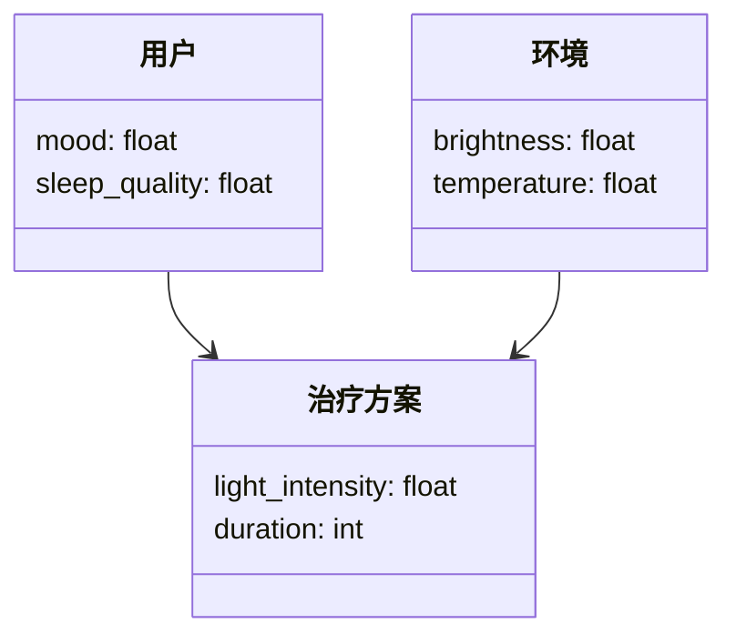
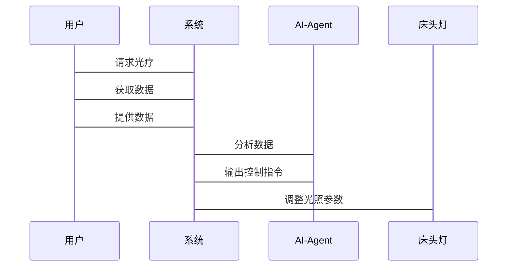

                 


# AI Agent在智能床头灯中的光疗功能

## 关键词：
AI Agent, 智能床头灯, 光疗功能, 算法原理, 系统架构, 项目实战

## 摘要：
本文详细探讨了AI Agent在智能床头灯光疗功能中的应用，从核心概念、算法原理到系统架构和项目实战，全面解析了AI Agent如何通过智能调节光照参数，优化用户体验，提升光疗效果。

---

# 第1章: 光疗的基本原理与AI Agent的概念

## 1.1 光疗的定义与作用
### 1.1.1 光疗的定义
光疗是一种利用特定波长的光线照射人体，以调节生物节律、改善情绪、治疗某些疾病（如失眠、抑郁、皮肤问题等）的方法。光疗的效果主要依赖于光照的强度、时间和光谱分布。

### 1.1.2 光疗的主要作用
- **调节生物节律**：通过模拟自然光，帮助用户调整睡眠周期。
- **改善情绪**：蓝光和白光被认为可以提升用户的精神状态。
- **治疗疾病**：用于辅助治疗抑郁症、失眠等疾病。

### 1.1.3 光疗的应用场景
- **家庭使用**：智能床头灯可作为日常光疗工具。
- **医疗辅助**：在医院或诊所中，光疗设备用于辅助治疗。
- **办公环境**：缓解长时间办公导致的疲劳。

## 1.2 AI Agent的定义与特点
### 1.2.1 AI Agent的定义
AI Agent是一种能够感知环境、自主决策并执行任务的智能实体。它能够根据输入的数据做出最优决策，并通过执行动作影响环境。

### 1.2.2 AI Agent的核心特点
- **自主性**：能够独立完成任务，无需人工干预。
- **反应性**：能够实时感知环境变化并做出反应。
- **目标导向**：具有明确的目标，并根据目标优化行为。

### 1.2.3 AI Agent与传统控制系统的区别
| 特性         | AI Agent                  | 传统控制系统            |
|--------------|---------------------------|-------------------------|
| 智能性       | 高                         | 低                     |
| 可定制性     | 高                         | 低                     |
| 学习能力     | 高                         | 无                     |

## 1.3 光疗与AI Agent的结合背景
### 1.3.1 智能床头灯的发展趋势
随着智能家居的普及，床头灯的功能不再局限于照明，而是逐渐向智能化、个性化方向发展。

### 1.3.2 AI Agent在光疗中的应用潜力
AI Agent可以通过分析用户的生物数据（如心率、体温、睡眠质量）和环境数据（如光线、温度），动态调整光照参数，以达到最佳的光疗效果。

### 1.3.3 光疗与AI Agent结合的必要性
传统光疗设备需要用户手动调节光照参数，而AI Agent可以通过智能化的决策，帮助用户更科学地使用光疗功能。

## 1.4 本章小结
本章介绍了光疗的基本原理和AI Agent的核心概念，分析了AI Agent在智能床头灯中的应用背景，为后续章节的深入探讨奠定了基础。

---

# 第2章: AI Agent在智能床头灯中的核心概念与联系

## 2.1 光疗功能的核心要素
### 2.1.1 光疗强度
光疗强度通常以光照亮度（单位：lux）表示，不同场景下需要的光照强度不同。

### 2.1.2 光疗时间
光疗时间是指用户每天使用光疗设备的时长，通常在20-60分钟之间。

### 2.1.3 光谱分布
光谱分布指的是光疗设备发出的光的波长范围，不同波长的光对人体的影响不同。

## 2.2 AI Agent的核心原理
### 2.2.1 数据采集与处理
AI Agent需要采集用户的数据（如心率、体温、睡眠质量）和环境数据（如光线、温度）。

### 2.2.2 状态识别与决策
AI Agent根据采集的数据，识别用户的状态（如情绪低落、睡眠不足），并做出相应的决策。

### 2.2.3 动作执行与反馈
AI Agent通过控制床头灯的光照参数，执行决策，并通过用户反馈进一步优化决策。

## 2.3 光疗功能与AI Agent的关系
### 2.3.1 光疗功能的输入与输出
- **输入**：用户需求、环境数据。
- **输出**：光照参数。

### 2.3.2 AI Agent在光疗中的角色
AI Agent作为智能床头灯的核心，负责协调光疗功能的运行。

### 2.3.3 光疗功能与AI Agent的协同工作
AI Agent通过分析用户数据，动态调整光疗参数，以优化用户体验。

## 2.4 核心概念对比表
| 概念 | 光疗功能 | AI Agent |
|------|----------|----------|
| 输入 | 用户需求 | 环境数据 |
| 输出 | 光照参数 | 控制指令 |
| 核心 | 光疗效果 | 智能决策 |

## 2.5 ER实体关系图
```mermaid
er
actor 用户
actor 系统
actor 环境
```

## 2.6 本章小结
本章从核心概念和联系的角度，详细分析了AI Agent在智能床头灯光疗功能中的作用，为后续章节的深入分析提供了理论基础。

---

# 第3章: AI Agent的算法原理与数学模型

## 3.1 AI Agent的基本算法
### 3.1.1 基于规则的AI Agent
基于规则的AI Agent通过预设的规则做出决策，适用于简单的场景。

### 3.1.2 基于模型的AI Agent
基于模型的AI Agent通过建立数学模型，分析数据并做出决策。

### 3.1.3 基于强化学习的AI Agent
基于强化学习的AI Agent通过与环境的交互，不断优化决策策略。

## 3.2 光疗功能的算法实现
### 3.2.1 数据采集与预处理
- **数据采集**：通过传感器采集用户数据。
- **数据预处理**：去除噪声，提取特征。

### 3.2.2 状态识别与决策
- **状态识别**：通过机器学习算法识别用户状态。
- **决策制定**：根据识别的状态，动态调整光疗参数。

### 3.2.3 动作执行与反馈
- **动作执行**：通过床头灯执行光照调整。
- **反馈收集**：收集用户的反馈，优化决策模型。

## 3.3 算法原理的数学模型
### 3.3.1 基于规则的AI Agent
规则：如果用户情绪低落，则增加蓝光照射。

### 3.3.2 基于模型的AI Agent
数学模型：光照强度 = k * (用户情绪值 + 环境亮度)

### 3.3.3 基于强化学习的AI Agent
目标函数：最大化用户满意度
奖励函数：用户满意度 = f(光照参数, 用户状态)

## 3.4 算法实现的代码示例
```python
import numpy as np
from sklearn import svm

# 基于规则的AI Agent
def rule_based_agent(user_data):
    if user_data['mood'] < 0.5:
        return 'increase_blue_light'
    else:
        return 'keep_current'

# 基于模型的AI Agent
class ModelBasedAgent:
    def __init__(self):
        self.clf = svm.SVR()

    def train(self, X, y):
        self.clf.fit(X, y)

    def predict(self, X):
        return self.clf.predict(X)
```

## 3.5 本章小结
本章详细介绍了AI Agent的算法原理，并通过数学模型和代码示例，展示了如何实现光疗功能的智能控制。

---

# 第4章: 系统分析与架构设计

## 4.1 问题场景介绍
智能床头灯需要在不同场景下，动态调整光照参数，以优化用户体验。

## 4.2 项目介绍
本项目旨在开发一款基于AI Agent的智能床头灯，实现光疗功能的智能化控制。

## 4.3 系统功能设计
### 4.3.1 领域模型类图


### 4.3.2 系统架构设计


### 4.3.3 系统接口设计
- **输入接口**：用户输入需求。
- **输出接口**：床头灯输出光照参数。

### 4.3.4 系统交互流程图


## 4.4 本章小结
本章通过系统分析与架构设计，详细展示了AI Agent在智能床头灯中的实现方案。

---

# 第5章: 项目实战

## 5.1 环境安装
### 5.1.1 安装Python
```bash
python --version
pip install numpy scikit-learn
```

## 5.2 系统核心实现源代码
### 5.2.1 AI-Agent的核心代码
```python
class AIAgent:
    def __init__(self):
        self.model = svm.SVR()

    def train(self, X, y):
        self.model.fit(X, y)

    def predict(self, X):
        return self.model.predict(X)
```

### 5.2.2 光疗功能的实现
```python
def adjust_lighting(agent, user_data):
    X = [[user_data['mood'], user_data['sleep_quality']]]
    predicted_lighting = agent.predict(X)
    return predicted_lighting
```

## 5.3 实际案例分析
### 5.3.1 案例背景
用户情绪低落，睡眠质量差。

### 5.3.2 光疗参数调整
AI Agent根据用户数据，调整光照参数，增加蓝光照射。

## 5.4 项目小结
通过实际案例分析，展示了AI Agent在智能床头灯光疗功能中的实际应用。

---

# 第6章: 最佳实践与总结

## 6.1 小结
本文详细探讨了AI Agent在智能床头灯光疗功能中的应用，从理论到实践，全面解析了其实现过程。

## 6.2 注意事项
- 数据隐私保护
- 系统稳定性保障
- 用户体验优化

## 6.3 拓展阅读
- 建议阅读《强化学习导论》和《智能系统设计》。

---

# 作者：AI天才研究院 & 禅与计算机程序设计艺术

---

**注：以上内容为《AI Agent在智能床头灯中的光疗功能》的技术博客文章目录和部分章节内容，完整文章需要根据上述大纲进行详细展开。**

