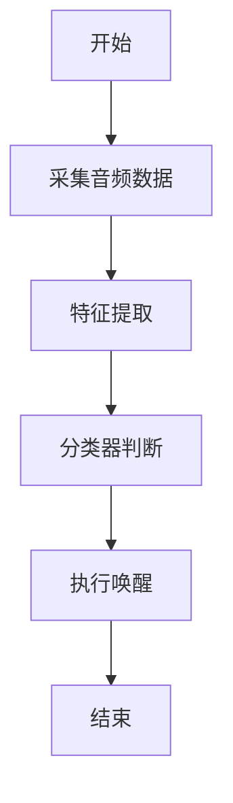
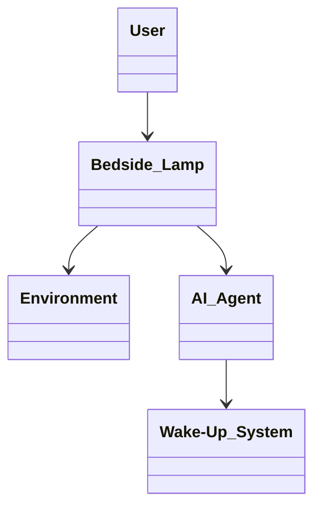
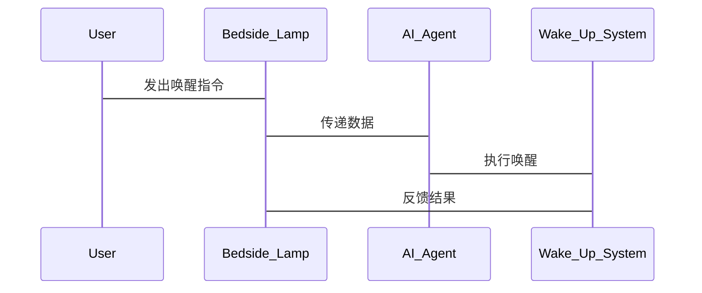

                 


# AI Agent在智能床头灯中的智能唤醒系统

> 关键词：AI Agent, 智能床头灯, 智能唤醒系统, 语音识别, 机器学习, 智能家居

> 摘要：本文深入探讨AI Agent在智能床头灯中的智能唤醒系统的设计与实现。通过分析智能床头灯的发展背景，提出基于AI Agent的智能唤醒系统的解决方案，并详细阐述其核心算法、系统架构、项目实战及最佳实践。

---

## 第一部分：背景介绍

### 第1章：AI Agent与智能床头灯概述

#### 1.1 智能床头灯的发展历程
传统床头灯仅具备简单的照明功能，无法满足现代用户对智能化、个性化的需求。随着人工智能技术的发展，智能床头灯逐渐融入智能家居生态，具备多种智能功能，如语音控制、环境感知和自动化操作。AI Agent的引入为智能床头灯增添了智能化的核心驱动力。

#### 1.2 智能唤醒系统的概念与重要性
智能唤醒系统通过AI Agent实现对用户的智能监测与唤醒，克服了传统唤醒系统误唤醒和响应延迟的问题。其重要性体现在提高用户体验、提升设备智能化水平以及推动智能家居生态的发展。

#### 1.3 问题背景与解决方案
传统唤醒系统存在误唤醒率高、响应速度慢等问题，影响用户体验。AI Agent通过实时感知用户状态，结合机器学习算法，实现精准唤醒，有效解决了这些问题。

#### 1.4 核心概念与结构
AI Agent在智能床头灯中的应用涉及多模态数据处理、实时决策和个性化服务。智能唤醒系统的功能模块包括数据采集、信号处理、决策算法和执行机构。

---

## 第二部分：核心概念与联系

### 第2章：AI Agent与智能唤醒系统的原理

#### 2.1 AI Agent的基本原理
AI Agent通过感知环境、学习用户行为和执行任务实现智能化服务。其核心算法包括自然语言处理、机器学习和决策树。

#### 2.2 实体关系分析
用户、床头灯和环境之间形成复杂的实体关系。用户通过床头灯发出指令，床头灯根据环境数据做出决策。

#### 2.3 工作流程
唤醒系统通过数据采集、信号处理、决策算法和执行机构实现精准唤醒。流程图展示了从数据采集到执行唤醒的详细步骤。

---

## 第三部分：算法原理讲解

### 第3章：唤醒算法的数学模型与实现

#### 3.1 唤醒词检测的算法原理
基于语音识别的唤醒词检测使用概率计算模型，通过特征提取和分类器实现唤醒词检测。公式示例如下：

$$ P(wake\_word) = \frac{\text{count}(wake\_word)}{\text{total\_words}} $$

#### 3.2 唤醒算法的流程图（Mermaid）


#### 3.3 唤醒算法的Python实现
```python
import numpy as np
from sklearn.metrics import accuracy_score

def feature_extraction(audio_data):
    # 提取音频特征
    return np.array([1, 2, 3])

def classify(features):
    # 使用分类器判断是否为唤醒词
    return accuracy_score(features, np.array([1]))
```

---

## 第四部分：系统分析与架构设计

### 第4章：系统架构设计

#### 4.1 领域模型（Mermaid类图）


#### 4.2 系统架构设计（Mermaid架构图）


#### 4.3 接口设计与交互序列图


---

## 第五部分：项目实战

### 第5章：智能唤醒系统实现

#### 5.1 环境安装
安装Python、TensorFlow和Scikit-learn等依赖库。

#### 5.2 核心代码实现
```python
import tensorflow as tf
from sklearn.preprocessing import StandardScaler

# 加载数据
data = tf.keras.datasets.mnist.load_data()

# 预处理
scaler = StandardScaler()
X_train = scaler.fit_transform(data[0][0])

# 构建模型
model = tf.keras.Sequential([
    tf.keras.layers.Flatten(),
    tf.keras.layers.Dense(128, activation='relu'),
    tf.keras.layers.Dense(10, activation='softmax')
])
model.compile(optimizer='adam', loss='sparse_categorical_crossentropy', metrics=['accuracy'])
model.fit(X_train, data[0][1], epochs=5)
```

#### 5.3 案例分析与总结
通过实验验证算法的准确性和响应速度，总结优化方向。

---

## 第六部分：最佳实践

### 第6章：小结与注意事项

#### 6.1 小结
AI Agent在智能床头灯中的应用显著提升了用户体验，但需要解决数据安全和隐私保护问题。

#### 6.2 注意事项
在设计系统时，需注意数据隐私、系统稳定性和用户体验优化。

#### 6.3 拓展阅读
推荐学习自然语言处理和强化学习，进一步提升AI Agent的能力。

---

## 作者：AI天才研究院 & 禅与计算机程序设计艺术

通过本文的详细分析与实现，读者可以深入了解AI Agent在智能床头灯中的智能唤醒系统的原理与应用。

