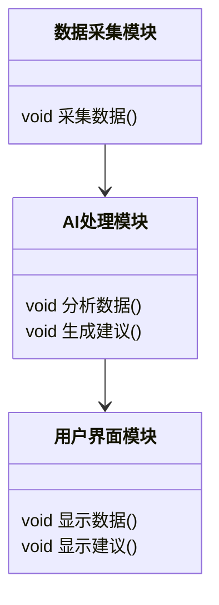
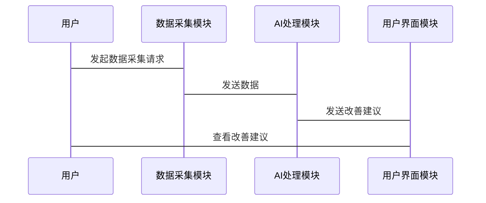

                 


# AI Agent在智能床头灯中的睡眠辅助

## 关键词：AI Agent, 智能床头灯, 睡眠辅助, 睡眠监测, 算法原理

## 摘要：本文详细探讨了AI Agent在智能床头灯中的睡眠辅助应用。从背景介绍到系统架构设计，再到项目实战，全面分析了如何通过AI技术改善睡眠质量。文章深入讲解了睡眠监测技术、AI Agent的核心算法、系统架构设计以及实际项目实现，为读者提供了全面的技术指导。

---

# 第1章: 背景介绍

## 1.1 问题背景

### 1.1.1 睡眠问题的现状
现代社会的快节奏生活导致许多人面临睡眠问题，如失眠、睡眠质量差等。这些问题不仅影响个人健康，还可能引发其他健康问题。

### 1.1.2 智能床头灯的发展趋势
智能床头灯逐渐从传统照明工具转变为多功能智能设备，集成睡眠监测、环境调节等多种功能。

### 1.1.3 AI Agent在睡眠辅助中的作用
AI Agent通过分析用户的睡眠数据，提供个性化的睡眠改善建议，优化用户的睡眠质量。

## 1.2 问题描述

### 1.2.1 睡眠监测的挑战
现有睡眠监测技术存在数据采集不准确、算法复杂等问题，难以提供有效的睡眠改善方案。

### 1.2.2 睡眠辅助的需求分析
用户需要个性化的睡眠改善方案，包括睡眠监测、环境调节、行为建议等。

### 1.2.3 AI Agent如何解决睡眠问题
AI Agent通过实时监测用户的睡眠数据，结合环境数据，提供智能化的睡眠改善建议。

## 1.3 问题解决

### 1.3.1 AI Agent的核心功能
AI Agent能够实时监测用户的睡眠数据，分析数据并提供个性化的睡眠改善建议。

### 1.3.2 AI Agent与智能床头灯的结合
通过AI Agent与智能床头灯的结合，实现睡眠监测、环境调节和行为引导，帮助用户改善睡眠质量。

### 1.3.3 睡眠辅助的具体实现方式
通过传感器采集用户的生理数据和环境数据，利用AI算法进行分析，生成个性化的睡眠改善方案。

## 1.4 边界与外延

### 1.4.1 AI Agent的功能边界
AI Agent仅负责睡眠数据的采集和分析，不涉及其他功能。

### 1.4.2 智能床头灯的适用场景
适用于家庭、酒店等需要改善睡眠质量的场景。

### 1.4.3 睡眠辅助的未来发展
随着技术的进步，AI Agent在睡眠辅助中的应用将更加智能化和个性化。

## 1.5 概念结构与核心要素组成

### 1.5.1 AI Agent的组成要素
AI Agent由数据采集模块、数据分析模块、决策模块和执行模块组成。

### 1.5.2 智能床头灯的系统架构
智能床头灯由硬件设备、数据采集模块、AI处理模块和用户界面模块组成。

### 1.5.3 睡眠辅助的核心流程
数据采集 -> 数据分析 -> 生成改善建议 -> 执行改善方案 -> 反馈结果。

---

# 第2章: AI Agent的核心概念与联系

## 2.1 核心概念原理

### 2.1.1 AI Agent的定义与特点
AI Agent是一种能够感知环境、自主决策并执行任务的智能体。

### 2.1.2 AI Agent的工作原理
AI Agent通过感知环境数据，利用算法进行分析和决策，执行相应的动作。

### 2.1.3 AI Agent与智能床头灯的交互机制
AI Agent通过床头灯的传感器采集数据，分析后发送指令，调整床头灯的亮度、颜色等参数。

## 2.2 核心概念属性特征对比表格

| 概念       | 自主性 | 学习性 | 适应性 |
|------------|--------|--------|--------|
| AI Agent   | 高     | 高     | 高     |
| 智能床头灯 | 低     | 低     | 中     |

## 2.3 ER实体关系图架构

```mermaid
er
actor: 用户
agent: AI Agent
bedlight: 智能床头灯
sleep_data: 睡眠数据
goal: 睡眠目标
rule: 规则
action: 行动
```

---

# 第3章: 睡眠监测技术

## 3.1 生理数据监测

### 3.1.1 心率监测
通过心率传感器监测用户的心率变化，分析睡眠周期。

### 3.1.2 体温监测
通过体温传感器监测用户的体温变化，辅助判断睡眠深度。

### 3.1.3 血氧监测
通过血氧传感器监测用户的血氧饱和度，评估睡眠质量。

## 3.2 环境数据监测

### 3.2.1 光线监测
监测房间的光线强度，调整床头灯的亮度和颜色。

### 3.2.2 温度监测
监测房间的温度，调整床头灯的光线颜色，营造舒适的睡眠环境。

## 3.3 行为数据监测

### 3.3.1 睡眠时间监测
记录用户的睡眠时间，分析用户的作息规律。

### 3.3.2 睡眠周期监测
通过生理数据监测，分析用户的睡眠周期，优化睡眠质量。

---

# 第4章: 算法原理

## 4.1 睡眠监测算法

### 4.1.1 睡眠阶段识别算法
使用机器学习算法识别用户的睡眠阶段，如浅睡、深睡等。

### 4.1.2 睡眠质量评估算法
通过分析用户的睡眠数据，评估睡眠质量，生成改善建议。

## 4.2 推荐算法

### 4.2.1 基于规则的推荐算法
根据用户的睡眠数据和环境数据，制定个性化的睡眠改善方案。

### 4.2.2 基于机器学习的推荐算法
利用机器学习模型，预测用户的睡眠问题，并提供相应的改善建议。

## 4.3 实时反馈机制

### 4.3.1 睡眠改善反馈
根据用户的睡眠数据，实时调整床头灯的参数，优化睡眠环境。

### 4.3.2 用户反馈收集
收集用户的反馈，不断优化AI Agent的算法和推荐策略。

---

# 第5章: 系统架构设计

## 5.1 问题场景介绍

### 5.1.1 睡眠监测场景
用户在卧室中使用智能床头灯，通过传感器采集睡眠数据。

### 5.1.2 睡眠改善场景
AI Agent根据睡眠数据，调整床头灯的参数，改善用户的睡眠质量。

## 5.2 项目介绍

### 5.2.1 项目目标
开发一个基于AI Agent的智能床头灯，帮助用户改善睡眠质量。

### 5.2.2 项目范围
涵盖睡眠监测、数据分析、算法设计、系统实现等。

## 5.3 系统功能设计

### 5.3.1 数据采集模块
负责采集用户的生理数据和环境数据。

### 5.3.2 AI处理模块
负责分析数据，生成睡眠改善建议。

### 5.3.3 用户界面模块
展示数据和建议，与用户交互。

## 5.4 系统架构设计

### 5.4.1 系统架构图


### 5.4.2 系统接口设计
- 数据采集模块提供API接口，供AI处理模块调用。
- 用户界面模块提供用户交互界面，展示数据和建议。

## 5.5 系统交互流程

### 5.5.1 交互流程图


---

# 第6章: 项目实战

## 6.1 环境搭建

### 6.1.1 安装必要的库和工具
- Python 3.8+
- NumPy, Pandas, Scikit-learn
- Mermaid CLI

### 6.1.2 安装步骤
```bash
pip install numpy pandas scikit-learn mermaid-cli
```

## 6.2 系统核心实现源代码

### 6.2.1 数据采集模块
```python
import numpy as np

def collect_data():
    # 模拟数据采集
    data = np.random.randn(100, 5)  # 100条数据，5个特征
    return data

collect_data()
```

### 6.2.2 AI处理模块
```python
from sklearn.ensemble import RandomForestClassifier

def train_model(data):
    # 数据预处理
    X = data[:, :-1]
    y = data[:, -1]
    # 训练模型
    model = RandomForestClassifier()
    model.fit(X, y)
    return model

model = train_model(collect_data())
```

## 6.3 案例分析

### 6.3.1 数据分析案例
通过机器学习算法分析用户的睡眠数据，识别用户的睡眠阶段。

### 6.3.2 改善建议案例
根据分析结果，生成个性化的睡眠改善建议，如调整床头灯的亮度和颜色。

## 6.4 项目总结

### 6.4.1 项目实现总结
通过项目实战，验证了AI Agent在智能床头灯中的应用可行性。

### 6.4.2 经验与教训
在数据采集和算法优化过程中，需要注意数据质量和模型的泛化能力。

---

# 第7章: 总结与展望

## 7.1 总结
本文详细介绍了AI Agent在智能床头灯中的睡眠辅助应用，涵盖了从背景介绍到系统架构设计的各个方面。

## 7.2 未来展望
随着技术的进步，AI Agent在睡眠辅助中的应用将更加智能化和个性化。

## 7.3 最佳实践 tips

### 7.3.1 数据采集
确保数据的准确性和完整性。

### 7.3.2 算法优化
不断优化算法，提高睡眠监测和改善的准确性。

### 7.3.3 系统设计
注重系统的模块化和可扩展性，便于后续优化和功能扩展。

---

# 作者：AI天才研究院 & 禅与计算机程序设计艺术

