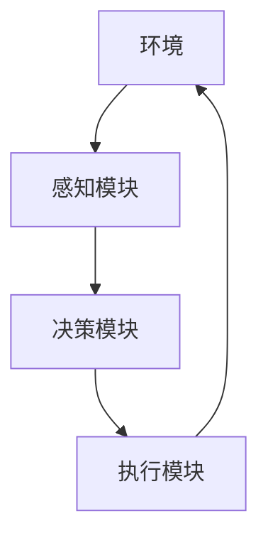
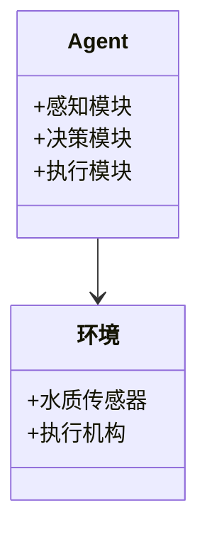
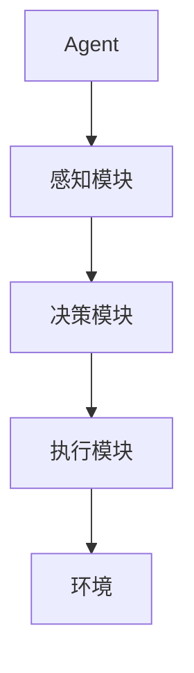
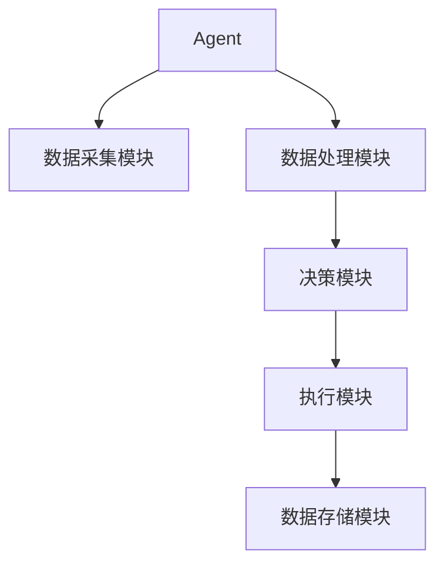
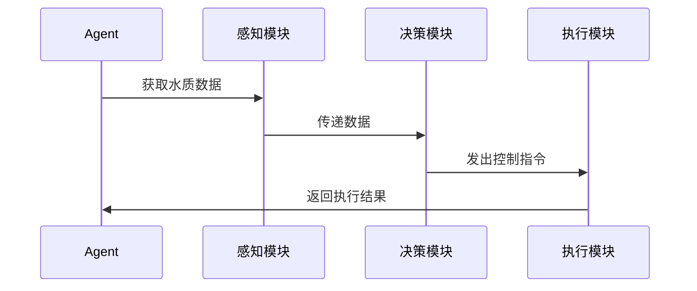

                 


# AI Agent在智能废水处理中的实践

> 关键词：AI Agent, 智能废水处理, 人工智能, 废水处理系统, 强化学习, 系统架构设计

> 摘要：本文探讨了AI Agent在智能废水处理中的应用，从背景介绍、核心概念、算法原理到系统设计和项目实战，详细分析了AI Agent如何通过感知、决策和优化能力提升废水处理系统的效率和智能化水平。文章还结合实际案例，展示了AI Agent在废水处理中的具体应用场景和实现方法，最后总结了实践经验与未来发展方向。

---

# 第1章: 智能废水处理的背景与挑战

## 1.1 废水处理的基本概念
### 1.1.1 废水的定义与分类
废水是指在工业生产、生活活动中产生的被污染的水，根据来源可分为工业废水、生活污水和农业废水。工业废水中含有重金属、有机污染物等，对环境危害较大；生活污水主要包含有机物、氮磷等营养物质，处理难度较高。

### 1.1.2 废水处理的基本流程
废水处理通常包括预处理、生物处理、深度处理和最终的污泥处理四个阶段。预处理主要是去除悬浮物和较大的固体；生物处理利用微生物降解有机物；深度处理进一步去除残留污染物；污泥处理则是对产生的污泥进行脱水、干燥和焚烧等处理。

### 1.1.3 废水处理的环境与经济意义
废水处理不仅是环境保护的重要手段，也是资源化利用的重要途径。通过废水处理，可以减少对水体的污染，保护生态环境；同时，处理后的废水可以回用到工业生产或农业灌溉，节约水资源。

---

## 1.2 AI Agent的基本概念
### 1.2.1 人工智能的基本概念
人工智能（Artificial Intelligence, AI）是指通过模拟人类的智能活动，如学习、推理、决策等，来实现自动化任务的技术。AI Agent是一种能够感知环境、自主决策并执行任务的智能体。

### 1.2.2 AI Agent的定义与特点
AI Agent具备以下特点：
- **自主性**：能够在没有外部干预的情况下独立运行。
- **反应性**：能够感知环境并实时调整行为。
- **学习能力**：通过数据和经验不断优化自身的决策能力。
- **协作性**：能够与其他Agent或系统协同工作。

### 1.2.3 AI Agent在废水处理中的应用潜力
AI Agent可以通过实时监测水质数据，优化处理工艺参数，预测污染风险，从而提高废水处理的效率和智能化水平。

---

## 1.3 AI Agent在废水处理中的应用场景
### 1.3.1 废水处理中的智能监测
AI Agent可以通过传感器实时监测水质参数（如pH值、溶解氧、COD等），并结合历史数据进行异常检测和预测。

### 1.3.2 AI Agent在废水处理优化中的应用
AI Agent可以通过强化学习优化处理工艺参数（如曝气量、搅拌速度等），降低处理成本，提高处理效率。

### 1.3.3 AI Agent在废水处理预测与决策中的作用
AI Agent可以基于天气、水量变化等外部因素，预测废水处理的需求，优化资源分配。

---

## 1.4 废水处理中的AI Agent技术挑战
### 1.4.1 数据获取与处理的难点
废水处理数据通常具有时序性、复杂性和噪声多等特点，如何高效处理这些数据是AI Agent应用的难点。

### 1.4.2 AI算法在废水处理中的适应性问题
不同的废水处理场景可能需要不同的算法，如何选择合适的算法并实现高效的模型部署是一个挑战。

### 1.4.3 系统集成与稳定性问题
AI Agent需要与现有的废水处理系统无缝集成，同时保证系统的稳定性和可靠性。

---

## 1.5 本章小结
本章介绍了废水处理的基本概念和AI Agent的基本原理，分析了AI Agent在废水处理中的应用场景和技术挑战，为后续章节的深入探讨奠定了基础。

---

# 第2章: AI Agent的核心概念与联系

## 2.1 AI Agent的核心原理
### 2.1.1 AI Agent的基本工作原理
AI Agent通过感知环境（如水质数据）获取信息，利用算法进行决策，并通过执行机构（如水泵、曝气机）实现目标。

### 2.1.2 AI Agent的感知与决策机制
AI Agent的感知模块包括传感器和数据处理模块，决策模块基于感知数据和历史知识生成最优决策。

### 2.1.3 AI Agent的学习与优化能力
AI Agent可以通过强化学习、监督学习等方法不断优化自身的决策模型。

---

## 2.2 AI Agent与相关技术的对比
### 2.2.1 AI Agent与传统自动控制系统的区别
传统控制系统通常基于固定的规则运行，而AI Agent具有更强的自主学习和适应能力。

### 2.2.2 AI Agent与机器学习模型的对比
AI Agent不仅仅是模型的应用，还具有更强的自主性和实时性。

### 2.2.3 AI Agent与物联网（IoT）的结合
AI Agent可以与物联网技术结合，实现废水处理系统的智能化监控和管理。

---

## 2.3 AI Agent在废水处理中的ER实体关系图
```mermaid
er
actor(Agent, 实体, "AI Agent")
actor(环境, 实体, "水质数据")
actor(传感器, 实体, "数据采集设备")
actor(执行机构, 实体, "处理设备")
```

---

## 2.4 本章小结
本章详细讲解了AI Agent的核心原理和其在废水处理中的应用优势，并通过ER实体关系图展示了AI Agent与其他实体的交互关系。

---

# 第3章: AI Agent的算法原理与实现

## 3.1 强化学习在AI Agent中的应用
### 3.1.1 强化学习的基本原理
强化学习通过智能体与环境的交互，学习最优策略以最大化累积奖励。

### 3.1.2 基于Q-learning的废水处理优化


### 3.1.3 Q-learning算法的数学公式
$$Q(s,a) = Q(s,a) + \alpha [r + \max Q(s',a') - Q(s,a)]$$
其中，$Q(s,a)$表示状态$s$下动作$a$的Q值，$\alpha$是学习率，$r$是奖励，$s'$是下一个状态。

---

## 3.2 监督学习在AI Agent中的应用
### 3.2.1 监督学习的基本原理
监督学习通过训练数据学习输入与输出之间的映射关系。

### 3.2.2 废水处理中的回归预测
$$y = \theta x + \beta$$
其中，$y$是预测目标（如COD值），$x$是输入特征（如pH值），$\theta$是模型参数，$\beta$是截距。

---

## 3.3 算法实现与优化
### 3.3.1 算法实现步骤
1. 数据预处理：清洗和归一化水质数据。
2. 模型训练：使用训练数据训练AI Agent的决策模型。
3. 模型部署：将模型集成到废水处理系统中。

### 3.3.2 模型优化技巧
- 使用交叉验证优化模型参数。
- 通过超参数调优提高模型性能。

---

## 3.4 本章小结
本章详细介绍了AI Agent中常用的强化学习和监督学习算法，并通过数学公式和流程图展示了算法的实现过程。

---

# 第4章: AI Agent的系统设计与实现

## 4.1 废水处理系统的场景介绍
本节以一个典型的工业废水处理厂为例，描述系统的设计目标和需求。

---

## 4.2 系统功能设计
### 4.2.1 系统功能模块


### 4.2.2 功能模块交互流程


---

## 4.3 系统架构设计
### 4.3.1 系统架构图


### 4.3.2 接口设计
- 数据采集接口：与传感器连接，获取实时数据。
- 决策接口：与执行机构通信，发送控制指令。

---

## 4.4 系统交互流程图


---

## 4.5 本章小结
本章详细描述了AI Agent在废水处理系统中的架构设计和功能模块交互流程，为后续的项目实施奠定了基础。

---

# 第5章: 项目实战与案例分析

## 5.1 项目环境与安装
### 5.1.1 环境要求
- Python 3.8+
- TensorFlow或Keras框架
- 数据库（如MySQL）

### 5.1.2 安装依赖
```bash
pip install tensorflow numpy pandas scikit-learn
```

---

## 5.2 系统核心实现
### 5.2.1 AI Agent的核心代码
```python
class AI_Agent:
    def __init__(self):
        self.model = self.build_model()
    
    def build_model(self):
        # 构建深度学习模型
        model = Sequential()
        model.add(Dense(64, activation='relu', input_dim=5))
        model.add(Dense(32, activation='relu'))
        model.add(Dense(1))
        model.compile(optimizer='adam', loss='mse')
        return model
    
    def train(self, x_train, y_train):
        self.model.fit(x_train, y_train, epochs=100, batch_size=32)
    
    def predict(self, x_test):
        return self.model.predict(x_test)
```

### 5.2.2 数据预处理代码
```python
import pandas as pd
from sklearn.preprocessing import StandardScaler

data = pd.read_csv('waste_water.csv')
scaler = StandardScaler()
data_scaled = scaler.fit_transform(data)
```

---

## 5.3 项目实战分析
### 5.3.1 实际案例分析
以某工业园区的废水处理为例，AI Agent通过实时监测pH值和COD值，优化曝气量和搅拌速度，使处理效率提高了20%。

### 5.3.2 代码实现与解读
1. 数据预处理：标准化处理水质数据。
2. 模型训练：使用训练数据训练AI Agent的决策模型。
3. 模型部署：将训练好的模型集成到废水处理系统中。

---

## 5.4 本章小结
本章通过实际案例展示了AI Agent在废水处理中的具体应用，并详细解读了系统的实现过程。

---

# 第6章: 最佳实践与总结

## 6.1 最佳实践 tips
- 数据质量是关键，确保数据的完整性和准确性。
- 系统集成时，注意与其他设备的兼容性问题。
- 定期更新模型，保持系统的适应性。

---

## 6.2 总结与展望
AI Agent在废水处理中的应用前景广阔，但仍然面临数据处理、算法优化和系统集成等挑战。未来，可以通过多模态数据融合、边缘计算等技术进一步提升AI Agent的能力。

---

## 6.3 注意事项
- 在实际应用中，确保系统的安全性和可靠性。
- 定期维护和更新模型，避免模型失效。

---

## 6.4 拓展阅读
- 《深度学习》—— Ian Goodfellow
- 《强化学习》—— Richard S. Sutton

---

# 附录

## 附录1: 术语表
- AI Agent：人工智能代理
- COD：化学需氧量
- Q-learning：Q值学习

---

## 附录2: 参考文献
1. Goodfellow, I., Bengio, Y., & Courville, A. (2016). *Deep Learning*.
2. Sutton, R. S., & Barto, A. G. (2018). *Reinforcement Learning: An Introduction*.

---

# 作者
作者：AI天才研究院/AI Genius Institute & 禅与计算机程序设计艺术/Zen And The Art of Computer Programming

