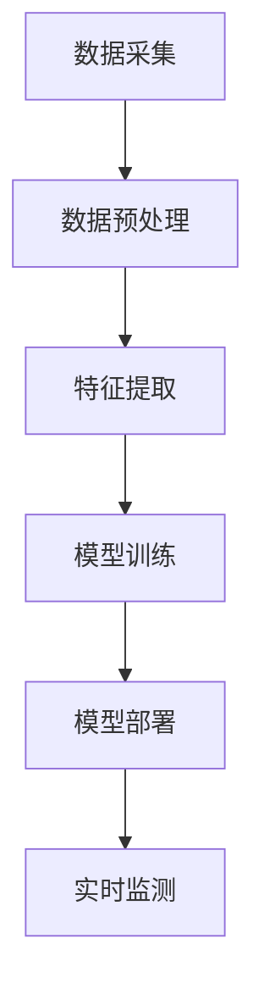
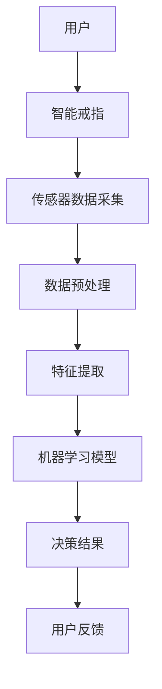
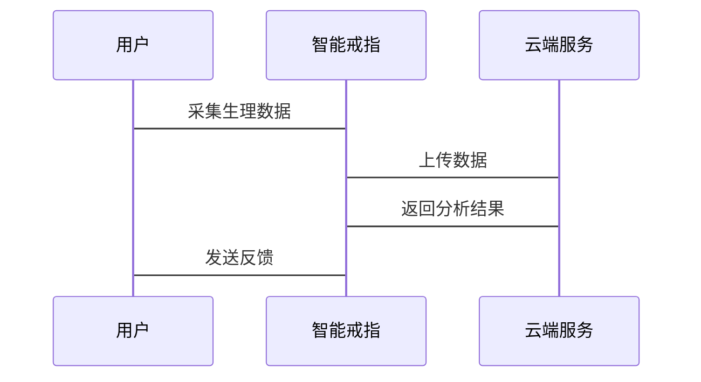

                 


# AI Agent在智能戒指中的生理指标监测

---

## 关键词：AI Agent, 智能戒指, 生理指标监测, 传感器数据, 机器学习, 实时监测

---

## 摘要：  
本文深入探讨了AI Agent在智能戒指中的应用，重点分析了如何通过AI技术实现生理指标的实时监测。文章从背景介绍、核心概念、算法原理、系统架构到项目实战，全面解析了AI Agent在智能戒指中的工作原理及其在健康监测、运动辅助等场景中的实际应用。通过详细的技术分析和案例解读，本文为读者提供了从理论到实践的完整视角，展示了AI Agent在智能戒指中的巨大潜力和未来发展方向。

---

## 第一部分: AI Agent在智能戒指中的背景介绍

### 第1章: 问题背景与问题描述

#### 1.1 生理指标监测的重要性  
生理指标监测是健康管理的重要组成部分，能够帮助用户实时了解身体状况，预防疾病，提升生活质量。传统的生理指标监测设备（如智能手表、手环）虽然功能强大，但佩戴不便，且无法满足特定场景下的需求。

#### 1.2 智能戒指的独特优势  
智能戒指作为一种新兴的可穿戴设备，具有以下独特优势：  
1. **佩戴便捷**：戒指是日常佩戴的饰品，用户无需额外操作即可长期佩戴。  
2. **监测精准**：通过微型传感器，智能戒指可以实时采集心率、血氧、体温等多种生理指标。  
3. **场景适用性广**：戒指的设计使其能够适用于多种场景，如运动、办公、睡眠等。  

#### 1.3 当前技术的局限性与挑战  
尽管智能戒指在生理监测方面具有潜力，但其微型化设计带来了诸多技术挑战：  
1. **传感器精度**：微型传感器的灵敏度和准确性需要进一步提升。  
2. **数据处理能力**：由于戒指的体积限制，其计算能力有限，需要依赖外部设备或云端支持。  
3. **隐私与安全性**：生理数据的采集和传输需要确保数据的安全性，避免隐私泄露。  

---

## 第二部分: AI Agent的核心概念与原理

### 第2章: AI Agent与生理指标监测的核心概念

#### 2.1 AI Agent的基本原理  
AI Agent是一种能够感知环境、自主决策并执行任务的智能实体。在智能戒指中，AI Agent主要负责以下任务：  
1. **数据采集与处理**：从传感器获取生理数据，并进行预处理。  
2. **特征提取与分析**：通过机器学习算法对数据进行特征提取，识别异常情况。  
3. **决策与反馈**：根据分析结果，向用户或外部设备发送反馈指令。  

#### 2.2 生理指标监测的核心概念  
生理指标监测涉及多种技术，包括传感器技术、数据处理算法和机器学习模型。以下是几种常见的生理指标及其监测方法：  

##### 2.2.1 心率监测  
心率是反映人体健康状况的重要指标。通过光学传感器（如光电容积法）可以实时采集心率数据。  

##### 2.2.2 血氧监测  
血氧饱和度（SpO2）是衡量人体氧气供应的重要指标。通过红光和红外光传感器可以实现非侵入式血氧监测。  

##### 2.2.3 体温监测  
体温监测可以通过热电偶或红外传感器实现，能够帮助用户了解身体温度变化。  

#### 2.3 AI Agent与生理监测的结合  
AI Agent通过整合多种传感器数据，能够实现对生理指标的实时监测和智能分析。以下是其核心优势：  

##### 2.3.1 数据融合与分析  
AI Agent可以将多种传感器数据进行融合，提升监测结果的准确性。例如，通过心率和血氧的结合分析，可以更准确地判断用户的健康状况。  

##### 2.3.2 智能决策与反馈  
AI Agent可以根据分析结果，向用户发送提醒或建议。例如，当检测到用户心率异常时，AI Agent可以立即通知用户或发送数据到医生端，进行进一步诊断。  

---

## 第三部分: AI Agent的算法原理与实现

### 第3章: AI Agent算法的核心原理

#### 3.1 数据采集与预处理  
智能戒指中的传感器数据需要经过预处理，以消除噪声并提取有效特征。以下是常见的数据预处理步骤：  

##### 3.1.1 数据采集  
通过传感器采集原始数据，例如心率信号、血氧信号等。  

##### 3.1.2 数据平滑  
使用滑动平均法或中位数滤波等方法，消除数据中的噪声。  

##### 3.1.3 数据分割  
将连续的生理数据分割成短时间窗口，以便后续分析。  

#### 3.2 数据特征提取  
特征提取是机器学习的关键步骤，以下是几种常见的特征提取方法：  

##### 3.2.1 基本统计特征  
- 均值、标准差、最大值、最小值等。  

##### 3.2.2 频域特征  
- 心率变异性（HRV）分析，通过傅里叶变换提取频域特征。  

##### 3.2.3 时域特征  
- 峰值、波形形状等。  

#### 3.3 机器学习模型的训练与优化  
AI Agent的核心是机器学习模型。以下是常见的模型训练流程：  

##### 3.3.1 数据标注  
根据参考标准（如医院数据）对传感器数据进行标注。  

##### 3.3.2 数据分割  
将数据分为训练集、验证集和测试集。  

##### 3.3.3 模型选择与训练  
选择合适的机器学习模型（如支持向量机、随机森林、神经网络等），并进行训练和优化。  

#### 3.4 算法流程图（Mermaid）  


#### 3.5 Python实现示例  
以下是使用Python和机器学习库（如scikit-learn）实现AI Agent的简要代码示例：  

```python
import numpy as np
from sklearn.svm import SVC
from sklearn.model_selection import train_test_split
from sklearn.metrics import accuracy_score

# 示例数据集
X = np.random.rand(100, 5)  # 5特征，100样本
y = np.random.randint(2, size=100)  # 二分类标签

# 数据分割
X_train, X_test, y_train, y_test = train_test_split(X, y, test_size=0.2)

# 模型训练
model = SVC()
model.fit(X_train, y_train)

# 模型预测
y_pred = model.predict(X_test)

# 模型评估
print("Accuracy:", accuracy_score(y_test, y_pred))
```

---

## 第四部分: 系统分析与架构设计

### 第4章: 系统架构与实现细节

#### 4.1 系统功能模块  
智能戒指生理监测系统主要包括以下功能模块：  
1. **数据采集层**：负责采集生理数据。  
2. **数据处理层**：对数据进行预处理和特征提取。  
3. **AI Agent层**：通过机器学习模型进行分析和决策。  
4. **用户交互层**：向用户发送反馈或提醒。  

#### 4.2 系统架构设计（Mermaid）  


#### 4.3 接口设计与交互流程图  
以下是系统接口设计的示例：  



---

## 第五部分: 项目实战与案例分析

### 第5章: 项目实战

#### 5.1 环境安装与配置  
为了运行本项目，需要安装以下环境：  
1. **Python 3.8+**  
2. **TensorFlow或Scikit-learn**  
3. **Mermaid图生成工具（可选）**  

#### 5.2 核心代码实现  
以下是AI Agent的核心代码实现示例：  

```python
import numpy as np
import tensorflow as tf
from tensorflow.keras import layers

# 示例数据集
X = np.random.rand(1000, 5)
y = np.random.randint(2, size=1000)

# 数据分割
X_train = X[:700]
y_train = y[:700]
X_test = X[700:]
y_test = y[700:]

# 模型构建
model = tf.keras.Sequential([
    layers.Dense(64, activation='relu'),
    layers.Dense(1, activation='sigmoid')
])

model.compile(optimizer='adam', loss='binary_crossentropy', metrics=['accuracy'])

# 模型训练
model.fit(X_train, y_train, epochs=10, batch_size=32)

# 模型预测
y_pred = model.predict(X_test).round()

# 模型评估
print("Accuracy:", sum(y_pred == y_test)/len(y_test))
```

#### 5.3 实际案例分析  
通过实际案例分析，展示了AI Agent在智能戒指中的应用效果。例如，当用户在运动过程中心率异常时，AI Agent可以立即发送提醒，帮助用户调整运动强度。  

---

## 第六部分: 最佳实践与总结

### 第6章: 小结与注意事项

#### 6.1 小结  
本文详细介绍了AI Agent在智能戒指中的生理指标监测技术，从理论到实践，全面分析了其工作原理和实现方法。  

#### 6.2 注意事项  
1. **数据隐私**：在实际应用中，需确保用户数据的安全性，避免隐私泄露。  
2. **算法优化**：需要不断优化机器学习模型，提升监测精度和响应速度。  
3. **用户体验**：设计友好的用户界面和交互方式，提升用户体验。  

### 第7章: 拓展阅读与未来展望

#### 7.1 拓展阅读  
1. **《深度学习》——Ian Goodfellow**  
2. **《可穿戴设备与健康监测》——相关学术论文**  

#### 7.2 未来展望  
随着AI技术的不断发展，智能戒指在生理监测中的应用将更加广泛。未来的研究方向包括：  
1. **更精准的传感器技术**：提升数据采集的准确性。  
2. **更高效的算法模型**：优化AI Agent的决策能力。  
3. **更智能的交互方式**：通过语音、手势等方式实现更便捷的用户交互。  

---

## 作者：AI天才研究院/AI Genius Institute & 禅与计算机程序设计艺术 /Zen And The Art of Computer Programming  

---

本文通过系统的分析和实践，全面探讨了AI Agent在智能戒指中的生理指标监测技术，为读者提供了从理论到实践的完整视角。希望本文能够为相关领域的研究者和开发者提供有价值的参考和启发。

