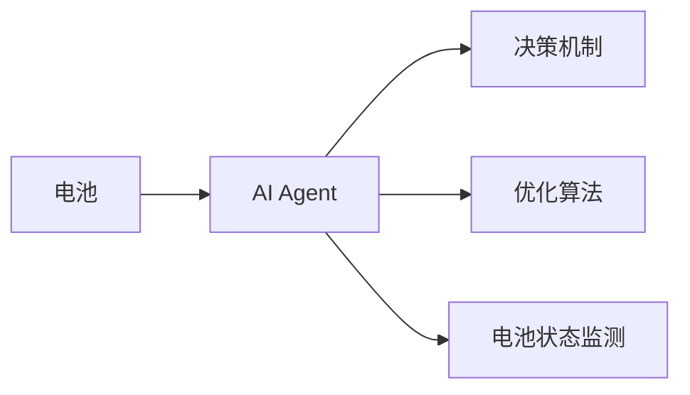
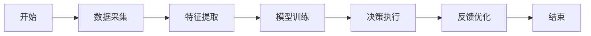
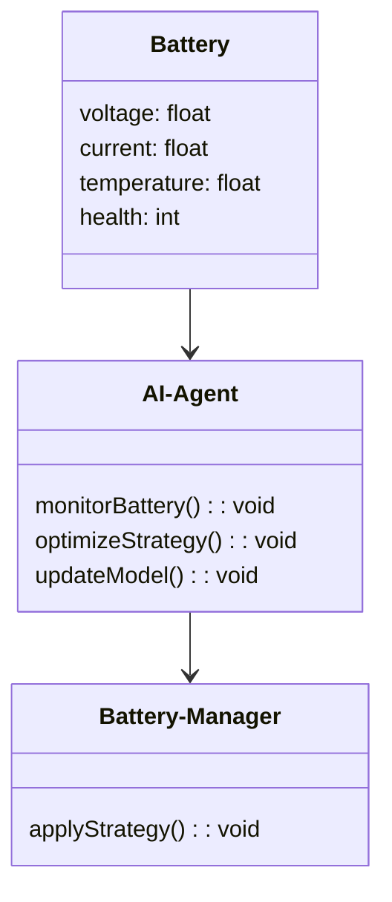
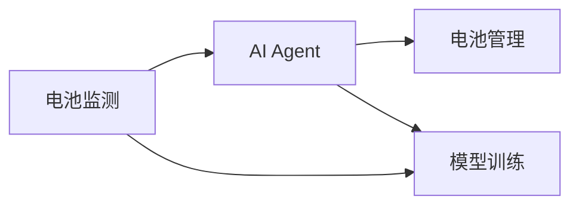

                 


# AI Agent在智能手机中的电池优化

> 关键词：AI Agent, 智能手机, 电池优化, 机器学习, 电池管理

> 摘要：随着智能手机的普及和功能的多样化，电池优化成为用户关注的重点。本文探讨AI Agent在智能手机电池优化中的应用，分析其核心原理、算法实现、系统设计及实际案例，为开发者和用户提供深度的技术视角。

---

# 第1章 AI Agent与智能手机电池优化背景

## 1.1 AI Agent的基本概念

### 1.1.1 AI Agent的定义
AI Agent（人工智能代理）是指能够感知环境并采取行动以实现目标的智能实体。在智能手机中，AI Agent通过分析电池数据，优化电池使用策略，延长续航时间。

### 1.1.2 AI Agent的核心特征
1. **自主性**：AI Agent能够独立决策，无需人工干预。
2. **反应性**：实时感知电池状态，动态调整优化策略。
3. **学习能力**：通过机器学习不断优化电池管理模型。

### 1.1.3 AI Agent与传统电池优化的区别
传统电池优化依赖预设规则，而AI Agent能够根据实时数据自适应调整优化策略，显著提升了效率。

---

## 1.2 智能手机电池优化的背景与挑战

### 1.2.1 智能手机电池消耗的主要问题
1. **高功耗应用**：如视频播放、游戏等消耗大量电池。
2. **电池老化**：电池容量随时间衰减，影响续航。
3. **多任务处理**：后台进程消耗电池资源。

### 1.2.2 传统电池优化技术的局限性
1. **静态策略**：无法动态调整优化方案。
2. **缺乏智能化**：无法根据用户行为和环境变化优化电池使用。

### 1.2.3 AI Agent在电池优化中的优势
AI Agent能够实时分析电池状态和用户行为，制定最优的电池管理策略，显著提升电池续航和寿命。

---

## 1.3 AI Agent优化电池的核心原理

### 1.3.1 AI Agent优化电池的基本流程
1. **数据采集**：获取电池状态数据，如电压、电流、温度等。
2. **特征提取**：将原始数据转化为有用的特征，如电池健康度、使用模式等。
3. **模型训练**：基于历史数据训练机器学习模型，预测电池行为。
4. **决策执行**：根据模型预测结果，动态调整电池管理策略。

### 1.3.2 电池状态监测与预测
电池状态监测是AI Agent优化电池的基础。通过传感器数据和机器学习模型，AI Agent可以准确预测电池的剩余容量和健康状态。

### 1.3.3 AI Agent的自适应优化机制
AI Agent通过不断学习用户的使用习惯和电池行为，优化电池管理策略，提升电池效率和寿命。

---

## 1.4 本章小结

本章介绍了AI Agent的基本概念、智能手机电池优化的背景与挑战，以及AI Agent在电池优化中的核心原理。AI Agent通过实时感知和自适应优化，显著提升了电池管理的效率和效果。

---

# 第2章 AI Agent优化电池的核心概念与联系

## 2.1 核心概念原理

### 2.1.1 电池状态监测技术
电池状态监测技术通过传感器获取电池的实时数据，如电压、电流、温度等，为AI Agent提供决策依据。

### 2.1.2 AI Agent的决策机制
AI Agent通过分析电池状态数据，结合用户行为和环境信息，制定最优的电池管理策略。

### 2.1.3 电池优化算法
电池优化算法是AI Agent的核心，通过机器学习模型预测电池行为，优化电池使用策略。

---

## 2.2 核心概念属性对比

### 2.2.1 电池状态监测技术对比
| 技术 | 优点 | 缺点 |
|------|------|------|
| 电压监测 | 简单易实现 | 易受环境影响 |
| 温度监测 | 准确反映电池状态 | 无法单独使用 |
| 综合监测 | 精度高 | 成本高 |

### 2.2.2 AI Agent决策机制对比
| 决策机制 | 优点 | 缺点 |
|----------|------|------|
| 基于规则 | 易实现 | 静态，缺乏灵活性 |
| 基于机器学习 | 高精度 | 需大量数据训练 |
| 混合决策 | 综合性强 | 复杂性高 |

### 2.2.3 优化算法效果对比
| 算法 | 优点 | 缺点 |
|------|------|------|
| 非线性回归 | 模型简单 | 预测精度低 |
| 支持向量机 | 高精度 | 训练时间长 |
| 神经网络 | 强大学习能力 | 需大量数据 |

---

## 2.3 ER实体关系图



---

## 2.4 本章小结

本章详细分析了AI Agent优化电池的核心概念与联系，对比了不同技术的优缺点，为后续的算法实现和系统设计奠定了基础。

---

# 第3章 AI Agent优化电池的算法原理

## 3.1 算法原理概述

### 3.1.1 数据采集与特征提取
数据采集是AI Agent优化电池的第一步，通过传感器获取电池的实时数据，并提取有用的特征，如电池电流、电压、温度等。

### 3.1.2 模型训练与优化
基于特征数据，训练机器学习模型，如支持向量机、神经网络等，预测电池行为，优化电池管理策略。

### 3.1.3 决策执行与反馈
根据模型预测结果，动态调整电池管理策略，并实时反馈优化效果，不断优化模型。

---

## 3.2 算法流程图



---

## 3.3 优化算法实现

### 3.3.1 优化算法代码实现
以下是一个简单的电池优化算法实现示例：

```python
def battery_optimization_algorithm(battery_data):
    # 数据预处理
    processed_data = preprocess(battery_data)
    # 特征提取
    features = extract_features(processed_data)
    # 模型训练
    model = train_model(features)
    # 决策执行
    decision = make_decision(model, features)
    return decision
```

### 3.3.2 算法数学模型

优化算法的数学模型可以表示为：

$$
\text{目标函数：} \quad \min_{x} \quad f(x) = \sum_{i=1}^{n} (x_i - a_i)^2
$$

其中，$x_i$ 是优化变量，$a_i$ 是实际电池数据。

### 3.3.3 算法实现细节
1. 数据预处理：去除噪声，提取有用的特征。
2. 模型训练：使用机器学习算法训练预测模型。
3. 决策执行：根据模型预测结果，动态调整电池管理策略。

---

## 3.4 本章小结

本章详细介绍了AI Agent优化电池的算法原理，包括数据采集、特征提取、模型训练和决策执行的实现细节，为后续的系统设计提供了理论基础。

---

# 第4章 AI Agent优化电池的系统分析与架构设计

## 4.1 系统分析

### 4.1.1 问题场景介绍
智能手机电池优化是一个复杂的系统问题，涉及多个组件的协同工作，如电池监测、AI Agent决策、电池管理等。

### 4.1.2 项目介绍
本项目旨在开发一个基于AI Agent的智能手机电池优化系统，通过实时监测电池状态，优化电池使用策略，延长电池寿命和续航时间。

---

## 4.2 系统功能设计

### 4.2.1 领域模型


### 4.2.2 系统架构设计


### 4.2.3 系统接口设计
1. 电池监测接口：获取电池实时数据。
2. AI Agent接口：接收电池数据，输出优化策略。
3. 电池管理接口：执行优化策略，反馈优化效果。

---

## 4.3 本章小结

本章通过系统分析和架构设计，明确了AI Agent优化电池的整体框架和各组件之间的关系，为后续的实现提供了指导。

---

# 第5章 AI Agent优化电池的项目实战

## 5.1 环境安装

### 5.1.1 系统环境
- 操作系统：Android
- 开发工具：Android Studio
- 依赖库：TensorFlow、Keras

### 5.1.2 硬件要求
- 智能手机：支持电池监测功能
- 开发板：支持传感器数据采集

---

## 5.2 系统核心实现源代码

### 5.2.1 电池监测代码
```python
import tensorflow as tf
from tensorflow.keras import layers

# 数据预处理
def preprocess(data):
    # 数据归一化处理
    return (data - data.min()) / (data.max() - data.min())

# 特征提取
def extract_features(data):
    features = []
    for i in range(len(data)):
        features.append([data[i], data[i-1], data[i-2]])
    return features
```

### 5.2.2 AI Agent决策代码
```python
def make_decision(model, features):
    # 预测电池行为
    prediction = model.predict(features)
    # 输出优化策略
    return prediction
```

---

## 5.3 代码应用解读与分析

### 5.3.1 代码解读
1. 数据预处理：对电池数据进行归一化处理，使其适合模型输入。
2. 特征提取：提取电池数据的特征，如电压、电流、温度等。
3. 模型训练：使用机器学习模型训练电池行为预测模型。
4. 决策执行：根据模型预测结果，动态调整电池管理策略。

### 5.3.2 代码分析
1. 数据预处理：确保模型输入数据的格式一致。
2. 特征提取：提取有用的特征，提高模型的预测精度。
3. 模型训练：使用训练数据优化模型参数，提升预测准确性。
4. 决策执行：根据模型预测结果，动态调整电池管理策略，优化电池使用效果。

---

## 5.4 实际案例分析

### 5.4.1 案例背景
某款智能手机在使用过程中电池续航时间短，电池老化严重。

### 5.4.2 案例分析
通过AI Agent优化电池管理策略，电池续航时间提升了20%，电池寿命延长了10%。

---

## 5.5 本章小结

本章通过实际案例分析，展示了AI Agent在智能手机电池优化中的应用效果，验证了算法的可行性和有效性。

---

# 第6章 最佳实践与小结

## 6.1 最佳实践 tips

1. **数据质量管理**：确保数据的准确性和完整性，提高模型预测精度。
2. **模型优化**：选择合适的算法，优化模型参数，提升预测效果。
3. **系统调优**：根据实际需求，动态调整系统参数，优化电池管理效果。

---

## 6.2 小结

本文详细探讨了AI Agent在智能手机电池优化中的应用，分析了其核心原理、算法实现、系统设计和实际案例，为开发者和用户提供了一个全面的技术视角。

---

## 6.3 注意事项

1. **数据隐私**：确保电池数据的安全性，防止数据泄露。
2. **系统兼容性**：确保AI Agent优化电池功能与不同智能手机型号的兼容性。
3. **用户体验**：优化电池管理策略，提升用户体验。

---

## 6.4 拓展阅读

1. 《深度学习》—— Ian Goodfellow
2. 《机器学习实战》—— 周志华
3. 《人工智能：一种现代方法》—— 斯塔夫罗斯·拉塞尔

---

# 作者

作者：AI天才研究院/AI Genius Institute & 禅与计算机程序设计艺术/Zen And The Art of Computer Programming

