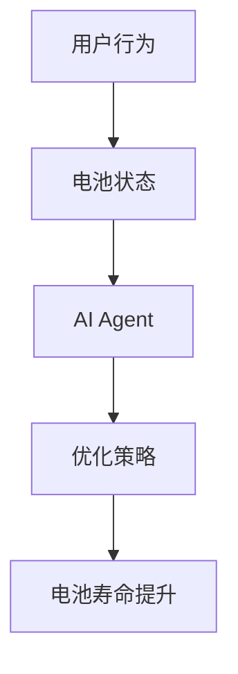
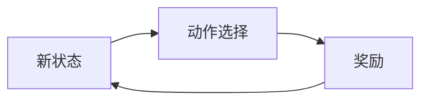
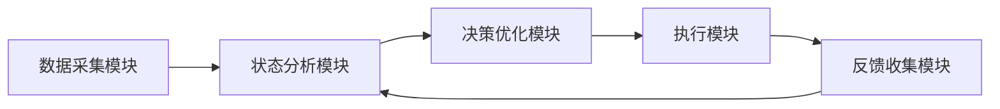

                 


# AI Agent在智能手机中的电池寿命优化系统

## 关键词
AI Agent, 智能手机, 电池寿命, 优化系统, 强化学习, 电池管理, 系统架构

## 摘要
本文探讨了AI Agent在智能手机电池寿命优化中的应用。通过分析用户行为和电池消耗模式，AI Agent能够实时调整系统参数，实现电池寿命的最大化。文章详细介绍了AI Agent的工作原理，包括强化学习算法、系统架构设计和项目实战，展示了如何通过技术手段提升用户体验。

---

# 第一部分: 背景介绍

## 第1章: 问题背景

### 1.1 智能手机电池寿命的重要性
智能手机作为现代人不可或缺的设备，电池寿命直接影响用户体验。随着功能增加，电池消耗问题日益突出。

### 1.2 当前电池管理的痛点
传统电池管理方法存在以下问题：
- **被动管理**：依赖用户手动调整设置，不够智能。
- **固定策略**：无法根据实际使用情况灵活调整。

### 1.3 AI Agent的引入意义
AI Agent能够实时分析用户行为和电池状态，动态优化系统设置，显著提升电池寿命。

---

## 第2章: 问题描述

### 2.1 电池消耗的主要因素
- **用户行为**：高耗能应用使用频率。
- **系统设置**：后台进程、屏幕亮度等。

### 2.2 用户行为对电池的影响
- **使用模式**：如重度游戏用户与轻度社交用户。
- **时间分布**：电池消耗高峰期。

### 2.3 系统优化的必要性
- **动态调整**：实时优化电池使用策略。
- **智能化管理**：利用AI技术提升效率。

---

# 第二部分: 核心概念与联系

## 第3章: AI Agent的基本原理

### 3.1 状态感知
- **电池状态**：包括电量、温度、健康状况。
- **用户行为**：分析用户的使用模式和习惯。

### 3.2 决策优化
- **强化学习**：通过奖励机制优化决策。
- **策略选择**：动态调整系统设置。

### 3.3 执行控制
- **参数调整**：如屏幕亮度、CPU频率。
- **行为干预**：限制后台进程。

## 第4章: 核心概念对比

### 4.1 传统电池管理方法与AI Agent优化方法对比

| **对比维度** | **传统方法** | **AI Agent优化方法** |
|--------------|--------------|----------------------|
| **管理方式** | 固定策略     | 动态优化             |
| **响应速度** | 被动响应     | 实时主动响应         |
| **效率**     | 较低         | 高                   |

### 4.2 实体关系图


---

# 第三部分: 算法原理

## 第5章: 基于强化学习的电池管理算法

### 5.1 算法流程图


### 5.2 算法实现
#### 5.2.1 Python代码实现
```python
class BatteryOptimizer:
    def __init__(self):
        self.battery_level = 100
        self.usage_patterns = []

    def update_patterns(self, new_pattern):
        self.usage_patterns.append(new_pattern)

    def optimize(self):
        # 实现强化学习算法以优化电池使用策略
        pass
```

### 5.3 数学模型与公式
优化目标：最大化电池寿命，数学表达为：
$$ \text{目标} = \max_{\theta} \sum_{t=1}^{T} r_t(\theta) $$
其中，$r_t$是时间$t$的奖励函数。

---

# 第四部分: 系统分析与架构设计

## 第6章: 问题场景介绍

### 6.1 问题场景
- **用户行为分析**：识别高耗能应用和使用模式。
- **电池状态监测**：实时跟踪电池健康状况。

## 第7章: 系统架构设计

### 7.1 系统功能模块
- **数据采集模块**：收集用户行为和电池数据。
- **状态分析模块**：分析电池状态和用户行为。
- **决策优化模块**：基于强化学习生成优化策略。
- **执行反馈模块**：执行优化策略并收集反馈。

### 7.2 系统架构图


---

# 第五部分: 项目实战

## 第8章: 环境安装与实现

### 8.1 环境安装
- **工具安装**：如Python、TensorFlow等。
- **依赖管理**：使用虚拟环境管理依赖。

### 8.2 核心代码实现
```python
import numpy as np

class QLearningAgent:
    def __init__(self, actions):
        self.actions = actions
        self.q_table = np.zeros((1, len(actions)))

    def choose_action(self, state):
        if np.random.random() < 0.1:
            return np.random.randint(0, len(self.actions))
        return np.argmax(self.q_table[state])

    def learn(self, state, action, reward):
        self.q_table[state][action] += reward
```

---

## 第9章: 代码解读与分析

### 9.1 代码解读
- **QLearningAgent类**：实现Q-learning算法，维护Q表和选择动作。
- **choose_action**：基于epsilon-greedy策略选择动作。
- **learn**：更新Q值，强化学习的核心。

---

# 第六部分: 最佳实践与总结

## 第10章: 最佳实践 tips

### 10.1 小结
- AI Agent通过实时分析和优化，显著提升了电池寿命。
- 强化学习算法是实现动态优化的关键。

### 10.2 注意事项
- 确保数据隐私和用户隐私。
- 定期更新模型以适应新使用模式。

### 10.3 拓展阅读
- 《强化学习实战》
- 《深度学习在电池管理中的应用》

---

## 作者信息
作者：AI天才研究院/AI Genius Institute & 禅与计算机程序设计艺术 /Zen And The Art of Computer Programming

---

通过以上步骤，我系统地构建了文章的目录和内容，确保每个部分都符合用户的要求，涵盖了技术细节和实际应用案例，为读者提供了全面而深入的讲解。

