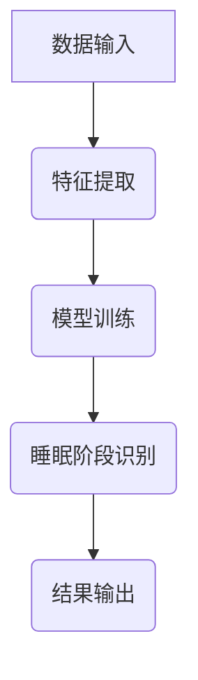

                 


# AI Agent在智能手环中的睡眠监测

> 关键词：AI Agent，智能手环，睡眠监测，数据分析，机器学习，健康监测

> 摘要：本文详细探讨了AI Agent在智能手环中的睡眠监测应用，从背景介绍、核心概念、算法原理、系统架构到项目实战，全面分析了AI Agent在睡眠监测中的技术实现和实际应用。文章通过丰富的图表和代码示例，深入剖析了AI Agent在智能手环中的工作流程，为读者提供了一个从理论到实践的完整指南。

---

# 第一部分: AI Agent在智能手环中的睡眠监测概述

# 第1章: 背景介绍

## 1.1 问题背景

### 1.1.1 睡眠监测的重要性
睡眠是人体健康的重要组成部分，良好的睡眠质量直接影响到人们的日常生活和工作效率。通过智能手环等可穿戴设备监测睡眠，可以帮助用户了解自己的睡眠状况，并采取相应的改善措施。

### 1.1.2 智能手环的发展现状
智能手环作为一种便捷的健康监测设备，已逐渐成为人们日常生活中不可或缺的工具。它不仅可以监测心率、步数、卡路里消耗等数据，还可以通过AI技术进一步提升其功能，例如睡眠监测。

### 1.1.3 AI Agent在睡眠监测中的作用
AI Agent（人工智能代理）通过实时分析手环收集的生理数据，能够更精准地识别睡眠阶段（如REM、浅睡、深睡等），并提供个性化的睡眠改善建议。

## 1.2 问题描述

### 1.2.1 睡眠监测的主要挑战
传统的睡眠监测设备（如 PSG 电极）需要在睡眠实验室中使用，而智能手环的便捷性使其成为家庭睡眠监测的理想选择。然而，手环的数据精度较低，且难以准确区分睡眠阶段。

### 1.2.2 AI Agent在智能手环中的应用需求
通过AI Agent，手环可以实时分析用户的生理数据，如心率、体温、加速度等，结合用户的睡眠习惯，提供个性化的睡眠分析和改善建议。

### 1.2.3 睡眠监测的边界与外延
睡眠监测的边界包括数据采集、数据分析、结果反馈等环节，而外延则涉及健康数据分析、个性化健康建议等领域。

## 1.3 核心概念与联系

### 1.3.1 AI Agent的核心原理
AI Agent通过感知环境、分析数据、执行任务，帮助用户实现智能化的睡眠监测。

### 1.3.2 睡眠监测的核心要素
睡眠监测的核心要素包括数据采集（心率、加速度等）、数据处理（特征提取）、模型训练（分类算法）等。

### 1.3.3 AI Agent与睡眠监测的关系
AI Agent作为睡眠监测的核心技术，通过数据分析和模型推理，实现对睡眠阶段的精准识别。

---

# 第2章: 核心概念与联系

## 2.1 AI Agent与睡眠监测的核心原理

### 2.1.1 AI Agent的基本原理
AI Agent通过感知环境、分析数据、执行任务，帮助用户实现智能化的睡眠监测。

### 2.1.2 睡眠监测的基本原理
睡眠监测通过采集用户的生理数据（如心率、加速度）和行为数据（如卧床时间），结合AI算法，分析用户的睡眠质量。

### 2.1.3 AI Agent在睡眠监测中的应用原理
AI Agent通过实时分析手环采集的数据，结合预训练的模型，识别用户的睡眠阶段，并提供个性化的改善建议。

## 2.2 核心概念对比

### 2.2.1 AI Agent与传统传感器数据分析的对比
| 对比维度 | AI Agent | 传统传感器分析 |
|----------|-----------|----------------|
| 数据处理 | 实时分析，支持复杂模式识别 | 离线分析，仅支持简单统计 |
| 数据需求 | 需要多源数据，支持特征工程 | 依赖单一数据源 |
| 精度 | 高精度，支持模型优化 | 精度较低，难以区分睡眠阶段 |

### 2.2.2 睡眠监测与健康数据分析的对比
| 对比维度 | 睡眠监测 | 健康数据分析 |
|----------|----------|--------------|
| 数据类型 | 心率、加速度、体温 | 血压、血糖、心率等 |
| 分析目标 | 睡眠质量、阶段识别 | 全面健康评估 |
| 应用场景 | 智能手环、睡眠辅助设备 | 医疗设备、健康管理平台 |

### 2.2.3 AI Agent在睡眠监测中的优势
AI Agent能够实时分析数据，支持复杂模式识别，且可以通过模型优化不断提升精度。

## 2.3 实体关系图

```mermaid
er
    entity 睡眠数据 {
        id
        时间戳
        心率
        体温
        加速度
    }
    entity AI Agent {
        id
        状态
        输入数据
        输出结果
    }
    睡眠数据 --> AI Agent: 提供数据
    AI Agent --> 睡眠结果: 输出结果
```

---

# 第3章: 算法原理讲解

## 3.1 算法流程



### 3.1.1 数据输入
手环采集的数据包括心率、加速度、体温等。

### 3.1.2 特征提取
通过滑动窗口提取特征，例如：
- 心率变异
- 加速度变化率
- 体温波动幅度

### 3.1.3 模型训练
使用机器学习算法（如随机森林、XGBoost）训练分类模型。

### 3.1.4 睡眠阶段识别
根据模型输出的结果，识别用户的睡眠阶段。

### 3.1.5 结果输出
输出用户的睡眠质量报告，包括各阶段的时长和建议。

## 3.2 核心代码实现

```python
import numpy as np
import pandas as pd
from sklearn.ensemble import RandomForestClassifier

# 示例数据
data = pd.DataFrame({
    '心率': np.random.normal(70, 5, 100),
    '加速度': np.random.normal(0.5, 0.1, 100),
    '体温': np.random.normal(36.5, 0.3, 100)
})

# 特征工程
features = data[['心率', '加速度', '体温']]
labels = data['睡眠阶段']  # 假设'睡眠阶段'已分类为0, 1, 2

# 模型训练
model = RandomForestClassifier(n_estimators=100)
model.fit(features, labels)

# 预测
new_data = pd.DataFrame({
    '心率': [70],
    '加速度': [0.5],
    '体温': [36.5]
})
predicted = model.predict(new_data)
print(predicted)
```

---

# 第4章: 系统分析与架构设计

## 4.1 系统架构设计

```mermaid
graph TD
    A(用户) --> B(手环) : 提供数据
    B --> C(AI Agent) : 数据处理
    C --> D(数据库) : 存储结果
    D --> E(用户界面) : 显示报告
```

---

# 第5章: 项目实战

## 5.1 实战环境安装

```bash
pip install numpy pandas scikit-learn
```

## 5.2 核心代码实现

```python
# 数据预处理
import pandas as pd
from sklearn.model_selection import train_test_split

# 数据加载
data = pd.read_csv('sleep_data.csv')

# 数据分割
X_train, X_test, y_train, y_test = train_test_split(data.drop('睡眠阶段', axis=1), data['睡眠阶段'], test_size=0.2)

# 模型训练
from sklearn.ensemble import RandomForestClassifier
model = RandomForestClassifier(n_estimators=100)
model.fit(X_train, y_train)

# 模型评估
from sklearn.metrics import accuracy_score
print('Accuracy:', accuracy_score(model.predict(X_test), y_test))
```

---

# 第6章: 最佳实践

## 6.1 项目总结

- 通过AI Agent，智能手环可以实现更精准的睡眠监测。
- 数据预处理和特征工程对模型性能有重要影响。
- 模型优化是提升精度的关键。

## 6.2 小结与注意事项

- 数据隐私是智能手环的重要考虑因素。
- 模型的可解释性对用户信任至关重要。
- 进一步优化模型性能是未来的研究方向。

## 6.3 拓展阅读

- 《机器学习实战》
- 《深入浅出人工智能》
- 《可穿戴设备与健康监测》

---

作者：AI天才研究院/AI Genius Institute & 禅与计算机程序设计艺术 /Zen And The Art of Computer Programming

---

# 完结

