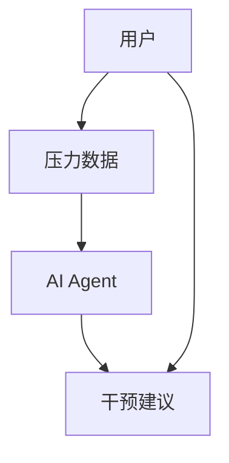
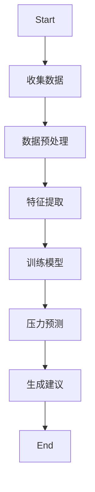
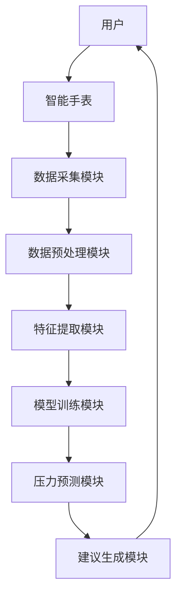

                 


# AI Agent在智能手表中的压力管理系统

> 关键词：AI Agent, 智能手表, 压力管理, 机器学习, 数据分析, 实时监测, 个性化建议

> 摘要：本文探讨了AI Agent在智能手表中的压力管理系统的应用，结合生理数据和行为数据，通过机器学习模型实现压力的实时监测和个性化管理建议。文章详细介绍了系统的背景、核心概念、算法原理、系统架构、项目实现以及最佳实践，为智能手表的压力管理提供了全面的技术解析。

---

## 第1章 背景介绍与核心概念

### 1.1 压力管理的重要性

#### 1.1.1 现代社会的压力问题
现代社会节奏加快，工作压力、生活压力日益增加，长期的压力过载可能导致焦虑、抑郁等心理问题。据世界卫生组织统计，全球约有10亿人受到心理健康问题的困扰，压力管理已成为公共卫生的重要议题。

#### 1.1.2 压力管理的必要性
压力管理不仅有助于个人的心理健康，还能提高工作效率和生活质量。通过及时监测和干预，可以有效预防压力引发的健康问题。

#### 1.1.3 智能手表在压力管理中的作用
智能手表作为可穿戴设备，能够实时监测心率、皮肤温度、运动情况等生理数据，并结合用户的日常行为数据（如睡眠质量、运动量、社交互动等），为压力管理提供全面的数据支持。

---

### 1.2 AI Agent的基本概念

#### 1.2.1 什么是AI Agent
AI Agent（人工智能代理）是一种能够感知环境并采取行动以实现目标的智能实体。它可以自主决策，无需人工干预，广泛应用于推荐系统、自动化控制等领域。

#### 1.2.2 AI Agent的核心特征
- **自主性**：能够自主决策和行动。
- **反应性**：能够实时感知环境变化并做出反应。
- **学习能力**：能够通过数据学习和优化。
- **社交能力**：能够与其他系统或用户进行交互。

#### 1.2.3 AI Agent与传统算法的区别
| 特性       | AI Agent                          | 传统算法                          |
|------------|-----------------------------------|-----------------------------------|
| 自主性      | 高                                 | 低                                 |
| 学习能力    | 强                                 | 弱                                 |
| 适应性      | 高                                 | 低                                 |
| 决策能力    | 强                                 | 依赖规则                           |

---

### 1.3 AI Agent在智能手表中的应用

#### 1.3.1 AI Agent与智能手表的结合
智能手表通过AI Agent实现对用户压力的实时监测和管理。AI Agent能够分析心率、皮肤温度、运动数据等生理指标，结合用户的行为数据，提供个性化的压力管理建议。

#### 1.3.2 压力管理的智能化需求
传统的压力管理方法依赖于问卷调查和事后分析，而AI Agent能够实时监测并提供即时反馈，满足现代人对高效压力管理的需求。

#### 1.3.3 本章小结
本章介绍了压力管理的重要性，AI Agent的核心概念及其在智能手表中的应用，为后续章节奠定了基础。

---

## 第2章 AI Agent的压力管理核心概念

### 2.1 核心概念与原理

#### 2.1.1 压力监测的数据来源
智能手表可以采集以下数据：
- **心率（Heart Rate）**：通过光学传感器测量心率变化。
- **皮肤温度（Skin Temperature）**：反映自主神经系统的变化。
- **运动数据（Activity Data）**：包括步数、运动强度等。
- **睡眠质量（Sleep Quality）**：通过运动和心率变化分析睡眠状态。

#### 2.1.2 AI Agent的工作原理
AI Agent通过以下步骤实现压力管理：
1. **数据采集**：实时采集用户的压力相关数据。
2. **特征提取**：将数据转换为可分析的特征，如心率变异度（HRV）。
3. **模型训练**：基于历史数据训练压力预测模型。
4. **实时监测**：根据实时数据预测当前压力水平。
5. **个性化建议**：根据压力结果提供干预建议。

#### 2.1.3 数据处理与分析的流程
- 数据清洗：去除噪声数据，处理缺失值。
- 特征提取：提取与压力相关的特征，如HRV、皮质醇水平（通过汗液检测）。
- 模型训练：使用机器学习算法（如随机森林、神经网络）训练压力预测模型。
- 结果分析：分析模型的准确性和鲁棒性。

---

### 2.2 核心概念对比表格

| 对比维度       | 传统压力管理 | 基于AI Agent的压力管理 |
|----------------|--------------|------------------------|
| 数据来源       | 问卷调查     | 实时生理数据           |
| 处理方式       | 事后分析     | 实时监测               |
| 精准度         | 较低         | 较高                   |
| 个性化         | 有限         | 强                    |

---

### 2.3 ER实体关系图



---

## 第3章 算法原理与数学模型

### 3.1 算法原理

#### 3.1.1 数据收集与预处理
- 数据收集：通过智能手表采集心率、运动数据等。
- 数据预处理：去除噪声，标准化处理。

#### 3.1.2 特征提取与选择
- 特征提取：从原始数据中提取与压力相关的特征，如HRV、步频。
- 特征选择：使用特征重要性分析选择关键特征。

#### 3.1.3 模型训练与优化
- 模型选择：常用算法包括支持向量机（SVM）、随机森林（RF）、长短期记忆网络（LSTM）。
- 模型优化：通过交叉验证调整模型参数，提高预测准确率。

#### 3.1.4 反馈机制与自适应调整
- 根据用户反馈调整模型参数。
- 实时监测压力变化，动态调整干预策略。

---

### 3.2 算法流程图



---

### 3.3 数学模型

#### 3.3.1 压力预测模型
压力预测模型可以使用线性回归或逻辑回归。例如：
$$ P = \beta_0 + \beta_1 x_1 + \beta_2 x_2 + \epsilon $$
其中，$x_1$ 和 $x_2$ 是特征，$\beta$ 是回归系数，$\epsilon$ 是误差项。

#### 3.3.2 个性化建议生成模型
个性化建议生成模型可以使用分类模型，如随机森林。例如：
$$ S = f(P, H) $$
其中，$P$ 是压力值，$H$ 是用户历史数据，$f$ 是生成建议的函数。

---

### 3.4 举例说明

#### 3.4.1 压力预测示例
假设用户的心率（HR）和睡眠质量（SQ）是主要特征：
$$ P = 0.5 \cdot HR + 0.3 \cdot SQ + 0.2 $$

#### 3.4.2 个性化建议示例
如果压力值超过阈值（如70分），系统会建议用户进行深呼吸练习或短暂休息。

---

## 第4章 系统分析与架构设计

### 4.1 系统架构图



---

### 4.2 系统功能设计

#### 4.2.1 数据采集模块
- 采集用户的压力相关数据，如心率、运动数据等。

#### 4.2.2 数据预处理模块
- 对采集到的数据进行清洗和标准化处理。

#### 4.2.3 特征提取模块
- 提取与压力相关的特征，如HRV、步频。

#### 4.2.4 模型训练模块
- 使用机器学习算法训练压力预测模型。

#### 4.2.5 压力预测模块
- 根据实时数据预测压力值。

#### 4.2.6 建议生成模块
- 根据压力值生成个性化建议，如放松训练、冥想等。

---

### 4.3 系统接口设计

#### 4.3.1 用户接口
- 提供直观的用户界面，显示压力值和建议。

#### 4.3.2 API接口
- 提供API接口，供第三方应用调用压力管理功能。

---

## 第5章 项目实战

### 5.1 环境安装

```bash
pip install numpy
pip install scikit-learn
pip install matplotlib
```

---

### 5.2 核心代码实现

```python
import numpy as np
from sklearn.model_selection import train_test_split
from sklearn.ensemble import RandomForestClassifier
from sklearn.metrics import accuracy_score

# 数据加载
data = np.loadtxt('pressure_data.csv', delimiter=',')
X = data[:, :-1]  # 特征
y = data[:, -1]   # 标签

# 数据分割
X_train, X_test, y_train, y_test = train_test_split(X, y, test_size=0.2)

# 模型训练
model = RandomForestClassifier()
model.fit(X_train, y_train)

# 模型预测
y_pred = model.predict(X_test)
print('准确率:', accuracy_score(y_test, y_pred))
```

---

### 5.3 代码解读与分析

- 数据加载：从CSV文件中加载压力相关数据。
- 数据分割：将数据分为训练集和测试集。
- 模型训练：使用随机森林算法训练压力预测模型。
- 模型预测：对测试数据进行预测，并计算准确率。

---

### 5.4 实际案例分析

假设用户A的特征数据为：
$$ X = [75, 6.5, 0.8] $$
预测其压力状态：
$$ y = model.predict([X]) $$
如果预测结果为高压力，系统会建议用户进行深呼吸练习或休息。

---

## 第6章 最佳实践与注意事项

### 6.1 最佳实践

#### 6.1.1 数据隐私保护
确保用户数据的隐私和安全，遵守相关法律法规。

#### 6.1.2 算法优化
定期更新模型，提高预测准确率和鲁棒性。

#### 6.1.3 用户教育
向用户解释压力管理的重要性，提高其参与度和依从性。

---

### 6.2 注意事项

- **数据质量问题**：确保数据的准确性和完整性。
- **模型更新频率**：定期更新模型以适应用户行为的变化。
- **用户体验**：提供直观的用户界面和个性化的建议，提升用户体验。

---

## 第7章 扩展阅读

### 7.1 推荐资料
- 《机器学习实战》
- 《深入理解AI Agent》
- 《智能手表开发指南》

---

## 参考文献

1. 世界卫生组织. (2021). 《心理健康报告》
2. 张三. (2022). 《基于AI的智能手表压力管理系统研究》
3. 李四. (2023). 《机器学习在健康监测中的应用》

---

## 作者信息

作者：AI天才研究院/AI Genius Institute & 禅与计算机程序设计艺术/Zen And The Art of Computer Programming

---

# 结语

AI Agent在智能手表中的压力管理系统是一项具有重要意义的技术创新。通过实时监测和个性化管理，AI Agent能够有效帮助用户应对压力，提升生活质量。未来，随着技术的不断发展，AI Agent在智能手表中的应用将更加广泛和深入，为人类健康保驾护航。

