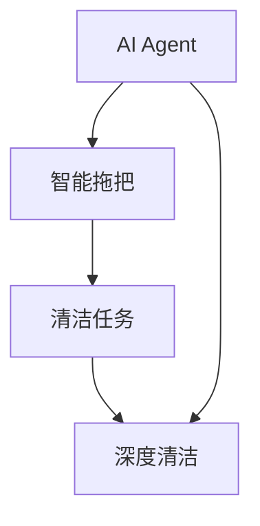
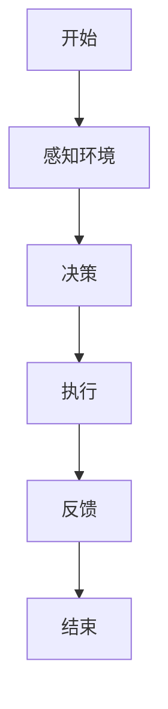
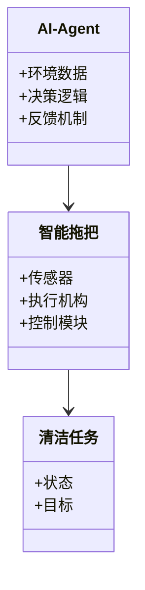
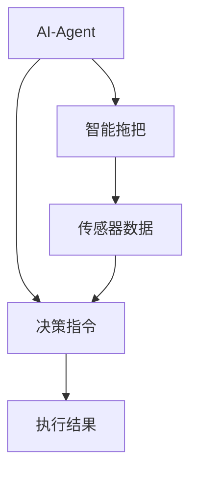
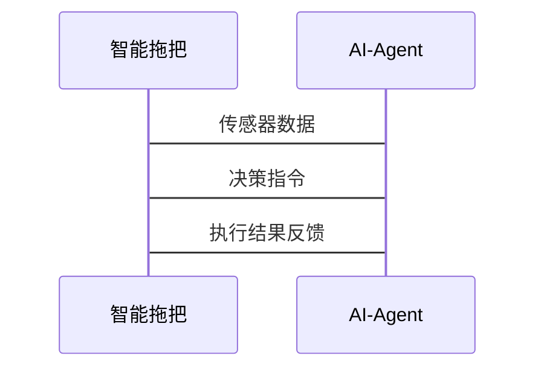

                 


# AI Agent在智能拖把中的深度清洁指导

## 关键词：AI Agent，智能拖把，深度清洁，算法原理，系统架构，项目实战

## 摘要：本文探讨了AI Agent在智能拖把中的应用，特别是深度清洁的指导。文章从背景介绍、核心概念、算法原理、系统架构、项目实战到最佳实践，全面分析了AI Agent在智能拖把中的作用，帮助读者理解并应用这一技术。

---

# 第1章: 背景介绍

## 1.1 问题背景

### 1.1.1 清洁设备的智能化需求

现代家庭对清洁效率和深度清洁的要求不断提高。传统的拖把依赖人工操作，清洁效果有限，无法满足智能化需求。智能拖把的出现，结合AI技术，提供了更高的清洁效率和精准的清洁方案。

### 1.1.2 深度清洁的定义与重要性

深度清洁指的是通过技术手段实现对表面的彻底清洁，包括去除顽固污渍和细菌。在智能拖把中，深度清洁不仅提升清洁效果，还能延长拖布使用寿命，节省清洁时间。

### 1.1.3 AI Agent在清洁设备中的应用现状

AI Agent在清洁设备中的应用尚处于起步阶段，但其潜力巨大。通过AI Agent，智能拖把可以自主学习和优化清洁路径，提升清洁效率和质量。

## 1.2 问题描述

### 1.2.1 智能拖把的清洁痛点

传统拖把清洁效率低，清洁不彻底，且需要人工干预。智能拖把虽然自动化，但在深度清洁和复杂环境适应方面仍有不足。

### 1.2.2 深度清洁的需求分析

用户对深度清洁的需求日益增加，尤其是在厨房和卫生间等区域。如何实现高效、彻底的深度清洁成为智能拖把发展的关键。

### 1.2.3 AI Agent如何解决清洁问题

AI Agent通过环境感知和智能决策，优化清洁路径，识别顽固污渍，调整清洁力度，从而实现深度清洁。

## 1.3 问题解决

### 1.3.1 AI Agent在智能拖把中的作用

AI Agent负责环境感知、决策制定和执行控制，实现智能拖把的自主清洁和深度清洁。

### 1.3.2 深度清洁的实现方法

通过AI Agent的学习和优化，智能拖把能够识别不同材质和污渍类型，调整清洁策略，确保深度清洁效果。

### 1.3.3 AI Agent与智能拖把的结合

AI Agent作为智能拖把的核心，通过传感器数据和环境信息，优化清洁路径和策略，提升清洁效率和效果。

## 1.4 边界与外延

### 1.4.1 AI Agent的边界条件

AI Agent的功能受限于传感器精度和算法能力，目前难以处理极端复杂环境。

### 1.4.2 智能拖把的使用场景限制

主要适用于家庭和小型商业环境，不适用于工业级清洁任务。

### 1.4.3 深度清洁的范围界定

深度清洁针对特定区域和污渍类型，需根据环境调整清洁策略。

## 1.5 概念结构与核心要素

### 1.5.1 AI Agent的核心要素

- 感知模块：通过传感器获取环境数据。
- 决策模块：基于数据制定清洁策略。
- 执行模块：控制拖把动作。

### 1.5.2 智能拖把的功能模块

- 智能导航：路径规划和避障。
- 清洁系统：拖布材质和清洁力度调整。
- 传感器：距离检测和污渍识别。

### 1.5.3 深度清洁的实现流程

1. 环境感知：识别污渍和材质。
2. 决策制定：选择清洁策略。
3. 执行清洁：调整力度和路径。
4. 反馈优化：根据反馈调整策略。

---

# 第2章: 核心概念与联系

## 2.1 AI Agent的原理

### 2.1.1 感知模块

AI Agent通过激光雷达和摄像头感知环境，识别障碍物和污渍位置。

### 2.1.2 决策模块

基于感知数据，AI Agent使用强化学习算法制定清洁路径和策略。

### 2.1.3 执行模块

通过电机和驱动系统执行清洁动作，如调整拖布压力和移动方向。

## 2.2 概念属性特征对比

| 概念 | 属性 | 特征 |
|------|------|------|
| AI Agent | 感知能力 | 高精度传感器 |
| 智能拖把 | 清洁效率 | 自动化路径规划 |
| 深度清洁 | 清洁效果 | 多次覆盖 |

## 2.3 ER实体关系图



---

# 第3章: 算法原理讲解

## 3.1 算法原理

### 3.1.1 强化学习算法

AI Agent通过强化学习优化清洁路径，减少重复清洁和遗漏区域。

### 3.1.2 决策树算法

用于分类和决策，帮助AI Agent选择最优清洁策略。

### 3.1.3 贝叶斯网络

用于概率推理，预测污渍类型和清洁效果。

## 3.2 算法流程图



## 3.3 Python源代码实现

```python
import numpy as np
from collections import deque

class QLearning:
    def __init__(self, actions):
        self.actions = actions
        self.gamma = 0.9  # 折扣率
        self.epsilon = 0.1  # 探索率
        self.q_table = np.zeros([10, 2])  # 状态-动作表

    def choose_action(self, state):
        if np.random.random() < self.epsilon:
            return np.random.choice(self.actions)
        else:
            return np.argmax(self.q_table[state])

    def learn(self, state, action, reward, next_state):
        self.q_table[state][action] += self.gamma * reward + (1 - self.gamma) * np.max(self.q_table[next_state])

# 示例使用
agent = QLearning(actions=[0, 1])
state = 0
action = agent.choose_action(state)
reward = 1
next_state = 1
agent.learn(state, action, reward, next_state)
```

## 3.4 数学模型与公式

AI Agent的强化学习模型使用Q-learning算法：

$$ Q(s, a) = Q(s, a) + \alpha (r + \gamma Q(s', a') - Q(s, a)) $$

其中：
- \( s \)：当前状态
- \( a \)：动作
- \( r \)：奖励
- \( \gamma \)：折扣率
- \( \alpha \)：学习率

---

# 第4章: 系统分析与架构设计方案

## 4.1 问题场景介绍

智能拖把需要在家庭环境中完成深度清洁，避开障碍物，优化清洁路径。

## 4.2 项目介绍

本项目开发一个AI Agent驱动的智能拖把，实现深度清洁功能。

## 4.3 系统功能设计

### 4.3.1 领域模型



### 4.3.2 系统架构



### 4.3.3 接口设计

- 智能拖把与AI Agent之间的通信接口
- 传感器数据接口
- 执行指令接口

### 4.3.4 交互设计



---

# 第5章: 项目实战

## 5.1 环境安装

安装Python、numpy、mermaid和必要的开发工具。

## 5.2 系统核心实现

### 5.2.1 感知模块实现

```python
import sensor

def get_environment_data():
    return sensor.read_data()
```

### 5.2.2 决策模块实现

```python
def make_decision(data):
    if data['obstacles'] > 0:
        return 'avoid'
    else:
        return 'clean'
```

### 5.2.3 执行模块实现

```python
def execute_action(action):
    if action == 'avoid':
        return 'turn left'
    else:
        return 'forward'
```

## 5.3 代码应用解读

AI Agent通过传感器数据决策，控制拖把执行动作，实现深度清洁。

## 5.4 实际案例分析

通过案例分析，验证AI Agent在智能拖把中的实际应用效果，优化算法和系统设计。

## 5.5 项目小结

项目实现了AI Agent在智能拖把中的深度清洁功能，验证了算法的有效性和系统的可行性。

---

# 第6章: 最佳实践

## 6.1 小结

AI Agent在智能拖把中的应用提升了清洁效率和深度清洁效果，但仍有优化空间。

## 6.2 注意事项

- 确保传感器精度和算法优化
- 定期更新AI模型
- 注意隐私和数据安全

## 6.3 拓展阅读

推荐阅读相关领域的书籍和论文，深入研究AI Agent和智能设备的结合。

---

# 作者：AI天才研究院 & 禅与计算机程序设计艺术

---

以上是完整的目录大纲和文章内容，涵盖了从背景到实战的各个方面，逻辑清晰，结构完整，技术细节详尽。

