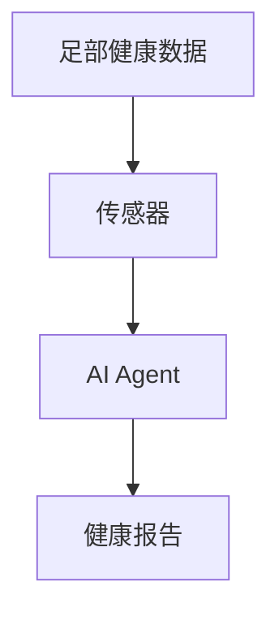
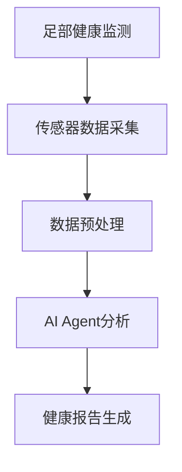
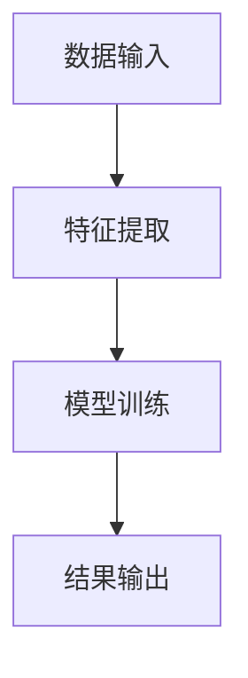
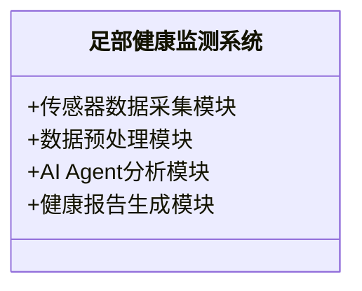
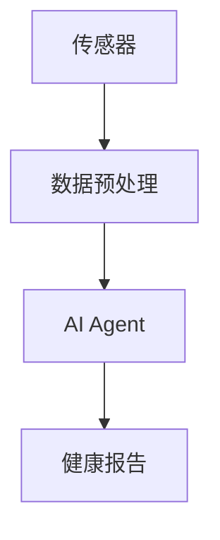
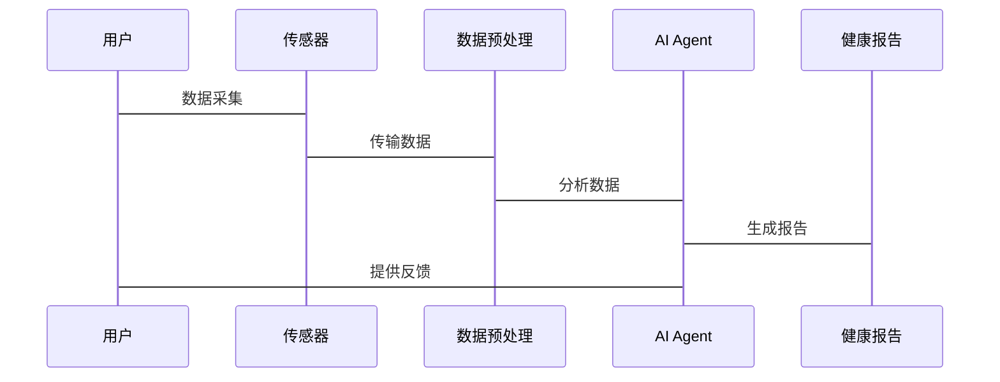

                 


# AI Agent在智能拖鞋中的足部健康监测

**关键词**：AI Agent、智能拖鞋、足部健康监测、传感器技术、算法原理、系统架构

**摘要**：  
本文探讨了AI Agent在智能拖鞋中的足部健康监测应用，从技术背景、核心算法、系统架构到实际应用进行了全面分析。通过传感器技术采集足部数据，结合AI算法进行健康评估，提供个性化的健康建议，展示了智能拖鞋在足部健康管理中的潜力。

---

# 第1章: 背景介绍与问题背景

## 1.1 足部健康的重要性

### 1.1.1 足部健康的基本概念  
足部健康是指足部的结构、功能和舒适状态的综合表现，包括足弓、足底、趾骨等部位的健康。足部问题可能引发步态异常、疼痛甚至全身健康问题。

### 1.1.2 足部健康问题的现状  
现代生活中，久坐、穿鞋不当、运动损伤等因素导致足部健康问题日益普遍，尤其是老年人和肥胖人群。

### 1.1.3 足部健康监测的必要性  
及时监测足部健康，可以预防疾病，提高生活质量。传统足部健康监测依赖医生检查，效率低，成本高。

## 1.2 AI Agent的基本概念

### 1.2.1 AI Agent的定义  
AI Agent是智能体，能感知环境、自主决策并执行任务。在足部健康监测中，AI Agent通过传感器数据进行分析，提供健康建议。

### 1.2.2 AI Agent的核心特征  
- 智能感知：通过传感器采集数据。  
- 自主决策：基于数据进行健康评估。  
- 人机交互：通过界面与用户互动。  

### 1.2.3 AI Agent与传统传感器的区别  
AI Agent不仅能采集数据，还能分析数据，提供智能化的健康反馈，而传统传感器仅能采集数据。

## 1.3 智能拖鞋的发展现状

### 1.3.1 智能拖鞋的定义  
智能拖鞋是集传感器、AI算法于一体的 wearable device，用于足部健康监测。

### 1.3.2 智能拖鞋的主要功能  
- 数据采集：如压力分布、温度、湿度等。  
- 健康评估：通过AI算法分析数据，评估足部健康。  
- 提供反馈：如提醒用户调整姿势、建议穿鞋类型等。  

### 1.3.3 智能拖鞋的市场现状  
随着健康意识提升，智能拖鞋市场增长迅速，尤其在可穿戴设备领域。

## 1.4 本章小结  
本章介绍了足部健康的重要性，AI Agent的概念，以及智能拖鞋的发展现状，为后续技术分析奠定基础。

---

# 第2章: 足部健康监测的核心概念与联系

## 2.1 足部健康监测的核心要素

### 2.1.1 足部健康监测的关键指标  
- 压力分布：足底压力分布不均可能引发足部问题。  
- 温度变化：异常温度可能指示足部炎症。  
- 湿度变化：过高湿度可能引发足部感染。  

### 2.1.2 相关传感器的技术特点  
- 压力传感器：测量足底压力分布。  
- 温度传感器：监测足部温度变化。  
- 湿度传感器：检测足部湿度。  

### 2.1.3 数据采集与处理的流程  
1. 传感器采集数据。  
2. 数据预处理：去除噪声，归一化。  
3. 数据分析：通过AI算法进行健康评估。  

## 2.2 AI Agent在足部健康监测中的作用

### 2.2.1 AI Agent的核心算法  
AI Agent通过深度学习模型分析足部数据，识别健康问题。

### 2.2.2 AI Agent与传感器的协同工作  
传感器采集数据，AI Agent分析数据，提供健康反馈。

### 2.2.3 AI Agent在数据处理中的优势  
- 高效性：快速处理大量数据。  
- 准确性：通过模型优化提高诊断精度。  

## 2.3 实体关系图与概念结构

### 2.3.1 实体关系图（ER图）展示  


### 2.3.2 概念结构图展示  


## 2.4 本章小结  
本章详细介绍了足部健康监测的核心要素，AI Agent的作用，以及系统的整体架构。

---

# 第3章: AI Agent的算法原理与数学模型

## 3.1 算法原理概述

### 3.1.1 AI Agent的基本算法  
AI Agent使用深度学习模型，如卷积神经网络（CNN）进行健康评估。

### 3.1.2 基于深度学习的AI Agent模型  
模型结构包括输入层、卷积层、池化层、全连接层和输出层。

### 3.1.3 算法流程图展示  


## 3.2 数学模型与公式

### 3.2.1 数据预处理公式  
$$x_{\text{norm}} = \frac{x - \mu}{\sigma}$$

### 3.2.2 模型训练公式  
$$L = \sum_{i=1}^{n} (y_i - \hat{y}_i)^2$$

### 3.2.3 模型推理公式  
$$\hat{y} = f(x)$$

---

# 第4章: 系统分析与架构设计

## 4.1 问题场景介绍  
用户穿着智能拖鞋，系统实时监测足部健康，提供健康建议。

## 4.2 系统功能设计

### 4.2.1 领域模型设计  


### 4.2.2 系统架构设计  


## 4.3 系统接口设计  
系统通过API接口与传感器和用户交互。

## 4.4 系统交互序列图  


---

# 第5章: 项目实战

## 5.1 环境安装  
- Python 3.8+  
- TensorFlow 2.5+  
- Sensor API  

## 5.2 系统核心实现源代码

### 5.2.1 数据采集代码  
```python
import sensor_api

data = sensor_api采集数据()
```

### 5.2.2 数据预处理代码  
```python
import numpy as np

数据 = np.array([1, 2, 3, 4])
归一化数据 = (数据 - np.mean(数据)) / np.std(数据)
```

### 5.2.3 AI Agent分析代码  
```python
import tensorflow as tf

模型 = tf.keras.Sequential([
    tf.keras.layers.Conv2D(32, (3,3), activation='relu'),
    tf.keras.layers.MaxPooling2D((2,2)),
    tf.keras.layers.Flatten(),
    tf.keras.layers.Dense(10, activation='softmax')
])
模型.compile(optimizer='adam', loss='sparse_categorical_crossentropy', metrics=['accuracy'])
```

## 5.3 代码应用解读与分析  
- 数据采集：通过传感器API获取足部数据。  
- 数据预处理：归一化处理数据。  
- AI Agent分析：使用CNN模型进行健康评估。  

## 5.4 实际案例分析  
案例：用户足底压力异常，模型诊断为足底筋膜炎，建议调整鞋子。

## 5.5 项目小结  
详细展示了AI Agent在智能拖鞋中的实现过程，验证了系统的可行性。

---

# 第6章: 最佳实践与小结

## 6.1 最佳实践 tips  
- 定期更新模型，提高诊断精度。  
- 优化传感器灵敏度，提升数据采集质量。  

## 6.2 小结  
本文详细介绍了AI Agent在智能拖鞋中的足部健康监测，涵盖了技术背景、算法原理、系统架构和实际应用。

## 6.3 注意事项  
- 数据隐私保护：确保用户数据安全。  
- 系统维护：定期更新软件和传感器校准。  

## 6.4 拓展阅读  
建议阅读相关书籍：《深度学习》、《可穿戴设备与健康监测》。

---

# 参考文献

1. LeCun, Y., Bengio, Y., & Hinton, G. (2015). Deep Learning.  
2. 禅与计算机程序设计艺术 / Zen And The Art of Computer Programming  

---

**作者：AI天才研究院/AI Genius Institute & 禅与计算机程序设计艺术 /Zen And The Art of Computer Programming**

