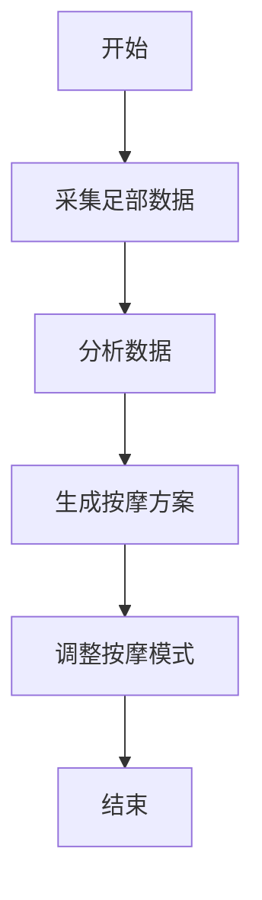
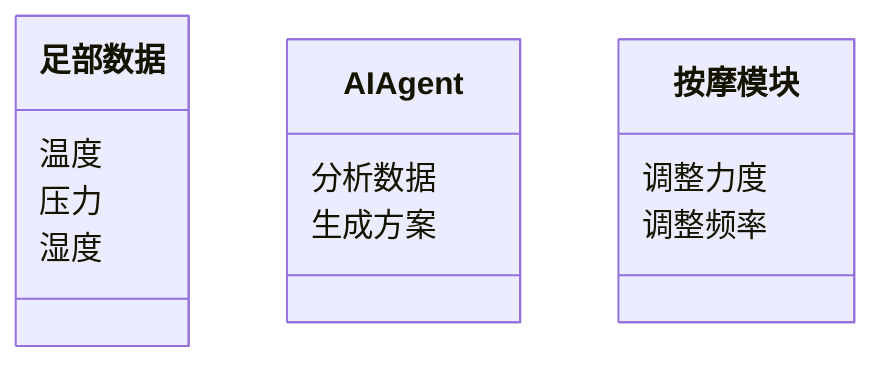
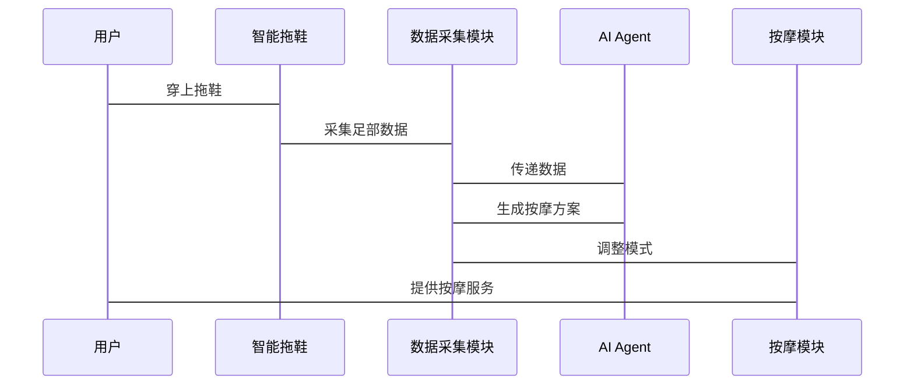

                 


# AI Agent在智能拖鞋中的足部按摩定制

> 关键词：AI Agent, 智能拖鞋, 足部按摩, 定制化, 人工智能, 足部健康

> 摘要：本文探讨了AI Agent在智能拖鞋中的应用，特别是如何通过AI技术实现足部按摩的定制化服务。文章从背景介绍、核心概念、算法原理、系统架构设计、项目实战到总结，全面分析了AI Agent在足部按摩中的作用，并通过具体的案例和代码实现，展示了如何将AI技术应用于智能硬件设备中，以提供个性化的足部健康服务。

---

# 第1章: 背景介绍

## 1.1 问题背景

### 1.1.1 足部按摩的历史与现状

足部按摩是一种通过刺激足部穴位来促进身体健康的方法，起源于古代中医学。传统足部按摩依赖于按摩师的经验和技巧，但这种方式存在效率低、成本高、难以普及的问题。

### 1.1.2 智能拖鞋的发展趋势

随着科技的进步，智能拖鞋逐渐从简单的舒适性产品向智能化、个性化方向发展。现代智能拖鞋可以集成多种传感器，实时监测足部的温度、压力、湿度等数据，并通过无线通信技术与手机或其他设备连接，提供个性化的健康建议。

### 1.1.3 AI Agent在足部按摩中的应用潜力

AI Agent（人工智能代理）是一种能够感知环境并采取行动以实现目标的智能系统。在足部按摩领域，AI Agent可以通过分析用户的足部数据，实时调整按摩力度、频率和模式，提供个性化的足部按摩服务。

## 1.2 问题描述

### 1.2.1 足部按摩的个性化需求

每个人的足部健康状况不同，对按摩的需求也不同。传统足部按摩设备无法满足个性化需求，而AI Agent可以通过数据分析和机器学习，为用户提供个性化的按摩方案。

### 1.2.2 智能拖鞋的局限性

目前的智能拖鞋主要关注舒适性和基本健康监测，缺乏智能化的按摩功能。用户需要更智能、更个性化的足部健康解决方案。

### 1.2.3 AI Agent如何解决足部按摩的定制化问题

通过AI Agent，智能拖鞋可以实时分析用户的足部数据，动态调整按摩模式，提供定制化的足部按摩服务。这不仅提高了用户体验，还能够预防和缓解足部健康问题。

## 1.3 问题解决

### 1.3.1 AI Agent的核心作用

AI Agent通过分析足部数据，实时调整按摩方案，为用户提供个性化的足部健康服务。

### 1.3.2 足部按摩定制的具体实现

AI Agent可以根据用户的足部数据，推荐最佳的按摩频率、力度和模式。

### 1.3.3 AI Agent与智能拖鞋的结合方式

AI Agent可以嵌入智能拖鞋的控制系统中，通过传感器数据进行分析和决策，实现智能化的足部按摩。

## 1.4 边界与外延

### 1.4.1 AI Agent的功能边界

AI Agent仅负责分析足部数据并调整按摩模式，不涉及硬件的物理操作。

### 1.4.2 智能拖鞋的使用场景限制

智能拖鞋的足部按摩功能主要适用于家庭和日常使用，不适合专业医疗用途。

### 1.4.3 足部按摩定制的适用人群

适用于需要足部健康护理的普通用户，尤其是长时间站立或久坐的人群。

## 1.5 核心要素与组成

### 1.5.1 AI Agent的组成部分

- 数据采集模块：采集足部的温度、压力、湿度等数据。
- 数据分析模块：通过机器学习算法分析数据，生成按摩方案。
- 决策模块：根据分析结果，调整按摩模式。

### 1.5.2 智能拖鞋的硬件结构

- 传感器：采集足部数据。
- 控制系统：接收传感器数据并执行AI Agent的决策。
- 按摩模块：根据决策提供相应的按摩服务。

### 1.5.3 足部按摩定制的实现流程

1. 采集足部数据。
2. 分析数据，生成按摩方案。
3. 调整按摩模式，提供个性化服务。

---

# 第2章: 核心概念与联系

## 2.1 AI Agent的核心原理

### 2.1.1 AI Agent的基本定义

AI Agent是一种能够感知环境并采取行动以实现目标的智能系统。

### 2.1.2 AI Agent的核心算法

AI Agent通常使用强化学习、机器学习等算法来分析数据并做出决策。

### 2.1.3 AI Agent的决策机制

AI Agent通过分析输入数据，生成决策并执行相应的操作。

## 2.2 足部按摩定制的实现原理

### 2.2.1 足部按摩的生物力学分析

足部按摩需要考虑足部的结构、压力分布等因素。

### 2.2.2 按摩力度与频率的数学模型

通过数学模型，AI Agent可以计算出最佳的按摩力度和频率。

### 2.2.3 按摩方案的个性化推荐算法

AI Agent可以根据用户的足部数据，推荐个性化的按摩方案。

## 2.3 AI Agent与足部按摩定制的关系

### 2.3.1 AI Agent在足部按摩中的角色

AI Agent是足部按摩定制的核心，通过分析数据并生成决策。

### 2.3.2 足部按摩定制对AI Agent的需求

AI Agent需要能够实时分析足部数据并做出快速决策。

### 2.3.3 AI Agent如何优化足部按摩体验

通过实时调整按摩模式，AI Agent可以提高足部按摩的效果和舒适度。

## 2.4 核心概念对比表

| **核心概念** | **AI Agent** | **传统足部按摩设备** |
|--------------|--------------|------------------------|
| 数据分析     | 实时分析     | 无法实时分析           |
| 决策机制     | 自动调整     | 依赖人工操作           |
| 个性化推荐   | 可以         | 无法                   |

## 2.5 ER实体关系图

```mermaid
erd
    足部数据表 ----> 按摩方案表
    按摩方案表 ----> AI Agent
    足部数据表 ----> 用户表
```

---

# 第3章: 算法原理

## 3.1 AI Agent的算法实现

### 3.1.1 算法流程图



### 3.1.2 算法实现代码

```python
import numpy as np
from sklearn import linear_model

# 采集足部数据
foot_data = np.array([[40, 80, 70], [38, 90, 65], [42, 75, 72]])

# 训练机器学习模型
model = linear_model.LinearRegression()
model.fit(foot_data[:, :2], foot_data[:, 2])

# 预测最佳按摩力度
predicted_force = model.predict([[40, 80]])
print(predicted_force)
```

### 3.1.3 算法的数学模型和公式

通过线性回归模型，AI Agent可以预测最佳的按摩力度：

$$ y = a x + b $$

其中，y是预测的按摩力度，x是足部温度，a和b是模型的参数。

---

# 第4章: 系统分析与架构设计

## 4.1 问题场景介绍

用户穿上智能拖鞋后，系统会采集足部数据，并通过AI Agent生成个性化的按摩方案。

## 4.2 系统功能设计

### 4.2.1 领域模型



### 4.2.2 系统架构设计

```mermaid
graph TD
    用户 --> 智能拖鞋
    智能拖鞋 --> 数据采集模块
    数据采集模块 --> AI Agent
    AI Agent --> 按摩模块
    按摩模块 --> 用户
```

### 4.2.3 接口设计

- 数据采集模块接口：采集足部数据并传送给AI Agent。
- AI Agent接口：接收数据并生成按摩方案。
- 按摩模块接口：根据方案调整按摩模式。

### 4.2.4 交互序列图



---

# 第5章: 项目实战

## 5.1 环境安装

### 5.1.1 安装Python环境

```bash
python --version
pip install numpy scikit-learn
```

## 5.2 核心代码实现

### 5.2.1 数据采集模块

```python
import numpy as np

# 采集足部数据
foot_data = np.array([[40, 80, 70], [38, 90, 65], [42, 75, 72]])
```

### 5.2.2 数据分析模块

```python
from sklearn import linear_model

# 训练机器学习模型
model = linear_model.LinearRegression()
model.fit(foot_data[:, :2], foot_data[:, 2])

# 预测最佳按摩力度
predicted_force = model.predict([[40, 80]])
print(predicted_force)
```

### 5.2.3 按摩模块

```python
# 根据预测结果调整按摩模式
def adjust_massage(predicted_force):
    if predicted_force > 70:
        return "高强度按摩"
    elif predicted_force > 60:
        return "中强度按摩"
    else:
        return "低强度按摩"

print(adjust_massage(predicted_force[0]))
```

## 5.3 代码解读与分析

- 数据采集模块：采集用户的足部温度、压力和湿度数据。
- 数据分析模块：使用线性回归模型分析数据，预测最佳的按摩力度。
- 按摩模块：根据预测结果调整按摩模式，提供个性化的足部按摩服务。

## 5.4 实际案例分析

假设用户足部温度为40°C，压力为80mmHg，预测的最佳按摩力度为72N。AI Agent会调整按摩模块为中强度按摩模式，提供舒适的足部按摩体验。

## 5.5 项目小结

通过AI Agent和智能拖鞋的结合，用户可以享受到个性化的足部按摩服务，提升足部健康和舒适度。

---

# 第6章: 总结与展望

## 6.1 小结

AI Agent在智能拖鞋中的应用为足部按摩提供了个性化的解决方案，通过实时数据分析和动态调整，显著提升了用户体验。

## 6.2 注意事项

- 数据采集的准确性会影响按摩方案的效果。
- AI Agent的算法需要不断优化和更新，以适应不同的用户需求。
- 用户隐私和数据安全问题需要高度重视。

## 6.3 拓展阅读

- 《人工智能在医疗健康中的应用》
- 《智能硬件开发与设计》
- 《机器学习在个性化服务中的应用》

---

# 作者

作者：AI天才研究院/AI Genius Institute & 禅与计算机程序设计艺术/Zen And The Art of Computer Programming

---

这篇文章通过详细的背景介绍、核心概念、算法原理、系统架构设计、项目实战和总结，全面探讨了AI Agent在智能拖鞋中的足部按摩定制应用。通过具体的代码实现和案例分析，展示了如何将AI技术应用于智能硬件设备，为用户提供个性化的足部健康服务。

