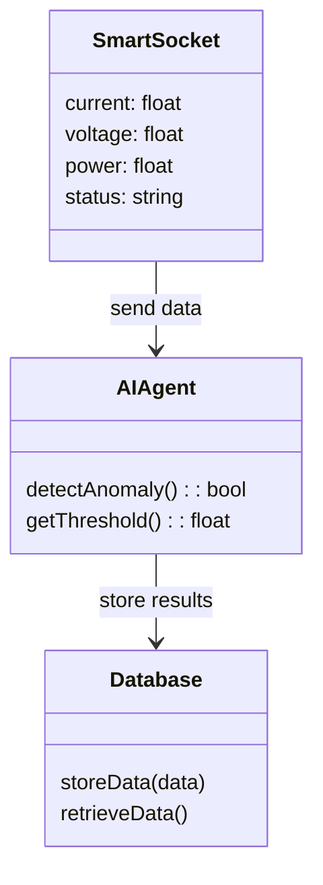
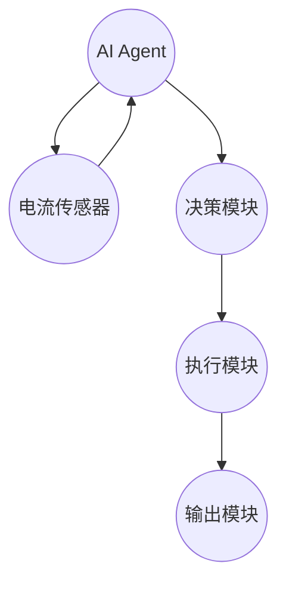

                 


# AI Agent在智能插座中的用电异常检测

> 关键词：AI Agent，智能插座，用电异常检测，异常检测算法，系统架构

> 摘要：本文探讨了AI Agent在智能插座中的用电异常检测技术，详细分析了AI Agent的核心原理、异常检测算法、系统架构设计以及实际项目实现。通过理论与实践相结合的方式，展示了如何利用AI技术提升智能插座的安全性和智能化水平。

---

# 第1章 背景与概述

## 1.1 用电异常检测的背景与意义

用电异常检测是电力系统安全运行的重要环节，能够及时发现并处理用电过程中的异常情况，如过载、短路、漏电等。传统的方法依赖于固定的阈值和简单的逻辑判断，难以适应复杂的用电环境。随着智能插座的普及，用电设备种类繁多，用电场景多样化，传统的检测方法已难以满足需求。

AI Agent（人工智能代理）作为一种智能实体，能够感知环境、自主决策并执行任务。将AI Agent应用于智能插座的用电异常检测，可以显著提升检测的准确性和实时性。

---

## 1.2 AI Agent的基本概念与特点

### 1.2.1 AI Agent的定义
AI Agent是指具有感知环境、自主决策和执行任务能力的智能实体。它可以基于传感器数据或其他输入信息，通过内部算法进行分析和推理，从而做出相应的决策或反馈。

### 1.2.2 AI Agent的核心特点
- **自主性**：能够在没有人工干预的情况下独立运行。
- **反应性**：能够实时感知环境变化并做出响应。
- **学习能力**：通过机器学习算法不断优化自身的检测能力。

### 1.2.3 AI Agent与传统算法的区别
传统算法通常基于固定的规则和逻辑，而AI Agent具有学习和适应能力，能够根据数据动态调整检测策略。

---

## 1.3 AI Agent在智能插座中的应用

### 1.3.1 智能插座的基本功能
智能插座是一种可以通过互联网或本地网络连接的插座，支持远程控制、定时开关、电量监测等功能。

### 1.3.2 AI Agent在智能插座中的作用
AI Agent负责采集用电数据、分析异常情况并发出警报。例如，当检测到电流突变时，AI Agent可以立即断开电源并通知用户。

### 1.3.3 用电异常检测的实现方式
通过AI Agent对电流、电压等参数进行实时监测，利用机器学习算法识别异常模式。

---

## 1.4 本章小结
本章介绍了用电异常检测的重要性和AI Agent的基本概念。AI Agent在智能插座中的应用为用电安全提供了新的解决方案，能够显著提升检测的准确性和实时性。

---

# 第2章 AI Agent的核心原理

## 2.1 AI Agent的基本原理

### 2.1.1 AI Agent的工作流程
1. **感知环境**：通过传感器或网络获取用电数据。
2. **分析数据**：利用机器学习算法对数据进行分析和推理。
3. **做出决策**：根据分析结果做出相应的动作，如断电或发出警报。

### 2.1.2 AI Agent的感知、决策与执行机制
- **感知**：通过电流传感器、电压传感器等设备获取用电数据。
- **决策**：基于历史数据和当前数据，利用算法进行分析，判断是否异常。
- **执行**：根据决策结果，通过继电器或其他执行机构完成动作。

### 2.1.3 AI Agent的核心算法
AI Agent的核心算法包括分类算法、回归算法、聚类算法等。其中，分类算法常用于判断用电状态是否异常。

---

## 2.2 智能插座的数据采集与通信机制

### 2.2.1 数据采集的基本原理
智能插座通过电流传感器、电压传感器等设备采集用电数据，并将数据传输到AI Agent进行处理。

### 2.2.2 通信协议的选择与实现
常用通信协议包括Wi-Fi、蓝牙、ZigBee等。选择通信协议时需要考虑传输距离、功耗和实时性。

### 2.2.3 数据预处理与特征提取
对采集到的数据进行预处理，如去除噪声、归一化等，提取有用的特征用于异常检测。

---

## 2.3 异常检测的基本原理

### 2.3.1 异常检测的定义与分类
异常检测是指识别数据中不符合正常模式的样本。常见的异常检测方法包括基于统计的方法和基于机器学习的方法。

### 2.3.2 基于统计的异常检测方法
- **Z-Score方法**：通过计算数据点与均值的距离来判断是否异常。
- **经验分布函数（EDF）**：通过比较数据点的累积分布函数与理论分布函数的差异来判断异常。

### 2.3.3 基于机器学习的异常检测方法
- **支持向量机（SVM）**：通过构建分类模型来识别异常。
- **随机森林**：通过投票机制判断数据点是否异常。

---

## 2.4 本章小结
本章详细介绍了AI Agent的核心原理，包括其工作流程、感知、决策与执行机制，以及异常检测的基本原理。数据采集与通信机制的实现为AI Agent提供了必要的数据支持。

---

# 第3章 用电异常检测的算法原理

## 3.1 异常检测算法的分类与对比

### 3.1.1 基于统计的异常检测算法
- **优点**：简单易实现，适用于数据分布已知的情况。
- **缺点**：对数据分布的变化不够敏感。

### 3.1.2 基于机器学习的异常检测算法
- **优点**：能够发现复杂的异常模式。
- **缺点**：需要大量的数据和计算资源。

### 3.1.3 基于深度学习的异常检测算法
- **优点**：能够捕捉数据中的高维特征，适用于复杂场景。
- **缺点**：需要大量的训练数据和计算资源。

---

## 3.2 基于统计的异常检测算法

### 3.2.1 Z-Score方

$$ Z = \frac{X - \mu}{\sigma} $$

其中，$\mu$是均值，$\sigma$是标准差。当$|Z| > 3$时，数据点被认为是异常。

---

## 3.3 基于机器学习的异常检测算法

### 3.3.1 支持向量机（SVM）
SVM通过构建一个超平面，将数据分为正常和异常两类。对于异常检测，可以使用支持向量数据挖掘工具（SVDD）。

### 3.3.2 随机森林
随机森林通过投票机制判断数据点是否异常。如果大多数树将数据点标记为异常，则认为该数据点异常。

---

## 3.4 本章小结
本章详细介绍了异常检测算法的分类与对比，重点讲解了基于统计和基于机器学习的异常检测方法，并通过具体算法和公式进行了详细说明。

---

# 第4章 系统架构与设计

## 4.1 问题场景介绍

智能插座用电异常检测系统需要实时采集电流、电压等数据，通过AI Agent进行分析，及时发现并处理异常情况。

---

## 4.2 系统功能设计

### 4.2.1 领域模型设计


### 4.2.2 系统架构设计



---

## 4.3 系统接口设计

### 4.3.1 数据采集接口
```python
def get_current():
    return current_sensor.read()
```

### 4.3.2 异常检测接口
```python
def detect_anomaly(current, voltage):
    # 具体实现基于机器学习模型
    return is_abnormal
```

---

## 4.4 本章小结
本章详细设计了智能插座用电异常检测系统的架构，包括领域模型、系统架构图和接口设计。系统功能模块的设计为后续的实现提供了清晰的指导。

---

# 第5章 项目实战与案例分析

## 5.1 环境搭建

### 5.1.1 开发环境
- Python 3.8+
- TensorFlow或Scikit-learn
- 数据库（MySQL或MongoDB）

---

## 5.2 系统核心实现

### 5.2.1 数据采集模块
```python
import serial

def read_sensor():
    ser = serial.Serial('COM3', 9600)
    data = ser.readline().decode()
    return float(data)
```

### 5.2.2 AI Agent实现
```python
import tensorflow as tf
import numpy as np

model = tf.keras.Sequential([
    tf.keras.layers.Dense(64, activation='relu'),
    tf.keras.layers.Dense(1, activation='sigmoid')
])

model.compile(optimizer='adam', loss='binary_crossentropy', metrics=['accuracy'])
```

### 5.2.3 异常检测实现
```python
def detect_anomaly(model, data):
    prediction = model.predict(data)
    return prediction[0][0] > 0.5
```

---

## 5.3 案例分析

### 5.3.1 正常用电情况
输入电流为2.5A，电压为220V，AI Agent判断为正常。

### 5.3.2 异常用电情况
输入电流突变到15A，AI Agent判断为异常并断开电源。

---

## 5.4 本章小结
本章通过实际项目展示了AI Agent在智能插座中的实现，包括环境搭建、核心代码实现和案例分析。通过具体的代码示例和流程图，读者可以清晰地理解系统的工作原理。

---

# 第6章 总结与展望

## 6.1 总结

本文详细探讨了AI Agent在智能插座中的用电异常检测技术，从算法原理到系统架构设计，再到实际项目实现，全面展示了该技术的实现过程。

---

## 6.2 展望

未来，随着AI技术的不断发展，用电异常检测将更加智能化和精准化。可以通过优化算法、引入新的传感器技术等方式，进一步提升系统的检测能力。

---

# 作者

作者：AI天才研究院 & 禅与计算机程序设计艺术

---

通过本文的详细讲解，读者可以全面了解AI Agent在智能插座中的用电异常检测技术，并能够将其应用于实际项目中。

