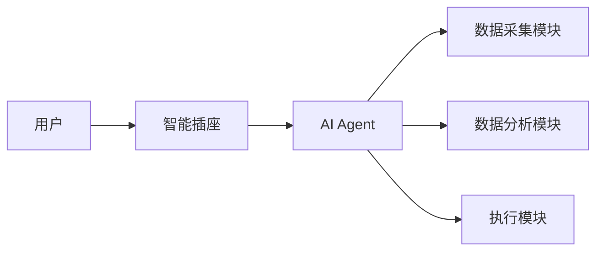
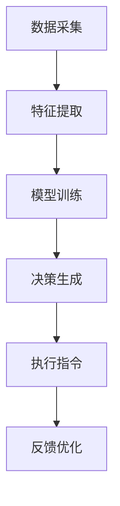

                 


# AI Agent在智能插座中的设备使用优化

## 关键词：AI Agent, 智能插座, 设备优化, 能耗管理, 智能家居

## 摘要：  
随着智能家居的普及，智能插座作为智能家居的重要组成部分，逐渐成为家庭能源管理的核心设备。然而，传统的智能插座仍然面临能耗浪费、设备使用效率低、用户操作复杂等问题。AI Agent（人工智能代理）作为一种能够自主感知、决策和执行的智能体，可以有效解决这些问题。本文将深入探讨AI Agent在智能插座中的应用，分析其优化设备使用的原理和方法，结合实际案例，展示如何通过AI Agent实现智能插座的高效管理和优化。

---

# 第一部分: AI Agent在智能插座中的设备使用优化概述

## 第1章: AI Agent与智能插座的背景介绍

### 1.1 AI Agent的基本概念  
AI Agent（人工智能代理）是一种能够感知环境、自主决策并执行任务的智能体。它可以基于传感器数据、历史记录和用户输入，动态调整设备的运行状态，以达到最优目标。AI Agent的核心特征包括：  
- **自主性**：能够独立运行，无需人工干预。  
- **反应性**：能够实时感知环境变化并做出响应。  
- **目标导向性**：以优化目标（如能耗最小化、设备效率最大化）为导向。  
- **学习能力**：通过机器学习算法不断优化自身的决策模型。  

### 1.2 AI Agent在智能插座中的应用场景  
智能插座作为智能家居的核心设备，可以通过AI Agent实现以下功能：  
1. **能耗管理**：通过分析用电数据，优化设备的开启和关闭时间，降低能耗。  
2. **设备协同**：AI Agent可以协调多个设备的工作状态，避免资源浪费。  
3. **用户行为分析**：通过学习用户的用电习惯，提供个性化的用电建议。  
4. **异常检测**：实时监测设备状态，发现异常及时反馈给用户或系统。  

### 1.3 本章小结  
本章通过介绍AI Agent的基本概念和其在智能插座中的应用场景，为后续内容奠定了基础。AI Agent的核心能力使其成为智能插座优化的的理想选择。

---

# 第二部分: AI Agent的核心概念与原理

## 第2章: AI Agent的核心概念与联系  

### 2.1 AI Agent的核心原理  
AI Agent在智能插座中的工作原理可以分为三个主要环节：  
1. **数据采集与感知**：通过传感器、网络数据和用户输入获取环境信息。  
2. **数据分析与决策**：利用机器学习算法对数据进行分析，生成最优决策。  
3. **执行与反馈**：根据决策结果执行操作，并将反馈信息用于模型优化。  

### 2.2 AI Agent与智能插座的实体关系图  
以下是AI Agent与智能插座的实体关系图：  


### 2.3 AI Agent的算法流程图  
以下是AI Agent的算法流程图：  


### 2.4 本章小结  
本章详细讲解了AI Agent的核心原理及其与智能插座的实体关系，为后续的算法设计和系统实现提供了理论基础。

---

# 第三部分: AI Agent的算法原理与数学模型

## 第3章: AI Agent的算法原理  

### 3.1 数据采集与特征提取  
1. **数据采集方法**：  
   - 通过智能插座内置的传感器采集用电数据。  
   - 通过网络接口获取外部环境数据（如天气、时间）。  
2. **特征提取技术**：  
   - 时间特征：用电时间、周期性特征。  
   - 负荷特征：功率、电流、电压等。  
3. **数据预处理**：  
   - 去除噪声数据。  
   - 数据归一化处理。  

### 3.2 AI Agent的决策算法  
1. **基于机器学习的决策模型**：  
   - 使用随机森林、支持向量机（SVM）等算法进行分类或回归预测。  
2. **基于规则的决策算法**：  
   - 根据预设规则（如电价高峰时段关闭非必要设备）进行决策。  
3. **综合决策算法**：  
   - 结合机器学习模型和规则系统，实现更复杂的决策逻辑。  

### 3.3 AI Agent的数学模型与公式  
1. **能耗预测模型**：  
   $$E(t) = a \cdot t^2 + b \cdot t + c$$  
   其中，$E(t)$ 表示在时间 $t$ 的能耗，$a$、$b$、$c$ 是模型参数。  

2. **优化模型**：  
   $$\min_{x} \sum_{i=1}^{n} (y_i - f(x))^2$$  
   其中，$y_i$ 是实际能耗，$f(x)$ 是预测能耗，$x$ 是决策变量。  

### 3.4 本章小结  
本章详细讲解了AI Agent的算法原理，包括数据处理方法、决策算法和数学模型，为后续的系统设计和实现提供了技术支持。

---

# 第四部分: 系统分析与架构设计

## 第4章: AI Agent智能插座系统的分析与设计  

### 4.1 系统架构设计  
以下是AI Agent智能插座系统的架构图：  
```mermaid
graph TD
    A[用户] --> B[智能插座]
    B --> C[A
```

