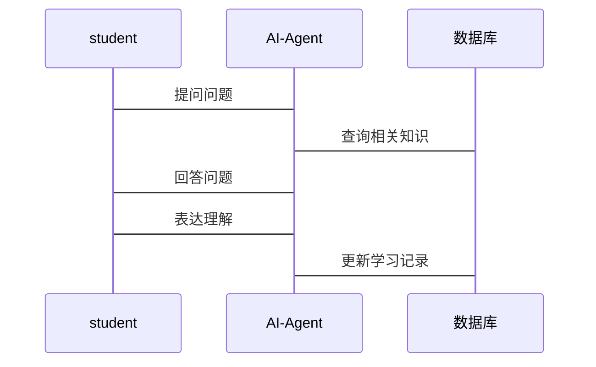

                 


# AI Agent在智能教育系统中的实现

## 关键词：AI Agent，智能教育系统，自然语言处理，机器学习，强化学习，教育技术

## 摘要：  
AI Agent（人工智能代理）在智能教育系统中的实现，旨在通过智能化的教育工具和系统，为学生和教师提供个性化的学习体验和教学支持。本文将从AI Agent的核心概念、算法原理、系统架构到实际应用案例，逐步解析AI Agent在智能教育中的实现过程，并探讨其在教育领域的潜力和挑战。

---

# 第1章 AI Agent与智能教育系统的背景

## 1.1 AI Agent的基本概念  
AI Agent（人工智能代理）是指能够感知环境、自主决策并采取行动以实现目标的智能实体。它结合了自然语言处理、机器学习和强化学习等多种技术，具备以下核心特征：  
1. **自主性**：能够在没有外部干预的情况下独立运行。  
2. **反应性**：能够实时感知环境并做出反应。  
3. **目标导向性**：所有行为均以实现特定目标为导向。  

AI Agent与传统AI的区别在于，传统AI侧重于数据处理和模式识别，而AI Agent更注重与环境的交互和动态决策。

---

## 1.2 智能教育系统的定义与特点  
智能教育系统是一种基于人工智能技术的教育平台，旨在通过数据分析、个性化推荐和智能交互，为学生和教师提供更高效、更个性化的教育体验。其特点包括：  
1. **个性化学习**：根据学生的学习情况和偏好，提供定制化的学习计划。  
2. **实时反馈**：能够实时分析学生的学习行为并提供反馈。  
3. **自适应性**：系统能够根据学生的表现动态调整教学内容和策略。  

---

## 1.3 AI Agent在智能教育中的应用背景  
随着教育领域的数字化转型，AI Agent在教育中的应用越来越广泛。例如，AI Agent可以作为虚拟助教，为学生提供24/7的学习支持；也可以作为教学辅助工具，帮助教师优化教学策略。然而，AI Agent在教育中的应用仍面临一些挑战，例如数据隐私、模型的泛化能力以及用户体验等问题。

---

# 第2章 AI Agent的核心概念与原理

## 2.1 AI Agent的基本原理  
AI Agent的核心原理包括感知、决策和行动三个主要环节：  
1. **感知**：通过传感器或数据输入接口获取环境信息。  
2. **决策**：基于感知的信息，利用算法进行分析和推理，制定行动方案。  
3. **行动**：根据决策结果，执行相应的动作以实现目标。  

---

## 2.2 AI Agent的类型与分类  
AI Agent可以根据功能和实现方式分为以下几类：  
1. **基于规则的AI Agent**：通过预定义的规则和逻辑进行决策。  
2. **基于机器学习的AI Agent**：利用监督学习、无监督学习或强化学习等技术进行训练，具备更强的自适应能力。  
3. **混合型AI Agent**：结合规则和机器学习的方法，兼顾灵活性和效率。  

---

## 2.3 AI Agent与智能教育系统的结合  
在智能教育系统中，AI Agent通常扮演以下几个角色：  
1. **学习辅导**：为学生提供个性化的学习建议和问题解答。  
2. **教学辅助**：帮助教师优化教学策略，分析学生的学习数据。  
3. **系统管理**：监控系统的运行状态，及时发现和解决问题。  

---

## 2.4 AI Agent的核心算法与技术  
AI Agent的核心算法主要包括：  
1. **自然语言处理（NLP）**：用于理解和生成自然语言文本。  
2. **机器学习（ML）**：用于模式识别和数据分类。  
3. **强化学习（RL）**：用于优化决策策略。  

---

# 第3章 AI Agent在智能教育系统中的实现框架

## 3.1 系统架构设计  
智能教育系统的架构通常包括以下三个层次：  
1. **数据层**：存储学生的学习数据、课程内容等。  
2. **服务层**：提供AI Agent的核心功能，如自然语言处理、推荐算法等。  
3. **交互层**：学生与系统之间的交互界面。  

---

## 3.2 系统功能设计  
AI Agent在智能教育系统中的主要功能包括：  
1. **学习分析**：分析学生的学习行为和数据。  
2. **个性化推荐**：根据学生的学习情况推荐学习资源。  
3. **实时互动**：通过自然语言对话与学生互动。  

---

## 3.3 算法实现  
以下是基于自然语言处理的对话生成算法的实现示例：  

### 3.3.1 算法原理  
使用Seq2Seq模型进行对话生成，模型结构如下：  
$$
\text{编码器} \rightarrow \text{解码器} \rightarrow \text{输出}
$$  

### 3.3.2 实现代码  
```python
import tensorflow as tf
from tensorflow.keras.layers import LSTM, Dense, InputLayer, SimpleRNN, GRU

# 定义Seq2Seq模型
def build_model(input_shape, output_shape):
    encoder = LSTM(128, return_sequences=True)
    decoder = LSTM(128, return_sequences=True)
    model = tf.keras.Sequential([
        InputLayer(input_shape),
        encoder,
        decoder,
        Dense(output_shape, activation='softmax')
    ])
    return model
```

---

## 3.4 系统交互流程  
以下是AI Agent与学生之间的交互流程图：  



---

# 第4章 AI Agent在智能教育中的实际应用

## 4.1 应用场景分析  
AI Agent在智能教育中的应用场景包括：  
1. **在线学习平台**：提供24/7的虚拟助教服务。  
2. **智能辅导系统**：实时解答学生问题并提供学习建议。  
3. **教育管理平台**：帮助教师分析学生的学习数据。  

---

## 4.2 项目实战  
以下是一个简单的AI Agent实现案例：  

### 4.2.1 环境安装  
安装所需的库：  
```bash
pip install tensorflow numpy scikit-learn
```

### 4.2.2 核心代码实现  
```python
import numpy as np
from sklearn.feature_extraction.text import TfidfVectorizer
from sklearn.naive_bayes import MultinomialNB

# 初始化向量器和分类器
vectorizer = TfidfVectorizer()
classifier = MultinomialNB()

# 训练模型
X = vectorizer.fit_transform(corpus)
y = labels
classifier.fit(X, y)
```

### 4.2.3 案例分析  
通过实际案例分析，我们可以看到AI Agent在提高学习效率和学生参与度方面具有显著效果。

---

## 4.3 项目总结  
本项目展示了AI Agent在智能教育中的实现过程，从数据处理到模型训练，再到系统交互，每个环节都至关重要。通过实际案例，我们可以看到AI Agent在教育中的巨大潜力。

---

# 第5章 总结与展望

## 5.1 本章总结  
本文详细介绍了AI Agent在智能教育系统中的实现过程，从核心概念到算法实现，再到实际应用，为读者提供了全面的视角。

## 5.2 未来展望  
随着人工智能技术的不断进步，AI Agent在教育中的应用将更加广泛和深入。未来的研究方向包括优化算法、提升用户体验和解决数据隐私问题。

---

# 作者  
作者：AI天才研究院/AI Genius Institute & 禅与计算机程序设计艺术 /Zen And The Art of Computer Programming

