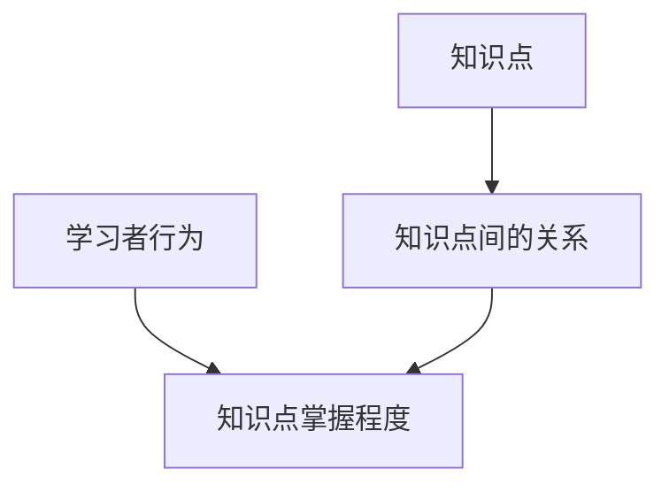
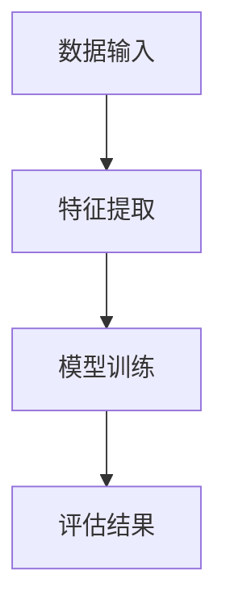
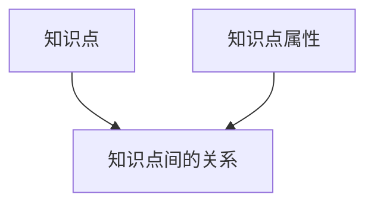
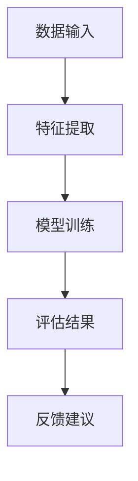
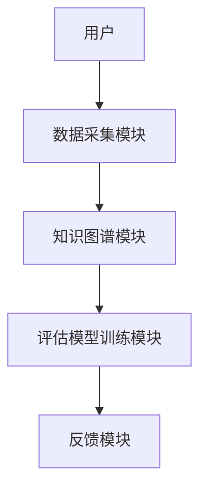

                 


# AI Agent在智能教育评估中的角色

## 关键词：AI Agent, 教育评估, 人工智能, 系统架构, 算法原理

## 摘要：  
本文探讨了AI Agent在智能教育评估中的核心作用，分析了其在数据采集、评估模型构建、个性化学习推荐等方面的应用。通过详细的技术实现和系统架构设计，展示了AI Agent如何提升教育评估的效率和准确性。文章从算法原理到系统实现，结合实际案例，全面剖析了AI Agent在教育领域的潜力与挑战。

---

# 第1章: AI Agent的基本概念与背景

## 1.1 AI Agent的定义与核心要素  
AI Agent（人工智能代理）是指能够感知环境、自主决策并执行任务的智能体。其核心要素包括：  
1. **感知能力**：通过传感器或数据输入获取环境信息。  
2. **推理能力**：基于感知信息进行逻辑推理和知识表示。  
3. **学习能力**：通过机器学习算法不断优化模型和策略。  
4. **决策能力**：根据推理结果制定行动方案。  
5. **执行能力**：通过执行机构或接口完成任务。  

AI Agent与传统教育评估方法的对比：  
传统评估主要依赖人工评分和固定标准，而AI Agent能够实时分析学习者的行为数据，提供动态、个性化的评估结果。  

---

## 1.2 智能教育评估的背景与需求  

### 1.2.1 教育评估的现状与挑战  
传统教育评估存在以下问题：  
1. **主观性**：人工评分易受评阅者主观因素影响。  
2. **效率低下**：大规模评估需要大量人工投入。  
3. **个性化不足**：难以针对不同学习者提供个性化的反馈。  

### 1.2.2 智能教育评估的需求与目标  
智能教育评估的目标是通过AI技术实现以下功能：  
1. **实时评估**：在学习过程中动态采集数据并即时反馈。  
2. **个性化评估**：根据学习者特点提供定制化的评估方案。  
3. **数据驱动**：基于大量学习数据优化评估模型。  

### 1.2.3 AI Agent在教育评估中的独特价值  
AI Agent能够通过以下方式提升教育评估的效率和准确性：  
1. **自动化数据采集**：实时收集学习者的行为数据。  
2. **智能分析**：利用机器学习算法对数据进行深度分析。  
3. **动态反馈**：根据分析结果提供实时反馈和个性化建议。  

---

# 第2章: AI Agent的核心原理与技术实现  

## 2.1 AI Agent的基本原理  

### 2.1.1 AI Agent的感知与推理机制  
AI Agent的感知模块通过传感器或API接口获取环境数据。推理模块基于知识图谱和逻辑推理算法，对数据进行分析。  

**知识图谱构建**：  


### 2.1.2 AI Agent的学习与优化算法  
AI Agent通过监督学习、强化学习等算法优化模型参数。  

**监督学习流程**：  


### 2.1.3 AI Agent的决策与执行流程  
AI Agent根据推理结果制定决策，并通过执行模块完成任务。  

---

## 2.2 AI Agent在教育评估中的技术实现  

### 2.2.1 数据采集与处理  
AI Agent通过以下方式采集数据：  
1. **学习者行为数据**：包括答题时间、正确率、点击次数等。  
2. **知识图谱数据**：知识点之间的关联关系。  
3. **评估结果数据**：包括评分、反馈建议等。  

### 2.2.2 知识图谱构建  
知识图谱是AI Agent的核心知识库，用于推理和决策。  

**知识图谱构建流程**：  


---

## 2.3 本章小结  

---

# 第3章: AI Agent的算法原理与实现  

## 3.1 算法原理  

### 3.1.1 评估模型的数学表示  
评估模型可以用以下公式表示：  
$$ P(\text{掌握知识点} | \text{正确率}=100\%) = \frac{\text{正确次数}}{\text{总次数}} $$  

### 3.1.2 算法流程图  


### 3.1.3 算法实现代码  
```python
def assess_performance(correct, total):
    return correct / total
```

---

## 3.2 算法优化  

### 3.2.1 贝叶斯推理的应用  
贝叶斯推理可以用于评估模型的不确定性。  

**贝叶斯公式**：  
$$ P(A|B) = \frac{P(B|A) \cdot P(A)}{P(B)} $$  

---

## 3.3 本章小结  

---

# 第4章: AI Agent的系统架构与设计  

## 4.1 系统分析  

### 4.1.1 项目背景  
本项目旨在开发一个基于AI Agent的智能教育评估系统。  

### 4.1.2 系统功能设计  
系统功能包括：  
1. 数据采集模块：实时采集学习者行为数据。  
2. 知识图谱构建模块：构建知识点关联关系。  
3. 评估模型训练模块：训练评估模型。  
4. 反馈模块：提供个性化的反馈建议。  

### 4.1.3 系统架构图  


---

## 4.2 系统设计  

### 4.2.1 系统架构设计  
系统架构包括：  
1. 数据层：存储学习者行为数据和知识点数据。  
2. 服务层：提供数据处理和模型训练服务。  
3. 接口层：与前端和后端系统交互。  

### 4.2.2 系统接口设计  
系统接口包括：  
1. 数据采集接口：`POST /api/data`  
2. 模型训练接口：`POST /api/train`  
3. 反馈接口：`GET /api/feedback`  

---

## 4.3 本章小结  

---

# 第5章: AI Agent在教育评估中的项目实战  

## 5.1 项目概述  

### 5.1.1 项目背景  
本项目旨在开发一个基于AI Agent的智能教育评估系统。  

---

## 5.2 核心代码实现  

### 5.2.1 数据采集模块  
```python
import requests

def collect_data():
    response = requests.post("http://localhost:8000/api/data")
    return response.json()
```

### 5.2.2 知识图谱构建模块  
```python
from kgpedia import build_kg

kg = build_kg("mathematics")
```

### 5.2.3 评估模型训练模块  
```python
from sklearn import metrics

def train_model(X, y):
    clf = metrics.SGDClassifier()
    clf.fit(X, y)
    return clf
```

### 5.2.4 反馈模块  
```python
def generate_feedback(correct, total):
    accuracy = correct / total
    if accuracy == 1:
        return "您已经完全掌握了这个知识点！"
    else:
        return "还需要加强练习，建议复习相关知识点。"
```

---

## 5.3 项目总结  

---

# 第6章: AI Agent的优化与扩展  

## 6.1 系统优化  

### 6.1.1 模型优化  
通过引入深度学习模型（如BERT）提升评估的准确性。  

### 6.1.2 系统扩展  
将AI Agent应用于更多学科和场景。  

---

## 6.2 本章小结  

---

# 第7章: 总结与展望  

## 7.1 总结  
本文详细探讨了AI Agent在智能教育评估中的角色，从算法原理到系统架构，全面分析了其在教育领域的应用潜力。  

## 7.2 展望  
未来，随着AI技术的不断发展，AI Agent在教育评估中的应用将更加广泛，包括更多个性化和动态化的评估方式。  

---

# 作者：AI天才研究院/AI Genius Institute & 禅与计算机程序设计艺术 /Zen And The Art of Computer Programming

