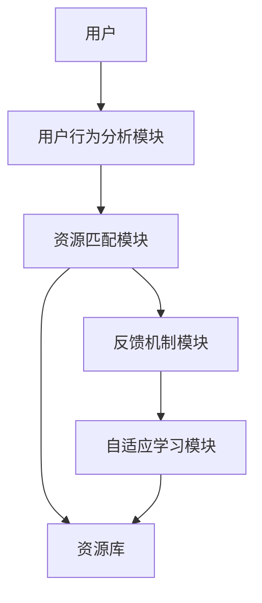

                 


# AI Agent在智能教育资源个性化分配中的应用

**关键词**：AI Agent, 智能教育, 资源分配, 个性化学习, 人工智能

**摘要**：  
本文探讨了AI Agent在智能教育资源个性化分配中的应用，分析了AI Agent的基本原理、核心算法、系统架构以及实际应用场景。通过详细的技术分析和实际案例，本文揭示了AI Agent如何通过数据驱动的方式实现教育资源的精准匹配，从而提升教育效果和学习效率。本文内容涵盖从理论到实践的全过程，为教育技术领域的从业者提供了有价值的参考。

---

## 第三章: AI Agent的算法原理与数学模型

### 3.2 基于深度学习的推荐算法

#### 3.2.1 神经网络在推荐系统中的应用

深度学习模型在推荐系统中的应用越来越广泛，尤其是在处理复杂特征和非结构化数据时表现尤为突出。以下是一个基于深度学习的推荐系统的简要框架：

1. **输入层**：接收用户行为数据（如点击、评分）和资源特征数据（如课程属性、教师评价）。
2. **嵌入层**：将高维的原始数据映射到低维的嵌入空间，降低计算复杂度。
3. **神经网络层**：通过全连接层、卷积层或注意力机制提取深层次特征。
4. **输出层**：生成推荐结果或概率评分。

#### 3.2.2 基于自注意力机制的推荐模型

自注意力机制（Self-Attention）在推荐系统中的应用可以通过以下方式实现：

- **输入序列**：用户的历史行为序列，如点击的课程ID、教师ID等。
- **查询（Query）、键（Key）、值（Value）**：将输入序列映射到三个不同的向量空间。
- **注意力计算**：通过计算每个元素与其他元素的相关性，生成权重矩阵。
- **加权求和**：根据权重对值向量进行加权求和，得到最终的注意力输出。

以下是自注意力机制的数学表达：

$$
\text{Attention}(Q, K, V) = \text{softmax}\left(\frac{QK^T}{\sqrt{d_k}}\right)V
$$

其中，$Q$、$K$、$V$分别为查询、键、值矩阵，$d_k$为键的维度。

#### 3.2.3 深度学习模型的数学表达

以下是一个简单的深度学习推荐模型的数学表达：

$$
p(i,j) = \frac{e^{a_{i}^T b_j}}{\sum_{k} e^{a_{i}^T b_k}}
$$

其中，$p(i,j)$表示用户$i$推荐课程$j$的概率，$a_i$和$b_j$分别为用户$i$和课程$j$的嵌入向量。

---

### 3.3 资源分配的数学模型

#### 3.3.1 资源分配问题的数学建模

资源分配问题可以建模为一个优化问题，目标是最小化资源分配的误差，同时满足约束条件：

$$
\min_{x} \sum_{i=1}^{n} (y_i - \sum_{j=1}^{m} w_{i,j}x_j)^2
$$

其中，$y_i$是用户$i$的需求，$w_{i,j}$是用户$i$对资源$j$的偏好权重，$x_j$是资源$j$的分配量。

#### 3.3.2 基于优化理论的资源分配

资源分配问题可以通过拉格朗日乘数法求解，具体步骤如下：

1. **目标函数**：构建资源分配的目标函数，包括约束条件。
2. **求导**：对目标函数求导，找到极值点。
3. **优化**：通过迭代优化算法（如梯度下降）求解最优解。

#### 3.3.3 资源分配模型的求解方法

以下是一个简单的优化模型求解过程：

1. 初始化参数$x_j$。
2. 计算梯度$\frac{\partial f}{\partial x_j}$。
3. 更新参数$x_j = x_j - \eta \frac{\partial f}{\partial x_j}$，其中$\eta$是学习率。
4. 重复步骤2-3，直到收敛。

---

## 第四章: AI Agent的系统架构与设计

### 4.1 系统架构设计

#### 4.1.1 系统模块划分

AI Agent的系统架构可以划分为以下几个模块：

1. **用户行为分析模块**：分析用户的历史行为数据，提取特征。
2. **资源匹配模块**：基于特征匹配算法，推荐适合的资源。
3. **反馈机制模块**：收集用户反馈，优化推荐算法。
4. **自适应学习模块**：根据反馈调整资源分配策略。

#### 4.1.2 系统功能设计

系统功能设计包括以下方面：

1. 用户注册与登录：收集用户基本信息。
2. 资源推荐：基于AI Agent算法推荐教育资源。
3. 学习效果评估：通过测试评估用户的学习效果。
4. 自适应调整：根据评估结果调整资源分配策略。

#### 4.1.3 系统架构图

以下是系统架构的Mermaid图：



---

### 4.2 系统功能实现

#### 4.2.1 用户需求分析

用户需求分析是系统设计的第一步，主要包括以下步骤：

1. 收集用户的基本信息（如年龄、兴趣爱好）。
2. 分析用户的历史行为数据（如点击、评分）。
3. 建立用户画像，为资源推荐提供依据。

#### 4.2.2 资源匹配算法

资源匹配算法的核心是基于用户特征和资源特征的相似度计算。以下是协同过滤算法的伪代码：

```python
def collaborative_filtering(users, items, ratings, k=5):
    # 计算用户相似度
    user_similarities = compute_user_similarities(users, ratings)
    # 推荐资源
    recommendations = {}
    for user in users:
        similar_users = get_top_k_similar_users(user, user_similarities, k)
        recommended_items = get_common_items(similar_users, items, ratings)
        recommendations[user] = recommended_items
    return recommendations
```

---

## 第五章: 项目实战与案例分析

### 5.1 环境安装与配置

#### 5.1.1 环境需求

为了实现AI Agent的资源分配系统，需要以下环境：

1. Python 3.8+
2. NumPy、Pandas、Scikit-learn等机器学习库。
3. TensorFlow或PyTorch（可选，用于深度学习）。

---

### 5.2 核心代码实现

#### 5.2.1 协同过滤算法实现

以下是一个基于协同过滤的资源推荐系统的核心代码：

```python
from sklearn.metrics.pairwise import cosine_similarity

def build_user_similarity_matrix(user_features):
    # 计算用户特征之间的余弦相似度
    similarity_matrix = cosine_similarity(user_features)
    return similarity_matrix

def get_top_k_similar_users(user_id, similarity_matrix, k=5):
    # 获取相似度最高的k个用户
    similar_users = []
    for i in range(len(similarity_matrix[user_id])):
        if i != user_id:
            similar_users.append((i, similarity_matrix[user_id][i]))
    similar_users.sort(key=lambda x: x[1], reverse=True)
    return similar_users[:k]
```

---

### 5.3 实际案例分析

#### 5.3.1 案例背景

假设我们有一个包含1000个用户的在线教育平台，每个用户学习过不同的课程。我们需要为每个用户推荐5个最相关的课程。

---

### 5.4 项目小结

通过实际案例分析，我们可以看到AI Agent在教育资源个性化分配中的巨大潜力。基于协同过滤和深度学习的推荐算法能够有效地提高资源分配的精准度，从而提升学习效果。

---

## 第六章: 最佳实践与总结

### 6.1 小结

AI Agent通过智能化的资源分配算法，能够为每个用户量身定制最优的学习路径。本文详细介绍了AI Agent的核心原理、算法实现和系统架构，为教育技术领域的从业者提供了理论和实践的双重指导。

---

### 6.2 注意事项

1. 数据隐私保护：在处理用户数据时，必须遵守相关法律法规。
2. 模型迭代：定期更新模型参数，保持推荐算法的有效性。
3. 系统优化：优化系统性能，提升用户体验。

---

### 6.3 拓展阅读

1. 《推荐系统实践》
2. 《深度学习在教育中的应用》
3. 《人工智能与教育技术》

---

**作者：AI天才研究院 & 禅与计算机程序设计艺术**

