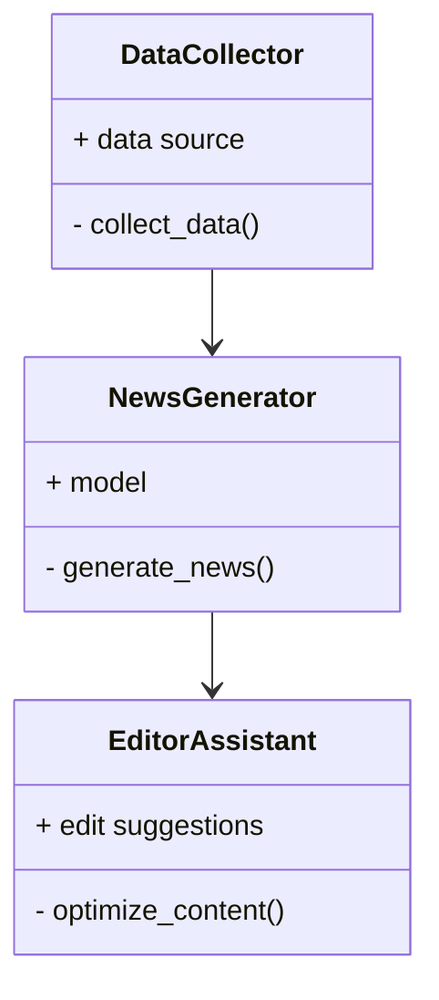
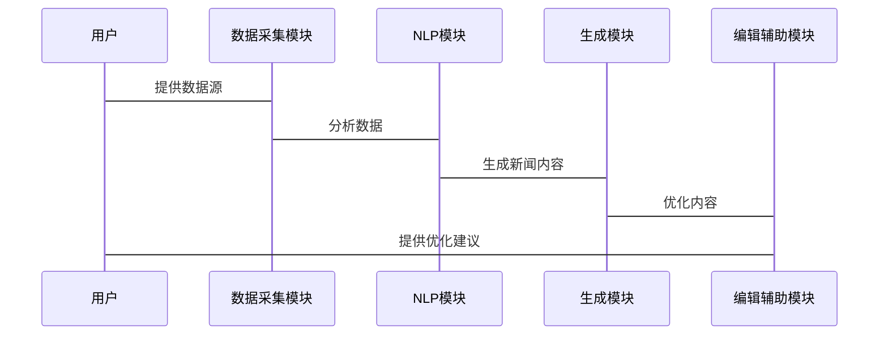

                 


# AI Agent在智能新闻写作中的角色

> 关键词：AI Agent, 智能新闻写作, 自然语言处理, 机器学习, 新闻生成系统

> 摘要：本文探讨了AI Agent在智能新闻写作中的角色，分析其在新闻选题、内容生成、编辑辅助等方面的应用，结合具体案例和技术实现，详细阐述了AI Agent在智能新闻写作中的技术原理、系统架构及实际应用。

---

# 第一部分：AI Agent在智能新闻写作中的背景与概念

## 第1章：AI Agent的基本概念与新闻写作的背景

### 1.1 AI Agent的定义与核心功能

#### 1.1.1 什么是AI Agent
AI Agent（人工智能代理）是指能够感知环境并采取行动以实现目标的智能实体。在新闻写作中，AI Agent可以作为辅助工具，帮助记者完成从选题到稿件生成的全过程。

**AI Agent的核心功能包括：**
1. **数据收集与分析**：自动抓取新闻相关数据，进行主题分析。
2. **内容生成**：基于数据生成新闻稿件。
3. **辅助编辑**：提供改进建议，优化内容质量。

#### 1.1.2 AI Agent的核心功能与特点
- **自动化**：无需人工干预，自动完成任务。
- **智能性**：能够理解和处理复杂信息。
- **适应性**：根据反馈不断优化输出。

#### 1.1.3 AI Agent与传统新闻写作的对比
| 特性         | 传统新闻写作            | AI Agent辅助的新闻写作         |
|--------------|-------------------------|-----------------------------|
| 数据处理     | 需要手动收集与分析      | 自动化收集与分析              |
| 内容生成     | 依赖记者经验与判断      | 自动生成初稿，辅助优化        |
| 效率         | 较低，依赖人工            | 高效，节省时间                |

### 1.2 智能新闻写作的背景与现状

#### 1.2.1 新闻写作的传统模式与局限性
传统新闻写作依赖记者的经验与直觉，效率较低，且容易受到主观因素影响。

#### 1.2.2 智能新闻写作的兴起与发展
随着AI技术的进步，AI Agent在新闻写作中的应用逐渐普及，尤其是在数据处理和内容生成方面表现出色。

#### 1.2.3 当前智能新闻写作的主要技术与应用
- **NLP技术**：用于文本生成与理解。
- **机器学习**：用于模式识别与预测。
- **大数据分析**：用于新闻选题与趋势预测。

---

## 第2章：AI Agent在新闻写作中的角色与作用

### 2.1 AI Agent在新闻写作中的角色定位

#### 2.1.1 作为内容生成工具的角色
AI Agent可以自动生成新闻初稿，为记者提供参考。

#### 2.1.2 作为编辑辅助工具的角色
AI Agent帮助编辑优化内容，检测语法错误，提供改写建议。

#### 2.1.3 作为新闻数据分析师的角色
AI Agent分析新闻数据，识别潜在的新闻价值，辅助选题决策。

### 2.2 AI Agent在新闻写作中的具体作用

#### 2.2.1 提供新闻选题与主题建议
AI Agent通过分析数据，识别热门话题，推荐新闻选题。

#### 2.2.2 自动化生成新闻稿件
基于结构化数据，AI Agent可以快速生成新闻稿件，节省时间。

#### 2.2.3 辅助编辑与内容优化
AI Agent提供多版本稿件，帮助编辑选择最优方案。

---

## 第3章：AI Agent与智能新闻写作的核心技术

### 3.1 自然语言处理技术在新闻写作中的应用

#### 3.1.1 NLP技术的基本原理
NLP技术通过分析文本数据，理解语义，生成符合逻辑的新闻内容。

#### 3.1.2 基于NLP的新闻主题分析
使用TF-IDF算法提取关键词，识别新闻主题。

#### 3.1.3 基于NLP的新闻内容生成
采用序列到序列模型（Seq2Seq）生成新闻稿件。

### 3.2 机器学习在新闻写作中的应用

#### 3.2.1 机器学习的基本原理
机器学习通过训练数据，建立模型，预测新闻内容。

#### 3.2.2 基于机器学习的新闻推荐
使用协同过滤算法推荐相关新闻，辅助选题。

#### 3.2.3 基于机器学习的新闻质量评估
通过训练模型评估新闻稿件的质量，优化生成内容。

### 3.3 AI Agent在新闻写作中的技术实现

#### 3.3.1 数据处理与特征提取
使用NLP技术提取文本特征，为模型提供输入。

#### 3.3.2 模型训练与优化
训练生成模型，优化生成效果。

#### 3.3.3 系统集成与部署
将AI Agent集成到新闻写作系统中，提供实时辅助。

---

# 第二部分：AI Agent在智能新闻写作中的算法原理

## 第4章：AI Agent的算法原理与实现

### 4.1 基于NLP的新闻生成模型

#### 4.1.1 模型原理
使用Transformer架构，通过自注意力机制生成新闻内容。

#### 4.1.2 模型实现
采用预训练模型（如GPT），微调新闻写作任务。

#### 4.1.3 代码实现
```python
import torch
from transformers import GPT2LMHeadModel, GPT2Tokenizer

tokenizer = GPT2Tokenizer.from_pretrained('gpt2')
model = GPT2LMHeadModel.from_pretrained('gpt2')

def generate_news():
    input_ids = tokenizer.encode("Latest developments in AI technology.", add_special_tokens=True)
    input_ids = torch.tensor(input_ids, dtype=torch.long).unsqueeze(0)
    output = model.generate(input_ids, max_length=500, do_sample=True)
    news = tokenizer.decode(output[0], skip_special_tokens=True)
    return news

print(generate_news())
```

#### 4.1.4 代码解读
上述代码使用GPT-2模型生成新闻内容，首先将输入文本编码为模型可处理的格式，然后生成符合要求的新闻稿件。

### 4.2 基于机器学习的新闻推荐系统

#### 4.2.1 系统原理
通过协同过滤算法，分析用户行为，推荐新闻内容。

#### 4.2.2 算法实现
使用矩阵分解方法，训练推荐模型。

#### 4.2.3 代码实现
```python
import numpy as np

# 矩阵分解示例
def matrix_factorization(R, k=5):
    pass

R = np.array([[1, 2, 3], [4, 5, 6], [7, 8, 9]])
P, Q = matrix_factorization(R)
```

#### 4.2.4 代码解读
上述代码展示了一个矩阵分解的示例，用于训练推荐模型，为用户提供新闻推荐。

---

## 第5章：AI Agent的数学模型与公式

### 5.1 基于NLP的新闻生成模型公式

#### 5.1.1 自注意力机制公式
$$
\text{Attention}(Q,K,V) = \text{softmax}\left(\frac{QK^T}{\sqrt{d_k}}\right)V
$$

#### 5.1.2 模型训练损失函数
$$
\mathcal{L} = -\sum_{i=1}^{n}\log p(x_i|x_{<i})
$$

### 5.2 基于机器学习的新闻推荐公式

#### 5.2.1 协同过滤公式
$$
\hat{r}_{u,i} = \frac{\sum_{j} w_{u,i} \cdot r_{u,j}}{\sum_{j} w_{u,i} \cdot r_{u,j}}
$$

---

# 第三部分：AI Agent在智能新闻写作中的系统设计

## 第6章：系统架构与实现

### 6.1 系统功能设计

#### 6.1.1 系统功能模块
- 数据采集模块：收集新闻相关数据。
- 内容生成模块：生成新闻稿件。
- 编辑辅助模块：优化内容质量。

#### 6.1.2 功能设计类图


### 6.2 系统架构设计

#### 6.2.1 系统架构图


#### 6.2.2 系统交互流程


### 6.3 系统接口设计

#### 6.3.1 API接口
- `/api/v1/generate`: 生成新闻内容
- `/api/v1/analyze`: 数据分析接口

---

## 第7章：项目实战与案例分析

### 7.1 项目实战：智能新闻生成系统

#### 7.1.1 环境安装
安装必要的库：
```bash
pip install transformers torch numpy
```

#### 7.1.2 核心代码实现
```python
import torch
from transformers import GPT2LMHeadModel, GPT2Tokenizer

tokenizer = GPT2Tokenizer.from_pretrained('gpt2')
model = GPT2LMHeadModel.from_pretrained('gpt2')

def generate_news():
    input_ids = tokenizer.encode("Latest developments in AI technology.", add_special_tokens=True)
    input_ids = torch.tensor(input_ids, dtype=torch.long).unsqueeze(0)
    output = model.generate(input_ids, max_length=500, do_sample=True)
    news = tokenizer.decode(output[0], skip_special_tokens=True)
    return news

print(generate_news())
```

#### 7.1.3 代码解读
上述代码展示了如何使用GPT-2模型生成新闻内容，首先将输入文本编码为模型可处理的格式，然后生成符合要求的新闻稿件。

---

## 第8章：总结与展望

### 8.1 总结
本文详细探讨了AI Agent在智能新闻写作中的角色与作用，分析了其核心技术与算法实现，并通过具体案例展示了其实际应用。

### 8.2 未来展望
随着AI技术的不断发展，AI Agent在新闻写作中的应用将更加广泛，未来可能会出现更加智能化、个性化的新闻生成系统。

---

# 作者：AI天才研究院/AI Genius Institute & 禅与计算机程序设计艺术 /Zen And The Art of Computer Programming

---

感谢您的阅读！希望这篇文章能为您提供有价值的信息与启发。如果需要进一步探讨或获取更多资料，请随时联系我！

