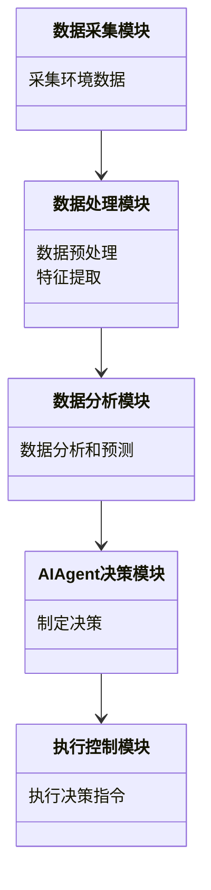

                 


# AI Agent在智能晾衣架中的天气感知烘干

> 关键词：AI Agent, 天气感知, 智能晾衣架, 烘干, 物联网

> 摘要：本文探讨了AI Agent在智能晾衣架中的天气感知烘干技术，分析了天气感知的核心概念、算法原理、系统架构，并通过实际案例展示了AI Agent在智能晾衣架中的应用价值。本文旨在为相关领域的技术人员提供深入的技术见解和实践指导。

---

## 第1章: AI Agent与天气感知的背景与应用

### 1.1 AI Agent的基本概念与特点

#### 1.1.1 AI Agent的定义
AI Agent（人工智能代理）是一种能够感知环境、自主决策并执行任务的智能实体。它通过传感器获取数据，利用算法进行分析，并根据结果采取行动。AI Agent的核心目标是帮助人类完成复杂任务或优化现有流程。

#### 1.1.2 AI Agent的核心特点
- **自主性**：AI Agent能够在没有人工干预的情况下自主运行。
- **反应性**：能够实时感知环境变化并做出响应。
- **主动性**：主动采取行动以达到目标。
- **学习能力**：通过数据和经验不断优化自身性能。

#### 1.1.3 AI Agent与传统自动控制系统的区别
| 属性       | AI Agent                | 传统控制系统         |
|------------|-------------------------|----------------------|
| **决策方式** | 基于机器学习模型       | 基于固定规则         |
| **适应性**   | 能够自适应环境变化     | 需要人工调整规则     |
| **数据处理** | 处理复杂非结构化数据   | 处理结构化数据       |

### 1.2 天气感知在智能设备中的应用背景

#### 1.2.1 天气感知技术的发展历程
天气感知技术经历了从简单的温湿度传感器到复杂的多参数监测系统的演变。随着物联网（IoT）和人工智能技术的进步，天气感知技术在智能家居、农业、交通等领域得到了广泛应用。

#### 1.2.2 天气感知在智能家居中的应用现状
天气感知技术在智能家居中的应用主要体现在环境监测、能源管理、健康监测等方面。例如，智能空调可以根据室外温度自动调节室内温度，智能空气净化器可以根据室外空气质量调整净化模式。

#### 1.2.3 智能晾衣架的市场需求与痛点分析
智能晾衣架的市场需求主要集中在提升晾衣效率、节能环保和用户体验方面。然而，现有产品大多仅具备基础的定时功能，缺乏智能决策能力，无法根据天气变化优化晾衣过程。

### 1.3 AI Agent在智能晾衣架中的应用价值

#### 1.3.1 提高晾衣效率
AI Agent可以通过天气预测和环境监测，优化晾衣时间，避免因天气变化导致的衣物潮湿或损坏。

#### 1.3.2 节能环保
通过智能决策，AI Agent可以减少不必要的能源消耗，例如在恶劣天气条件下暂停或延迟晾衣操作。

#### 1.3.3 提升用户体验
AI Agent可以通过手机APP或语音助手提供天气信息和晾衣建议，为用户提供更加便捷和个性化的服务。

## 第2章: AI Agent与天气感知的核心概念

### 2.1 天气感知系统的基本原理

#### 2.1.1 天气数据的采集与处理
天气数据的采集通常通过传感器完成，常见的传感器包括温度传感器、湿度传感器、气压传感器等。数据采集后需要进行预处理，包括数据清洗、标准化和特征提取。

#### 2.1.2 天气数据的特征提取
特征提取是将原始数据转化为更有意义的特征的过程。例如，将温度和湿度结合起来，可以提取“相对湿度”这一特征，用于预测衣物晾干所需的时间。

#### 2.1.3 天气数据的分析与预测
通过机器学习算法对天气数据进行分析和预测，可以为AI Agent提供决策依据。常用的算法包括回归分析、时间序列分析和随机森林等。

### 2.2 AI Agent在天气感知中的作用

#### 2.2.1 AI Agent的感知能力
AI Agent通过传感器获取环境数据，并利用机器学习模型对数据进行分析和预测，从而感知当前天气状况。

#### 2.2.2 AI Agent的决策能力
AI Agent根据天气预测结果和用户需求，制定最优的晾衣策略。例如，在晴朗天气下，AI Agent可以建议用户延长晾衣时间以确保衣物完全干燥。

#### 2.2.3 AI Agent的执行能力
AI Agent通过与智能晾衣架的控制系统交互，执行决策指令。例如，启动或停止晾衣过程、调整晾衣架的角度等。

### 2.3 天气感知与AI Agent的系统架构

#### 2.3.1 系统组成与功能模块
- 数据采集模块：负责采集环境数据。
- 数据处理模块：对数据进行预处理和特征提取。
- 数据分析模块：利用机器学习算法对数据进行分析和预测。
- AI Agent决策模块：根据分析结果制定决策。
- 执行控制模块：与智能晾衣架的控制系统交互，执行决策指令。

#### 2.3.2 系统的输入输出关系
- 输入：环境数据（温度、湿度、气压等）、用户需求。
- 输出：晾衣策略、执行指令。

#### 2.3.3 系统的边界与外延
天气感知系统的核心部分包括数据采集、数据处理和AI Agent决策模块。外延部分包括用户界面、传感器网络和执行机构。

### 2.4 本章小结

---

## 第3章: 天气感知与AI Agent的核心算法原理

### 3.1 天气数据的特征提取与分析

#### 3.1.1 数据预处理
数据预处理是确保数据质量的重要步骤，包括数据清洗（去除噪声）、标准化（归一化）和特征工程（提取有意义的特征）。

#### 3.1.2 数据特征提取方法
- 基于统计的方法：计算均值、方差等统计指标。
- 基于机器学习的方法：利用PCA（主成分分析）提取特征。

#### 3.1.3 数据特征的可视化
通过可视化工具（如Matplotlib）将数据特征进行可视化，帮助理解数据分布和关联性。

### 3.2 AI Agent的天气预测算法

#### 3.2.1 基于回归的天气预测模型
回归分析是一种常用的预测方法，适用于连续型变量的预测，如温度和湿度。

#### 3.2.2 基于分类的天气预测模型
分类算法适用于将天气状况分为不同的类别，例如晴天、雨天等。

#### 3.2.3 基于时间序列的天气预测模型
时间序列分析适用于预测未来的天气状况，常用的算法包括ARIMA和LSTM。

### 3.3 AI Agent的决策算法

#### 3.3.1 基于规则的决策算法
基于规则的决策算法通过预定义的规则进行决策，适用于简单的场景。

#### 3.3.2 基于概率的决策算法
基于概率的决策算法利用概率模型进行决策，例如贝叶斯网络。

#### 3.3.3 基于强化学习的决策算法
强化学习是一种通过不断试错来优化决策的算法，适用于复杂的决策场景。

### 3.4 本章小结

---

## 第4章: 天气感知与AI Agent的系统架构设计

### 4.1 系统总体架构设计

#### 4.1.1 系统组成模块
- 数据采集模块：负责采集环境数据。
- 数据处理模块：对数据进行预处理和特征提取。
- 数据分析模块：利用机器学习算法对数据进行分析和预测。
- AI Agent决策模块：根据分析结果制定决策。
- 执行控制模块：与智能晾衣架的控制系统交互，执行决策指令。

#### 4.1.2 系统功能模块之间的关系
系统功能模块之间的关系可以用以下mermaid类图表示：



#### 4.1.3 系统的可扩展性设计
系统设计时应考虑模块化设计，以便在需要时可以方便地添加新的功能模块。

### 4.2 系统功能模块详细设计

#### 4.2.1 数据采集模块
数据采集模块负责从传感器获取环境数据，并将其传递给数据处理模块。

#### 4.2.2 数据处理模块
数据处理模块对采集到的数据进行预处理和特征提取，为后续的分析和预测提供基础数据。

#### 4.2.3 数据分析模块
数据分析模块利用机器学习算法对数据进行分析和预测，生成天气预测结果。

#### 4.2.4 AI Agent决策模块
AI Agent决策模块根据天气预测结果和用户需求，制定最优的晾衣策略。

#### 4.2.5 执行控制模块
执行控制模块与智能晾衣架的控制系统交互，执行决策指令。

### 4.3 本章小结

---

## 第5章: 项目实战与代码实现

### 5.1 项目环境搭建

#### 5.1.1 系统环境
- 操作系统：Windows/Mac/Linux
- Python版本：3.6+
- 需要的库：numpy、pandas、scikit-learn、tensorflow等

### 5.2 核心代码实现

#### 5.2.1 传感器数据处理代码
```python
import numpy as np
import pandas as pd

# 读取传感器数据
data = pd.read_csv('weather_data.csv')

# 数据预处理
data['relative_humidity'] = data['湿度'] / data['温度'] * 100
data.dropna(inplace=True)
```

#### 5.2.2 AI Agent决策模块代码
```python
from sklearn.ensemble import RandomForestRegressor

# 训练天气预测模型
model = RandomForestRegressor(n_estimators=100, random_state=42)
model.fit(X_train, y_train)

# 根据天气预测结果制定决策
predicted_weather = model.predict(X_test)
decision = '启动晾衣' if predicted_weather[0] > 70 else '暂停晾衣'
```

### 5.3 实际案例分析

#### 5.3.1 案例描述
某天的天气数据为：温度=25℃，湿度=60%。AI Agent预测天气晴朗，建议启动晾衣过程。

#### 5.3.2 决策过程分析
AI Agent根据天气预测结果，决定启动晾衣过程，并调整晾衣架的角度以加快晾干速度。

### 5.4 项目小结

---

## 第6章: 最佳实践与系统优化

### 6.1 最佳实践 tips
- 定期更新天气预测模型，以提高预测准确性。
- 在传感器数据采集过程中，注意数据的实时性和准确性。
- 提供用户友好的界面，方便用户查看天气信息和操作记录。

### 6.2 系统优化建议
- 引入更多的环境参数，如风速和空气质量，以提高预测精度。
- 优化算法模型，采用更先进的机器学习算法，如深度学习模型。

### 6.3 小结
通过不断优化系统架构和算法模型，可以进一步提高AI Agent在智能晾衣架中的天气感知能力，从而实现更智能的烘干功能。

---

## 作者：AI天才研究院 & 禅与计算机程序设计艺术

---

以上是文章的完整目录大纲和部分章节内容。

