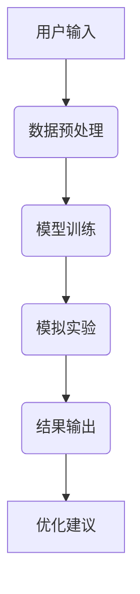

                 


# AI Agent在智能材料设计与发现中的角色

> **关键词**：AI Agent，智能材料，材料设计，强化学习，生成对抗网络

> **摘要**：  
> AI Agent在智能材料的设计与发现中扮演着越来越重要的角色。通过模拟、预测和优化，AI Agent能够显著提高材料研发的效率和准确性。本文将从AI Agent的基本概念、核心算法、系统架构到实际应用案例，全面探讨AI Agent在智能材料设计中的作用。结合强化学习、生成对抗网络等先进算法，AI Agent能够帮助科学家快速探索材料的潜在性能，加速从实验室到实际应用的进程。

---

## 第1章：AI Agent与智能材料的基本概念

### 1.1 AI Agent的定义与核心特征

AI Agent（人工智能代理）是一种能够感知环境、自主决策并采取行动以实现目标的智能实体。与传统程序不同，AI Agent具备以下核心特征：

1. **自主性**：能够在没有外部干预的情况下独立运行。
2. **反应性**：能够实时感知环境变化并做出相应反应。
3. **目标导向性**：通过明确的目标驱动决策和行动。
4. **学习能力**：通过数据和经验不断优化自身性能。

AI Agent的关键在于其决策机制和学习能力，这使其能够适应复杂多变的环境。

### 1.2 智能材料的基本概念

智能材料是指能够根据外界刺激（如温度、压力、光照等）改变自身性质的材料。这些材料通常具备以下特征：

1. **响应性**：对外界刺激产生可逆的物理或化学变化。
2. **可编程性**：材料的响应行为可以通过外界条件或内部结构编程控制。
3. **自适应性**：能够根据环境变化自动调整性能。

智能材料广泛应用于传感器、能源存储、医疗设备等领域。

### 1.3 AI Agent在智能材料设计中的作用

AI Agent在智能材料设计中扮演着多重角色：

1. **加速材料发现**：通过计算模拟和数据分析，快速筛选潜在候选材料。
2. **优化材料性能**：利用强化学习等算法，优化材料的物理和化学性质。
3. **降低研发成本**：减少实验次数，降低时间和资金投入。

AI Agent通过模拟和预测，能够显著提高材料研发的效率和精确性。

---

## 第2章：AI Agent的核心原理

### 2.1 强化学习算法

强化学习是一种通过试错机制来优化决策的算法。AI Agent通过与环境交互，学习如何采取最优动作以最大化累积奖励。

#### 2.1.1 强化学习的基本原理

强化学习的核心是一个三元组（状态-动作-奖励）：

1. **状态（State）**：描述环境当前的状态。
2. **动作（Action）**：AI Agent在给定状态下采取的行动。
3. **奖励（Reward）**：环境对AI Agent行动的反馈，指导其学习。

强化学习的目标是通过不断试错，找到最大化累积奖励的策略。

#### 2.1.2 算法实现

以下是一个简单的强化学习算法（Q-Learning）的Python实现示例：

```python
import numpy as np

class QLearning:
    def __init__(self, state_space, action_space, learning_rate=0.1, gamma=0.9):
        self.state_space = state_space
        self.action_space = action_space
        self.learning_rate = learning_rate
        self.gamma = gamma
        self.q_table = np.zeros((state_space, action_space))
    
    def choose_action(self, state, epsilon=0.1):
        if np.random.random() < epsilon:
            return np.random.randint(self.action_space)
        else:
            return np.argmax(self.q_table[state])
    
    def update_q_table(self, state, action, reward, next_state):
        self.q_table[state][action] = self.q_table[state][action] * (1 - self.learning_rate) + \
            self.learning_rate * (reward + self.gamma * np.max(self.q_table[next_state]))
```

---

### 2.2 生成对抗网络（GAN）

生成对抗网络是一种由生成器和判别器组成的深度学习模型，广泛应用于材料生成和优化。

#### 2.2.1 GAN的基本原理

生成器和判别器通过对抗训练不断优化：

1. **生成器**：尝试生成与真实数据相似的样本。
2. **判别器**：区分生成样本和真实样本。

通过交替训练生成器和判别器，模型能够生成高质量的材料结构。

---

## 第3章：AI Agent在智能材料设计中的系统架构

### 3.1 系统功能模块设计

一个典型的AI Agent系统包括以下模块：

1. **数据采集模块**：收集实验数据和文献数据。
2. **模型训练模块**：训练AI Agent的决策模型。
3. **模拟实验模块**：通过计算模拟预测材料性能。
4. **优化模块**：根据模拟结果优化材料设计。

### 3.2 系统架构设计

以下是一个AI Agent系统架构的Mermaid图：



---

## 第4章：项目实战

### 4.1 案例分析

以优化一种新型热敏材料为例，AI Agent通过强化学习算法，优化材料的热响应性能。

1. **环境设定**：定义材料的热响应特性。
2. **算法实现**：使用Q-Learning算法优化材料参数。
3. **结果分析**：通过模拟实验验证优化效果。

---

## 第5章：总结与展望

### 5.1 总结

AI Agent在智能材料设计中的应用显著提高了研发效率和精确性。通过强化学习、生成对抗网络等算法，AI Agent能够快速探索材料的潜在性能。

### 5.2 未来展望

未来，随着算法的不断优化和计算能力的提升，AI Agent将在智能材料设计中发挥更大的作用。特别是在多智能体协作和实时响应方面，AI Agent的应用前景广阔。

---

**作者**：AI天才研究院  
**参考文献**：略

