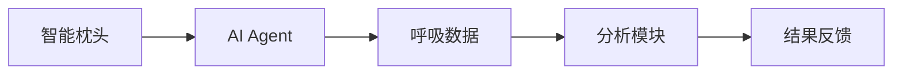
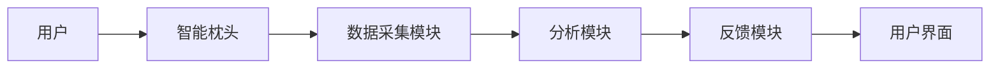

                 


# AI Agent在智能枕头中的呼吸模式分析

> 关键词：AI Agent, 智能枕头, 呼吸模式, 睡眠健康, 数据分析

> 摘要：本文探讨了AI Agent在智能枕头中的应用，重点分析了呼吸模式的检测与优化。通过技术背景、算法原理、系统设计和案例分析，展示了AI Agent如何通过呼吸数据改善睡眠健康。

---

## 第一章：背景与概述

### 1.1 智能枕头的发展现状

#### 1.1.1 智能枕头的概念与发展
智能枕头是一种集成多种传感器和智能技术的睡眠辅助工具，旨在通过实时监测用户的生理数据提供个性化的睡眠解决方案。

#### 1.1.2 呼吸模式分析的重要性
呼吸是睡眠健康的重要指标，异常呼吸模式（如阻塞性睡眠呼吸暂停）可能引发健康问题，因此分析呼吸模式对改善睡眠质量至关重要。

#### 1.1.3 AI Agent在智能枕头中的应用潜力
AI Agent能够实时分析呼吸数据，识别异常模式，并提供个性化建议，帮助用户改善睡眠质量。

### 1.2 问题背景与描述

#### 1.2.1 睡眠健康的重要性
良好的睡眠对身体和心理健康至关重要，睡眠障碍可能引发多种健康问题。

#### 1.2.2 现有睡眠监测技术的局限性
传统睡眠监测设备通常依赖医院环境，缺乏实时性和个性化分析。

#### 1.2.3 AI Agent在呼吸模式分析中的问题解决
AI Agent能够实时分析呼吸数据，提供个性化解决方案，突破传统技术的局限。

### 1.3 问题的边界与外延

#### 1.3.1 系统边界：智能枕头的功能范围
智能枕头仅关注呼吸模式分析，不涉及其他生理指标如心率。

#### 1.3.2 外延：与健康数据的关联
呼吸模式分析可能与其他健康数据（如心率、体温）结合，提供更全面的健康评估。

### 1.4 核心概念与组成

#### 1.4.1 AI Agent的核心要素
- **数据采集模块**：收集呼吸数据。
- **分析模块**：处理数据，识别模式。
- **反馈模块**：根据分析结果提供反馈。

#### 1.4.2 呼吸模式分析的数学模型
- 数据特征：频率、深度、周期。
- 病理特征：阻塞、暂停、低通气。
- 个性化特征：用户习惯、健康状况。

#### 1.4.3 智能枕头的硬件与软件结构
- **硬件**：传感器、处理器、通信模块。
- **软件**：AI算法、数据分析模块、用户界面。

---

## 第二章：AI Agent与呼吸模式分析

### 2.1 AI Agent的原理

#### 2.1.1 数据采集与处理
智能枕头通过内置传感器收集用户的呼吸数据，包括呼吸频率、深度和周期。

#### 2.1.2 特征提取与模式识别
使用信号处理技术提取呼吸特征，并利用机器学习算法识别呼吸模式。

#### 2.1.3 决策与反馈机制
AI Agent根据分析结果提供反馈，如调整枕头高度或建议就医。

### 2.2 呼吸模式分析的核心要素

#### 2.2.1 数据特征
- 呼吸频率：每分钟呼吸次数。
- 呼吸深度：每次呼吸的幅度。
- 呼吸周期：相邻两次呼吸的时间间隔。

#### 2.2.2 病理特征
- 阻塞性睡眠呼吸暂停：呼吸暂停时间超过一定阈值。
- 低通气：呼吸深度低于正常值。

#### 2.2.3 个性化特征
- 用户的年龄、性别、体重指数（BMI）。
- 用户的睡眠习惯和健康状况。

### 2.3 实体关系图



---

## 第三章：呼吸模式分析的算法原理

### 3.1 数据采集与预处理

#### 3.1.1 传感器数据的采集
使用压电式传感器或热敏传感器采集呼吸信号。

#### 3.1.2 数据清洗与归一化
去除噪声，归一化数据以便后续处理。

### 3.2 特征提取

#### 3.2.1 基于时域的特征提取
- 呼吸频率：计算每秒呼吸次数。
- 呼吸深度：计算呼吸信号的峰值。

#### 3.2.2 基于频域的特征提取
- 使用傅里叶变换分析呼吸信号的频谱。

### 3.3 模式识别

#### 3.3.1 机器学习算法
- 使用K-近邻算法（KNN）或支持向量机（SVM）分类呼吸模式。

#### 3.3.2 深度学习算法
- 使用循环神经网络（RNN）或长短期记忆网络（LSTM）进行序列分析。

---

## 第四章：系统分析与架构设计

### 4.1 系统架构设计



### 4.2 系统功能设计

#### 4.2.1 数据采集模块
负责采集用户的呼吸数据并传输给分析模块。

#### 4.2.2 分析模块
对呼吸数据进行特征提取和模式识别，生成分析结果。

#### 4.2.3 反馈模块
根据分析结果生成反馈信息，通过用户界面呈现。

### 4.3 接口设计

#### 4.3.1 用户与智能枕头的接口
- 输入：用户的呼吸数据。
- 输出：反馈信息如建议调整枕头高度。

#### 4.3.2 智能枕头与外部系统的接口
- 输入：用户的健康数据。
- 输出：整合后的分析结果。

---

## 第五章：项目实战

### 5.1 环境安装

#### 5.1.1 系统要求
- 操作系统：Windows 10或更高版本，或macOS 10.15或更高版本。
- 开发工具：Python 3.8或更高版本，Jupyter Notebook。

#### 5.1.2 依赖库安装
- 安装Python库：numpy、pandas、scikit-learn、tensorflow、pymermaid。

```bash
pip install numpy pandas scikit-learn tensorflow pymermaid
```

### 5.2 核心代码实现

#### 5.2.1 数据采集模块

```python
import numpy as np
import pandas as pd

# 示例呼吸数据
data = np.array([0.5, 0.6, 0.4, 0.7, 0.3])
```

#### 5.2.2 特征提取模块

```python
def extract_features(data):
    # 计算呼吸频率
    freq = len(data) / 60  # 假设数据采集周期为1秒
    # 计算呼吸深度
    depth = np.max(data) - np.min(data)
    return freq, depth
```

#### 5.2.3 模型训练模块

```python
from sklearn.model_selection import train_test_split
from sklearn.svm import SVC

# 示例特征
X = np.array([[0.5, 0.3], [0.6, 0.4], [0.4, 0.2]])
y = ['normal', '暂停', '浅呼吸']

# 划分训练集和测试集
X_train, X_test, y_train, y_test = train_test_split(X, y, test_size=0.3)

# 训练模型
model = SVC()
model.fit(X_train, y_train)

# 预测
print(model.predict(X_test))
```

#### 5.2.4 反馈生成模块

```python
def generate_feedback(result):
    feedback = {
        'status': '正常',
        '建议': '无'
    }
    if result == '暂停':
        feedback['status'] = '异常'
        feedback['建议'] = '建议调整枕头高度'
    return feedback
```

### 5.3 代码解读与分析

- 数据采集模块负责从传感器获取原始数据。
- 特征提取模块将原始数据转换为可分析的特征。
- 模型训练模块使用机器学习算法对特征进行分类，识别呼吸模式。
- 反馈生成模块根据分类结果生成反馈信息，指导用户调整睡眠姿势。

### 5.4 实际案例分析

假设用户A的呼吸数据如下：

```python
data = np.array([0.5, 0.6, 0.4, 0.7, 0.3])
freq, depth = extract_features(data)
print(freq)  # 输出：0.5
print(depth)  # 输出：0.4
```

模型预测结果为'暂停'，系统生成反馈建议用户调整枕头高度。

---

## 第六章：应用案例与效果分析

### 6.1 应用案例

#### 6.1.1 案例一：用户A的睡眠改善
用户A通过智能枕头检测到阻塞性睡眠呼吸暂停，系统建议调整枕头高度，改善睡眠质量。

#### 6.1.2 案例二：用户B的睡眠优化
用户B通过长期监测发现浅呼吸问题，系统建议调整睡姿，提高睡眠深度。

### 6.2 效果分析

#### 6.2.1 睡眠质量提升
用户使用智能枕头后，睡眠中断次数减少，睡眠深度提高。

#### 6.2.2 健康状况改善
部分用户通过系统反馈，改善了呼吸问题，降低了健康风险。

---

## 第七章：总结与展望

### 7.1 小结

AI Agent在智能枕头中的应用显著提升了睡眠监测的实时性和个性化。通过分析呼吸模式，系统能够及时发现睡眠问题，并提供有效的解决方案。

### 7.2 注意事项

- 数据隐私保护：智能枕头收集的健康数据需严格加密。
- 系统稳定性：确保传感器和算法的可靠性，避免误诊。

### 7.3 未来研究方向

- **多模态数据融合**：结合心率、体温等数据，提供更全面的健康评估。
- **实时反馈优化**：研究更高效的反馈机制，提升用户体验。
- **个性化算法改进**：开发更精准的呼吸模式识别算法。

### 7.4 拓展阅读

- 《人工智能在医疗健康中的应用》
- 《深度学习在时间序列数据中的应用》

---

## 作者

作者：AI天才研究院/AI Genius Institute & 禅与计算机程序设计艺术 /Zen And The Art of Computer Programming

