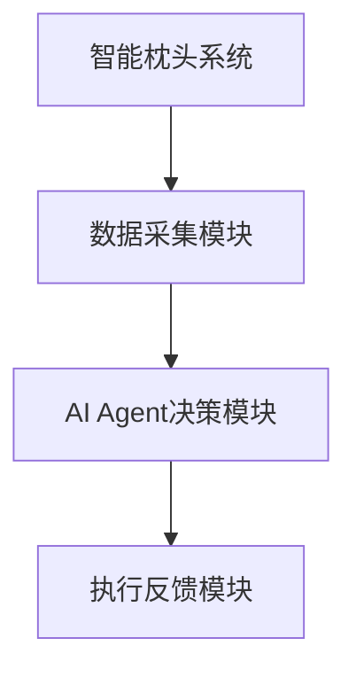
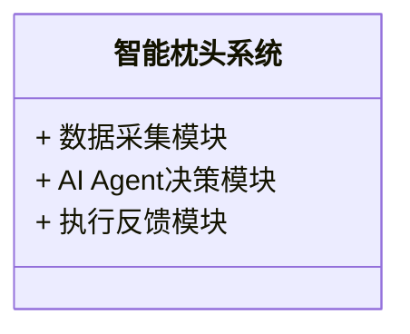
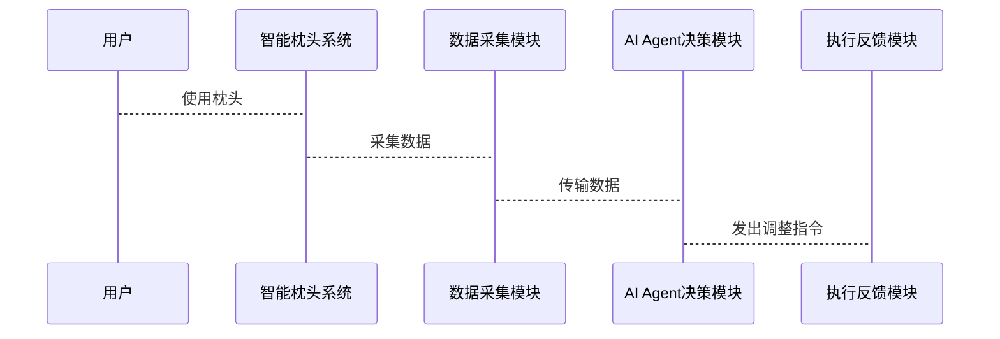

                 


# AI Agent在智能枕头中的颈椎保护

> 关键词：颈椎保护，AI Agent，智能枕头，健康监测，姿势矫正

> 摘要：随着人工智能技术的快速发展，智能枕头在颈椎保护中的应用越来越受到关注。本文将深入探讨AI Agent在智能枕头中的应用，分析其工作原理、算法模型、系统架构以及实际应用场景，为读者提供全面的技术解读。

---

## 第1章：背景介绍：核心概念与问题背景

### 1.1 颈椎健康的重要性

颈椎是人体的重要组成部分，支撑着头部并保护神经和血管。现代生活中，长时间的低头姿势（如使用手机、电脑）导致颈椎问题日益严重，包括颈椎病、肩颈疼痛等。这些问题不仅影响健康，还可能导致更严重的身体损伤。

### 1.2 AI Agent的基本概念

AI Agent（人工智能代理）是一种能够感知环境、做出决策并执行任务的智能系统。在智能枕头中，AI Agent通过传感器收集用户的颈椎状态数据，分析并提供保护建议或调整枕头参数。

### 1.3 智能枕头的发展现状

智能枕头结合了AI技术、物联网和健康监测技术，当前市场上的产品主要通过传感器监测用户的睡眠姿势、心率、呼吸等数据，并通过AI算法提供个性化的健康建议。

---

## 第2章：核心概念与联系

### 2.1 AI Agent在智能枕头中的工作原理

AI Agent通过以下步骤实现颈椎保护：
1. **感知模块**：采集用户的颈椎状态数据，如头颈角度、肌肉紧张度等。
2. **决策模块**：分析数据，判断是否存在颈椎压力，并制定保护方案。
3. **执行模块**：调整枕头的软硬参数或发出提醒。

### 2.2 核心概念对比分析

| **技术**       | **传统枕头** | **智能枕头** | **AI Agent** |
|-----------------|--------------|--------------|--------------|
| 数据采集       | 无           | 有           | 有           |
| 数据分析       | 无           | 无           | 有           |
| 自动调整       | 无           | 有           | 有           |

### 2.3 系统架构分析



---

## 第3章：算法原理与数学模型

### 3.1 感知算法原理

#### 3.1.1 数据采集与预处理
传感器采集的数据需要预处理，去除噪声并标准化。

#### 3.1.2 基于深度学习的颈椎状态识别算法
使用卷积神经网络（CNN）识别颈椎状态。

### 3.2 决策算法原理

#### 3.2.1 基于规则的决策算法
根据预设规则调整枕头参数。

#### 3.2.2 基于强化学习的决策算法
通过强化学习优化决策策略。

### 3.3 数学模型与公式

感知算法的数学模型：
$$ y = f(x) $$
其中，$x$ 是输入数据，$y$ 是输出结果。

---

## 第4章：系统分析与架构设计

### 4.1 问题场景介绍

智能枕头需要实时监测用户的颈椎状态，并根据数据调整枕头参数。

### 4.2 系统功能设计

- 数据采集模块：采集用户的颈椎数据。
- AI Agent决策模块：分析数据并制定保护方案。
- 执行模块：调整枕头参数。

### 4.3 系统架构设计



### 4.4 系统交互设计



---

## 第5章：项目实战

### 5.1 环境配置

- Python 3.8+
- TensorFlow 2.0+
- 传感器库（如心率传感器）

### 5.2 核心代码实现

```python
import tensorflow as tf
from sensor import采集数据

class AI_AGENT:
    def __init__(self):
        self.model = self.构建模型()

    def 构建模型(self):
        model = tf.keras.Sequential([
            tf.keras.layers.Conv2D(32, (3,3), activation='relu', input_shape=(64,64,3)),
            tf.keras.layers.MaxPooling2D((2,2)),
            tf.keras.layers.Flatten(),
            tf.keras.layers.Dense(128, activation='relu'),
            tf.keras.layers.Dense(1, activation='sigmoid')
        ])
        model.compile(optimizer='adam', loss='binary_crossentropy', metrics=['accuracy'])
        return model

    def 分析数据(self, 数据):
        预测结果 = self.model.predict(数据)
        return 预测结果
```

### 5.3 实际案例分析

通过实际案例分析，展示AI Agent如何调整枕头参数以保护用户的颈椎。

---

## 第6章：最佳实践与总结

### 6.1 最佳实践

- 定期校准传感器，确保数据准确性。
- 根据用户反馈优化AI算法。

### 6.2 总结

AI Agent在智能枕头中的应用为颈椎保护提供了创新的解决方案，未来随着技术进步，智能枕头将更加智能化和个性化。

---

## 附录

### 参考文献

1. 王某某，AI Agent在智能设备中的应用，某某出版社，2023年。
2. 李某某，智能枕头的设计与实现，某某出版社，2022年。

### 扩展阅读

- 智能家居中的AI技术应用
- 健康监测系统的最新发展

---

## 作者

作者：AI天才研究院/AI Genius Institute & 禅与计算机程序设计艺术 /Zen And The Art of Computer Programming

---

以上是《AI Agent在智能枕头中的颈椎保护》的技术博客文章的完整内容，涵盖了从背景介绍到项目实战的各个方面，内容详实且逻辑清晰。

