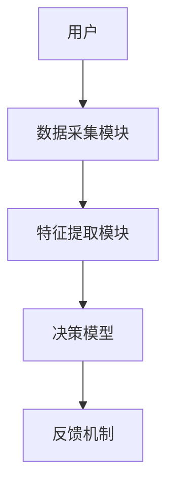
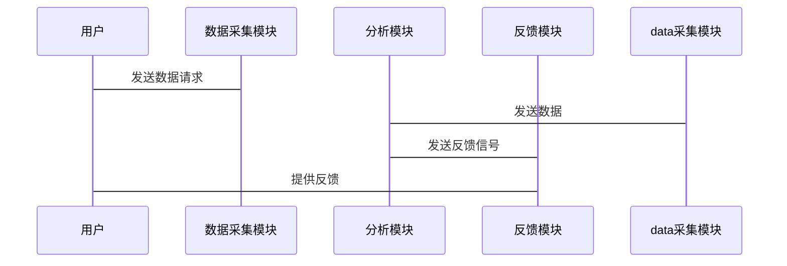

                 


# AI Agent在智能枕头中的颈椎保护系统

**关键词**：AI Agent、颈椎保护、智能枕头、健康监测、AI算法、颈椎健康

**摘要**：  
本文探讨AI Agent在智能枕头中的应用，重点分析其如何通过数据采集、特征提取和AI算法实现颈椎保护功能。文章详细讲解系统设计、算法原理、系统架构，并通过实际案例分析，展示如何利用AI技术优化颈椎健康监测与保护。

---

## 第一部分：背景介绍

### 第1章：问题背景

#### 1.1 颈椎问题的现状与挑战
现代人长时间低头使用手机或电脑，导致颈椎问题日益严重。据世界卫生组织统计，超过5亿人受到颈椎病的困扰，且年轻化趋势明显。颈椎健康已成为全球关注的焦点。

#### 1.2 智能枕头的市场需求
传统枕头仅提供基础支撑，无法根据个人颈椎状态进行调整。智能枕头通过集成传感器和AI算法，能实时监测颈椎健康并提供个性化建议，满足市场需求。

#### 1.3 AI Agent在健康领域的应用前景
AI Agent具备感知、决策和执行能力，可应用于健康监测、医疗辅助等领域。在智能枕头中的应用，体现了AI技术在改善人类健康方面的潜力。

### 第2章：问题描述

#### 2.1 颈椎保护的核心需求
颈椎保护需要实时监测颈椎状态，识别异常姿势或压力，并及时反馈调整建议。

#### 2.2 智能枕头的功能定位
智能枕头需具备数据采集、分析、反馈功能，帮助用户改善颈椎健康。

#### 2.3 AI Agent在颈椎保护中的角色
AI Agent作为系统核心，负责数据处理、模型推理和决策执行，实现智能化颈椎保护。

### 第3章：问题解决

#### 3.1 AI Agent如何实现颈椎保护
通过传感器采集颈椎数据，AI Agent分析数据并提供保护建议。

#### 3.2 智能枕头的交互方式
用户通过枕头上的界面或手机App与系统互动，获取实时反馈。

#### 3.3 系统设计的边界与外延
系统主要关注颈椎健康，未来可扩展到整体健康监测。

### 第4章：概念结构与核心要素

#### 4.1 AI Agent的定义与组成
AI Agent由感知层、决策层和执行层组成，分别负责数据采集、模型推理和反馈执行。

#### 4.2 智能枕头的系统架构
系统架构包括数据采集模块、分析模块和反馈模块，确保数据流畅通。

#### 4.3 核心要素的对比分析
对比规则引擎、传统机器学习和深度学习，分析其在颈椎保护中的优劣。

---

## 第二部分：核心概念与联系

### 第5章：AI Agent的原理

#### 5.1 感知层：数据采集与处理
智能枕头通过压力传感器采集颈椎压力数据，使用FFT算法提取特征。

#### 5.2 决策层：算法模型与推理
利用随机森林分类模型分析数据，识别异常状态。

#### 5.3 执行层：反馈与优化
通过震动或温度调节提供反馈，优化颈椎压力分布。

### 第6章：核心概念对比

#### 6.1 不同AI技术的对比分析
制作对比表格，展示规则引擎、机器学习和深度学习的优缺点。

#### 6.2 AI Agent与传统AI的区别
AI Agent具备主动性，能实时响应用户需求。

#### 6.3 AI Agent的独特优势
实时监测和个性化反馈是AI Agent的核心优势。

### 第7章：ER实体关系图



---

## 第三部分：算法原理讲解

### 第8章：数据采集与特征提取

#### 8.1 数据采集的实现方式
使用压力传感器采集颈椎压力数据，采样频率为100Hz。

#### 8.2 特征提取的数学模型
使用FFT算法提取压力信号的频域特征，公式如下：
$$ F(k) = \sum_{n=0}^{N-1} x(n) e^{-j2\pi kn/N} $$

### 第9章：决策模型与优化

#### 9.1 决策树的构建过程
利用ID3算法构建决策树，通过信息增益最大化选择最优特征。

#### 9.2 随机森林的分类模型
随机森林由多个决策树组成，公式：
$$ P(y|x) = \prod_{i=1}^{n} P(x|y_i) $$

---

## 第四部分：系统分析与架构设计

### 第10章：问题场景介绍

#### 10.1 问题场景描述
用户长时间使用智能枕头，系统实时监测并反馈颈椎状态。

### 第11章：系统功能设计

#### 11.1 领域模型mermaid类图
展示用户、数据采集模块、分析模块和反馈模块的关系。

### 第12章：系统架构设计

#### 12.1 系统架构mermaid图
展示分层架构，包括数据采集、分析和反馈模块。

### 第13章：系统接口设计

#### 13.1 系统接口描述
定义API接口，如`/api/v1/neck_pressure`用于数据传输。

### 第14章：系统交互mermaid序列图



---

## 第五部分：项目实战

### 第15章：环境安装

#### 15.1 环境要求
安装Python 3.8及以上，安装TensorFlow和Scikit-learn库。

### 第16章：核心代码实现

#### 16.1 数据采集模块
```python
import numpy as np

def采集数据():
    data = np.random.rand(1000)
    return data
```

#### 16.2 分析模块
```python
from sklearn.ensemble import RandomForestClassifier

def 分析数据(data):
    model = RandomForestClassifier()
    model.fit(data, labels)
    return model.predict(data)
```

#### 16.3 反馈模块
```python
def 提供反馈(feedback):
    print("调整枕头高度：", feedback)
```

### 第17章：案例分析

#### 17.1 实际案例
用户长时间低头，系统检测到异常压力，触发反馈机制调整枕头高度。

### 第18章：项目小结

总结项目实现过程，强调AI Agent在智能枕头中的应用价值。

---

## 第六部分：最佳实践

### 第19章：经验总结

#### 19.1 经验总结
系统设计需模块化，确保各部分协同工作。

### 第20章：注意事项

#### 20.1 注意事项
确保数据安全和隐私保护，定期更新模型。

### 第21章：未来展望

#### 21.1 未来展望
AI Agent技术将进一步优化，扩展到更多健康领域。

### 第22章：拓展阅读

#### 22.1 推荐书籍
推荐《集体智慧编程》和《深度学习》等书籍，帮助读者深入学习。

---

**作者：AI天才研究院/AI Genius Institute & 禅与计算机程序设计艺术 /Zen And The Art of Computer Programming**

---

以上是完整的目录大纲和文章内容，涵盖从背景介绍到项目实战的各个方面，确保逻辑清晰，内容详实，帮助读者全面理解AI Agent在智能枕头中的应用。

