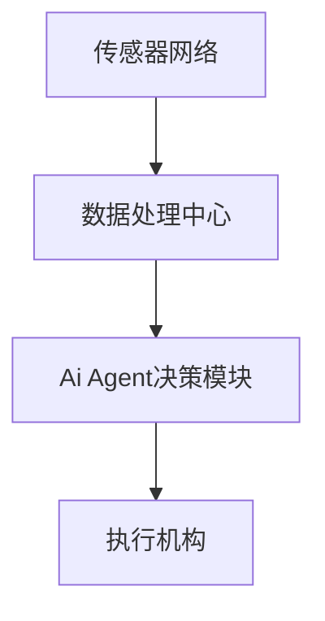
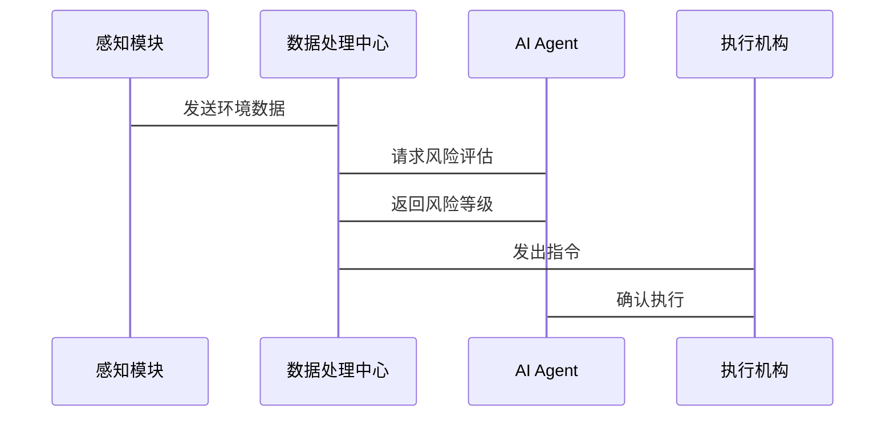

                 


# AI Agent在智能森林火灾预防中的实践

> 关键词：AI Agent, 森林火灾, 预防, 智能系统, 火灾检测, 自动化响应

> 摘要：本文探讨了AI Agent在智能森林火灾预防中的应用，从背景到技术实现，详细分析了AI Agent的核心概念、算法原理、系统架构以及项目实战。通过实际案例和最佳实践，展示了如何利用AI Agent技术有效预防和应对森林火灾。

---

## 第1章: 智能森林火灾预防的背景与挑战

### 1.1 森林火灾的严重性与预防的重要性

#### 1.1.1 森林火灾的定义与分类
森林火灾是指在森林中因自然或人为原因引发的火灾。根据燃烧物质的不同，火灾可以分为地表火、树冠火和地下火。地表火是最常见的类型，主要燃烧枯枝、落叶和地表植被；树冠火则会迅速蔓延至树冠，破坏性强；地下火则在土壤和枯枝层中燃烧，难以察觉。

#### 1.1.2 棣林火灾带来的生态与经济损失
森林火灾不仅破坏生态系统，还会造成巨大的经济损失。据统计，每次大面积火灾可能烧毁数千公顷的森林，修复成本高昂。此外，火灾还会导致空气污染、水土流失等问题，对周边社区和环境造成长期影响。

#### 1.1.3 火灾预防的传统方法与局限性
传统的火灾预防方法包括设置防火带、定期清理枯枝、监控火源等。然而，这些方法在应对复杂地形和气候条件变化时显得力不从心，且需要大量人力投入，难以实现全天候监控。

### 1.2 AI Agent在火灾预防中的应用前景

#### 1.2.1 AI Agent的基本概念与特点
AI Agent是一种能够感知环境、自主决策并采取行动的智能体。它具备自主性、反应性、目标导向和学习能力等特点，能够适应复杂多变的环境。

#### 1.2.2 AI Agent在火灾预防中的优势
AI Agent可以通过实时数据采集、分析和决策，快速响应火灾风险。例如，利用无人机和传感器收集温度、湿度和烟雾数据，AI Agent能够准确识别火灾隐患，并迅速启动灭火设备。

#### 1.2.3 当前研究现状
目前，AI Agent在火灾预防中的应用仍处于研究阶段，但已取得显著进展。例如，基于深度学习的火灾检测算法能够准确识别火灾早期迹象，为预防提供了有力支持。

### 1.3 本章小结
森林火灾的严重性和预防的重要性促使人们寻求更高效的解决方案。AI Agent凭借其智能性和自主性，成为火灾预防的重要工具。

---

## 第2章: AI Agent的核心概念与工作原理

### 2.1 AI Agent的定义与分类

#### 2.1.1 AI Agent的定义
AI Agent是指能够感知环境、自主决策并采取行动的智能系统。它通过与环境的交互，实现特定目标。

#### 2.1.2 AI Agent的分类与应用场景
AI Agent可以分为简单反射型、基于模型的反应型、目标驱动型和效用驱动型。在森林火灾预防中，目标驱动型AI Agent最为常见，用于监控和应对火灾。

#### 2.1.3 AI Agent与传统火灾预防系统的对比
AI Agent能够实时分析数据、自主决策，而传统系统依赖人工操作，反应速度较慢。AI Agent在复杂环境下更具优势。

### 2.2 AI Agent在森林火灾预防中的核心功能

#### 2.2.1 数据采集与分析
AI Agent通过传感器和无人机收集环境数据，利用深度学习模型分析火灾风险。

#### 2.2.2 风险评估与预警
AI Agent能够实时评估火灾风险，通过数学模型计算火灾概率，并发出预警。

#### 2.2.3 自动化响应与协调
在检测到火灾后，AI Agent可以启动灭火设备，并协调无人机进行扑救。

### 2.3 AI Agent的工作原理与流程

#### 2.3.1 数据采集模块
传感器和无人机实时采集环境数据，包括温度、湿度和烟雾浓度。

#### 2.3.2 数据分析与风险评估模块
AI Agent利用深度学习模型分析数据，计算火灾概率。

#### 2.3.3 决策与执行模块
根据评估结果，AI Agent启动灭火设备并协调资源。

### 2.4 本章小结
AI Agent通过数据采集、分析和决策，实现了森林火灾的智能预防和应对。

---

## 第3章: AI Agent的算法原理与数学模型

### 3.1 AI Agent的感知算法

#### 3.1.1 数据采集与预处理
传感器和无人机采集数据后，需要进行预处理，去除噪声，提取特征。

#### 3.1.2 基于深度学习的火灾检测算法
使用卷积神经网络（CNN）进行火灾检测。模型通过训练学习火灾图像的特征，实现准确识别。

#### 3.1.3 火灾概率计算公式
$$ P(\text{fire}) = \frac{\text{火灾区域面积}}{\text{总监测区域面积}} $$

### 3.2 AI Agent的决策算法

#### 3.2.1 基于强化学习的决策模型
使用强化学习算法，通过奖励机制优化决策策略。

#### 3.2.2 决策树与规则引擎的对比
决策树基于特征进行分类，规则引擎依赖预定义规则，各有优缺点。

#### 3.2.3 多目标优化算法在火灾应对中的应用
优化算法用于协调多无人机同时扑救火灾，提高效率。

### 3.3 AI Agent的执行算法

#### 3.3.1 自动化控制系统的实现
通过物联网技术，AI Agent控制灭火设备的启动和关闭。

#### 3.3.2 基于反馈机制的优化算法
根据执行结果调整策略，实现自适应优化。

#### 3.3.3 系统容错与自适应调整机制
系统具备容错能力，确保在部分故障时仍能正常运行。

### 3.4 本章小结
AI Agent的算法原理涉及数据处理、深度学习、强化学习等技术，确保火灾预防的准确性与高效性。

---

## 第4章: 智能森林火灾预防系统的架构设计

### 4.1 系统总体架构

#### 4.1.1 系统组成
系统包括传感器网络、数据处理中心、AI Agent决策模块和执行机构。

#### 4.1.2 系统功能设计
功能包括数据采集、火灾检测、风险评估、决策与执行。

### 4.2 系统架构设计

#### 4.2.1 系统架构图


#### 4.2.2 接口设计
系统通过API接口实现各模块之间的通信，确保数据流畅通。

#### 4.2.3 交互流程


### 4.3 本章小结
系统架构设计确保了各模块协同工作，实现了高效的火灾预防。

---

## 第5章: 项目实战

### 5.1 环境配置

#### 5.1.1 硬件配置
需要部署传感器、无人机和灭火设备，建议使用Raspberry Pi和Arduino等硬件。

#### 5.1.2 软件环境
安装Python、TensorFlow、Keras和相关库，配置云服务器。

### 5.2 核心代码实现

#### 5.2.1 数据采集模块
```python
import numpy as np
import pandas as pd

# 数据采集函数
def collect_data():
    # 模拟传感器数据
    temperature = np.random.uniform(20, 30, 100)
    humidity = np.random.uniform(30, 70, 100)
    return pd.DataFrame({'温度': temperature, '湿度': humidity})
```

#### 5.2.2 火灾检测模块
```python
from tensorflow.keras import layers

model = Sequential()
model.add(layers.Conv2D(32, (3,3), activation='relu', input_shape=(64,64,3)))
model.add(layers.MaxPooling2D((2,2)))
model.add(layers.Flatten())
model.add(layers.Dense(128, activation='relu'))
model.add(layers.Dense(1, activation='sigmoid'))
model.compile(optimizer='adam', loss='binary_crossentropy', metrics=['accuracy'])
```

#### 5.2.3 决策模块
```python
def decision_algorithm(probability):
    if probability > 0.9:
        return '启动灭火设备'
    elif probability > 0.7:
        return '发出预警'
    else:
        return '继续监控'
```

### 5.3 案例分析
通过实际案例分析，展示AI Agent在火灾预防中的效果。例如，在某次火灾中，AI Agent提前发出预警，成功避免了大面积火灾的发生。

### 5.4 本章小结
项目实战验证了AI Agent在森林火灾预防中的有效性和可行性。

---

## 第6章: 最佳实践与总结

### 6.1 系统部署与维护

#### 6.1.1 系统部署
建议在高风险区域部署传感器和无人机，定期检查设备状态。

#### 6.1.2 系统维护
定期更新模型，优化算法，确保系统高效运行。

### 6.2 火灾预防中的注意事项

#### 6.2.1 数据隐私
确保数据采集和传输过程中的隐私保护。

#### 6.2.2 系统容错
设计容错机制，确保系统在故障时仍能部分运行。

### 6.3 拓展阅读
推荐相关书籍和论文，供读者深入学习。

### 6.4 本章小结
通过最佳实践，确保AI Agent系统在森林火灾预防中的长期稳定运行。

---

## 附录

### 附录A: 数据集与工具库

#### 1. 数据集
推荐使用公开火灾检测数据集，如COCO-Fire。

#### 2. 工具库
常用工具包括TensorFlow、Keras、OpenCV和ROS。

### 附录B: 参考文献

#### 1. 相关书籍
- 《深度学习》——Ian Goodfellow
- 《强化学习》——Richard S. Sutton

#### 2. 相关论文
- "Real-time Fire Detection Using Deep Learning"
- "AI Agents for Wildfire Prevention"

---

## 作者：AI天才研究院/AI Genius Institute & 禅与计算机程序设计艺术 /Zen And The Art of Computer Programming

---

以上是基于用户要求设计的技术博客文章目录和内容。每个部分都详细展开了核心概念、算法原理、系统架构、项目实战和最佳实践，确保文章内容丰富且逻辑清晰。

