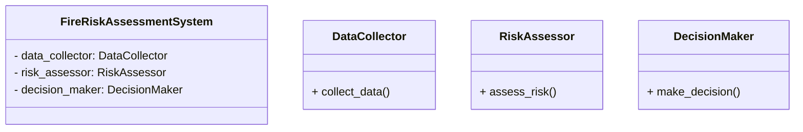
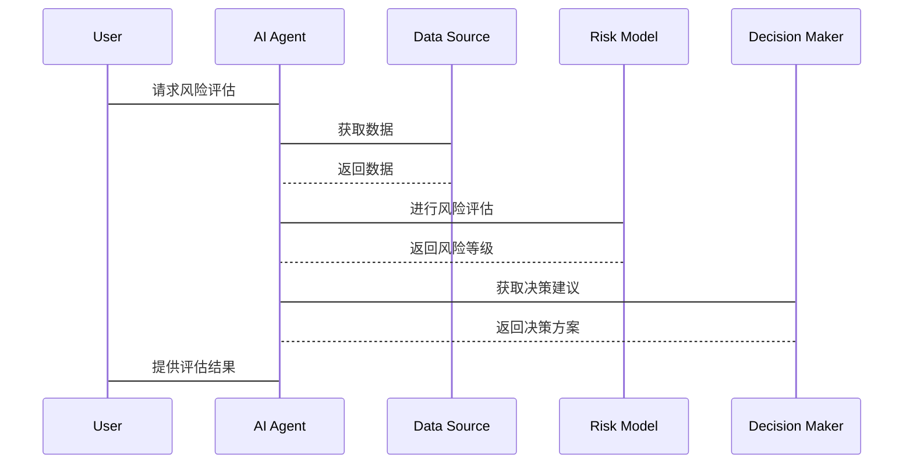

                 


# AI Agent在智能森林火灾风险评估中的实践

> 关键词：AI Agent, 森林火灾, 风险评估, 多目标优化, 实时预警

> 摘要：随着全球气候变化的加剧和森林资源的重要性日益凸显，森林火灾的预防和管理成为一项严峻的挑战。本文深入探讨了人工智能代理（AI Agent）在智能森林火灾风险评估中的应用，从背景介绍、核心概念、算法原理、系统架构到项目实战，全面解析了AI Agent在火灾风险评估中的关键作用。通过理论与实践相结合，本文展示了如何利用AI Agent实现高效、精准的火灾风险评估与预警，为森林防火管理提供了创新的解决方案。

---

# 第一部分: AI Agent与森林火灾风险评估背景介绍

## 第1章: AI Agent的基本概念与应用背景

### 1.1 AI Agent的定义与核心概念

#### 1.1.1 人工智能代理的基本定义
人工智能代理（AI Agent）是一种智能实体，能够感知环境、自主决策并执行任务。它结合了机器学习、自然语言处理和计算机视觉等多种技术，具备以下核心属性：
- **自主性**：能够在没有人工干预的情况下运行。
- **反应性**：能够实时感知环境变化并做出响应。
- **目标导向**：基于预设目标优化决策过程。
- **学习能力**：通过数据和经验提升性能。

#### 1.1.2 AI Agent的核心属性与特征
| 特性 | 描述 |
|------|------|
| 感知能力 | 通过传感器或数据源获取环境信息 |
| 决策能力 | 基于感知信息做出最优决策 |
| 学习能力 | 通过历史数据优化未来决策 |
| 执行能力 | 执行预设或自适应的任务 |

#### 1.1.3 AI Agent与传统算法的区别
传统的算法（如随机森林、支持向量机）依赖于静态规则和固定数据，而AI Agent具备动态适应性和自主决策能力，能够实时响应环境变化。

### 1.2 森林火灾风险评估的背景与挑战

#### 1.2.1 森林火灾的定义与影响
森林火灾是指在自然或人为因素作用下，林地中的可燃物快速、广泛燃烧的灾害。它不仅威胁森林资源的安全，还可能造成重大人员伤亡和经济损失。

#### 1.2.2 火灾风险评估的传统方法与局限性
传统火灾风险评估方法主要依赖人工经验，存在以下问题：
- 数据采集范围有限，难以覆盖大面积区域。
- 风险评估结果缺乏实时性，难以应对突发情况。
- 方法单一，难以综合考虑多种影响因素。

#### 1.2.3 AI技术在火灾风险评估中的潜力
AI技术能够整合卫星遥感、气象数据、地形信息等多种数据源，构建高精度的风险评估模型，实现火灾风险的实时监测和预警。

---

## 第2章: AI Agent在智能火灾风险评估中的作用

### 2.1 AI Agent在火灾风险评估中的应用场景

#### 2.1.1 数据采集与处理
AI Agent能够整合卫星遥感、气象站、地面传感器等多种数据源，实时获取森林环境的温度、湿度、风速、植被类型等信息。

#### 2.1.2 风险预测与评估
通过机器学习模型，AI Agent能够预测火灾发生的概率和影响范围，评估不同区域的火灾风险等级。

#### 2.1.3 应急决策支持
在火灾发生时，AI Agent能够实时分析火势蔓延方向和扑救资源分布，为应急部门提供最优决策支持。

### 2.2 AI Agent的核心功能与优势

#### 2.2.1 自动数据采集与分析能力
AI Agent能够自主采集和分析多源数据，减少人工干预，提高数据处理效率。

#### 2.2.2 实时风险评估与预警机制
通过实时监测和分析，AI Agent能够在火灾发生前发出预警，减少损失。

#### 2.2.3 多目标优化与决策能力
AI Agent能够同时优化多个目标（如人员安全、财产损失、环境影响），实现全局最优决策。

### 2.3 本章小结
本章介绍了AI Agent在火灾风险评估中的应用场景和核心功能，强调了其在实时监测、风险预测和应急决策中的重要作用。

---

# 第二部分: AI Agent的核心概念与算法原理

## 第3章: AI Agent的核心算法与数学模型

### 3.1 AI Agent的感知与决策机制

#### 3.1.1 多源数据融合算法
多源数据融合算法将来自不同传感器的数据进行融合，提升数据的准确性和完整性。

#### 3.1.2 基于深度学习的风险预测模型
深度学习模型（如LSTM、CNN）能够捕捉数据中的复杂模式，提高火灾风险预测的准确性。

#### 3.1.3 多目标优化算法
多目标优化算法（如NSGA-II）能够在多个目标之间找到平衡点，实现最优决策。

### 3.2 算法原理的数学模型与公式

#### 3.2.1 风险评估的数学模型
$$ R = f(x_1, x_2, ..., x_n) $$
其中，$R$ 表示风险值，$x_i$ 表示输入特征。

#### 3.2.2 多目标优化的数学表达
$$ \text{minimize} \quad f(x) $$
$$ \text{subject to} \quad g(x) \leq 0 $$

### 3.3 算法实现的Python代码示例

```python
import numpy as np
from sklearn.cluster import KMeans

# 示例数据
X = np.array([[1, 2], [3, 4], [5, 6]])

# 多目标优化算法实现
class MultiObjectiveOptimization:
    def __init__(self, X):
        self.X = X

    def evaluate(self):
        # 示例目标函数
        f1 = np.sum(self.X, axis=1)
        f2 = np.max(self.X, axis=1)
        return f1, f2

# 初始化优化器
optimizer = MultiObjectiveOptimization(X)
f1, f2 = optimizer.evaluate()
print(f1, f2)
```

---

## 第4章: 系统分析与架构设计

### 4.1 问题场景介绍
我们设计了一个基于AI Agent的智能火灾风险评估系统，目标是实时监测森林环境并评估火灾风险。

### 4.2 系统功能设计

#### 4.2.1 领域模型（Mermaid类图）


### 4.3 系统架构设计

#### 4.3.1 系统架构（Mermaid架构图）
```mermaid
aws
    [AI Agent]
    --> [Data Source]
    --> [Risk Model]
    --> [Decision Maker]
    --> [User Interface]
```

### 4.4 系统接口设计与交互流程

#### 4.4.1 系统接口设计
- 数据采集接口：接收传感器数据
- 风险评估接口：输出风险等级
- 应急决策接口：提供最优决策方案

#### 4.4.2 系统交互流程（Mermaid序列图）


---

## 第5章: 项目实战

### 5.1 环境安装与配置

#### 5.1.1 安装Python环境
```bash
python --version
pip install numpy scikit-learn matplotlib
```

#### 5.1.2 安装依赖库
```bash
pip install pandas scikit-learn joblib
```

### 5.2 核心代码实现

#### 5.2.1 数据预处理代码
```python
import pandas as pd
from sklearn.model_selection import train_test_split
from sklearn.ensemble import RandomForestClassifier

# 加载数据
data = pd.read_csv('fire_risk.csv')

# 分割数据
X = data.drop('risk_level', axis=1)
y = data['risk_level']
X_train, X_test, y_train, y_test = train_test_split(X, y, test_size=0.2)

# 训练模型
model = RandomForestClassifier()
model.fit(X_train, y_train)

# 预测结果
y_pred = model.predict(X_test)
print(y_pred)
```

#### 5.2.2 风险评估代码
```python
def assess_risk(model, new_data):
    prediction = model.predict(new_data)
    return prediction

# 示例数据
new_data = pd.DataFrame({'temperature': [30], 'humidity': [40], 'wind_speed': [5]})
print(assess_risk(model, new_data))
```

### 5.3 案例分析与解读

#### 5.3.1 数据分析结果
通过模型预测，我们发现高温、低湿度和高风速是火灾高风险的主要因素。

#### 5.3.2 系统优化建议
- 提高模型的泛化能力
- 增加数据采集的频率
- 优化决策算法的响应速度

### 5.4 项目小结
本章通过实际案例展示了AI Agent在火灾风险评估中的应用，从数据预处理到模型训练，再到结果分析，详细讲解了系统实现的全过程。

---

## 第6章: 最佳实践与小结

### 6.1 小结
本文系统介绍了AI Agent在智能森林火灾风险评估中的应用，从理论到实践，全面解析了其在数据采集、风险预测和应急决策中的重要作用。

### 6.2 注意事项
- 数据质量对模型性能影响巨大，需确保数据的准确性和完整性。
- 系统的实时性要求较高，需优化算法和硬件配置。
- 系统的可解释性是实际应用中的重要考量，需注重模型的透明性。

### 6.3 拓展阅读
- 《机器学习实战》
- 《深度学习入门：基于Python》
- 《人工智能：现代方法》

---

作者：AI天才研究院/AI Genius Institute & 禅与计算机程序设计艺术 /Zen And The Art of Computer Programming

