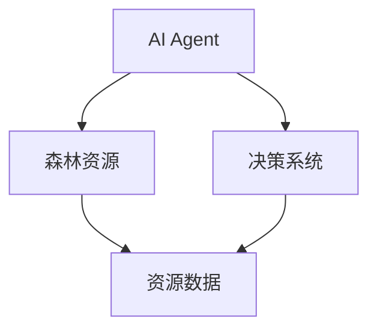

                 

# AI Agent在智能森林资源管理中的实践

> 关键词：AI Agent，智能森林资源管理，强化学习，算法原理，系统架构

> 摘要：本文详细探讨了AI Agent在智能森林资源管理中的实践应用，涵盖了从背景介绍到算法实现的各个方面。通过分析AI Agent的核心概念、算法原理和系统架构，本文为读者提供了一个全面的视角，展示了如何利用AI技术优化森林资源管理。

---

## 第1章: AI Agent与智能森林资源管理概述

### 1.1 智能森林资源管理的背景与意义

#### 1.1.1 森林资源管理的传统模式与挑战
传统的森林资源管理依赖于人工巡护和简单的数据记录，这种方法效率低下且难以应对复杂的环境变化。随着森林资源的重要性日益凸显，传统的管理模式已无法满足现代林业发展的需求。

#### 1.1.2 AI技术在森林资源管理中的应用潜力
AI技术，尤其是AI Agent（智能体），能够通过实时数据处理、自主决策和学习优化，显著提升森林资源管理的效率和精准度。AI Agent可以实现森林资源的动态监测、病虫害预测、资源分配优化等功能。

#### 1.1.3 智能森林资源管理的目标与价值
智能森林资源管理的目标是通过AI技术实现森林资源的可持续利用和保护。其价值在于提高管理效率、降低资源浪费、保护生态环境以及实现经济效益的最大化。

---

### 1.2 AI Agent的基本概念与特点

#### 1.2.1 什么是AI Agent
AI Agent是一种能够感知环境、自主决策并执行任务的智能体。它能够通过传感器获取数据，利用算法进行分析，并根据结果采取相应行动。

#### 1.2.2 AI Agent的核心特征
- **自主性**：能够自主决策和行动。
- **反应性**：能够实时感知环境变化并做出反应。
- **学习性**：能够通过经验优化自身的决策能力。

#### 1.2.3 AI Agent与传统自动化系统的区别
AI Agent不仅能够执行预设任务，还能够通过学习和适应环境，优化自身的行动策略。

---

### 1.3 智能森林资源管理中的AI Agent应用场景

#### 1.3.1 森林资源监测与保护
AI Agent可以通过无人机、卫星图像等手段，实时监测森林资源的动态变化，及时发现病虫害、火灾等威胁。

#### 1.3.2 森林资源优化配置
AI Agent可以根据土壤、气候等条件，优化树种的种植布局，提高资源利用效率。

#### 1.3.3 森林资源可持续发展支持
AI Agent可以通过数据分析和预测模型，支持森林资源的可持续利用，避免过度采伐和破坏。

---

## 第2章: AI Agent的核心概念与原理

### 2.1 AI Agent的核心原理

#### 2.1.1 AI Agent的感知与决策机制
AI Agent通过传感器获取环境数据，利用算法进行分析，生成决策策略。

#### 2.1.2 基于强化学习的AI Agent行为优化
强化学习是一种通过试错优化决策的算法。AI Agent在森林资源管理中，可以通过强化学习优化资源分配策略。

#### 2.1.3 AI Agent的自主学习与适应能力
AI Agent能够通过不断学习和适应，优化自身的决策能力，提升管理效率。

---

### 2.2 AI Agent在森林资源管理中的关键属性

#### 2.2.1 实时性与动态性
AI Agent能够实时处理数据，快速响应环境变化。

#### 2.2.2 分布式与协作性
AI Agent可以分布部署，协作完成复杂的管理任务。

#### 2.2.3 可扩展性与可定制性
AI Agent可以根据具体需求进行扩展和定制，适应不同的管理场景。

---

### 2.3 AI Agent与智能森林资源管理的实体关系分析

---

## 第3章: AI Agent的算法原理

### 3.1 基于强化学习的AI Agent算法

#### 3.1.1 强化学习的基本原理
强化学习通过试错优化决策策略。AI Agent在森林资源管理中，可以通过强化学习优化资源分配策略。

#### 3.1.2 Q-learning算法
Q-learning是一种经典的强化学习算法，适用于离散状态和动作空间。

$$ Q(s,a) = Q(s,a) + \alpha [r + \gamma \max Q(s',a') - Q(s,a)] $$

#### 3.1.3 Deep Q-Network (DQN)算法
DQN算法通过深度神经网络近似Q值函数，适用于复杂的森林资源管理场景。

---

### 3.2 基于监督学习的AI Agent算法

#### 3.2.1 监督学习的基本原理
监督学习通过训练数据学习输入与输出之间的映射关系。

#### 3.2.2 分类与回归算法在AI Agent中的应用
分类算法用于判断资源状态（如健康、病态），回归算法用于预测资源产量。

---

### 3.3 基于无监督学习的AI Agent算法

#### 3.3.1 聚类分析在AI Agent中的应用
聚类分析用于识别森林资源的相似区域，优化资源配置。

#### 3.3.2 异常检测在AI Agent中的应用
异常检测用于识别森林资源中的异常变化，及时发现潜在威胁。

---

## 作者

作者：AI天才研究院/AI Genius Institute & 禅与计算机程序设计艺术 /Zen And The Art of Computer Programming

---

以上是《AI Agent在智能森林资源管理中的实践》的技术博客文章。文章详细探讨了AI Agent在森林资源管理中的应用，从背景介绍到算法实现，为读者提供了全面的视角和深入的分析。

