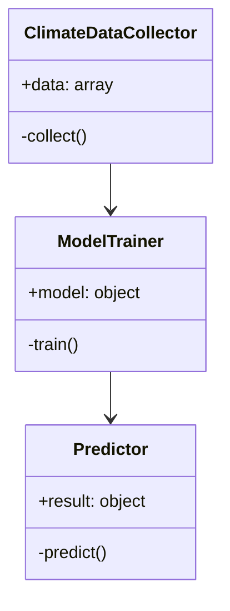
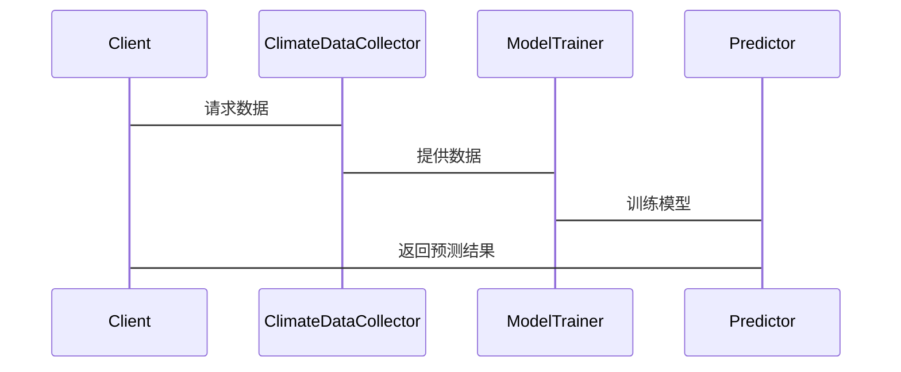

                 


---

# AI Agent在智能气候变化模拟中的实践

**关键词**：AI Agent，气候变化模拟，智能系统，机器学习，数据科学，系统架构

**摘要**：随着气候变化问题的日益严重，AI Agent技术在气候模拟中的应用逐渐成为研究热点。本文从AI Agent的核心概念出发，详细探讨其在气候变化模拟中的数学模型、算法原理、系统架构设计以及项目实战。通过对比传统气候模型与AI驱动模型的优缺点，本文展示了AI Agent在提升气候预测精度和效率方面的独特优势，并通过实际案例分析，总结了最佳实践和未来发展方向。

---

# 第1章：AI Agent与气候变化模拟的背景介绍

## 1.1 气候变化的科学背景

### 1.1.1 气候变化的定义与关键特征

气候变化是指气候系统长期统计特征的变化，包括温度、降水、风速等气象要素的改变。其关键特征包括全球变暖、极端天气事件增多、海平面上升等。

### 1.1.2 气候变化对人类社会的影响

气候变化对农业、水资源、生态系统、人类健康等都产生了深远影响。例如，极端天气事件增多导致灾害损失增加，海平面上升威胁沿海城市的安全。

### 1.1.3 气候变化模拟的科学意义

通过模拟气候变化，科学家可以预测未来气候变化趋势，为政策制定和应对措施提供科学依据。

## 1.2 AI Agent的基本概念

### 1.2.1 AI Agent的定义与核心特征

AI Agent是一种具有感知环境、自主决策和执行任务能力的智能实体，能够根据环境信息做出适应性反应。

### 1.2.2 AI Agent与传统AI的区别

AI Agent强调自主性和适应性，而传统AI更多关注特定任务的处理能力。

### 1.2.3 AI Agent在智能系统中的作用

AI Agent能够处理复杂动态环境中的任务，适用于需要实时决策和自适应调整的应用场景。

## 1.3 气候变化模拟中的AI Agent应用背景

### 1.3.1 气候变化模拟的传统方法与挑战

传统方法依赖于复杂的物理模型，计算量大且耗时，预测精度受模型假设和参数化的影响。

### 1.3.2 AI Agent在气候变化模拟中的优势

AI Agent能够处理海量数据，发现传统方法难以捕捉的非线性关系，提高预测精度和效率。

### 1.3.3 当前研究与应用现状

AI Agent在气候数据处理、预测模型优化等方面的应用研究正在快速发展。

## 1.4 本章小结

气候变化模拟是应对气候变化的重要手段，AI Agent凭借其自主性和适应性，为气候预测提供了新的可能性。

---

# 第2章：AI Agent的核心概念与原理

## 2.1 AI Agent的定义与分类

### 2.1.1 AI Agent的定义

AI Agent是一种具备感知、推理、决策和执行能力的智能实体。

### 2.1.2 AI Agent的分类与特点

AI Agent可以分为简单反射型、基于模型的反应型、目标驱动型和效用驱动型等。

### 2.1.3 不同类型AI Agent的对比分析

通过对比分析，了解不同类型AI Agent的适用场景和优缺点。

## 2.2 AI Agent的核心原理

### 2.2.1 知识表示与推理

知识表示是AI Agent理解和推理的基础，常用的表示方法包括逻辑推理和概率推理。

### 2.2.2 感知与决策机制

AI Agent通过感知环境信息，利用决策算法制定行动方案。

### 2.2.3 学习与自适应能力

通过机器学习，AI Agent能够从数据中学习，提升其预测和决策能力。

## 2.3 AI Agent与气候变化模拟的结合

### 2.3.1 气候数据的特征与挑战

气候数据具有高维性、复杂性等特点，处理这些数据需要高效的算法和强大的计算能力。

### 2.3.2 AI Agent在气候数据处理中的应用

AI Agent能够处理海量气候数据，提取有用信息，支持气候预测。

### 2.3.3 AI Agent如何支持气候模型优化

通过优化算法和参数调整，AI Agent能够提升气候模型的预测精度和计算效率。

## 2.4 本章小结

AI Agent的核心概念和原理为气候变化模拟提供了新的思路和技术支持。

---

# 第3章：气候变化模拟的数学模型与算法原理

## 3.1 气候模型的基本框架

### 3.1.1 大气环流模型的数学表达

大气环流模型通常涉及偏微分方程，描述大气运动的物理过程。

### 3.1.2 海洋环流模型的数学表达

海洋环流模型同样基于偏微分方程，描述海洋流动和热量传递。

### 3.1.3 地表过程的数学建模

地表过程建模涉及蒸发、降水等过程的数学描述。

## 3.2 数据驱动的气候预测模型

### 3.2.1 时间序列分析模型

时间序列模型如ARIMA用于预测气候变量的变化趋势。

### 3.2.2 神经网络气候预测模型

神经网络模型如LSTM能够捕捉气候数据中的复杂模式。

### 3.2.3 深度学习在气候预测中的应用

深度学习模型在处理高维气候数据方面具有优势。

## 3.3 AI Agent驱动的气候模拟算法

### 3.3.1 基于强化学习的气候模拟

强化学习算法通过奖励机制优化气候预测模型。

### 3.3.2 基于生成对抗网络的气候数据生成

生成对抗网络（GAN）可以生成逼真的气候数据，用于模型训练。

### 3.3.3 混合模型在气候模拟中的应用

混合模型结合物理模型和AI模型的优势，提升预测精度。

## 3.4 数学模型与算法的对比分析

### 3.4.1 传统气候模型的优缺点

传统模型基于物理规律，但计算复杂且参数敏感。

### 3.4.2 AI驱动模型的优缺点

AI模型计算效率高，但依赖于数据质量和模型泛化能力。

### 3.4.3 综合模型的未来发展方向

结合物理模型和AI模型，构建更加精准和高效的气候预测系统。

## 3.5 本章小结

数学模型和算法是气候变化模拟的核心，AI Agent的应用为模型优化提供了新思路。

---

# 第4章：AI Agent驱动的气候模拟系统架构设计

## 4.1 系统架构设计的背景与目标

### 4.1.1 问题场景介绍

设计一个高效、可扩展的气候模拟系统，支持实时数据处理和预测。

### 4.1.2 项目介绍

介绍一个基于AI Agent的气候模拟系统，涵盖数据采集、模型训练和结果分析。

## 4.2 系统功能设计

### 4.2.1 领域模型（Mermaid类图）



### 4.2.2 系统架构（Mermaid架构图）


### 4.2.3 系统接口设计

系统提供数据接口、模型训练接口和结果查询接口，支持多种数据格式和协议。

### 4.2.4 系统交互（Mermaid序列图）



## 4.3 本章小结

系统架构设计是实现高效气候模拟的关键，AI Agent层的引入提升了系统的智能性和适应性。

---

# 第5章：AI Agent驱动的气候模拟项目实战

## 5.1 环境配置

### 5.1.1 安装Python环境

使用Anaconda安装Python 3.8及以上版本。

### 5.1.2 安装依赖库

安装numpy、pandas、tensorflow、keras等库。

## 5.2 系统核心实现源代码

### 5.2.1 数据预处理代码

```python
import numpy as np
import pandas as pd

# 读取数据
data = pd.read_csv('climate_data.csv')

# 数据预处理
data = data.dropna()
```

### 5.2.2 模型训练代码

```python
import tensorflow as tf
from tensorflow.keras.models import Sequential
from tensorflow.keras.layers import LSTM, Dense

model = Sequential()
model.add(LSTM(64, input_shape=(timesteps, features)))
model.add(Dense(1))
model.compile(optimizer='adam', loss='mean_squared_error')
model.fit(X_train, y_train, epochs=100, batch_size=32)
```

### 5.2.3 预测与结果分析代码

```python
# 进行预测
predictions = model.predict(X_test)

# 可视化结果
import matplotlib.pyplot as plt
plt.plot(y_test, label='真实值')
plt.plot(predictions, label='预测值')
plt.legend()
plt.show()
```

## 5.3 实际案例分析

### 5.3.1 案例背景

分析某地区未来十年的气候变化趋势。

### 5.3.2 数据收集与处理

从公开数据源获取历史气候数据，进行清洗和预处理。

### 5.3.3 模型训练与评估

使用LSTM模型进行训练，评估模型的预测精度。

### 5.3.4 结果解读与应用

预测结果用于制定应对气候变化的政策和措施。

## 5.4 本章小结

通过实际案例，展示了AI Agent驱动的气候模拟系统的实现过程和应用价值。

---

# 第6章：总结与展望

## 6.1 本章总结

本文详细探讨了AI Agent在气候变化模拟中的应用，从理论到实践，展示了其在提升气候预测精度和效率方面的重要作用。

## 6.2 未来展望

未来的研究可以进一步优化AI Agent算法，探索多模态数据的融合，提升气候预测的准确性和实时性。

## 6.3 最佳实践 tips

- 数据质量是气候预测的关键，确保数据的准确性和完整性。
- 模型选择要根据具体需求，传统模型和AI模型各有优劣。
- 系统设计要注重可扩展性和可维护性。

## 6.4 小结

AI Agent的应用为气候变化模拟带来了新的可能性，未来的研究和应用前景广阔。

---

# 作者信息

作者：AI天才研究院（AI Genius Institute） & "禅与计算机程序设计艺术"（Zen And The Art of Computer Programming）

---

以上是根据用户提供的目录大纲撰写的完整文章内容。每个章节都详细展开，结合理论和实践，帮助读者全面理解AI Agent在气候变化模拟中的应用。

