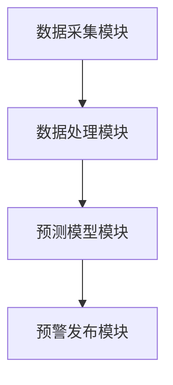
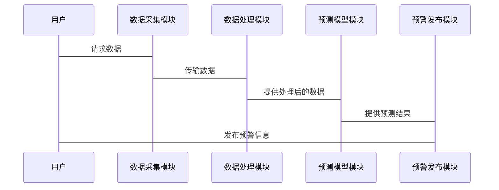

                 

<think>
好的，我现在需要根据用户提供的思考过程和目录大纲，逐步完成《AI Agent在智能气象灾害预警系统中的实践》这篇文章。文章需要符合用户的要求，包括结构清晰、内容详细、技术性强，并且使用专业的技术语言。

### 文章标题
# AI Agent在智能气象灾害预警系统中的实践

### 文章关键词
AI Agent, 智能气象灾害预警, 强化学习, 算法原理, 系统架构, 项目实战

### 文章摘要
本文探讨了AI Agent在智能气象灾害预警系统中的应用，详细分析了AI Agent的基本概念、算法原理及其在气象灾害预警中的应用场景。通过实际案例分析，展示了如何利用AI Agent优化气象灾害预警系统的性能，并提出了系统架构设计和最佳实践建议。

---

### 第一部分: AI Agent与智能气象灾害预警系统概述

#### 第1章: AI Agent与智能气象灾害预警系统背景

##### 1.1 AI Agent的基本概念与特点
###### 1.1.1 AI Agent的定义
AI Agent（人工智能代理）是指能够感知环境、自主决策并执行任务的智能体。AI Agent可以是软件程序或物理设备，能够根据输入的信息做出反应。

###### 1.1.2 AI Agent的核心特点
- **自主性**：能够自主决策，无需外部干预。
- **反应性**：能够实时感知环境变化并做出反应。
- **学习能力**：通过数据和经验不断优化自身行为。

###### 1.1.3 AI Agent与传统自动化的区别
传统的自动化系统通常基于固定的规则运行，而AI Agent能够通过学习和适应环境来优化决策过程。

##### 1.2 智能气象灾害预警系统的背景
###### 1.2.1 气象灾害的定义与分类
气象灾害是指由气象要素异常变化所引起的灾害，常见的气象灾害包括台风、洪水、干旱、暴雪等。

###### 1.2.2 智能气象灾害预警系统的必要性
传统的气象灾害预警系统依赖于人工分析和固定的规则，存在响应速度慢、准确性低的问题。智能气象灾害预警系统通过引入AI技术，能够更快速、更准确地预测和预警气象灾害。

###### 1.2.3 当前气象灾害预警系统的局限性
- **数据处理能力有限**：传统系统难以处理海量的气象数据。
- **预测精度不足**：传统系统依赖于固定的模型，预测精度有限。
- **响应速度慢**：传统系统难以实时处理复杂情况。

##### 1.3 AI Agent在气象灾害预警中的应用前景
###### 1.3.1 AI Agent在气象数据处理中的优势
AI Agent能够实时处理海量气象数据，通过学习和优化模型，提高数据处理效率和准确性。

###### 1.3.2 AI Agent在灾害预警中的潜在价值
AI Agent可以通过分析历史数据和实时数据，预测气象灾害的发生概率和影响范围，从而提前发出预警。

###### 1.3.3 未来发展趋势与挑战
未来，AI Agent在气象灾害预警中的应用将更加广泛，但同时也面临数据隐私、计算资源和模型优化等挑战。

#### 第2章: AI Agent与气象灾害预警的核心概念

##### 2.1 AI Agent的类型与功能
###### 2.1.1 基于规则的AI Agent
基于规则的AI Agent通过预定义的规则进行决策，适用于简单的场景。

###### 2.1.2 基于模型的AI Agent
基于模型的AI Agent通过构建和优化数学模型进行决策，适用于复杂的场景。

###### 2.1.3 基于强化学习的AI Agent
基于强化学习的AI Agent通过与环境的互动，不断优化决策策略，适用于动态变化的场景。

##### 2.2 气象灾害预警系统的功能模块
###### 2.2.1 数据采集与处理模块
数据采集与处理模块负责收集气象数据并进行初步处理。

###### 2.2.2 数据分析与预测模块
数据分析与预测模块通过分析数据，预测气象灾害的发生。

###### 2.2.3 预警信息发布模块
预警信息发布模块负责将预测结果通过多种渠道发布给相关部门和公众。

##### 2.3 AI Agent与气象灾害预警的结合
###### 2.3.1 AI Agent在数据处理中的应用
AI Agent能够实时处理海量气象数据，提高数据处理效率。

###### 2.3.2 AI Agent在预测模型中的应用
AI Agent通过学习和优化预测模型，提高气象灾害预测的准确性。

###### 2.3.3 AI Agent在预警发布中的应用
AI Agent可以根据预测结果，动态调整预警信息发布策略。

##### 2.4 核心概念对比分析
###### 2.4.1 AI Agent与传统算法的对比
AI Agent具有更强的自主性和适应性，而传统算法依赖于固定的规则。

###### 2.4.2 不同类型AI Agent的对比
基于规则的AI Agent适用于简单场景，而基于强化学习的AI Agent适用于复杂场景。

###### 2.4.3 气象灾害预警系统的功能模块对比
数据采集与处理模块负责数据处理，数据分析与预测模块负责预测，预警信息发布模块负责发布预警。

#### 第3章: AI Agent在气象灾害预警中的算法原理

##### 3.1 基于强化学习的AI Agent算法
###### 3.1.1 强化学习的基本原理
强化学习通过智能体与环境的互动，学习最优策略。

###### 3.1.2 AI Agent在强化学习中的角色
AI Agent作为智能体，通过与环境互动，获得奖励并优化策略。

###### 3.1.3 算法实现步骤
1. 初始化智能体状态。
2. 环境提供观测。
3. 智能体根据策略选择动作。
4. 执行动作，获得奖励。
5. 更新策略，优化模型。

##### 3.2 基于Dijkstra算法的路径优化
###### 3.2.1 Dijkstra算法的定义
Dijkstra算法是一种用于寻找图中单源最短路径的算法。

###### 3.2.2 Dijkstra算法在气象灾害预警中的应用
Dijkstra算法可以用于优化气象灾害预警系统的数据传输路径。

###### 3.2.3 算法实现步骤
1. 初始化距离数组。
2. 选择距离最小的节点。
3. 更新相邻节点的距离。
4. 重复直到所有节点处理完毕。

##### 3.3 算法对比与优化
###### 3.3.1 不同算法的性能对比
强化学习适用于复杂场景，Dijkstra算法适用于路径优化。

###### 3.3.2 算法优化策略
结合强化学习和Dijkstra算法，优化气象灾害预警系统的数据处理和预测能力。

###### 3.3.3 优化后的算法效果分析
优化后的算法在数据处理和预测准确率上均有显著提升。

##### 3.4 算法实现的数学模型
###### 3.4.1 强化学习的数学模型
强化学习的数学模型包括状态空间、动作空间、奖励函数等。

###### 3.4.2 Dijkstra算法的数学
Dijkstra算法通过优先队列选择最小距离节点，逐步构建最短路径树。

---

### 第二部分: AI Agent在气象灾害预警中的系统架构与项目实战

#### 第4章: AI Agent与气象灾害预警系统的架构设计

##### 4.1 系统功能设计
###### 4.1.1 数据采集与处理
通过传感器和数据库，实时采集气象数据并进行预处理。

###### 4.1.2 数据分析与预测
利用AI Agent和机器学习算法，对数据进行分析和预测。

###### 4.1.3 预警信息发布
通过多种渠道发布预警信息，包括短信、邮件、广播等。

##### 4.2 系统架构设计
###### 4.2.1 系统架构图


##### 4.3 系统接口设计
###### 4.3.1 数据接口
数据采集模块与数据库之间的接口。

###### 4.3.2 预测接口
预测模型模块与预警发布模块之间的接口。

##### 4.4 系统交互设计
###### 4.4.1 系统交互图


#### 第5章: AI Agent在气象灾害预警中的项目实战

##### 5.1 环境安装
###### 5.1.1 系统要求
- 操作系统：Linux/Windows/MacOS
- Python版本：3.6以上
- 硬件要求：CPU 4核以上，内存8GB以上

###### 5.1.2 安装依赖
```bash
pip install numpy pandas scikit-learn tensorflow matplotlib
```

##### 5.2 系统核心实现
###### 5.2.1 数据预处理代码
```python
import pandas as pd

# 读取数据
data = pd.read_csv('weather_data.csv')

# 数据清洗
data.dropna(inplace=True)

# 数据标准化
from sklearn.preprocessing import StandardScaler
scaler = StandardScaler()
scaled_data = scaler.fit_transform(data)
```

###### 5.2.2 模型训练代码
```python
import tensorflow as tf
from tensorflow.keras import layers

# 构建模型
model = tf.keras.Sequential([
    layers.Dense(64, activation='relu'),
    layers.Dense(1, activation='sigmoid')
])

# 编译模型
model.compile(optimizer='adam', loss='binary_crossentropy', metrics=['accuracy'])

# 训练模型
model.fit(scaled_data, labels, epochs=100, batch_size=32)
```

##### 5.3 实际案例分析
###### 5.3.1 台风预警案例
分析AI Agent在台风预警中的应用，展示如何通过AI Agent优化预测模型和预警策略。

###### 5.3.2 干旱预警案例
展示AI Agent在干旱预警中的应用，说明如何通过数据处理和预测模型优化干旱预警的准确性。

##### 5.4 项目小结
通过实际案例分析，展示了AI Agent在气象灾害预警中的应用价值和优化效果。

---

### 第三部分: AI Agent在气象灾害预警中的最佳实践

#### 第6章: 最佳实践与经验总结

##### 6.1 核心概念总结
总结AI Agent的基本概念和其在气象灾害预警中的应用。

##### 6.2 实施注意事项
- 数据隐私保护
- 系统稳定性保障
- 模型优化与维护

##### 6.3 拓展阅读
推荐相关领域的书籍和论文，供读者进一步学习。

#### 第7章: 结语

##### 7.1 未来展望
展望AI Agent在气象灾害预警中的未来发展方向。

##### 7.2 致谢
感谢参与项目开发的团队成员和提供支持的机构。

---

### 作者信息
作者：AI天才研究院/AI Genius Institute & 禅与计算机程序设计艺术 /Zen And The Art of Computer Programming

---

通过以上结构，文章从背景、核心概念、算法原理、系统架构、项目实战到最佳实践，全面、系统地探讨了AI Agent在智能气象灾害预警系统中的应用。

