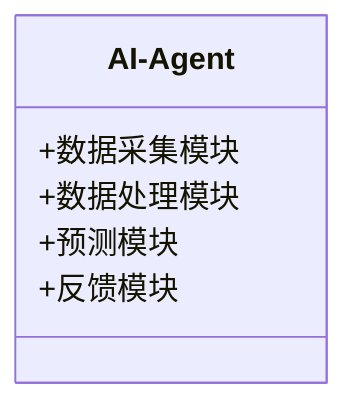
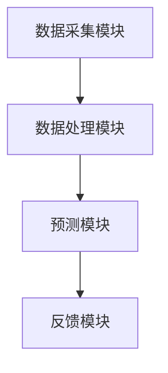

                 


# AI Agent在智能气象预报中的实践

## 关键词：
AI Agent，智能气象预报，深度学习，多智能体系统，气象数据

## 摘要：
本文探讨AI Agent在智能气象预报中的应用，从AI Agent的基本概念到其在气象预报中的具体应用，涵盖数学模型、算法原理、系统架构设计及项目实战。通过详细分析，展示AI Agent如何提升气象预报的准确性和效率，为相关领域的研究和实践提供参考。

---

# 第1章: AI Agent与智能气象预报的背景与概念

## 1.1 AI Agent的基本概念

### 1.1.1 AI Agent的定义与特点
AI Agent（人工智能代理）是指能够感知环境、自主决策并执行任务的智能实体。其特点包括自主性、反应性、目标导向和社交能力。AI Agent在气象预报中的应用可以显著提高预测的准确性和效率。

### 1.1.2 AI Agent的核心功能与类型
AI Agent的核心功能包括感知、推理、决策和执行。根据应用场景的不同，可以分为简单反射型、基于模型的反应型、目标驱动型和效用驱动型。

### 1.1.3 AI Agent在气象预报中的应用潜力
AI Agent可以处理多源气象数据，优化预测模型，并提供实时反馈，从而提高气象预报的准确性。

---

## 1.2 智能气象预报的背景与挑战

### 1.2.1 气象预报的传统方法与局限性
传统气象预报依赖统计方法和数值模拟，存在计算量大、预测时间长的问题。AI Agent的应用可以弥补这些不足。

### 1.2.2 AI技术在气象预报中的优势
AI技术能够处理海量数据，发现复杂模式，并实时更新预测结果。

### 1.2.3 当前智能气象预报的发展现状
AI Agent在气象预报中的应用正在快速发展，但仍面临数据质量、模型复杂性和计算资源等挑战。

---

## 1.3 本章小结
本章介绍了AI Agent的基本概念及其在气象预报中的应用潜力，分析了传统气象预报的局限性和AI技术的优势。

---

# 第2章: AI Agent的核心原理

## 2.1 多智能体系统概述

### 2.1.1 多智能体系统的定义与特点
多智能体系统由多个相互作用的智能体组成，具有分布性、协作性和反应性。

### 2.1.2 多智能体系统中的通信与协作
智能体之间通过消息传递进行通信，协作完成复杂任务。

### 2.1.3 多智能体系统分类与应用
多智能体系统可以分为基于规则和基于模型的两类，广泛应用于气象、交通等领域。

---

## 2.2 知识表示与推理

### 2.2.1 知识表示的基本方法
知识表示包括概念表示、关系表示和语义表示。

### 2.2.2 推理机制与逻辑推理
推理机制包括演绎推理、归纳推理和默认推理。

### 2.2.3 知识图谱在气象预报中的应用
知识图谱可以帮助智能体理解气象数据的语义。

---

## 2.3 AI Agent的决策机制

### 2.3.1 基于规则的决策方法
通过预定义规则进行决策，适用于简单场景。

### 2.3.2 基于机器学习的决策方法
利用训练数据学习决策模型，适用于复杂场景。

### 2.3.3 基于强化学习的决策优化
通过奖励机制优化决策策略。

---

## 2.4 本章小结
本章详细讲解了AI Agent的核心原理，包括多智能体系统、知识表示与推理和决策机制。

---

# 第3章: 概率论与统计学习方法

## 3.1 概率论基础

### 3.1.1 概率的基本概念与性质
概率是事件发生的可能性度量。

### 3.1.2 条件概率与贝叶斯定理
贝叶斯定理用于计算条件概率，公式如下：

$$P(A|B) = \frac{P(B|A)P(A)}{P(B)}$$

### 3.1.3 马尔可夫链与马尔可夫过程
马尔可夫链描述系统状态转移的概率。

---

## 3.2 统计学习方法

### 3.2.1 监督学习与无监督学习
监督学习基于标记数据，无监督学习基于无标记数据。

### 3.2.2 回归分析与分类算法
回归用于预测，分类用于分类。

### 3.2.3 聚类分析与降维技术
聚类分析将数据分组，降维技术减少数据维度。

---

## 3.3 气象数据的特征与处理

### 3.3.1 气象数据的类型与特点
气象数据包括温度、湿度等多维数据。

### 3.3.2 数据预处理与特征提取
数据预处理包括清洗和标准化，特征提取包括主成分分析。

### 3.3.3 时间序列分析与预测
时间序列分析用于预测未来气象数据。

---

## 3.4 本章小结
本章介绍了概率论和统计学习方法在气象数据处理中的应用。

---

# 第4章: 深度学习模型与算法

## 4.1 深度学习基础

### 4.1.1 神经网络的基本结构
神经网络由输入层、隐藏层和输出层组成。

### 4.1.2 深度学习的核心算法
包括反向传播和梯度下降。

### 4.1.3 深度学习与传统机器学习的对比
深度学习适合处理复杂数据，传统机器学习适合规则明确的数据。

---

## 4.2 常见深度学习模型

### 4.2.1 卷积神经网络（CNN）
CNN用于图像处理，适用于卫星气象数据。

### 4.2.2 长短期记忆网络（LSTM）
LSTM用于时间序列预测，适合气象数据。

### 4.2.3 Transformer模型与注意力机制
Transformer模型在序列建模中表现优异。

---

## 4.3 深度学习在气象预报中的应用

### 4.3.1 基于CNN的气象数据处理
CNN可以处理卫星图像，提取特征。

### 4.3.2 基于LSTM的气象时间序列预测
LSTM用于预测未来气象条件。

### 4.3.3 基于Transformer的气象数据编码
Transformer模型用于编码气象数据。

---

## 4.4 本章小结
本章介绍了深度学习模型在气象预报中的应用，包括CNN、LSTM和Transformer。

---

# 第5章: 系统架构设计

## 5.1 系统功能设计

### 5.1.1 领域模型
领域模型展示系统功能模块，如数据采集、处理、预测和反馈。



---

## 5.2 系统架构设计

### 5.2.1 系统架构图
系统架构图展示各模块之间的交互。



---

## 5.3 系统接口设计

### 5.3.1 API接口设计
API接口定义数据输入和输出格式。

### 5.3.2 接口交互流程
数据采集模块调用API获取数据，处理模块处理数据，预测模块进行预测，反馈模块返回结果。

---

## 5.4 本章小结
本章设计了AI Agent气象预报系统的架构，展示了各模块的交互和功能。

---

# 第6章: 项目实战

## 6.1 环境安装

### 6.1.1 Python环境安装
使用Python 3.8及以上版本。

### 6.1.2 依赖库安装
安装numpy、pandas、keras、tensorflow等库。

---

## 6.2 系统核心实现源代码

### 6.2.1 数据预处理代码
```python
import numpy as np
import pandas as pd

def preprocess_data(data):
    # 数据清洗
    data = data.dropna()
    # 标准化
    data = (data - data.mean()) / data.std()
    return data
```

### 6.2.2 模型训练代码
```python
from keras.models import Sequential
from keras.layers import LSTM, Dense

model = Sequential()
model.add(LSTM(64, input_shape=(timesteps, features)))
model.add(Dense(1))
model.compile(loss='mean_squared_error', optimizer='adam')
model.fit(X_train, y_train, epochs=100, batch_size=32)
```

### 6.2.3 结果分析代码
```python
y_pred = model.predict(X_test)
error = np.mean(np.abs(y_pred - y_test))
print(f'预测误差: {error}')
```

---

## 6.3 案例分析与详细讲解

### 6.3.1 数据来源与处理
使用历史气象数据，进行清洗和标准化。

### 6.3.2 模型训练与评估
训练LSTM模型，评估预测误差。

### 6.3.3 模型优化
调整模型参数，优化预测性能。

---

## 6.4 本章小结
本章通过实际项目展示了AI Agent在气象预报中的应用，包括环境安装、代码实现和案例分析。

---

# 第7章: 总结与展望

## 7.1 最佳实践 tips
- 数据预处理是关键，确保数据质量。
- 选择合适的模型，优化预测性能。
- 定期更新模型，适应气象变化。

## 7.2 小结
本文详细探讨了AI Agent在智能气象预报中的应用，从理论到实践，展示了其在提高气象预报准确性和效率中的潜力。

## 7.3 注意事项
- 数据隐私问题需要注意。
- 模型的可解释性需要进一步研究。

## 7.4 拓展阅读
推荐学习多智能体系统、深度学习和时间序列分析的相关书籍和论文。

---

# 作者：AI天才研究院/AI Genius Institute & 禅与计算机程序设计艺术 /Zen And The Art of Computer Programming

---

**感谢您的阅读！希望这篇文章能为您提供有价值的见解和实践指导。**

