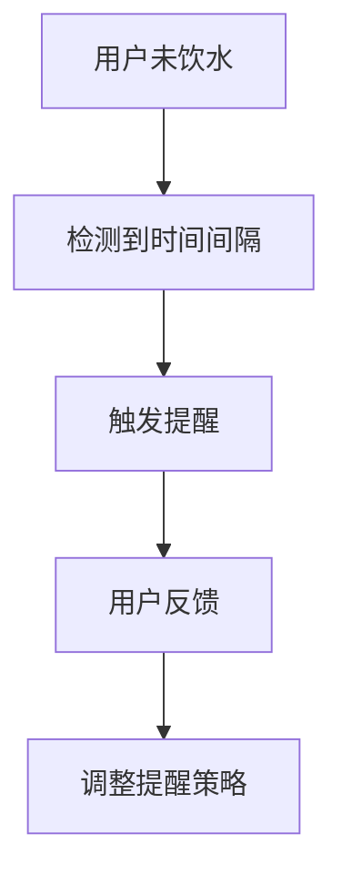
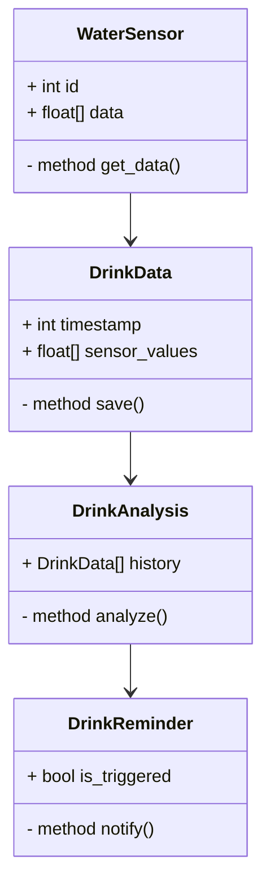
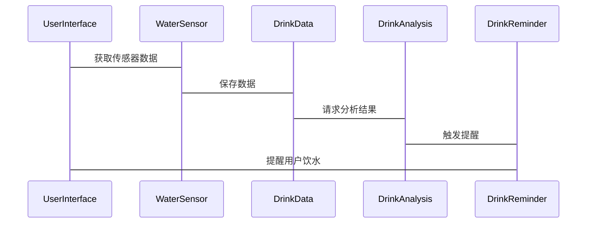

                 


```markdown
# AI Agent在智能水杯中的饮水提醒

> 关键词：AI Agent、智能水杯、饮水提醒、传感器、物联网、算法、系统设计

> 摘要：本文将探讨AI Agent在智能水杯中的饮水提醒功能，详细分析其背景、核心概念、算法原理、系统架构设计及实现方案，最后结合实际案例进行详细解读和分析。

---

# 第一部分: AI Agent在智能水杯中的饮水提醒背景与概念

# 第1章: AI Agent与智能水杯概述

## 1.1 问题背景与问题描述
### 1.1.1 健康饮水的重要性
- 人体水分流失的自然规律
- 饮水不足的健康风险
- 现代生活节奏对健康饮水的挑战

### 1.1.2 现有饮水提醒方式的局限性
- 传统饮水提醒方法的不足
- 用户行为与实际需求的偏差
- 智能设备在健康饮水管理中的潜力

### 1.1.3 AI Agent在智能水杯中的应用价值
- AI Agent的核心优势
- 智能水杯的创新应用场景
- AI驱动的个性化饮水管理

## 1.2 AI Agent的核心概念与功能
### 1.2.1 AI Agent的基本定义
- 定义：AI Agent的定义与特征
- 核心功能：感知、决策、执行
- 与传统算法的区别：自主性、适应性、主动性

### 1.2.2 智能水杯的功能需求
- 基本功能：实时监测、提醒、记录
- 高阶功能：个性化推荐、健康分析、数据同步
- 用户需求分析：不同场景下的饮水习惯

### 1.2.3 AI Agent在饮水提醒中的具体应用
- 状态检测：水量监测、用户行为识别
- 行为决策：主动提醒、智能调节
- 交互反馈：实时反馈、用户偏好学习

## 1.3 问题解决与边界分析
### 1.3.1 AI Agent如何解决饮水提醒问题
- 解决方案概述：通过传感器、算法、用户交互实现智能化提醒
- 关键技术：传感器数据采集、AI算法处理、用户反馈机制
- 优势对比：AI Agent与传统提醒方式的对比分析

### 1.3.2 系统的边界与外延
- 系统边界：传感器、算法、用户交互的整合
- 功能外延：数据存储、健康报告、社交分享
- 系统架构：模块化设计与扩展性分析

### 1.3.3 核心要素与功能模块
- 核心要素：传感器、AI算法、用户交互
- 功能模块：数据采集模块、算法处理模块、用户反馈模块
- 模块间关系：数据流、控制流、反馈机制

## 1.4 核心概念结构与ER实体关系图
### 1.4.1 核心概念的属性特征对比
| 概念 | 属性 | 特征 |
|------|------|------|
| AI Agent | 感知能力 | 多模态传感器数据处理 |
|        | 决策能力 | 基于历史数据的智能决策 |
| 智能水杯 | 实时监测 | 水量、温度、使用频率监测 |
|        | 交互能力 | 用户反馈、语音/视觉提醒 |

### 1.4.2 ER实体关系图
```mermaid
erDiagram
    user}o---{drinkReminder : "触发提醒"
    sensor}o---{drinkData : "数据采集"
    drinkData}o---{drinkAnalysis : "数据分析"
    drinkAnalysis}o---{drinkReminder : "生成提醒"
    drinkReminder}o---{userFeedback : "用户反馈"
```

---

# 第二部分: AI Agent的算法原理与数学模型

# 第2章: AI Agent算法原理

## 2.1 状态检测与行为决策
### 2.1.1 基于传感器的状态检测流程
- 多模态传感器数据采集：水量、杯温、倾斜角度
- 数据预处理：去噪、归一化
- 状态分类：未使用、少量使用、正常使用

### 2.1.2 AI Agent的行为决策逻辑
- 时间间隔判断：基于用户习惯的时间模型
- 用户状态识别：通过传感器数据判断用户是否在饮水
- 提醒策略：主动推送、被动提醒、优先级排序

## 2.2 算法流程图与数学模型
### 2.2.1 算法的Mermaid流程图


### 2.2.2 状态检测的数学模型
$$状态检测 = \sum_{i=1}^{n} (传感器数据_i \times 权重_i)$$

### 2.2.3 行为决策的条件判断
$$如果时间 >= 饮水时间间隔，则触发提醒$$

## 2.3 代码实现与案例分析
### 2.3.1 算法的Python代码示例
```python
def detect_water_level(sensor_data):
    # 传感器数据预处理
    processed_data = [d * 0.8 for d in sensor_data]  # 假设权重为0.8
    # 状态分类
    if max(processed_data) > 0.6:
        return "正常使用"
    elif max(processed_data) > 0.3:
        return "少量使用"
    else:
        return "未使用"
```

### 2.3.2 算法的详细解读与分析
- 传感器数据的预处理：去噪、归一化
- 状态分类的依据：水量阈值、用户习惯模型
- 提醒策略的优化：基于用户反馈的自适应调整

---

# 第三部分: 系统分析与架构设计

# 第3章: 系统架构设计方案

## 3.1 问题场景与项目介绍
### 3.1.1 系统目标与功能需求
- 目标：实现智能饮水提醒功能
- 功能需求：实时监测、智能提醒、用户反馈、数据存储

### 3.1.2 项目的主要特点
- 传感器数据的实时性
- AI算法的自主性
- 用户交互的便捷性

## 3.2 系统功能设计
### 3.2.1 领域模型的Mermaid类图


### 3.2.2 系统架构设计的Mermaid架构图


### 3.2.3 系统接口设计
- 接口1：WaterSensor -> DrinkData
  - 数据格式：JSON
  - 接口功能：传感器数据采集与存储
- 接口2：DrinkAnalysis -> DrinkReminder
  - 数据格式：结构化数据
  - 接口功能：分析结果推送

### 3.2.4 系统交互的Mermaid序列图


## 3.3 系统实现与优化
### 3.3.1 系统实现的关键点
- 传感器数据的实时采集与处理
- AI算法的高效运行与优化
- 用户反馈的快速响应与学习

### 3.3.2 系统优化策略
- 数据压缩与存储优化
- 算法加速：并行计算、模型轻量化
- 用户体验优化：个性化提醒、多模态反馈

---

# 第四部分: 项目实战与案例分析

# 第4章: 项目实战

## 4.1 环境安装与配置
### 4.1.1 开发环境搭建
- 操作系统：Linux/Windows/MacOS
- 开发工具：Python、Jupyter Notebook、IDE
- 依赖库安装：numpy、pandas、scikit-learn

### 4.1.2 传感器与硬件配置
- 硬件选型：支持多模态传感器的数据采集
- 硬件接口：I2C、SPI、UART
- 驱动安装：传感器驱动程序

## 4.2 系统核心实现
### 4.2.1 传感器数据采集代码
```python
import time
import numpy as np

class WaterSensor:
    def __init__(self):
        self.id = 1
        self.data = []

    def get_data(self):
        # 模拟传感器数据
        self.data = np.random.rand(3) * 0.5
        return self.data

# 初始化传感器
sensor = WaterSensor()
# 采集数据
data = sensor.get_data()
print("传感器数据:", data)
```

### 4.2.2 AI算法实现代码
```python
from sklearn.model

