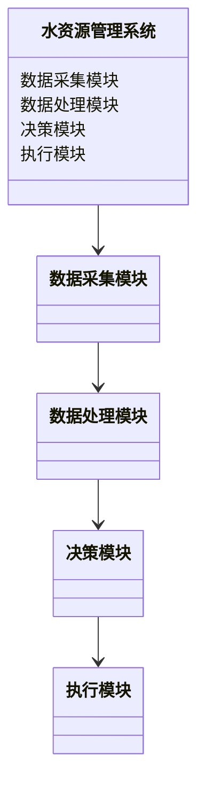
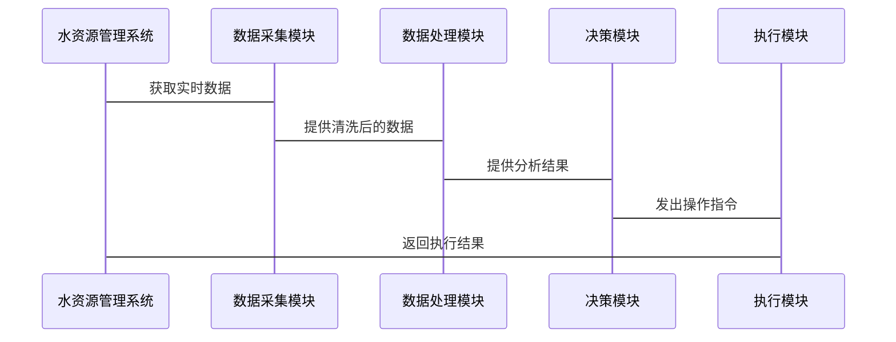

                 


# AI Agent在智能水资源管理中的实践

> 关键词：AI Agent, 智能水资源管理, 强化学习, 水资源优化, 智能决策系统

> 摘要：  
本文探讨了AI Agent在智能水资源管理中的实际应用与实践。通过分析AI Agent的核心原理、算法实现以及系统架构，结合具体案例，展示了如何利用AI Agent技术实现水资源的智能化监测、优化分配与高效管理。文章从背景、原理、系统设计到项目实战，层层深入，为读者提供了全面的理论与实践指导。

---

## 第一部分: AI Agent与智能水资源管理的背景与基础

### 第1章: AI Agent的基本概念与技术基础

#### 1.1 AI Agent的定义与核心特征

##### 1.1.1 什么是AI Agent
AI Agent（人工智能代理）是一种能够感知环境、自主决策并执行任务的智能实体。它通过传感器获取信息，利用算法进行分析，然后采取行动以实现特定目标。AI Agent可以是软件程序、机器人或其他智能系统。

##### 1.1.2 AI Agent的核心特征
- **自主性**：能够在没有外部干预的情况下独立运行。
- **反应性**：能够实时感知环境变化并做出响应。
- **目标导向性**：所有行为都围绕实现特定目标展开。
- **学习能力**：通过经验改进性能。

##### 1.1.3 AI Agent与传统AI的区别
传统AI（如专家系统）依赖于预定义的规则，而AI Agent具备自主性和适应性，能够根据环境动态调整行为。AI Agent更注重与环境的交互，而非单纯的计算或推理。

---

#### 1.2 智能水资源管理的背景与挑战

##### 1.2.1 水资源管理的现状与问题
随着全球人口增长和气候变化，水资源短缺问题日益严重。传统水资源管理依赖人工操作，效率低、响应慢，难以应对复杂多变的环境。

##### 1.2.2 智能化管理的必要性
通过智能化技术，可以实现水资源的实时监测、优化分配和高效利用，减少浪费并提高抗风险能力。

##### 1.2.3 AI Agent在水资源管理中的作用
AI Agent能够实时感知水文数据、优化水资源分配策略，并通过自主决策提高管理效率。

---

### 第2章: AI Agent与水资源管理的结合

#### 2.1 AI Agent在水资源管理中的应用场景

##### 2.1.1 水资源监测与预测
AI Agent可以通过传感器网络实时收集水位、流量、水质等数据，并利用机器学习模型预测未来趋势。

##### 2.1.2 水资源分配与优化
AI Agent可以根据实时数据和历史信息，优化水资源分配策略，确保供需平衡。

##### 2.1.3 水资源保护与治理
AI Agent可以协助制定污染治理方案，监控非法取水行为，保护水资源环境。

#### 2.2 AI Agent在水资源管理中的优势

##### 2.2.1 高效性与实时性
AI Agent能够快速处理数据并做出决策，显著提高管理效率。

##### 2.2.2 自适应与自主性
AI Agent能够根据环境变化自适应调整策略，无需人工干预。

##### 2.2.3 数据驱动与决策支持
AI Agent通过数据驱动的决策支持，提高水资源管理的科学性和准确性。

---

## 第二部分: AI Agent的核心原理与算法

### 第3章: AI Agent的核心原理

#### 3.1 AI Agent的感知机制

##### 3.1.1 数据采集与处理
AI Agent通过传感器或其他数据源获取环境信息，并进行预处理和特征提取。

##### 3.1.2 状态识别与分析
AI Agent利用算法对感知数据进行分析，识别当前状态并预测未来趋势。

#### 3.2 AI Agent的决策机制

##### 3.2.1 决策模型的构建
AI Agent基于历史数据和专家知识，构建决策模型，如强化学习模型或贝叶斯网络。

##### 3.2.2 决策逻辑的优化
通过不断学习和优化，AI Agent能够改进决策策略，提高决策准确性。

#### 3.3 AI Agent的执行机制

##### 3.3.1 动作规划与执行
AI Agent根据决策结果制定行动计划，并通过执行模块实现。

##### 3.3.2 反馈机制与自适应调整
AI Agent通过反馈机制不断优化行为，适应环境变化。

---

### 第4章: AI Agent的关键算法与实现

#### 4.1 强化学习算法

##### 4.1.1 强化学习的基本原理
强化学习是一种通过试错和奖励机制来优化决策的算法。AI Agent通过与环境交互，逐步学习最优策略。

##### 4.1.2 Q-learning算法的实现
Q-learning是一种经典的强化学习算法，通过更新Q值表来优化决策。

##### 4.1.3 算法的优化与改进
通过引入经验回放和目标网络等技术，可以提高强化学习算法的稳定性和效率。

#### 4.2 贝叶斯网络与决策树

##### 4.2.1 贝叶斯网络的构建
贝叶斯网络是一种概率图模型，用于表示变量之间的条件概率关系。

##### 4.2.2 决策树的训练与应用
决策树是一种基于树状结构的分类方法，可用于水资源管理中的分类和预测任务。

#### 4.3 算法实现的数学模型

##### 4.3.1 强化学习的数学公式
强化学习的Q值更新公式为：
$$ Q(s, a) = Q(s, a) + \alpha (r + \gamma \max Q(s', a') - Q(s, a)) $$
其中，$\alpha$ 是学习率，$\gamma$ 是折扣因子。

##### 4.3.2 贝叶斯网络的公式推导
贝叶斯网络的概率计算公式为：
$$ P(A|B) = \frac{P(B|A)P(A)}{P(B)} $$

---

## 第三部分: 智能水资源管理系统的架构与设计

### 第5章: 智能水资源管理系统的功能设计

#### 5.1 系统功能模块划分

##### 5.1.1 数据采集模块
负责收集水位、流量、水质等实时数据。

##### 5.1.2 数据处理模块
对采集的数据进行清洗、转换和特征提取。

##### 5.1.3 决策模块
基于数据和算法，生成优化策略。

##### 5.1.4 执行模块
根据决策结果，执行相应的操作。

#### 5.2 系统功能设计的领域模型



---

### 第6章: 智能水资源管理系统的架构设计

#### 6.1 系统架构设计


---

### 第7章: 系统接口设计与交互流程

#### 7.1 系统接口设计



---

## 第四部分: 项目实战与案例分析

### 第8章: 项目实战

#### 8.1 环境安装与配置

```bash
pip install numpy
pip install matplotlib
pip install scikit-learn
pip install keras
pip install tensorflow
```

#### 8.2 核心代码实现

##### 8.2.1 数据采集模块

```python
import numpy as np
import pandas as pd

def collect_data():
    # 模拟数据采集
    data = np.random.rand(100, 5)
    df = pd.DataFrame(data, columns=['水位', '流量', '水质', '温度', '湿度'])
    return df
```

##### 8.2.2 数据处理模块

```python
from sklearn.preprocessing import StandardScaler

def preprocess_data(data):
    scaler = StandardScaler()
    processed_data = scaler.fit_transform(data)
    return processed_data
```

##### 8.2.3 决策模块（强化学习）

```python
import numpy as np

class AI-Agent:
    def __init__(self, state_space, action_space):
        self.state_space = state_space
        self.action_space = action_space
        self.Q = np.zeros((state_space, action_space))
    
    def take_action(self, state):
        # 简单的策略，选择当前Q值最高的动作
        return np.argmax(self.Q[state, :])
    
    def update_Q(self, state, action, reward, next_state):
        # 简单的Q-learning更新
        self.Q[state, action] += 0.1 * (reward + 0.9 * max(self.Q[next_state, :]) - self.Q[state, action])
```

---

## 第五部分: 总结与展望

### 第9章: 总结与展望

#### 9.1 最佳实践与小结
AI Agent在智能水资源管理中的应用前景广阔，通过强化学习和数据驱动的方法，可以显著提高管理效率和准确性。

#### 9.2 未来展望
未来，随着AI技术的不断发展，AI Agent在水资源管理中的应用将更加智能化和精细化。多智能体协作、边缘计算和区块链技术的结合将为智能水资源管理带来更多可能性。

---

**作者：AI天才研究院/AI Genius Institute & 禅与计算机程序设计艺术 /Zen And The Art of Computer Programming**

