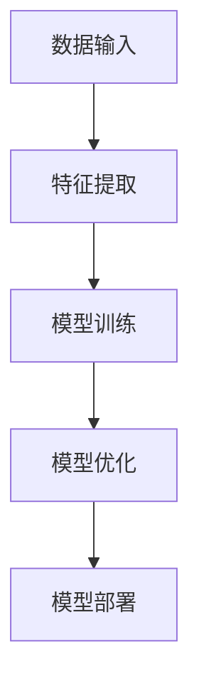
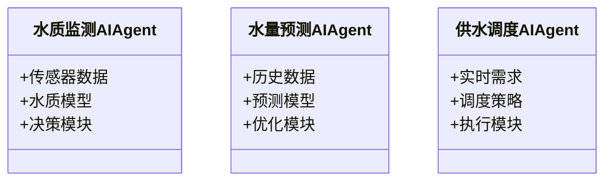
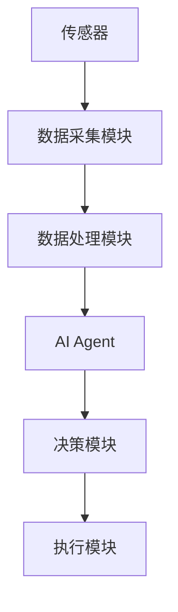

                 


# AI Agent在智能水资源管理中的实践

> 关键词：AI Agent，智能水资源管理，机器学习，深度学习，数学模型，系统架构

> 摘要：本文系统地介绍了AI Agent在智能水资源管理中的实践，从AI Agent的基本概念和原理出发，结合实际应用场景，详细分析了AI Agent在水质监测、水量预测、智能调度等关键环节中的技术实现。通过数学模型和算法的讲解，以及系统架构设计的展示，本文为读者提供了从理论到实践的全面指导。

---

# 第一部分: AI Agent与智能水资源管理基础

## 第1章: AI Agent与水资源管理概述

### 1.1 AI Agent的基本概念

#### 1.1.1 AI Agent的定义与特点
AI Agent（智能代理）是指能够感知环境、自主决策并执行任务的智能体。它具有以下特点：
- **自主性**：能够在没有外部干预的情况下独立运行。
- **反应性**：能够实时感知环境并做出反应。
- **学习性**：能够通过数据和经验不断优化自身的决策能力。
- **协作性**：能够与其他智能体或系统协同工作。

#### 1.1.2 AI Agent与传统自动化的区别
传统自动化依赖于固定的规则和程序，而AI Agent能够通过学习和推理动态调整行为，适应环境的变化。

| 特性 | 传统自动化 | AI Agent |
|------|------------|----------|
| 决策方式 | 预定义规则 | 自主学习与推理 |
| 环境适应性 | 固定程序 | 动态适应 |
| 复杂问题处理能力 | 有限 | 强大 |

#### 1.1.3 AI Agent在水资源管理中的应用潜力
水资源管理涉及多个复杂环节，如水质监测、水量预测、供水调度等。AI Agent能够通过实时数据处理、智能决策和自适应优化，显著提升水资源管理的效率和效果。

---

### 1.2 智能水资源管理的背景与挑战

#### 1.2.1 水资源管理的现状与问题
随着全球水资源短缺问题的加剧，传统的人工管理方式已难以应对复杂的水资源问题。主要问题包括：
- 数据量大且分散，难以实时处理。
- 水资源分布复杂，管理难度高。
- 环境变化和人类活动对水资源的影响难以预测。

#### 1.2.2 智能化管理的必要性
通过智能化技术，可以实现水资源的实时监测、动态预测和优化调度，从而提高水资源利用效率，减少浪费。

#### 1.2.3 AI Agent在水资源管理中的定位与作用
AI Agent作为智能水资源管理的核心技术，能够实现从数据采集、分析到决策的全流程自动化，帮助管理者做出最优决策。

---

## 第2章: AI Agent的核心原理与技术

### 2.1 AI Agent的核心原理

#### 2.1.1 感知与决策机制
AI Agent通过传感器或数据源获取环境信息，利用感知模型理解数据，并基于决策模型制定行动方案。

#### 2.1.2 学习与优化算法
AI Agent通过机器学习算法不断优化自身的决策能力，包括监督学习、无监督学习和强化学习。

#### 2.1.3 多智能体协作原理
在复杂的水资源管理场景中，多个AI Agent需要协作完成任务，例如分布式监测和联合决策。

---

### 2.2 AI Agent的关键技术

#### 2.2.1 机器学习算法
- **监督学习**：用于分类和回归任务，如水质预测。
- **无监督学习**：用于聚类分析，如异常检测。
- **强化学习**：用于动态决策，如供水调度。

#### 2.2.2 自然语言处理技术
用于处理与水资源相关的文本数据，如水质报告和用户反馈。

#### 2.2.3 计算机视觉技术
用于图像识别，如水体污染监测。

---

### 2.3 AI Agent与水资源管理的结合

#### 2.3.1 数据采集与处理
AI Agent通过传感器和物联网设备实时采集水质、水量等数据，并进行预处理和特征提取。

#### 2.3.2 智能决策模型
基于机器学习模型构建决策支持系统，帮助管理者做出科学决策。

#### 2.3.3 系统集成与优化
通过系统集成优化AI Agent的性能，确保其在水资源管理中的高效运行。

---

# 第二部分: AI Agent在水资源管理中的算法与数学模型

## 第3章: AI Agent的核心算法

### 3.1 机器学习算法

#### 3.1.1 监督学习算法
- **线性回归**：用于预测连续值，如水量预测。
  $$y = \beta_0 + \beta_1x + \epsilon$$

- **支持向量机**：用于分类和回归任务，如水质分类。
  $$max_{\gamma, \alpha} \sum_{i=1}^n \alpha_i y_i + \gamma$$

#### 3.1.2 无监督学习算法
- **聚类分析**：用于异常检测，如水质异常监测。

#### 3.1.3 强化学习算法
- **Q-Learning**：用于动态决策，如供水调度。
  $$Q(s, a) = Q(s, a) + \alpha [r + \gamma \max Q(s', a') - Q(s, a)]$$

### 3.2 深度学习算法

#### 3.2.1 卷积神经网络
- **CNN**：用于图像识别，如水体污染监测。

#### 3.2.2 循环神经网络
- **RNN**：用于时间序列预测，如水质变化预测。
  $$s_t = \tanh(W_{s}x_t + U_s s_{t-1} + b_s)$$

#### 3.2.3 图神经网络
- **GNN**：用于复杂网络分析，如供水网络优化。

### 3.3 算法流程图


---

## 第4章: 数学模型与公式

### 4.1 机器学习模型

#### 4.1.1 线性回归模型
$$y = \beta_0 + \beta_1x + \epsilon$$

#### 4.1.2 支持向量机模型
$$max_{\gamma, \alpha} \sum_{i=1}^n \alpha_i y_i + \gamma$$

### 4.2 深度学习模型

#### 4.2.1 神经网络模型
$$L = -\sum_{i=1}^n y_i \log p(y_i) + (1 - y_i)\log (1 - p(y_i))$$

#### 4.2.2 循环神经网络模型
$$s_t = \tanh(W_{s}x_t + U_s s_{t-1} + b_s)$$

### 4.3 算法优化公式

#### 4.3.1 梯度下降算法
$$\theta_{t+1} = \theta_t - \eta \nabla J(\theta_t)$$

#### 4.3.2 动量优化算法
$$v_t = \beta v_{t-1} + (1-\beta) \nabla J(\theta_t)$$
$$\theta_{t+1} = \theta_t - \eta v_t$$

---

# 第三部分: 项目实战与系统架构设计

## 第5章: 系统架构设计

### 5.1 项目介绍
本项目旨在开发一个基于AI Agent的智能水资源管理系统，实现水质监测、水量预测和供水调度等功能。

### 5.2 系统功能设计

#### 5.2.1 领域模型


#### 5.2.2 系统架构


### 5.3 系统接口设计

#### 5.3.1 接口定义
- 数据采集模块：接收传感器数据并传递给数据处理模块。
- 数据处理模块：对数据进行清洗和特征提取，传递给AI Agent。
- AI Agent：根据输入数据生成决策，并传递给执行模块。
- 执行模块：根据决策执行相应的操作。

#### 5.3.2 接口交互图
```mermaid
sequenceDiagram
参与者：传感器
参与者：数据采集模块
参与者：数据处理模块
参与者：AI Agent
参与者：执行模块

传感器 -> 数据采集模块: 发送数据
数据采集模块 -> 数据处理模块: 传递数据
数据处理模块 -> AI Agent: 传递特征
AI Agent -> 执行模块: 发送决策
执行模块 ->> 执行模块: 执行操作
```

---

## 第6章: 项目实战

### 6.1 环境安装
- 安装Python和相关库（如TensorFlow、Keras、Scikit-learn）。
- 安装传感器数据采集工具（如Modbus库）。

### 6.2 系统核心实现

#### 6.2.1 数据采集模块
```python
import modbus

def read_sensor():
    # 读取传感器数据
    data = modbus.read_from_sensor()
    return data
```

#### 6.2.2 数据处理模块
```python
import pandas as pd

def preprocess_data(data):
    # 数据清洗和特征提取
    df = pd.DataFrame(data)
    df['quality'] = df['ph'] * 0.5 + df['tds'] * 0.3 + df['turbidity'] * 0.2
    return df
```

#### 6.2.3 AI Agent实现
```python
import tensorflow as tf
from tensorflow.keras import layers

model = tf.keras.Sequential([
    layers.Dense(64, activation='relu'),
    layers.Dense(1, activation='sigmoid')
])

model.compile(optimizer='adam', loss='binary_crossentropy')
model.fit(X_train, y_train, epochs=10)
```

#### 6.2.4 决策模块
```python
def make_decision(model, data):
    prediction = model.predict(data)
    if prediction > 0.5:
        return '开启水泵'
    else:
        return '关闭水泵'
```

---

## 第7章: 项目小结与注意事项

### 7.1 项目小结
通过本项目的实践，我们成功实现了基于AI Agent的智能水资源管理系统，验证了AI Agent在水质监测和水量预测中的有效性。

### 7.2 注意事项
- 数据质量对模型性能影响重大，需确保数据的准确性和完整性。
- 模型优化需结合实际场景，避免过度拟合。
- 系统部署需考虑实时性和安全性。

---

## 第8章: 拓展阅读与进一步思考

### 8.1 拓展阅读
- 《机器学习实战》
- 《深度学习入门：基于Python的快速学习》
- 《分布式系统：设计与实现》

### 8.2 进一步思考
- 如何实现多智能体协作？
- 如何应对动态变化的环境？
- 如何优化系统的实时性和响应速度？

---

# 作者：AI天才研究院 & 禅与计算机程序设计艺术

---

通过本文的系统讲解，我们深入探讨了AI Agent在智能水资源管理中的实践应用，从理论到实践，为读者提供了全面的指导。希望本文能够为水资源管理的智能化转型提供有价值的参考和启发。

