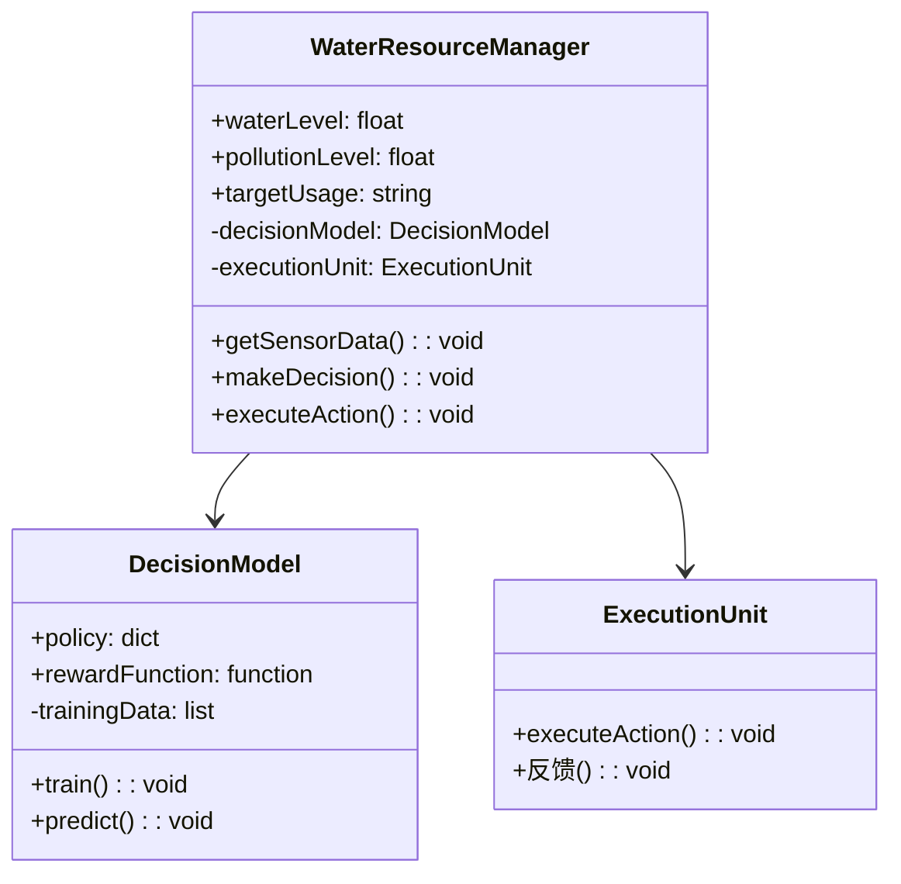
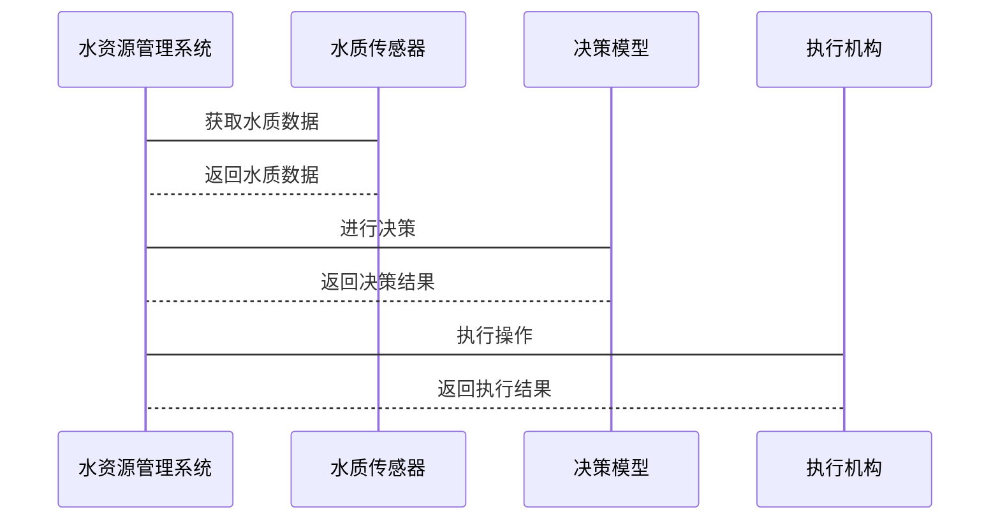

                 


# AI Agent在智能水资源管理中的角色

**关键词**：AI Agent、智能水资源管理、强化学习、系统架构、多智能体协作

**摘要**：  
随着全球水资源短缺问题日益严重，智能水资源管理成为解决这一挑战的关键。AI Agent（人工智能代理）在其中扮演了重要角色，通过感知、决策和执行机制，实现水资源的高效管理。本文将深入探讨AI Agent在水资源管理中的核心概念、算法原理、系统架构设计以及实际应用案例，分析其在智能水资源管理中的价值与潜力。

---

## 第1章: AI Agent与智能水资源管理概述

### 1.1 AI Agent的基本概念

#### 1.1.1 AI Agent的定义与特点
AI Agent是一种智能实体，能够感知环境、自主决策并执行任务。其特点包括自主性、反应性、目标导向和学习能力。AI Agent能够通过传感器获取数据，利用算法进行分析，并根据结果采取行动。

#### 1.1.2 AI Agent的核心功能与应用场景
AI Agent的核心功能包括感知、决策和执行。在水资源管理中，AI Agent可以应用于实时监测、优化配置和应急响应等领域。例如，AI Agent可以通过传感器实时监测水质和水位，并根据数据优化水资源分配。

#### 1.1.3 AI Agent在水资源管理中的潜在价值
AI Agent能够提高水资源管理的效率和精度。通过实时数据分析和智能决策，AI Agent可以减少浪费，提高水资源利用效率，并在突发事件中快速响应，降低损失。

---

### 1.2 智能水资源管理的现状与挑战

#### 1.2.1 水资源管理的传统模式与局限性
传统水资源管理依赖人工操作，效率低下且容易受到主观因素的影响。例如，传统的灌溉系统可能因为人工操作不当而导致水资源浪费。

#### 1.2.2 智能化管理的需求与目标
随着科技的发展，智能化管理成为必然趋势。智能化管理的目标是实现水资源的高效利用和可持续管理。通过AI Agent，可以实现水资源管理的自动化和智能化。

#### 1.2.3 AI Agent在水资源管理中的角色定位
AI Agent是智能化水资源管理的核心。它能够实时感知环境、分析数据、优化决策，并通过执行机构实现水资源的智能管理。

---

### 1.3 本章小结
本章介绍了AI Agent的基本概念、核心功能以及在水资源管理中的潜在价值。AI Agent通过感知、决策和执行机制，能够显著提高水资源管理的效率和效果。

---

## 第2章: AI Agent的感知、决策与执行机制

### 2.1 AI Agent的感知机制

#### 2.1.1 数据采集与处理
AI Agent通过传感器（如温度、湿度、压力传感器）采集数据，并利用数据处理技术（如过滤、归一化）对数据进行预处理。例如，水质传感器可以实时监测水体中的污染物浓度。

#### 2.1.2 感知模型的构建与优化
感知模型是AI Agent理解环境的关键。通过机器学习算法（如支持向量机、神经网络）构建感知模型，并通过优化算法（如遗传算法）对其进行优化。例如，利用神经网络模型预测水体污染趋势。

### 2.2 AI Agent的决策机制

#### 2.2.1 决策算法的选择与实现
决策算法是AI Agent的核心。常用的决策算法包括强化学习（Q-learning）、监督学习（随机森林）和规则引擎。例如，Q-learning算法可以通过奖励机制优化水资源分配策略。

#### 2.2.2 多目标优化与决策树的构建
在水资源管理中，决策通常涉及多个目标（如节水、防洪）。通过多目标优化算法（如NSGA-II）构建决策树，并根据优先级进行决策。例如，优先满足生活用水需求，同时优化农业灌溉用水。

### 2.3 AI Agent的执行机制

#### 2.3.1 执行策略的制定
执行策略是AI Agent行动的指南。根据决策结果制定具体的执行策略，例如启动水泵、关闭阀门。

#### 2.3.2 执行效果的反馈与调整
AI Agent需要根据执行效果进行反馈，并动态调整策略。例如，通过反馈机制优化灌溉周期。

### 2.4 AI Agent的核心概念对比分析

#### 2.4.1 AI Agent与传统自动控制系统的区别
AI Agent具有自主性和学习能力，而传统控制系统通常是基于规则的被动执行系统。

#### 2.4.2 AI Agent与规则引擎的对比
AI Agent能够根据环境动态调整决策，而规则引擎通常基于固定的规则进行推理。

---

### 2.5 本章小结
本章详细介绍了AI Agent的感知、决策和执行机制。AI Agent通过感知环境、分析数据、制定决策并执行操作，能够实现水资源的智能管理。

---

## 第3章: AI Agent的强化学习算法实现

### 3.1 强化学习的基本原理

#### 3.1.1 强化学习的定义与核心要素
强化学习是一种机器学习方法，通过智能体与环境的交互，学习最优策略。核心要素包括状态、动作、奖励和策略。

#### 3.1.2 状态、动作与奖励函数的定义
状态表示环境的当前情况，动作是智能体采取的操作，奖励是对动作的反馈。

### 3.2 Q-learning算法在AI Agent中的应用

#### 3.2.1 Q-learning算法的数学模型
$$ Q(s, a) = Q(s, a) + \alpha \left( r + \gamma \max Q(s', a') - Q(s, a) \right) $$
其中，$\alpha$是学习率，$\gamma$是折扣因子。

#### 3.2.2 Q-learning算法的实现步骤
1. 初始化Q表。
2. 通过环境反馈更新Q表。
3. 根据Q表选择最优动作。
4. 重复上述步骤，直到收敛。

#### 3.2.3 Q-learning算法在水资源管理中的应用
例如，AI Agent可以通过Q-learning算法学习最优的灌溉策略，最大化水资源利用效率。

---

## 第4章: AI Agent在水资源管理中的系统架构设计

### 4.1 问题场景介绍

#### 4.1.1 水资源监测与优化配置
AI Agent需要实时监测水质、水位等参数，并优化水资源分配。

#### 4.1.2 多智能体协作与边缘计算
在大型水资源管理系统中，多个AI Agent需要协作，同时需要考虑边缘计算的实时性和高效性。

### 4.2 系统功能设计

#### 4.2.1 领域模型设计（Mermaid类图）


### 4.3 系统架构设计

#### 4.3.1 系统架构图（Mermaid架构图）
```mermaid
archi
    title 智能水资源管理系统架构
    partition 网络层 {
        server
    }
    partition 数据层 {
        database
    }
    partition 服务层 {
        waterSensor
        decisionAgent
        executionAgent
    }
    server --> database
    waterSensor --> decisionAgent
    decisionAgent --> executionAgent
```

#### 4.3.2 系统接口设计
- 感知接口：接收传感器数据。
- 决策接口：输出决策结果。
- 执行接口：接收执行指令。

#### 4.3.3 系统交互设计（Mermaid序列图）


---

## 第5章: 项目实战——智能灌溉系统

### 5.1 环境安装与配置

#### 5.1.1 安装Python环境
使用Anaconda安装Python 3.8及以上版本。

#### 5.1.2 安装依赖库
安装numpy、pandas、scikit-learn、tensorflow等库。

### 5.2 系统核心实现

#### 5.2.1 决策模型实现（Python代码）
```python
import numpy as np
from sklearn.neural_network import MLPClassifier

# 数据预处理
X = np.array([...])  # 特征数据
y = np.array([...])  # 标签

# 训练决策模型
model = MLPClassifier()
model.fit(X, y)

# 预测
new_data = np.array([...])
predicted = model.predict(new_data)
```

#### 5.2.2 执行机构实现
```python
class ExecutionUnit:
    def __init__(self):
        self.status = 'idle'

    def execute_action(self, action):
        if action == 'open':
            print("打开阀门")
            self.status = 'running'
        elif action == 'close':
            print("关闭阀门")
            self.status = 'idle'

    def get_status(self):
        return self.status
```

### 5.3 代码应用解读与分析

#### 5.3.1 决策模型的训练与预测
通过机器学习算法训练决策模型，实现对灌溉策略的预测。

#### 5.3.2 执行机构的控制与反馈
根据决策模型的输出，控制执行机构（如水泵、阀门）进行操作，并通过反馈机制优化决策。

### 5.4 实际案例分析与效果评估

#### 5.4.1 灌溉系统优化
通过AI Agent优化灌溉周期，减少水资源浪费，提高灌溉效率。

#### 5.4.2 经济效益与环境效益
优化后的灌溉系统可以降低水资源浪费，减少能源消耗，提高农业产量，实现经济效益和环境效益的双赢。

---

## 第6章: 总结与展望

### 6.1 本章总结
本文详细探讨了AI Agent在智能水资源管理中的角色与应用。通过感知、决策和执行机制，AI Agent能够实现水资源的高效管理。

### 6.2 未来展望
未来，AI Agent在水资源管理中的应用将更加广泛。随着多智能体协作和边缘计算技术的发展，AI Agent将能够实现更复杂的水资源管理任务。

---

**作者：AI天才研究院/AI Genius Institute & 禅与计算机程序设计艺术 /Zen And The Art of Computer Programming**

