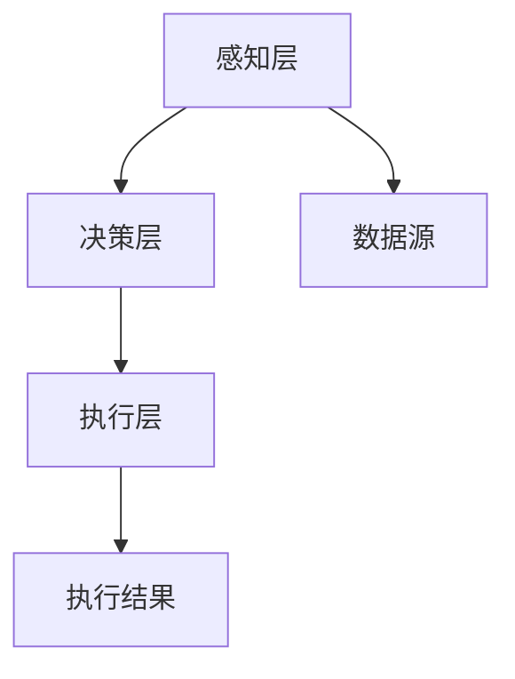
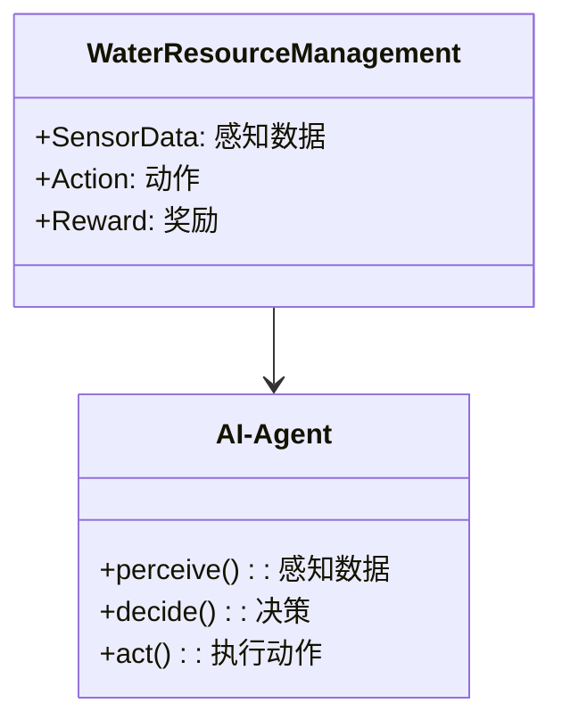
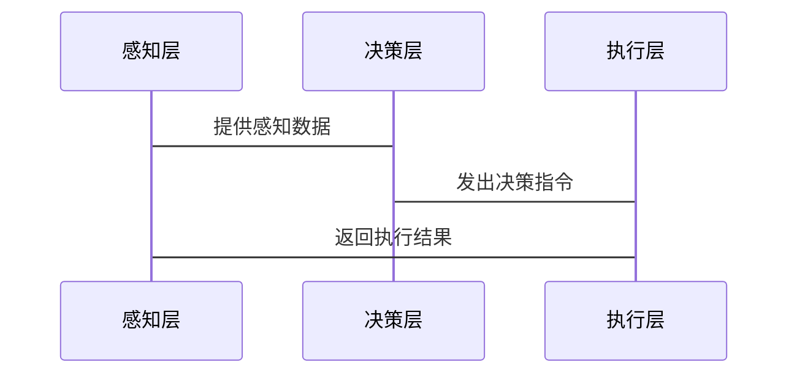

                 


# AI Agent在智能水资源管理系统中的实践

## 关键词：AI Agent, 智能水资源管理, 强化学习, 系统架构, 项目实战

## 摘要：  
本文详细探讨了AI Agent在智能水资源管理中的应用，从AI Agent的基本概念到其在水资源管理中的核心算法，再到系统的架构设计和实际项目实现，全面分析了如何利用AI技术提升水资源管理的智能化水平。文章内容包括AI Agent的核心原理、算法实现、系统架构设计、项目实战以及实际案例分析，旨在为读者提供一个全面的技术视角，帮助理解AI Agent在水资源管理中的实践价值和未来发展方向。

---

# 第1章: AI Agent与水资源管理概述

## 1.1 AI Agent的基本概念

### 1.1.1 AI Agent的定义与特点
AI Agent（人工智能代理）是指能够感知环境、自主决策并执行任务的智能体。它具有以下特点：
- **自主性**：能够在没有外部干预的情况下独立运行。
- **反应性**：能够实时感知环境变化并做出响应。
- **学习能力**：通过数据和经验不断优化自身的决策能力。
- **协作性**：能够与其他智能体或系统协同工作。

### 1.1.2 AI Agent的核心要素与分类
AI Agent的核心要素包括感知层、决策层和执行层。根据应用场景的不同，AI Agent可以分为以下几类：
- **简单反射型Agent**：基于预设规则进行简单响应。
- **基于模型的反射型Agent**：利用内部模型进行决策。
- **目标驱动型Agent**：以特定目标为导向进行行动。
- **实用驱动型Agent**：以效用函数为驱动，追求最优结果。

### 1.1.3 AI Agent与传统自动化的区别
AI Agent与传统自动化的主要区别在于：
- **自主性**：AI Agent具有自主决策能力，而传统自动化依赖于预设程序。
- **学习能力**：AI Agent能够通过学习优化自身行为，而传统自动化无法实现。
- **灵活性**：AI Agent能够适应复杂多变的环境，而传统自动化在面对未知情况时往往表现不佳。

## 1.2 智能水资源管理的背景与挑战

### 1.2.1 水资源管理的现状与问题
随着全球人口增长和气候变化的加剧，水资源短缺问题日益严重。传统的水资源管理方式存在以下问题：
- **数据不足**：缺乏实时、准确的水质和水量数据。
- **效率低下**：人工管理效率低，难以应对突发情况。
- **资源浪费**：水资源分配不合理，导致浪费。

### 1.2.2 AI技术在水资源管理中的应用潜力
AI技术在水资源管理中的应用潜力主要体现在以下几个方面：
- **实时监测**：通过传感器和AI算法，实时监测水质、水量等参数。
- **预测与优化**：利用机器学习模型预测水资源需求，优化分配策略。
- **智能调度**：通过AI Agent实现水资源的智能调度和应急响应。

### 1.2.3 智能水资源管理的目标与意义
智能水资源管理的目标是通过智能化手段实现水资源的高效利用和可持续管理。其意义在于：
- **提高水资源利用效率**：通过智能调度和优化分配，减少浪费。
- **增强应急响应能力**：快速发现并处理水质异常或泄漏等问题。
- **支持可持续发展**：通过智能化管理，实现水资源的可持续利用。

## 1.3 AI Agent在水资源管理中的应用价值

### 1.3.1 提高水资源利用效率
AI Agent可以通过实时监测和优化调度，提高水资源的利用效率。例如，通过预测降雨量和需水量，优化水库的蓄水和放水策略。

### 1.3.2 实现智能化监控与预警
AI Agent可以实时监控水质、水量等参数，并根据历史数据和模型预测，提前预警潜在的水质污染或水量短缺问题。

### 1.3.3 优化水资源分配与调度
AI Agent可以根据实时数据和需求变化，优化水资源的分配和调度策略，确保水资源的合理利用。

---

# 第2章: AI Agent与水资源管理的核心概念

## 2.1 AI Agent的核心原理

### 2.1.1 感知层: 数据采集与处理
AI Agent通过传感器和数据采集系统获取环境数据，如水质、水量、气象等信息。

### 2.1.2 决策层: 策略制定与优化
AI Agent利用机器学习算法（如强化学习）对感知到的数据进行分析，制定最优决策策略。

### 2.1.3 执行层: 动作输出与反馈
AI Agent根据决策层的指令，通过执行机构（如水泵、阀门）进行操作，并将执行结果反馈到感知层。

## 2.2 水资源管理中的关键问题

### 2.2.1 水资源供需平衡问题
通过AI Agent的预测和优化，实现水资源的供需平衡。

### 2.2.2 水污染与水质监测问题
通过实时监测和分析水质数据，及时发现并处理污染问题。

### 2.2.3 水资源分配与调度问题
通过AI Agent优化水资源的分配和调度策略，确保各区域的用水需求得到满足。

## 2.3 AI Agent在水资源管理中的系统架构

### 2.3.1 系统整体架构图


### 2.3.2 各模块功能说明
- **感知层**：负责数据的采集和初步处理。
- **决策层**：利用机器学习算法制定决策策略。
- **执行层**：根据决策层的指令执行具体操作。

### 2.3.3 系统边界与外延
系统边界包括感知层、决策层和执行层，外延部分则与数据源和执行结果相连。

---

# 第3章: AI Agent的核心算法原理

## 3.1 强化学习算法

### 3.1.1 Q-learning算法
Q-learning是一种常用的强化学习算法，其核心思想是通过更新Q值表来优化决策策略。数学模型如下：
$$ Q(s, a) = Q(s, a) + \alpha \cdot [r + \gamma \cdot \max Q(s', a') - Q(s, a)] $$
其中：
- \( s \)：当前状态
- \( a \)：当前动作
- \( r \)：奖励
- \( \alpha \)：学习率
- \( \gamma \)：折扣因子

### 3.1.2 多智能体强化学习
多智能体强化学习（MADRL）涉及多个智能体协同工作，通过分布式决策和协作优化实现全局最优。

### 3.1.3 算法的数学模型与公式
以下是一个简单的Q-learning实现示例：
```python
import numpy as np

class QLearning:
    def __init__(self, state_space, action_space, learning_rate=0.1, gamma=0.9):
        self.q_table = np.zeros((state_space, action_space))
        self.lr = learning_rate
        self.gamma = gamma

    def choose_action(self, state):
        return np.argmax(self.q_table[state])

    def update_q_table(self, state, action, reward, next_state):
        self.q_table[state][action] = self.q_table[state][action] + self.lr * (reward + self.gamma * np.max(self.q_table[next_state]) - self.q_table[state][action])
```

## 3.2 机器学习算法

### 3.2.1 监督学习与无监督
监督学习用于分类和回归任务，无监督学习用于聚类和降维任务。

### 3.2.2 算法实现与案例分析
以下是一个简单的线性回归实现：
```python
import numpy as np

class LinearRegression:
    def __init__(self, eta=0.05, n_iter=100):
        self.eta = eta
        self.n_iter = n_iter

    def fit(self, X, y):
        self.theta = np.zeros((X.shape[1], 1))
        self.theta = np.linalg.inv(X.T @ X) @ X.T @ y

    def predict(self, X):
        return X @ self.theta
```

---

# 第4章: AI Agent在水资源管理中的系统分析与架构设计

## 4.1 问题场景介绍
水资源管理中的典型问题包括水质监测、水量调度和污染预警。

## 4.2 系统功能设计

### 4.2.1 领域模型


### 4.2.2 系统架构设计


### 4.2.3 系统交互设计


## 4.3 系统接口设计
系统接口包括数据采集接口、决策接口和执行接口。

---

# 第5章: 项目实战

## 5.1 环境安装与配置
安装Python、TensorFlow、Keras等必要的库。

## 5.2 系统核心实现

### 5.2.1 数据采集与预处理
使用传感器采集水质数据，并进行数据清洗和特征提取。

### 5.2.2 模型训练与优化
利用强化学习算法训练AI Agent，并通过交叉验证优化模型参数。

## 5.3 案例分析与结果展示
通过实际案例展示AI Agent在水资源管理中的应用效果。

---

# 第6章: 总结与展望

## 6.1 项目总结
总结项目实现的关键点和经验教训。

## 6.2 未来展望
展望AI Agent在水资源管理中的未来发展方向，包括算法优化和应用场景扩展。

---

作者：AI天才研究院/AI Genius Institute & 禅与计算机程序设计艺术 /Zen And The Art of Computer Programming

