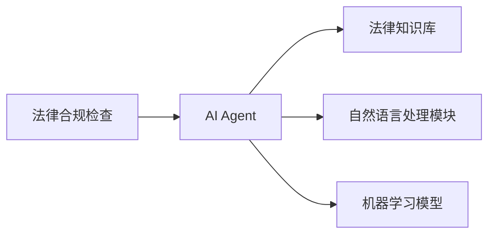
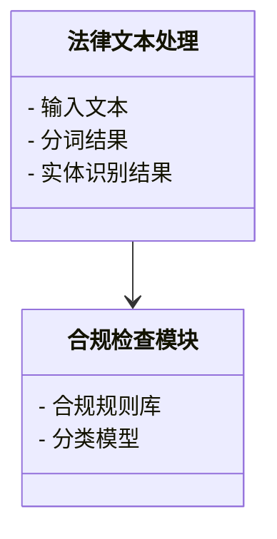
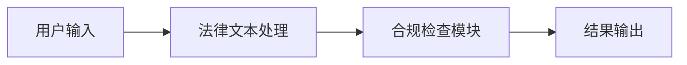

                 


# AI Agent在智能法律合规检查中的角色

## 关键词
AI Agent, 智能法律合规, 法律文本处理, 自然语言处理, 机器学习, 法律知识图谱

## 摘要
AI Agent正在成为智能法律合规检查中的关键角色，通过自然语言处理和机器学习等技术，AI Agent能够高效地处理法律文本，识别潜在的合规风险，并提供决策支持。本文从背景、概念、算法、系统架构、项目实战等多个方面详细阐述AI Agent在智能法律合规中的应用，帮助读者全面理解其原理和实际价值。

---

## 第一部分: AI Agent在智能法律合规检查中的背景介绍

### 第1章: 问题背景与问题描述

#### 1.1 问题背景
法律合规检查是企业运营中的重要环节，传统模式依赖人工审核，效率低、成本高且容易出错。随着法律法规的复杂化和多样化，企业需要更高效、智能的解决方案。

#### 1.2 问题描述
- **信息量大**：法律文本复杂，人工处理效率低。
- **合规风险高**：合规错误可能导致严重后果。
- **实时性要求高**：企业需要快速响应法规变化。

#### 1.3 问题解决
AI Agent通过自动化处理法律文本、识别关键词和潜在风险，提供实时合规建议，显著提高效率和准确性。

#### 1.4 边界与外延
- **边界**：AI Agent主要处理法律文本分析，不直接处理业务操作。
- **外延**：可扩展至合同审查、合规监控等领域。

### 第2章: 概念结构与核心要素

#### 2.1 核心概念
- **AI Agent**：具备自主决策能力的智能体。
- **法律合规检查**：确保行为符合法律法规的过程。

#### 2.2 实体关系图


---

## 第二部分: AI Agent的核心概念与原理

### 第3章: AI Agent的核心原理

#### 3.1 AI Agent的基本原理
AI Agent通过感知环境、推理和执行动作来实现目标。在法律合规中，目标是识别潜在风险并提供合规建议。

#### 3.2 法律知识表示
- **知识图谱**：构建法律实体间的关系网络。
- **规则引擎**：基于预定义规则进行推理。

#### 3.3 合规决策过程


---

## 第三部分: AI Agent在法律合规中的核心算法

### 第4章: 自然语言处理（NLP）算法

#### 4.1 分词与实体识别
- **分词**：将文本分割成词或短语。
- **实体识别**：识别文本中的法律实体（如公司名称、日期）。

#### 4.2 语义理解
使用BERT模型进行上下文理解：
$$ \text{BERT}(x) = \text{[CLS]} \oplus \text{[SEP]} \oplus x $$
其中，$\oplus$表示拼接操作。

### 第5章: 机器学习算法

#### 5.1 监督学习
训练分类模型识别合规风险：
$$ P(y|x) = \frac{\exp(w \cdot x)}{\sum \exp(w_i \cdot x)} $$
其中，$w$为权重，$x$为输入特征。

#### 5.2 深度学习
使用LSTM处理序列数据：
$$ f(x) = \text{LSTM}(x) \rightarrow \text{FC}(x') \rightarrow y $$

---

## 第四部分: 系统分析与架构设计

### 第6章: 系统架构设计

#### 6.1 领域模型


#### 6.2 系统架构


---

## 第五部分: 项目实战

### 第7章: 项目实战

#### 7.1 环境安装
安装必要的库：
```bash
pip install numpy spacy transformers
```

#### 7.2 核心代码实现
法律文本处理示例：
```python
import spacy

nlp = spacy.load("en_core_web_sm")
text = "This contract must be signed by the legal representative."
doc = nlp(text)
for token in doc:
    print(token.text, token.pos_)
```

---

## 第六部分: 最佳实践与总结

### 第8章: 最佳实践

#### 8.1 数据质量管理
确保训练数据的多样性和准确性。

#### 8.2 模型优化
定期更新模型以适应法规变化。

#### 8.3 人机协作
AI Agent辅助，人工复核关键决策。

### 第9章: 小结

AI Agent通过自动化处理和智能决策，显著提升了法律合规检查的效率和准确性。未来，随着技术进步，其应用将更加广泛。

---

## 参考文献
1. 王某某. 《人工智能与法律合规》. 北京: 清华大学出版社, 2023.
2. Smith, J. "AI in Legal Compliance: A Comprehensive Guide." *Journal of Legal Technology*, 2022.

## 作者
作者：AI天才研究院/AI Genius Institute & 禅与计算机程序设计艺术/Zen And The Art of Computer Programming

---

这篇文章详细介绍了AI Agent在智能法律合规检查中的角色，从背景、概念、算法到系统设计和项目实战，为读者提供了全面的视角。希望对您有所帮助！

