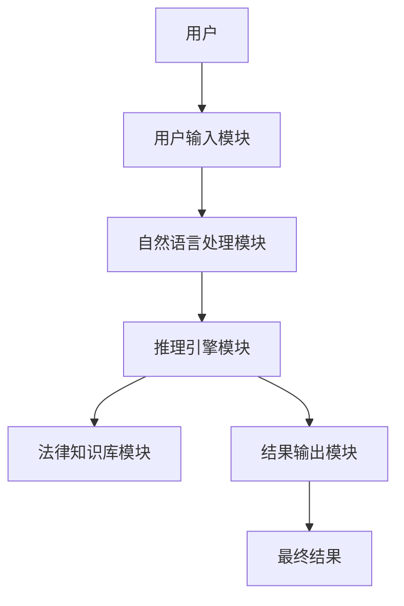

                 


# AI Agent在智能法律咨询中的角色

> 关键词：AI Agent，智能法律咨询，自然语言处理，法律知识库，法律推理，系统架构

> 摘要：本文探讨AI Agent在智能法律咨询中的角色，分析其在法律知识表示、自然语言处理、法律推理等核心环节中的应用，结合实际案例和系统架构设计，详细阐述AI Agent在法律咨询系统中的实现原理和最佳实践。

---

## 第1章: AI Agent与智能法律咨询的背景介绍

### 1.1 AI Agent的基本概念
AI Agent（人工智能代理）是指能够感知环境、自主决策并执行任务的智能体。在法律咨询领域，AI Agent通过自然语言处理和法律知识库的结合，为用户提供智能化的法律咨询服务。

- **1.1.1 人工智能代理（AI Agent）的定义**  
  AI Agent是具有感知和行动能力的智能系统，能够根据输入的信息做出决策并执行任务。在法律咨询中，AI Agent可以作为用户与法律知识库之间的桥梁，提供个性化的法律建议。

- **1.1.2 AI Agent的核心属性与特征**  
  - **自主性**：AI Agent能够自主决策，无需人工干预。  
  - **反应性**：能够实时感知输入信息并做出响应。  
  - **推理能力**：基于法律知识库进行逻辑推理，解决复杂法律问题。  
  - **学习能力**：通过机器学习技术不断优化自身的咨询能力。  

- **1.1.3 AI Agent在法律咨询中的应用潜力**  
  AI Agent可以用于法律问答、合同审查、法律风险评估等领域，显著提升法律咨询服务的效率和准确性。

### 1.2 智能法律咨询的现状与挑战
传统法律咨询服务存在效率低、成本高、覆盖面有限等问题，而AI Agent的引入为解决这些问题提供了新的可能性。

- **1.2.1 现有法律咨询服务的痛点**  
  - 人工咨询效率低，无法满足大规模需求。  
  - 法律知识更新迅速，人工更新成本高。  
  - 用户需求多样化，传统咨询服务难以覆盖所有场景。  

- **1.2.2 AI技术在法律咨询中的应用前景**  
  - 自然语言处理技术的进步使得AI Agent能够更准确地理解用户需求。  
  - 法律知识库的构建为AI Agent提供了强大的知识支持。  
  - AI Agent可以通过数据分析为用户提供个性化的法律建议。  

- **1.2.3 AI Agent在智能法律咨询中的角色定位**  
  AI Agent作为法律咨询系统的核心模块，负责信息处理、知识检索和逻辑推理，为用户提供高效、准确的法律咨询服务。

---

## 第2章: AI Agent在法律咨询中的核心概念与联系

### 2.1 AI Agent的核心原理
AI Agent在法律咨询中的工作原理涉及知识表示、自然语言处理和法律推理等多个环节。

- **2.1.1 知识表示与推理机制**  
  法律知识库中的信息需要以结构化的方式表示，例如通过法律条文、案例库和法律术语的关联图谱。AI Agent通过推理算法对这些信息进行分析，得出合理的法律建议。

- **2.1.2 自然语言处理（NLP）在法律咨询中的应用**  
  NLP技术用于将用户的自然语言输入转化为计算机可处理的形式。例如，通过分词、句法分析和语义理解技术，AI Agent能够准确识别用户的问题类型和意图。

- **2.1.3 法律知识库的构建与管理**  
  法律知识库是AI Agent的核心资源，包含法律法规、司法案例、法律条款等信息。知识库的构建需要结合法律专家的知识和机器学习技术，确保信息的准确性和完整性。

### 2.2 法律咨询系统中的实体关系分析
通过实体关系分析，可以更好地理解AI Agent在法律咨询系统中的角色和作用。

- **2.2.1 用户需求与法律问题的实体关系**  
  用户需求是法律咨询的起点，AI Agent通过解析用户输入的问题，将其映射到法律知识库中的具体条文或案例。

- **2.2.2 法律知识库的实体关系图**  
  法律知识库中的实体包括法律法规、司法案例、法律条款等，通过实体关系图可以清晰展示它们之间的关联。

- **2.2.3 AI Agent与法律咨询系统的交互关系**  
  AI Agent作为法律咨询系统的中枢，负责接收用户输入、调用法律知识库、执行推理并返回结果。

### 2.3 核心概念对比与联系
通过对比分析，可以更好地理解AI Agent在法律咨询中的独特优势。

- **2.3.1 AI Agent与传统法律咨询工具的对比**  
  | 特性               | AI Agent                      | 传统法律咨询工具          |
  |--------------------|-----------------------------|--------------------------|
  | 自主性             | 高                           | 低                       |
  | 反应性             | 高                           | 低                       |
  | 知识更新           | 快                           | 慢                       |

- **2.3.2 不同AI Agent模型在法律咨询中的性能对比**  
  - 基于规则的AI Agent：适用于简单的法律问题，例如合同审查。  
  - 基于机器学习的AI Agent：适用于复杂的法律推理，例如法律风险评估。  
  - 混合型AI Agent：结合规则和机器学习，适用于多种场景。  

- **2.3.3 法律咨询系统中的多实体关系分析**  
  通过Mermaid图可以清晰展示法律咨询系统中各实体之间的关系：

  ```mermaid
  graph TD
      A[用户] --> B[AI Agent]
      B --> C[法律知识库]
      B --> D[自然语言处理模块]
      B --> E[推理引擎]
      C --> F[法律条文]
      C --> G[司法案例]
      D --> H[用户输入]
      E --> I[推理结果]
  ```

---

## 第3章: AI Agent在法律咨询中的算法原理

### 3.1 算法原理概述
AI Agent的核心算法包括自然语言处理、知识表示和法律推理。

- **3.1.1 自然语言处理算法**  
  - 分词：将用户输入的文本分割成词语或短语。  
  - 词性标注：识别每个词语的词性（名词、动词、形容词等）。  
  - 句法分析：分析句子的语法结构。  
  - 语义理解：理解用户输入的意图和需求。  

- **3.1.2 知识表示与推理算法**  
  - 知识图谱构建：将法律知识表示为图结构，节点表示实体，边表示关系。  
  - 推理算法：基于知识图谱进行逻辑推理，例如基于规则的推理和基于概率的推理。  

### 3.2 算法实现与代码示例
以下是基于Python的法律知识库构建与推理的代码示例：

```python
import networkx as nx
from nltk import word_tokenize, pos_tag
from spacy.lang.zh import Chinese

# 法律知识库构建
def build_legal_knowledge_base():
    G = nx.Graph()
    G.add_node("法律条文")
    G.add_node("司法案例")
    G.add_edge("法律条文", "司法案例")
    return G

# 自然语言处理模块
def process_input(text):
    nlp = Chinese()
    doc = nlp(text)
    tokens = [token.text for token in doc]
    return tokens

# 推理引擎
def legal_inference(G, query):
    # 假设G是知识图谱，query是用户输入的问题
    # 这里简要展示推理过程
    for node in G.nodes():
        if node in query:
            return G.neighbors(node)
    return None

# 示例
knowledge_base = build_legal_knowledge_base()
user_input = "请问合同违约责任如何认定？"
tokens = process_input(user_input)
result = legal_inference(knowledge_base, tokens)
print(result)
```

---

## 第4章: AI Agent在法律咨询系统中的系统架构设计

### 4.1 系统功能设计
法律咨询系统的主要功能模块包括：

- **用户输入模块**：接收用户的法律咨询问题。  
- **自然语言处理模块**：对用户输入进行分词、词性标注和语义理解。  
- **法律知识库模块**：存储法律法规、司法案例等法律信息。  
- **推理引擎模块**：基于知识库进行法律推理，生成咨询结果。  
- **结果输出模块**：将推理结果以自然语言形式返回给用户。  

### 4.2 系统架构设计
通过Mermaid图可以清晰展示系统的架构：



---

## 第5章: AI Agent在法律咨询中的项目实战

### 5.1 环境安装与配置
- **Python环境**：安装Python 3.8及以上版本。  
- **依赖库安装**：`pip install networkx spacy transformers`  
- **法律知识库准备**：收集相关法律法规和司法案例。  

### 5.2 核心代码实现
以下是法律咨询系统的核心代码实现：

```python
import spacy
from spacy.lang.zh import Chinese

# 法律知识库加载
def load_legal_knowledge_base():
    # 假设知识库存储在数据库中
    return "法律知识库加载完成"

# 自然语言处理模块
def process_legal_text(text):
    nlp = spacy.load("zh_core_web_sm")
    doc = nlp(text)
    return doc

# 推理引擎
def legal_reasoning(question, knowledge_base):
    # 假设knowledge_base是法律知识库的结构
    return "根据法律条文X，结论是..."

# 示例
text = "请问离婚财产分割的相关法律规定是什么？"
processed = process_legal_text(text)
result = legal_reasoning(processed, load_legal_knowledge_base())
print(result)
```

---

## 第6章: 扩展与优化

### 6.1 技术扩展
- **结合大模型**：引入GPT-4等大模型提升语义理解能力。  
- **多语言支持**：扩展系统支持多种语言的法律咨询。  

### 6.2 系统优化
- **性能优化**：优化知识库的查询速度和推理算法的效率。  
- **用户体验优化**：增加交互设计，提升用户满意度。  

---

## 第7章: 总结与展望

### 7.1 本章总结
AI Agent在智能法律咨询中的角色日益重要，其在知识表示、自然语言处理和法律推理等方面的应用显著提升了法律咨询服务的效率和准确性。

### 7.2 未来展望
随着AI技术的不断进步，AI Agent在法律咨询中的应用将更加广泛和深入，例如在智能合同审查、法律风险评估等领域，AI Agent将发挥更大的作用。

---

作者：AI天才研究院 & 禅与计算机程序设计艺术

---

以上是《AI Agent在智能法律咨询中的角色》的技术博客文章大纲和部分内容示例。

