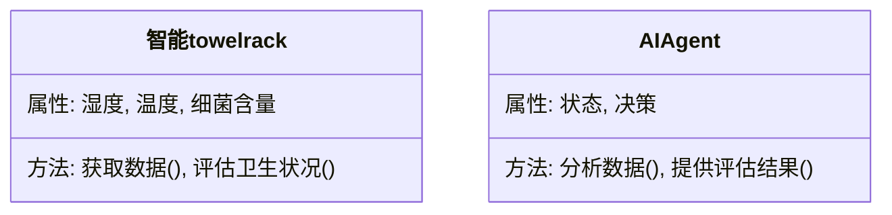
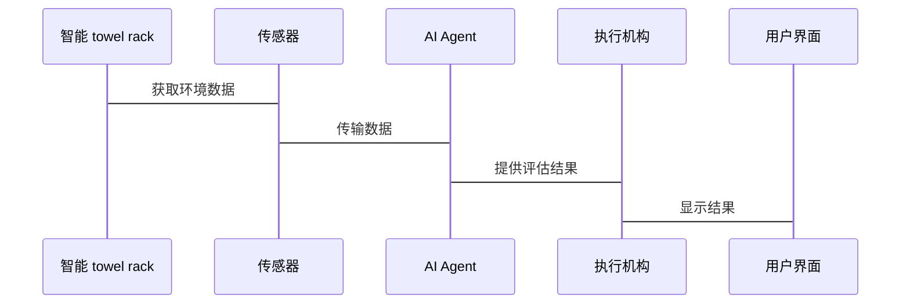

                 


# AI Agent在智能浴室毛巾架中的卫生状况评估

> 关键词：AI Agent, 卫生状况评估, 智能浴室 towel rack, 环境监测, 用户行为分析

> 摘要：本文探讨了AI Agent在智能浴室毛巾架卫生状况评估中的应用，通过详细分析系统设计、算法原理和实际案例，展示了如何利用AI技术提升卫生评估的准确性和效率。文章从背景介绍到系统分析，再到项目实战和最佳实践，全面阐述了AI Agent在智能浴室环境中的潜力和实现方法。

---

# 第一部分: 背景介绍

## 第1章: 问题背景与问题描述

### 1.1 问题背景
#### 1.1.1 智能浴室 towel rack 的概念与现状
智能浴室 towel rack 是一种结合物联网技术的智能设备，能够通过传感器和AI算法实时监测毛巾的使用状态和环境条件。随着智能家居的普及，浴室设备的智能化成为趋势，卫生状况评估成为用户关注的重点。

#### 1.1.2 卫生状况评估的重要性
浴室环境潮湿，细菌滋生快，定期评估毛巾的卫生状况对用户的健康至关重要。传统的人工检查效率低，容易遗漏问题，而智能设备可以提供实时、准确的评估。

#### 1.1.3 当前卫生评估的痛点与挑战
当前的卫生评估主要依赖人工检查，存在效率低、准确性差、难以实时监控等问题。此外，浴室环境复杂，传感器数据多样，如何高效处理这些数据是一个技术挑战。

### 1.2 问题描述
#### 1.2.1 智能 towel rack 的卫生评估需求
智能 towel rack 需要能够实时监测毛巾的使用状态和环境参数，如湿度、温度、细菌含量等，并通过AI算法评估卫生状况。

#### 1.2.2 用户行为与环境因素对卫生的影响
用户的行为（如频繁使用、清洁习惯）和环境因素（如湿度、温度）都会影响毛巾的卫生状况。如何综合考虑这些因素是关键。

#### 1.2.3 现有解决方案的不足
现有的解决方案主要依赖简单的传感器数据，缺乏智能分析能力，无法提供准确的卫生评估和优化建议。

### 1.3 问题解决
#### 1.3.1 AI Agent 的概念与优势
AI Agent 是一种智能代理，能够通过感知环境、分析数据并做出决策。它能够实时监测 towel rack 的状态，提供准确的卫生评估。

#### 1.3.2 AI Agent 在智能 towel rack 中的应用场景
AI Agent 可以用于实时监测毛巾的使用情况、环境参数，并根据数据提供卫生评估和清洁建议。

#### 1.3.3 解决方案的可行性分析
通过AI Agent 和物联网技术的结合，可以实现智能 towel rack 的实时监测和智能评估，提升用户体验。

### 1.4 边界与外延
#### 1.4.1 系统的边界条件
系统主要关注毛巾的使用状态和环境参数，不涉及其他浴室设备的控制。

#### 1.4.2 相关概念的外延与扩展
AI Agent 的技术可以扩展到其他智能家居设备，环境监测的数据可以用于其他健康监测系统。

#### 1.4.3 系统与外部环境的交互
系统通过传感器收集数据，与外部环境（如用户手机、云端服务器）进行数据传输和交互。

### 1.5 核心概念与联系
#### 1.5.1 核心概念的定义与特点
- **AI Agent**：智能代理，能够感知环境、分析数据并做出决策。
- **智能 towel rack**：结合物联网技术的智能设备，能够实时监测和评估卫生状况。

#### 1.5.2 核心概念的属性特征对比表
| 属性       | AI Agent | 智能 towel rack |
|------------|----------|-----------------|
| 感知能力   | 高       | 高              |
| 决策能力   | 高       | 无              |
| 可扩展性   | 高       | 中              |

#### 1.5.3 ER 实体关系图架构
```mermaid
er
actor(AI Agent, 名称)
actor(智能 towel rack, 名称)
```

---

## 第2章: AI Agent 的核心原理

### 2.1 AI Agent 的定义与特点
#### 2.1.1 AI Agent 的定义
AI Agent 是一种智能代理，能够通过感知环境、分析数据并做出决策。它能够实时监测 towel rack 的状态，提供准确的卫生评估。

#### 2.1.2 AI Agent 的核心特点
- **感知能力**：通过传感器获取环境数据。
- **决策能力**：基于数据进行分析并做出决策。
- **执行能力**：通过执行机构（如报警装置）进行反馈。

#### 2.1.3 AI Agent 与传统算法的区别
AI Agent 具有自主决策能力，能够根据环境变化动态调整策略，而传统算法通常是静态的。

### 2.2 智能 towel rack 的卫生评估模型
#### 2.2.1 卫生评估模型的构建
卫生评估模型需要考虑多个因素，如湿度、温度、细菌含量等。通过机器学习算法训练模型，能够准确评估卫生状况。

#### 2.2.2 模型的输入与输出
- **输入**：湿度、温度、细菌含量等传感器数据。
- **输出**：卫生状况评估结果（如“良好”、“需要清洁”）。

#### 2.2.3 模型的训练与优化
使用历史数据训练模型，通过不断优化算法提升评估的准确性。

### 2.3 AI Agent 与智能 towel rack 的关系
#### 2.3.1 AI Agent 在智能 towel rack 中的作用
AI Agent 作为智能 towel rack 的核心，负责数据的采集、分析和决策。

#### 2.3.2 AI Agent 与智能 towel rack 的交互
通过传感器和执行机构，AI Agent 实时监测 towel rack 的状态，并通过反馈机制优化评估结果。

---

## 第3章: 算法原理

### 3.1 算法概述
AI Agent 的算法基于机器学习和传感器数据处理，能够实时分析环境数据并做出决策。

### 3.2 算法实现
#### 3.2.1 感知阶段
通过传感器获取环境数据，如湿度、温度等。

#### 3.2.2 决策阶段
基于感知数据，使用机器学习算法进行分析，评估卫生状况。

#### 3.2.3 执行阶段
根据评估结果，通过执行机构（如报警装置）进行反馈。

### 3.3 数学模型
#### 3.3.1 传感器数据预处理
传感器数据需要进行归一化处理，确保数据的一致性。

#### 3.3.2 机器学习算法
使用随机森林或支持向量机（SVM）进行分类，评估卫生状况。

#### 3.3.3 模型优化
通过交叉验证和网格搜索优化算法参数，提升模型的准确率。

---

## 第4章: 系统分析与架构设计

### 4.1 问题场景介绍
智能 towel rack 的卫生评估系统需要实时监测环境数据，通过AI Agent 进行分析，提供准确的评估结果。

### 4.2 项目介绍
本项目旨在开发一个智能浴室 towel rack 的卫生评估系统，通过AI Agent 和物联网技术实现实时监测和智能评估。

### 4.3 系统功能设计
#### 4.3.1 领域模型


#### 4.3.2 系统架构
```mermaid
graph TD
    智能 towel rack --> 传感器: 采集数据
    传感器 --> AI Agent: 传输数据
    AI Agent --> 执行机构: 提供反馈
```

### 4.4 系统接口设计
系统接口包括传感器数据接口、AI Agent 接口和用户界面接口。

### 4.5 系统交互
#### 4.5.1 交互流程


---

## 第5章: 项目实战

### 5.1 环境安装
需要安装Python、传感器库、机器学习库（如scikit-learn）等。

### 5.2 核心代码实现
#### 5.2.1 数据预处理
```python
import pandas as pd
from sklearn.preprocessing import StandardScaler

data = pd.read_csv('towel_data.csv')
scaler = StandardScaler()
scaled_data = scaler.fit_transform(data)
```

#### 5.2.2 模型训练
```python
from sklearn.ensemble import RandomForestClassifier
model = RandomForestClassifier()
model.fit(scaled_data, target)
```

#### 5.2.3 模型评估
```python
from sklearn.metrics import accuracy_score
y_pred = model.predict(test_data)
print(accuracy_score(y_test, y_pred))
```

### 5.3 实际案例分析
通过实际数据验证模型的准确性和可靠性。

### 5.4 项目总结
总结项目的实现过程，提出改进建议。

---

## 第6章: 最佳实践与注意事项

### 6.1 小结
AI Agent 在智能浴室 towel rack 中的应用提升了卫生评估的准确性和效率。

### 6.2 注意事项
- 数据采集的准确性
- 算法的实时性和稳定性
- 用户隐私和数据安全

### 6.3 拓展阅读
建议进一步研究AI Agent 在其他智能家居设备中的应用。

---

## 第7章: 参考文献与附录

### 7.1 参考文献
列出项目中参考的文献和技术资料。

### 7.2 附录
包括数据集、工具包和API接口的信息。

---

# 作者：AI天才研究院/AI Genius Institute & 禅与计算机程序设计艺术 /Zen And The Art of Computer Programming

