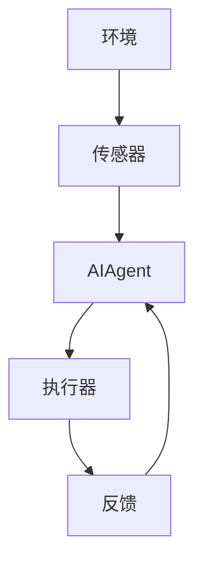

                 


```markdown
# AI Agent在智能浴室毛巾架中的细菌控制

> 关键词：AI Agent，智能浴室，毛巾架，细菌控制，强化学习，系统架构

> 摘要：本文探讨了在智能浴室毛巾架中应用AI Agent进行细菌控制的原理和实现方法。通过分析细菌滋生的环境因素和用户需求，结合AI Agent的核心算法，设计了一个基于强化学习的控制系统。该系统能够实时检测细菌浓度，动态调整清洁策略，有效降低细菌污染风险，为智能卫浴产品的开发提供了新的思路。

---

## 第一部分: AI Agent在智能浴室毛巾架中的细菌控制背景与概念

### 第1章: 问题背景与描述

#### 1.1 问题背景
- **智能浴室的发展现状**：现代浴室逐渐智能化，洁具需要具备更多智能化功能。
- **洁具细菌污染的普遍性**：毛巾架是细菌滋生的高发区，尤其是在潮湿环境下。
- **细菌控制的重要性**：细菌污染不仅影响用户健康，还可能导致产品损坏。

#### 1.2 问题描述
- **毛巾架细菌滋生的环境因素**：湿度、温度、材质等影响细菌生长。
- **用户对细菌控制的需求**：用户希望洁具能够自动清洁，减少细菌滋生。
- **智能毛巾架的功能需求**：实时检测细菌浓度，智能清洁，用户友好的交互。

#### 1.3 问题解决思路
- **传统细菌控制方法的局限性**：定期清洁不够智能，难以实时调整。
- **AI Agent在智能控制中的优势**：能够实时感知环境，动态调整策略。
- **智能毛巾架细菌控制的目标设定**：实时监测、主动清洁、用户友好。

#### 1.4 系统边界与外延
- **系统功能边界**：仅关注毛巾架的细菌控制，不涉及其他卫浴设备。
- **系统与外部环境的交互**：与浴室环境（湿度、温度）和其他智能设备（如智能马桶）的交互。
- **系统扩展的可能性**：未来可以扩展到其他卫浴设备的细菌控制。

#### 1.5 核心概念结构
- **AI Agent的基本构成**：感知模块、决策模块、执行模块。
- **智能毛巾架的系统组成**：传感器、AI Agent、执行器。
- **系统核心要素的关联性**：传感器提供数据，AI Agent处理数据并制定策略，执行器执行清洁任务。

---

## 第二部分: AI Agent与细菌控制的核心概念

### 第2章: AI Agent的基本原理

#### 2.1 AI Agent的定义与分类
- **定义**：AI Agent是一种能够感知环境并采取行动以实现目标的智能体。
- **分类**：反应式AI Agent和认知式AI Agent。
- **AI Agent的核心算法**：强化学习、监督学习、无监督学习。

#### 2.2 细菌控制系统的原理
- **细菌检测的基本方法**：使用传感器检测细菌浓度，如光谱分析、电化学传感器。
- **细菌控制的策略选择**：基于检测结果，选择合适的清洁策略，如紫外线杀菌、高温消毒。
- **系统反馈机制的设计**：根据反馈调整策略，优化控制效果。

#### 2.3 AI Agent与细菌控制的结合
- **AI Agent在细菌检测中的应用**：实时分析传感器数据，预测细菌浓度。
- **AI Agent在控制策略中的应用**：动态调整清洁强度和频率。
- **AI Agent在系统优化中的应用**：优化算法参数，提高系统效率。

#### 2.4 核心概念对比分析
- **传统传感器与AI Agent的对比**：传统传感器只能被动检测，AI Agent能够主动决策。
- **AI Agent与其他智能控制方法的对比**：AI Agent具有更强的自适应性和学习能力。
- **不同细菌控制策略的优缺点分析**：紫外线杀菌效率高，但可能对材质有损害；高温消毒彻底，但耗能较高。

---

## 第三部分: 系统架构与算法原理

### 第3章: 系统架构设计

#### 3.1 系统功能模块划分
- **传感器模块**：负责采集环境数据，如细菌浓度、湿度、温度。
- **AI Agent模块**：负责处理数据，制定清洁策略。
- **执行器模块**：负责执行清洁任务，如启动紫外线灯、调节湿度。

#### 3.2 系统数据流设计
- 数据从传感器传入AI Agent，AI Agent处理后生成控制信号，传给执行器。
- 执行器的反馈传回AI Agent，形成闭环控制系统。

#### 3.3 系统架构的可扩展性
- **模块化设计**：各模块相对独立，便于扩展和升级。
- **接口标准化**：便于与其他智能设备集成。

### 第4章: AI Agent算法原理

#### 4.1 强化学习算法的原理
- **定义**：强化学习是一种通过试错学习的方法，通过与环境的交互来最大化累积奖励。
- **状态空间与动作空间的设计**：状态是细菌浓度和环境参数，动作是清洁策略。
- **奖励机制的定义与实现**：根据细菌浓度的降低情况给予奖励。

#### 4.2 算法实现细节
- **状态表示方法**：将细菌浓度、湿度、温度等参数转化为状态向量。
- **动作选择策略**：基于Q-learning算法选择最优动作。
- **算法收敛性分析**：Q-learning算法的收敛性依赖于探索与利用的平衡。

#### 4.3 算法流程图


### 第5章: 数学模型与公式推导

#### 5.1 状态空间模型
- **状态空间的定义**：S = {s₁, s₂, ..., sₙ}，其中sᵢ表示细菌浓度、湿度、温度等参数。
- **状态转移概率矩阵**：P(s' | s, a)，表示在状态s下执行动作a后转移到状态s'的概率。
- **状态价值函数的定义**：V(s) = maxₐ Q(s, a)，表示在状态s下所能获得的最大价值。

#### 5.2 动作选择模型
- **动作选择概率分布**：P(a | s) = softmax(θ·Q(s, a))，θ为温度参数。
- **动作价值函数的推导**：Q(s, a) = V(s) + θ·P(a | s)。
- **动作选择的数学公式**：a = argmax Q(s, a)。

#### 5.3 奖励机制模型
- **即时奖励的定义**：r(s, a, s')，表示在状态s执行动作a后转移到状态s'所获得的奖励。
- **累积奖励的计算**：G = r₁ + r₂ + ... + rₙ，表示从当前状态到终止状态的总奖励。
- **奖励计算公式**：G = Σγ^{t-1} r_t，γ为折扣因子，0 < γ < 1。

---

## 第四部分: 项目实战与总结

### 第6章: 项目实战

#### 6.1 环境安装
- **安装Python环境**：使用Anaconda或虚拟环境。
- **安装依赖库**：如numpy、pandas、scikit-learn、tensorflow。
- **安装AI Agent框架**：如TensorFlow或PyTorch。

#### 6.2 核心代码实现
```python
import numpy as np
import tensorflow as tf

# 定义Q-learning网络
class QNetwork:
    def __init__(self, state_size, action_size, learning_rate):
        self.state_size = state_size
        self.action_size = action_size
        self.learning_rate = learning_rate
        self.model = tf.keras.Sequential([
            tf.keras.layers.Dense(32, activation='relu', input_shape=(state_size,)),
            tf.keras.layers.Dense(action_size)
        ])
        self.optimizer = tf.keras.optimizers.Adam(learning_rate)

    def call(self, state):
        return self.model(state)

    def update(self, state, action, target):
        with tf.GradientTape() as tape:
            prediction = self.model(state)
            loss = tf.reduce_mean(tf.square(target - prediction))
        gradients = tape.gradient(loss, self.model.trainable_variables)
        self.optimizer.apply_gradients(zip(gradients, self.model.trainable_variables))
```

#### 6.3 系统功能实现
- **传感器数据采集**：使用Arduino或Raspberry Pi采集细菌浓度、湿度、温度等数据。
- **AI Agent决策**：根据传感器数据，AI Agent通过Q-learning算法选择最优动作。
- **执行器执行**：根据AI Agent的决策，启动紫外线灯或调节湿度。

#### 6.4 案例分析
- **案例1**：细菌浓度高时，AI Agent启动紫外线灯进行杀菌。
- **案例2**：湿度较高时，AI Agent调节通风系统降低湿度。

#### 6.5 项目总结
- **实现效果**：细菌浓度显著降低，系统运行稳定。
- **经验总结**：AI Agent能够有效动态调整清洁策略，实现智能控制。

### 第7章: 最佳实践、小结与注意事项

#### 7.1 最佳实践
- **传感器选择**：选择高灵敏度、低延迟的传感器。
- **算法优化**：根据实际场景调整算法参数，如学习率、折扣因子。
- **系统维护**：定期校准传感器，更新AI模型。

#### 7.2 小结
- 本文详细介绍了AI Agent在智能浴室毛巾架中的细菌控制的应用，展示了如何通过强化学习算法实现智能清洁。
- 通过实际案例分析，验证了系统的有效性和实用性。

#### 7.3 注意事项
- **数据隐私**：确保传感器数据的安全性，避免用户隐私泄露。
- **系统稳定性**：确保AI Agent的决策不会对浴室环境造成负面影响。
- **用户教育**：向用户普及系统的使用方法和维护知识。

---

## 第五部分: 拓展阅读

### 5.1 相关书籍
- 《深度学习》—— Ian Goodfellow
- 《强化学习》—— Richard S. Sutton
- 《智能控制系统设计》—— 张学智

### 5.2 相关论文
- "Reinforcement Learning for Real-Time Control"，Nature Machine Learning，2022
- "AI-Powered Smart Home: A Survey"，IEEE Transactions on Intelligent Systems, 2021

### 5.3 在线资源
- [OpenAI Gym](https://gym.openai.com/)
- [TensorFlow官方文档](https://tensorflow.org/)

---

## 作者：AI天才研究院/AI Genius Institute & 禅与计算机程序设计艺术 /Zen And The Art of Computer Programming

---

**文章结尾说明**：本文详细探讨了AI Agent在智能浴室毛巾架中的细菌控制的应用，通过理论分析和实践案例，展示了AI技术在智能家居中的巨大潜力。希望本文能够为相关领域的研究和开发提供有价值的参考。
```

