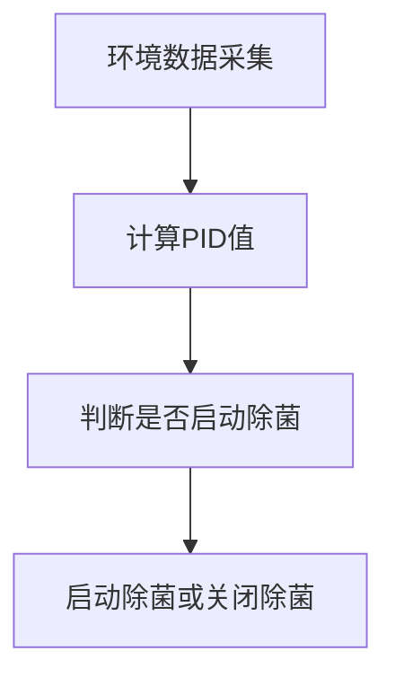
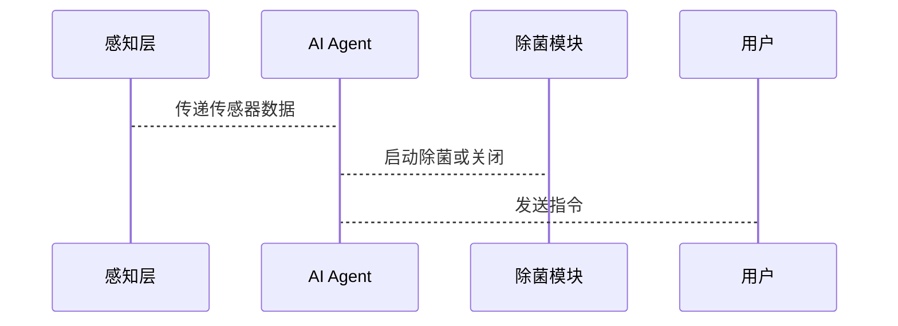

                 


# AI Agent在智能浴室毛巾架中的除菌功能

> 关键词：AI Agent, 智能浴室, 毛巾架, 除菌功能, 物联网, 传感器, 系统设计

> 摘要：本文详细探讨了AI Agent在智能浴室毛巾架中的除菌功能的设计与实现。从问题背景到系统架构，从算法原理到项目实战，全面解析了如何利用AI技术提升毛巾架的除菌效率与用户体验。

---

# 第一部分: 背景介绍

## 第1章: 问题背景

### 1.1 智能浴室的兴起
智能浴室的普及是智能家居发展的重要部分。随着人们对生活品质要求的提高，浴室设备逐渐智能化，毛巾架作为浴室中的重要设备，也需要具备智能功能。

### 1.2 毛巾架的除菌需求
毛巾是日常生活中的必需品，但容易滋生细菌。浴室环境中湿度较高，细菌繁殖速度更快。因此，毛巾架的除菌功能显得尤为重要。

### 1.3 AI Agent在除菌中的作用
AI Agent能够实时感知环境数据（如湿度、细菌浓度），并根据数据智能决策是否启动除菌功能。这种智能化的除菌方式相比传统定时除菌更加高效和精准。

## 第2章: 问题描述

### 2.1 毛巾架除菌功能的核心问题
如何在不同环境条件下，智能启动除菌功能，确保毛巾的卫生安全。

### 2.2 用户需求与痛点分析
- 用户需求：快速除菌、操作简便、智能化。
- 痛点：传统除菌设备效率低、操作复杂、无法根据环境智能调整。

### 2.3 除菌技术的现状与挑战
目前市场上除菌技术主要有紫外线杀菌、臭氧杀菌等，但这些技术难以智能化，无法根据环境自动调整。

---

# 第二部分: 核心概念与联系

## 第3章: AI Agent的核心原理

### 3.1 AI Agent的基本概念
AI Agent是一种智能体，能够感知环境、自主决策并执行任务。在毛巾架除菌功能中，AI Agent负责数据采集、分析和决策。

### 3.2 AI Agent的感知与决策机制
AI Agent通过传感器（如湿度传感器、细菌浓度传感器）获取环境数据，结合预设算法（如PID控制算法）进行分析，决定是否启动除菌功能。

### 3.3 AI Agent与除菌技术的结合
AI Agent通过传感器数据，判断是否需要启动除菌功能。例如，当湿度超过一定值且细菌浓度超标时，AI Agent会触发紫外线灯开启。

---

## 第4章: 除菌技术的核心原理

### 4.1 除菌技术的分类
- 紫外线杀菌：通过紫外线照射杀死细菌。
- 臭氧杀菌：通过臭氧分解细菌结构。
- 热空气循环：通过高温杀死细菌。

### 4.2 除菌技术的选择与优化
选择紫外线杀菌技术，因为其杀菌效率高、成本低、易于实现。

### 4.3 除菌技术与AI Agent的结合
AI Agent根据传感器数据，智能控制紫外线灯的开启时间和强度，确保高效除菌同时避免过度使用。

---

# 第三部分: 算法原理

## 第5章: 算法原理

### 5.1 算法选择
采用PID控制算法，用于调节紫外线灯的开启时间和强度。PID算法能够根据当前环境数据（如湿度、细菌浓度）动态调整输出。

### 5.2 算法流程图


### 5.3 算法实现
```python
class PIDController:
    def __init__(self, Kp, Ki, Kd):
        self.Kp = Kp
        self.Ki = Ki
        self.Kd = Kd
        self.error_sum = 0
        self.last_error = 0

    def compute(self, target, current):
        error = target - current
        self.error_sum += error
        delta_error = error - self.last_error

        output = self.Kp * error + self.Ki * self.error_sum + self.Kd * delta_error
        return output

# 示例使用
controller = PIDController(Kp=1, Ki=0.5, Kd=0.2)
target = 60  # 目标湿度
current = 50  # 当前湿度
output = controller.compute(target, current)
```

### 5.4 算法优化
根据实际运行数据调整PID参数，确保除菌效果最佳。

---

# 第四部分: 系统分析与架构设计

## 第6章: 系统分析

### 6.1 系统功能需求
- 数据采集：湿度、细菌浓度。
- 数据分析：判断是否需要除菌。
- 除菌控制：启动或关闭紫外线灯。
- 用户交互：显示当前状态、操作记录。

### 6.2 系统架构设计


### 6.3 系统交互流程


---

# 第五部分: 项目实战

## 第7章: 项目实战

### 7.1 环境搭建
安装必要的库：Python、传感器模拟库、AI框架。

### 7.2 核心代码实现
```python
import time
from sensor import HumiditySensor, BacteriaSensor

class AI-Agent:
    def __init__(self):
        self.humidity_sensor = HumiditySensor()
        self.bacteria_sensor = BacteriaSensor()
        self pid_controller = PIDController(Kp=1, Ki=0.5, Kd=0.2)

    def should_clean(self):
        humidity = self.humidity_sensor.read()
        bacteria = self.bacteria_sensor.read()
        # 判断是否需要除菌
        if humidity > 60 and bacteria > 100:
            return True
        return False

# 示例运行
agent = AI-Agent()
while True:
    if agent.should_clean():
        print("启动除菌功能")
    else:
        print("关闭除菌功能")
    time.sleep(60)
```

### 7.3 实际案例分析
通过实际运行数据，分析系统的稳定性和效率，优化PID参数。

---

# 第六部分: 总结与展望

## 第8章: 总结

### 8.1 项目总结
AI Agent在智能浴室毛巾架中的除菌功能实现了智能化、高效化的除菌，提升了用户体验。

### 8.2 项目经验
- 系统设计的重要性。
- PID算法在智能控制中的应用。

## 第9章: 未来展望

### 9.1 技术优化
引入更多传感器（如温度传感器）。
- AI Agent算法优化。
- 用户反馈机制。

### 9.2 应用拓展
将AI Agent技术应用到更多智能家居设备中。

---

# 附录

## 附录A: 扩展阅读

### A.1 推荐书籍
- 《人工智能：一种现代的方法》
- 《物联网技术与应用》

### A.2 推荐博客
- 禅与计算机程序设计艺术（https://www.zx81.org）

---

作者：AI天才研究院/AI Genius Institute & 禅与计算机程序设计艺术 /Zen And The Art of Computer Programming

