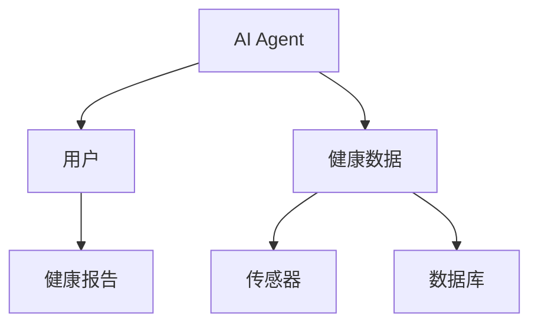
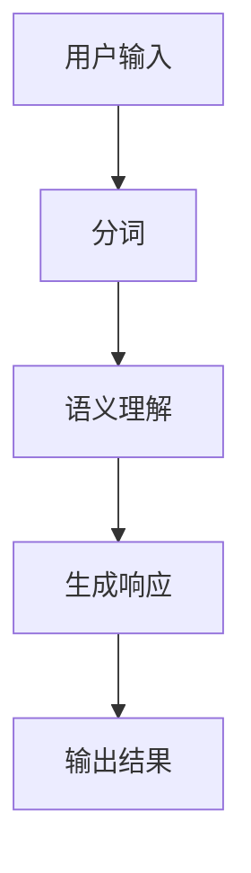
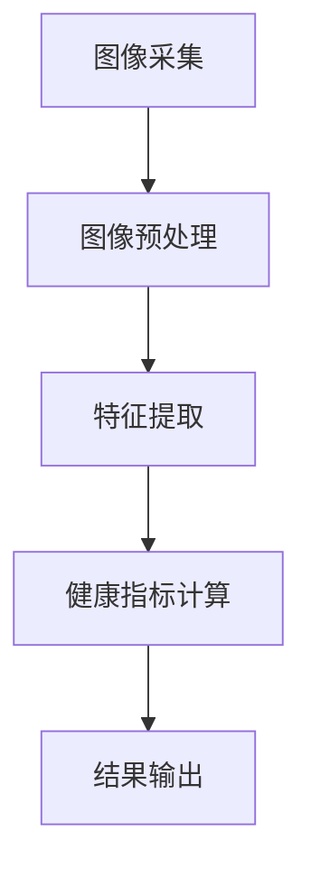

                 

# AI Agent在智能浴室镜中的每日健康检查

> 关键词：AI Agent, 智能浴室镜, 健康检查, 计算机视觉, 自然语言处理, 健康管理

> 摘要：本文探讨了AI Agent在智能浴室镜中的应用，详细介绍了其在每日健康检查中的作用，包括算法原理、系统架构设计、项目实现和实际案例分析。

## 第1章 背景介绍

### 1.1 问题背景

#### 1.1.1 智能浴室镜的发展现状
智能浴室镜已从基础的镜面显示扩展到集成健康监测的功能，成为智能家居的重要组成部分。

#### 1.1.2 健康检查的必要性
健康检查是早期发现问题的关键，尤其是每天的监测，帮助用户及时调整生活方式。

#### 1.1.3 AI Agent在健康监测中的作用
AI Agent通过分析用户数据，提供个性化建议，提升健康管理水平。

### 1.2 问题描述

#### 1.2.1 智能浴室镜的功能需求
需要集成健康监测功能，如体重、体脂监测，皮肤状态分析等。

#### 1.2.2 用户健康数据的采集与分析
通过传感器和AI算法，实时采集并分析用户健康数据。

#### 1.2.3 AI Agent在健康检查中的具体任务
处理健康数据，提供健康建议，与健康管理系统交互。

### 1.3 问题解决

#### 1.3.1 AI Agent的核心功能
数据采集、分析、反馈和系统集成。

#### 1.3.2 智能浴室镜的硬件与软件结合
传感器采集数据，AI算法处理，显示结果。

#### 1.3.3 用户数据的安全与隐私保护
采用加密技术和访问控制，确保数据安全。

### 1.4 边界与外延

#### 1.4.1 智能浴室镜的功能边界
专注于健康监测，不涉及医疗诊断。

#### 1.4.2 AI Agent的应用范围
健康数据监测和管理，不处理医疗数据。

#### 1.4.3 与健康管理系统的集成
通过API接口，将数据传输至健康管理系统。

### 1.5 核心概念

#### 1.5.1 AI Agent的定义与特征
AI Agent是智能系统，能执行任务，与用户交互，具有学习能力。

#### 1.5.2 智能浴室镜的功能模块
镜面显示、健康监测、数据存储、用户界面。

#### 1.5.3 用户健康数据的分类与处理
分类为体重、体脂、皮肤状况等，进行清洗和分析。

## 第2章 核心概念与联系

### 2.1 AI Agent的核心原理

#### 2.1.1 自然语言处理（NLP）在AI Agent中的应用
用户提问，AI Agent理解并生成回答，涉及分词、语义理解和生成。

#### 2.1.2 计算机视觉（CV）在健康数据采集中的作用
图像处理、特征提取和健康指标计算。

### 2.2 核心概念对比

#### 2.2.1 AI Agent与传统智能设备的对比
AI Agent具备自主决策能力，传统设备仅执行预设任务。

#### 2.2.2 智能浴室镜与普通镜子的功能对比
智能镜具备健康监测功能，普通镜仅反射图像。

#### 2.2.3 用户健康数据与传统医疗数据的差异
实时性、非侵入性和连续性。

### 2.3 ER实体关系图

## 第3章 算法原理讲解

### 3.1 AI Agent的核心算法

#### 3.1.1 自然语言处理流程

#### 3.1.2 计算机视觉流程

### 3.2 数学模型与公式

#### 3.2.1 健康指数计算模型

$$健康指数 = \alpha \times 体重 + \beta \times 身高 + \gamma \times 其他因素$$

#### 3.2.2 机器学习模型

$$y = w_1x_1 + w_2x_2 + ... + w_nx_n + b$$

---

通过以上章节的详细阐述，本文系统地介绍了AI Agent在智能浴室镜中的应用，从背景到算法，再到系统设计和项目实现，为读者提供了全面的技术视角。

