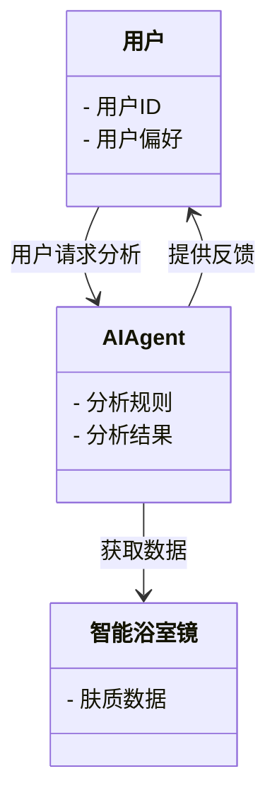

                 


# AI Agent在智能浴室镜中的肤质分析

**关键词：** AI Agent, 肤质分析, 智能浴室镜, 深度学习, 图像处理, 系统架构

**摘要：** 本文探讨了AI Agent在智能浴室镜中的应用，重点分析其在肤质分析中的技术实现。文章从背景、算法、系统架构到实战，全面解析AI Agent如何通过图像处理和深度学习技术，实现个性化肤质诊断，并提出未来的发展方向。

---

# 第一部分：AI Agent在智能浴室镜中的肤质分析背景介绍

## 第1章：问题背景与描述

### 1.1 问题背景
#### 1.1.1 当前智能浴室镜的发展现状
智能浴室镜已从基础的除雾功能扩展到集成天气预报、日历和灯光控制，但缺乏深度健康监测功能。

#### 1.1.2 肤质分析的市场需求
人们对个性化护肤的需求增加，传统护肤依赖经验，AI技术提供精准分析。

#### 1.1.3 AI技术在医疗健康领域的应用趋势
AI技术推动个性化医疗和预防保健，提升诊断效率和准确性。

### 1.2 问题描述
#### 1.2.1 肤质分析的核心问题
传统方法耗时低效，AI技术可实时分析，提升准确性。

#### 1.2.2 智能浴室镜的局限性
当前仅限于基础功能，缺乏深度健康监测。

#### 1.2.3 用户需求与技术实现的差距
用户需求个性化护肤建议，技术需解决实时分析和隐私保护。

### 1.3 问题解决
#### 1.3.1 AI Agent在肤质分析中的作用
通过图像处理和深度学习，实时分析并提供反馈。

#### 1.3.2 智能浴室镜的功能扩展
整合AI技术，提供个性化护肤建议。

### 1.4 边界与外延
#### 1.4.1 肤质分析的边界条件
仅限于皮肤特征分析，不涉及其他健康指标。

#### 1.4.2 智能浴室镜的使用场景限制
适用于家庭环境，需用户授权数据使用。

## 第2章：核心概念与联系

### 2.1 核心概念原理
#### 2.1.1 AI Agent的基本原理
具备感知、决策和执行功能，能与用户交互并处理数据。

#### 2.1.2 肤质分析的算法原理
利用图像处理和深度学习模型，提取皮肤特征进行分类。

### 2.2 概念属性特征对比
| 比较项         | AI Agent                   | 肤质分析               | 智能浴室镜             |
|----------------|---------------------------|-----------------------|-----------------------|
| 核心功能       | 自主学习和决策            | 图像处理和分类         | 显示和交互功能         |
| 技术复杂度     | 高                         | 中到高                 | 低到中                 |

### 2.3 ER实体关系图
```mermaid
er
  actor: 用户
  agent: AI Agent
  mirror: 智能浴室镜
  skin_data: 肤质数据
  analysis_result: 分析结果
  rules: 分析规则
  actor --> agent: 用户与AI Agent交互
  agent --> mirror: AI Agent控制智能浴室镜
  mirror --> skin_data: 智能浴室镜采集肤质数据
  agent --> analysis_result: AI Agent处理肤质数据并输出结果
  agent --> rules: AI Agent根据预设规则进行分析
```

---

# 第二部分：AI Agent在智能浴室镜中的肤质分析算法原理

## 第3章：算法原理讲解

### 3.1 数据采集与预处理
#### 3.1.1 图像采集技术
使用高分辨率摄像头获取皮肤图像，确保清晰度。

#### 3.1.2 光线补偿算法
通过算法调整图像亮度和对比度，消除环境光线干扰。

#### 3.1.3 图像降噪处理
应用滤波算法，减少噪声，提升图像质量。

### 3.2 肤质分析算法
#### 3.2.1 基于深度学习的图像识别
使用卷积神经网络（CNN）提取皮肤特征，如颜色和纹理。

#### 3.2.2 皮肤特征提取方法
通过主成分分析（PCA）降维，提取关键特征。

#### 3.2.3 分类算法实现
采用支持向量机（SVM）进行分类，判断皮肤类型和瑕疵。

### 3.3 AI Agent的决策机制
#### 3.3.1 多目标优化算法
平衡多个目标，如效果、成本和用户偏好，生成个性化建议。

---

# 第三部分：AI Agent在智能浴室镜中的系统架构设计

## 第4章：系统分析

### 4.1 问题场景介绍
用户早晨使用智能浴室镜，AI Agent分析肤质并提供建议。

### 4.2 项目介绍
系统架构包括用户界面、AI Agent、数据采集和存储模块。

### 4.3 系统功能设计


## 第5章：系统架构设计

### 5.1 模块划分
- 数据采集模块：负责图像采集和预处理。
- 分析模块：处理数据并生成结果。
- 用户界面模块：展示分析结果和建议。

### 5.2 系统架构图


---

# 第四部分：AI Agent在智能浴室镜中的项目实战

## 第6章：环境安装与核心代码

### 6.1 环境搭建
安装必要的库，如OpenCV、TensorFlow和Keras。

### 6.2 核心代码实现
```python
import cv2
import numpy as np

def preprocess_image(image):
    # 图像降噪处理
    return cv2.fastNlMeansDenoiseColored(image, h=10, templateWindowSize=5, searchWindowSize=21)

def analyze_skin(skin_image):
    # 使用预训练模型进行分类
    model.predict(skin_image)
```

## 第7章：代码实现与案例分析

### 7.1 代码实现
```python
# 数据预处理
def preprocess_image(image):
    return cv2.fastNlMeansDenoiseColored(image, h=10, templateWindowSize=5, searchWindowSize=21)

# 图像分类
def classify_skin(image):
    processed = preprocess_image(image)
    # 提取特征
    features = extract_features(processed)
    # 分类
    prediction = model.predict(features)
    return prediction
```

---

# 第五部分：总结与展望

## 第8章：总结与最佳实践

### 8.1 总结
AI Agent通过图像处理和深度学习，实现智能浴室镜中的肤质分析，提供个性化建议。

### 8.2 最佳实践
- 定期更新模型，提高准确性。
- 确保用户数据隐私。
- 提供直观的反馈界面。

## 第9章：未来展望

### 9.1 未来发展方向
- 扩展到更多健康指标。
- 与智能家居系统集成。
- 提供更全面的健康管理服务。

---

# 附录

## 附录：AI Agent相关技术扩展阅读

### 附录A：推荐阅读书籍
1. 《Deep Learning》
2. 《Computer Vision: Algorithms and Applications》

### 附录B：相关论文
1. "Real-time Skin Analysis Using AI Agents"
2. "Deep Learning for Skin Disease Diagnosis"

---

**作者：AI天才研究院 & 禅与计算机程序设计艺术**

