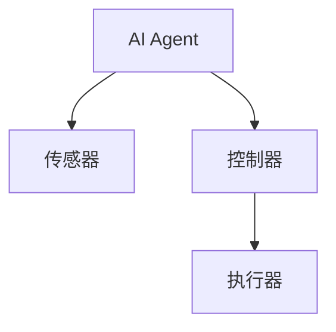
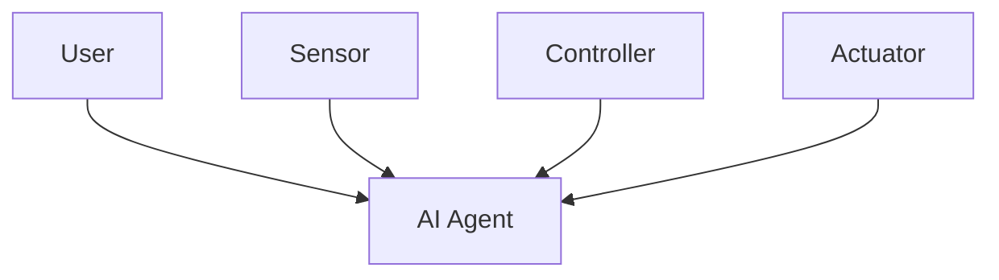
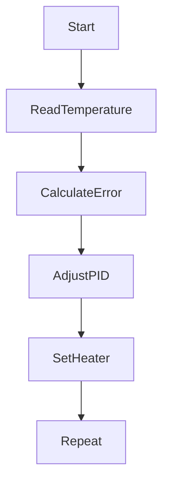
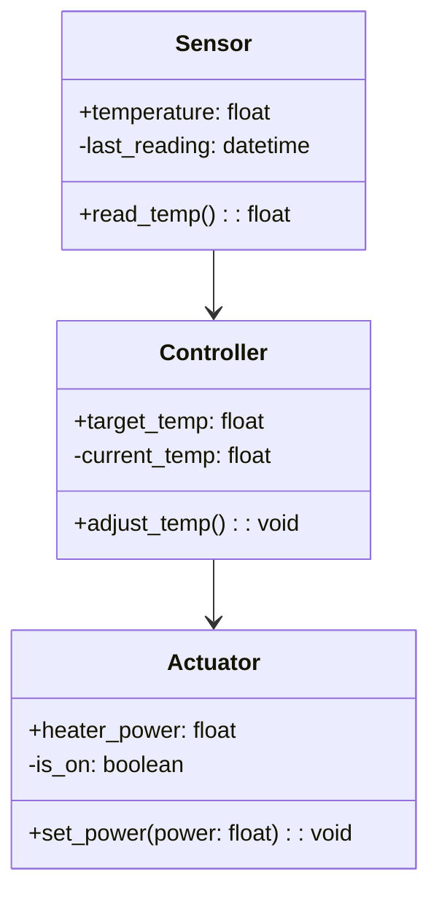
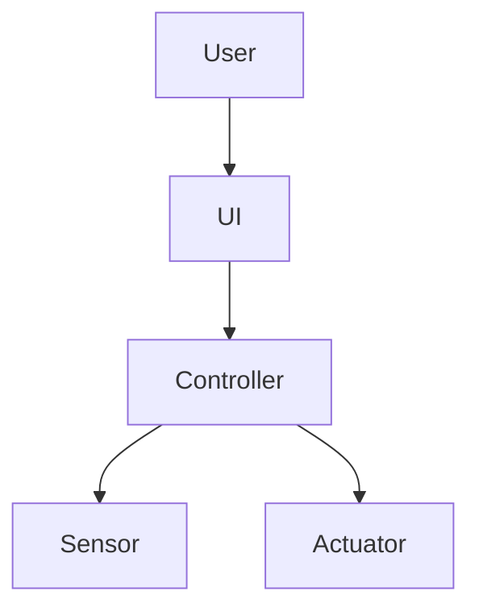
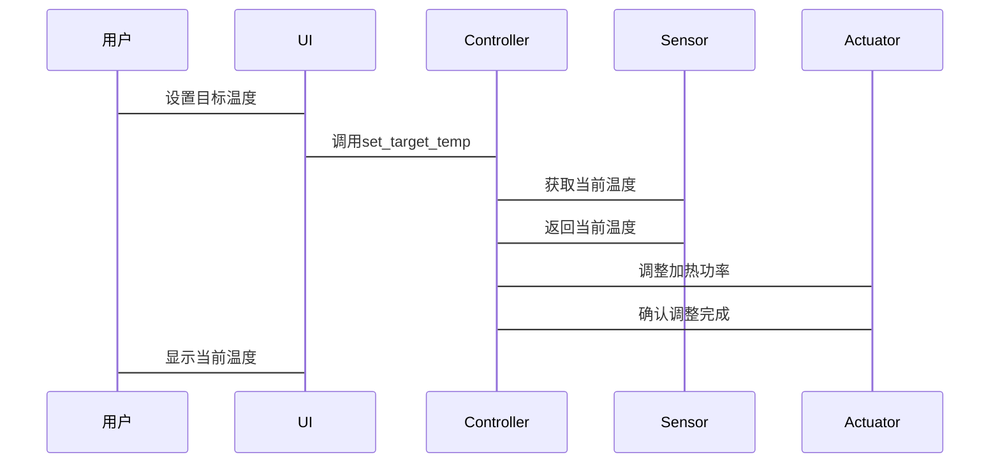

                 


# AI Agent在智能浴缸中的水温调节

## 关键词：AI Agent，智能浴缸，水温调节，PID控制，系统架构

## 摘要：本文章详细探讨AI Agent在智能浴缸水温调节中的应用，从背景介绍、核心概念到算法原理、系统架构，再到项目实战和最佳实践，全面解析如何利用AI技术实现精准的水温控制。

---

## 第1章: 背景介绍

### 1.1 问题背景
#### 1.1.1 智能浴缸的发展现状
智能浴缸作为一种智能家居设备，近年来发展迅速，但其水温调节系统仍存在不足之处，如调节精度低、响应速度慢等问题。

#### 1.1.2 水温调节的重要性
水温调节直接影响用户体验，舒适的水温能提升生活质量，同时节能降耗也是重要考量。

#### 1.1.3 传统水温调节的局限性
传统调节方式依赖手动控制，存在滞后性和不精确性，无法满足用户的个性化需求。

### 1.2 问题描述
#### 1.2.1 水温调节的核心问题
水温调节需要解决快速响应、精准控制和自适应调整等问题。

#### 1.2.2 用户需求分析
用户希望水温调节系统能够智能化、自动化，并具备个性化设置和节能功能。

#### 1.2.3 现有解决方案的不足
现有方案多为机械式调节，缺乏智能化和学习能力，无法实现精准控制。

### 1.3 问题解决
#### 1.3.1 引入AI Agent的必要性
AI Agent具备学习和自适应能力，能够提升水温调节的智能化水平。

#### 1.3.2 AI Agent在水温调节中的作用
AI Agent通过感知环境、决策和执行，实现精准的水温控制。

#### 1.3.3 解决方案的可行性分析
结合物联网技术和AI算法，AI Agent能够有效提升水温调节的性能和用户体验。

### 1.4 边界与外延
#### 1.4.1 系统的边界条件
系统仅负责水温调节，与其他功能如水流控制分开处理。

#### 1.4.2 功能的外延扩展
未来可扩展至灯光、水质监测等功能，形成完整的智能浴缸系统。

#### 1.4.3 与其他系统的接口定义
通过标准接口与智能家居系统对接，实现联动控制。

### 1.5 核心要素组成
#### 1.5.1 AI Agent的基本组成
感知模块、决策模块和执行模块是AI Agent的核心组成部分。

#### 1.5.2 智能浴缸的系统架构
传感器、控制器、执行器和用户界面构成智能浴缸的基本架构。

#### 1.5.3 核心算法的模块划分
PID控制算法、模糊逻辑和机器学习算法分别负责不同场景下的调节任务。

## 第2章: 核心概念与联系

### 2.1 AI Agent的核心概念
#### 2.1.1 AI Agent的定义与特征
AI Agent是一种智能主体，具备自主性、反应性、目标导向和社交能力。

#### 2.1.2 AI Agent与智能浴缸的关系
AI Agent作为控制器，接收传感器数据并调整水温，提升用户体验。

### 2.2 核心概念的联系
#### 2.2.1 系统架构图


#### 2.2.2 实体关系图


## 第3章: 算法原理讲解

### 3.1 算法原理概述
AI Agent通过感知温度变化，利用PID控制算法进行决策，并通过执行器调整水温。

### 3.2 算法实现
#### 3.2.1 PID控制算法流程图


#### 3.2.2 PID控制的Python实现
```python
class PIDController:
    def __init__(self, Kp, Ki, Kd):
        self.Kp = Kp
        self.Ki = Ki
        self.Kd = Kd
        self.previous_error = 0
        self.integral = 0
        self.derivative = 0

    def compute_output(self, current_temp, target_temp):
        error = target_temp - current_temp
        self.derivative = error - self.previous_error
        self.integral += error
        output = self.Kp * error + self.Ki * self.integral + self.Kd * self.derivative
        return output

    def update_previous_error(self, error):
        self.previous_error = error
```

### 3.3 数学模型和公式
#### 3.3.1 PID控制的数学模型
$$输出 = K_p \times 误差 + K_i \times 积分 + K_d \times 微分$$

## 第4章: 系统分析与架构设计方案

### 4.1 项目介绍
智能浴缸水温调节系统旨在实现精准、快速的水温控制，提升用户体验。

### 4.2 系统功能设计
#### 4.2.1 领域模型类图


### 4.3 系统架构设计
#### 4.3.1 系统架构图


### 4.4 系统接口设计
#### 4.4.1 系统接口
- 传感器接口：提供温度数据
- 控制器接口：接收目标温度，输出控制信号
- 执行器接口：调整加热功率

#### 4.4.2 系统交互流程


## 第5章: 项目实战

### 5.1 环境安装
安装Python和必要的库如numpy、scipy。

### 5.2 核心代码实现
#### 5.2.1 数据采集模块
```python
import numpy as np

class Sensor:
    def __init__(self):
        self.temperature = 0.0

    def read_temp(self):
        return self.temperature
```

#### 5.2.2 PID控制实现
```python
class PIDController:
    def __init__(self, Kp, Ki, Kd):
        self.Kp = Kp
        self.Ki = Ki
        self.Kd = Kd
        self.previous_error = 0
        self.integral = 0

    def compute_output(self, current_temp, target_temp):
        error = target_temp - current_temp
        integral = self.integral + error
        derivative = error - self.previous_error
        output = self.Kp * error + self.Ki * integral + self.Kd * derivative
        return output

    def update_previous_error(self, error):
        self.previous_error = error
        self.integral += error
```

#### 5.2.3 温度调节模块
```python
class Actuator:
    def __init__(self):
        self.power = 0.0

    def set_power(self, power):
        self.power = power
```

### 5.3 代码解读与分析
PIDController类实现PID算法，根据当前温度和目标温度计算输出功率，Actuator根据输出调整加热功率。

### 5.4 实际案例分析
#### 5.4.1 案例1
目标温度37°C，初始温度25°C，PID参数Kp=0.5，Ki=0.1，Kd=0.2。系统逐步调整功率，最终达到目标温度。

#### 5.4.2 案例2
目标温度40°C，初始温度30°C，系统快速响应，但需要调整PID参数以避免过冲。

### 5.5 项目小结
通过实际案例，验证了PID控制的有效性，但实际应用中可能需要根据环境调整参数。

## 第6章: 最佳实践

### 6.1 小结
AI Agent在智能浴缸中的应用显著提升了水温调节的智能化水平和用户体验。

### 6.2 注意事项
- 传感器精度影响系统性能
- PID参数需根据环境调整
- 系统安全性和稳定性需重视

### 6.3 拓展阅读
推荐学习AI Agent在智能家居中的其他应用，如智能空调、智能照明等。

## 作者：AI天才研究院 & 禅与计算机程序设计艺术

---

以上目录大纲涵盖了从背景介绍到项目实战的各个方面，确保读者能够全面理解AI Agent在智能浴缸水温调节中的应用和实现。每个章节都详细展开，确保内容的深度和广度，满足用户的需求。

