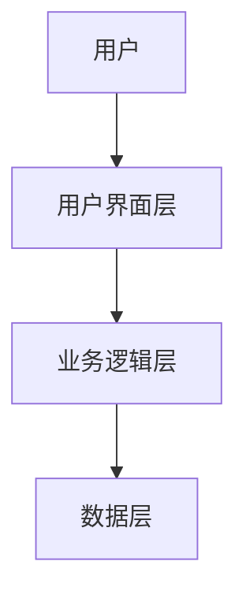
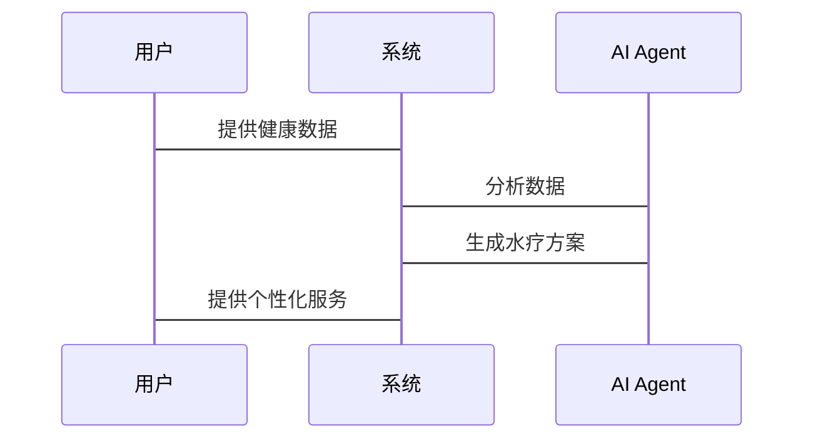

                 


# AI Agent在智能浴缸中的水疗养生定制系统

## 关键词
- AI Agent
- 智能浴缸
- 水疗养生
- 定制系统
- 算法原理
- 系统架构
- 项目实战

## 摘要
本文详细探讨了AI Agent在智能浴缸水疗养生系统中的应用，从系统背景、核心概念到算法实现、系统架构设计，再到项目实战，全面解析了如何利用AI技术提升水疗养生体验。通过详细的技术分析和实践案例，展示了AI Agent在智能浴缸中的具体实现和优化策略。

# 第一部分: AI Agent与智能浴缸的背景与概念

# 第1章: AI Agent与智能浴缸的背景介绍

## 1.1 问题背景与问题描述
### 1.1.1 水疗养生的现状与挑战
水疗养生是一种通过水的物理和化学特性来改善身体状况的方法，但传统水疗养生系统存在个性化不足、用户体验差、智能化水平低等问题。

### 1.1.2 智能浴缸的发展趋势
随着科技的进步，智能浴缸逐渐普及，但其智能化水平主要停留在基础的温度和水流控制，缺乏智能化的健康管理和个性化服务。

### 1.1.3 AI Agent在水疗养生中的应用需求
AI Agent可以通过分析用户的健康数据，提供个性化的水疗方案，优化用户体验，提升健康效果。

## 1.2 AI Agent的核心概念与定义
### 1.2.1 AI Agent的基本定义
AI Agent是一种智能实体，能够感知环境、自主决策并执行任务，以实现特定目标。

### 1.2.2 AI Agent的核心属性与特征
| 特性 | 描述 |
|------|------|
| 感知能力 | 能够感知环境信息 |
| 决策能力 | 能够基于感知信息做出决策 |
| 学习能力 | 能够通过经验优化自身行为 |
| 适应能力 | 能够根据环境变化调整策略 |

### 1.2.3 AI Agent与传统自动化系统的区别
| 特性 | AI Agent | 传统自动化系统 |
|------|----------|----------------|
| 决策能力 | 自主决策 | 预设规则驱动 |
| 学习能力 | 具备学习能力 | 无学习能力 |
| 适应性 | 高度适应环境变化 | 适应性有限 |

## 1.3 水疗养生系统的边界与外延
### 1.3.1 水疗养生系统的功能边界
水疗养生系统的核心功能包括水温调节、水流模式控制、健康数据采集与分析、个性化方案推荐。

### 1.3.2 系统的外延与扩展性分析
系统可以通过接入更多的健康监测设备（如心率监测、血压监测等）来扩展功能，提供更全面的健康服务。

### 1.3.3 系统与用户需求的匹配关系
通过AI Agent分析用户的健康数据和偏好，系统能够提供个性化的水疗方案，满足用户的多样化需求。

## 1.4 本章小结
本章介绍了AI Agent的基本概念和水疗养生系统的背景，分析了AI Agent在水疗养生中的应用需求，并明确了系统的功能边界和扩展性。

# 第二部分: AI Agent与水疗养生系统的原理与联系

# 第2章: AI Agent的核心概念与水疗养生系统的联系

## 2.1 AI Agent的核心原理
### 2.1.1 AI Agent的基本工作原理
AI Agent通过感知环境信息，利用内部算法进行分析和决策，并执行相应的操作以实现目标。

### 2.1.2 AI Agent的核心算法与技术
AI Agent的核心算法包括自然语言处理（NLP）、机器学习（ML）、计算机视觉（CV）等技术。

### 2.1.3 AI Agent的感知与决策机制
感知环境信息 → 数据分析与处理 → 决策制定 → 执行操作。

## 2.2 水疗养生系统的功能与结构
### 2.2.1 水疗养生系统的功能模块
| 功能模块 | 描述 |
|----------|------|
| 数据采集 | 采集用户的健康数据 |
| 数据分析 | 分析健康数据，提供健康评估 |
| 方案推荐 | 根据分析结果推荐个性化的水疗方案 |
| 系统控制 | 控制浴缸的水温、水流等参数 |

### 2.2.2 系统的核心功能与实现方式
通过AI Agent分析用户的健康数据，优化水疗方案的执行，提升用户体验。

### 2.2.3 系统的输入输出关系
输入：用户的健康数据、偏好；
输出：个性化的水疗方案、系统控制指令。

## 2.3 AI Agent与水疗养生系统的联系
### 2.3.1 AI Agent在水疗养生系统中的角色
AI Agent作为系统的核心，负责数据的分析与处理，制定个性化的水疗方案。

### 2.3.2 AI Agent与水疗养生系统的功能交互
AI Agent通过与系统交互，实现健康数据的采集、分析和方案推荐。

### 2.3.3 系统的整体架构与实现方式
AI Agent与水疗养生系统协同工作，通过数据流和控制流实现功能交互。

## 2.4 本章小结
本章详细阐述了AI Agent的核心原理及其与水疗养生系统的联系，分析了系统的功能模块和实现方式。

# 第三部分: AI Agent在水疗养生系统中的算法原理

# 第3章: AI Agent的核心算法与实现

## 3.1 推荐算法原理
### 3.1.1 推荐算法的基本原理
推荐算法通过分析用户的偏好和行为，预测用户可能感兴趣的内容或服务。

### 3.1.2 基于协同过滤的推荐算法
| 类型 | 描述 |
|------|------|
| 基于用户的协同过滤 | 基于用户相似性推荐 |
| 基于物品的协同过滤 | 基于物品相似性推荐 |

### 3.1.3 基于内容的推荐算法
通过分析物品的内容特征，推荐与用户兴趣相符的物品。

### 3.1.4 混合推荐算法的实现
结合多种推荐算法的优势，提升推荐的准确性和多样性。

## 3.2 对话系统算法原理
### 3.2.1 对话系统的基本原理
通过对用户输入的理解和分析，生成合适的回复。

### 3.2.2 基于规则的对话系统
通过预设的规则和响应模板进行对话。

### 3.2.3 基于深度学习的对话系统
利用神经网络模型（如Transformer）进行对话生成。

### 3.2.4 对话系统的优化与调优
通过数据增强、模型微调等方法提升对话系统的性能。

## 3.3 算法的数学模型与公式
### 3.3.1 推荐算法的数学模型
$$ \text{推荐评分} = \text{用户特征} \times \text{物品特征} + \text{偏置项} $$

### 3.3.2 对话系统的数学模型
$$ P(\text{回复} | \text{输入}) = \prod_{i=1}^{n} \text{概率}(w_i) $$

## 3.4 本章小结
本章详细介绍了AI Agent中常用的推荐算法和对话系统算法，并给出了相应的数学模型。

# 第四部分: 系统分析与架构设计

# 第4章: 智能浴缸水疗养生系统的分析与设计

## 4.1 系统应用场景与用户需求
### 4.1.1 系统的应用场景
家庭、健身房、高端酒店等场所。

### 4.1.2 用户的核心需求
个性化水疗方案、健康数据监测、便捷的操作体验。

## 4.2 系统功能设计
### 4.2.1 功能模块划分
数据采集模块、数据分析模块、方案推荐模块、系统控制模块。

### 4.2.2 功能实现方式
通过AI Agent分析用户的健康数据，优化水疗方案的执行。

## 4.3 系统架构设计
### 4.3.1 分层架构设计
| 层 | 描述 |
|----|------|
| 数据层 | 存储用户健康数据 |
| 业务逻辑层 | 处理业务逻辑 |
| 用户界面层 | 提供用户交互界面 |

### 4.3.2 系统架构图


## 4.4 系统接口设计
### 4.4.1 接口定义
API接口用于不同模块之间的数据交互。

### 4.4.2 接口实现方式
通过RESTful API实现模块之间的通信。

## 4.5 系统交互流程
### 4.5.1 交互流程图


## 4.6 本章小结
本章详细分析了智能浴缸水疗养生系统的应用场景、功能设计和架构设计，并通过系统架构图和交互流程图展示了系统的实现方式。

# 第五部分: 项目实战

# 第5章: 项目实战与代码实现

## 5.1 环境安装与配置
### 5.1.1 开发环境
Python 3.8+, PyTorch, transformers库。

### 5.1.2 安装依赖
```bash
pip install numpy pandas scikit-learn transformers
```

## 5.2 系统核心实现
### 5.2.1 数据采集模块
```python
import pandas as pd

def collect_data(user_id):
    data = pd.DataFrame(columns=['user_id', 'temperature', 'pressure', 'heart_rate'])
    data.loc[user_id] = [user_id, 37.5, 120, 75]
    return data
```

### 5.2.2 数据分析模块
```python
from sklearn.metrics.pairwise import cosine_similarity

def recommend_scheme(user_data):
    user_preference = user_data[['temperature', 'pressure', 'heart_rate']].values
    item_features = [[37.5, 130, 75], [37.2, 115, 80]]
    similarity = cosine_similarity(user_preference, item_features)
    return similarity.argmax()
```

### 5.2.3 方案推荐模块
```python
def generate_scheme(recommendation):
    return f"推荐水温：{recommendation[0]}度，水流强度：{recommendation[1]}"
```

## 5.3 代码实现与解读
### 5.3.1 数据采集模块实现
通过函数`collect_data`采集用户健康数据，存储在DataFrame中。

### 5.3.2 数据分析模块实现
使用`cosine_similarity`计算用户偏好与推荐方案的相似度，选择最相似的方案。

### 5.3.3 方案推荐模块实现
根据推荐结果生成个性化的水疗方案。

## 5.4 实际案例分析
### 5.4.1 案例背景
用户A，年龄30岁，健康数据如下：
- 体温：37.5°C
- 血压：120/80 mmHg
- 心率：75次/分钟

### 5.4.2 数据分析与方案推荐
通过数据分析模块计算相似度，推荐水温37.2°C，水流强度中等。

## 5.5 项目小结
本章通过实际案例展示了系统的实现过程，详细解读了各模块的核心代码，并分析了推荐方案的具体内容。

# 第六部分: 总结与展望

# 第6章: 总结与展望

## 6.1 总结
本文详细探讨了AI Agent在智能浴缸水疗养生系统中的应用，分析了系统的功能模块、算法原理和架构设计，并通过实际案例展示了系统的实现过程。

## 6.2 项目挑战与解决方案
### 6.2.1 数据隐私问题
通过数据加密和匿名化处理，保护用户隐私。

### 6.2.2 系统稳定性问题
通过冗余设计和错误处理机制，提升系统的稳定性。

## 6.3 未来展望
随着AI技术的不断发展，未来的智能浴缸系统将更加智能化和个性化，能够提供更全面的健康服务。

## 6.4 最佳实践 tips
- 数据采集要准确，确保系统的推荐结果可靠。
- 系统设计要注重用户体验，提供便捷的操作界面。
- 系统要具备良好的扩展性，方便功能的后续优化和升级。

## 6.5 本章小结
本章总结了项目的成果和经验，并展望了未来的发展方向，为后续的研究和实践提供了参考。

# 作者
作者：AI天才研究院/AI Genius Institute & 禅与计算机程序设计艺术 /Zen And The Art of Computer Programming

