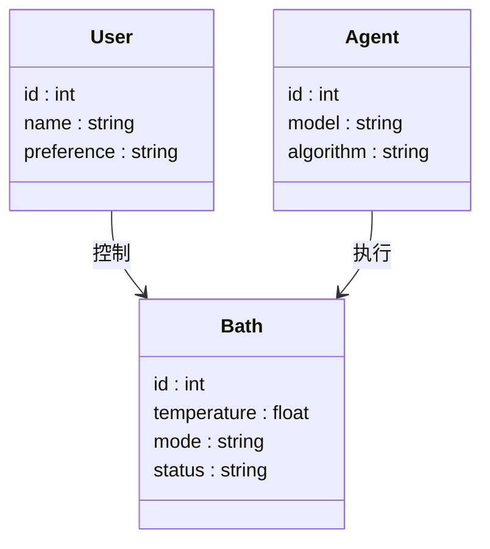
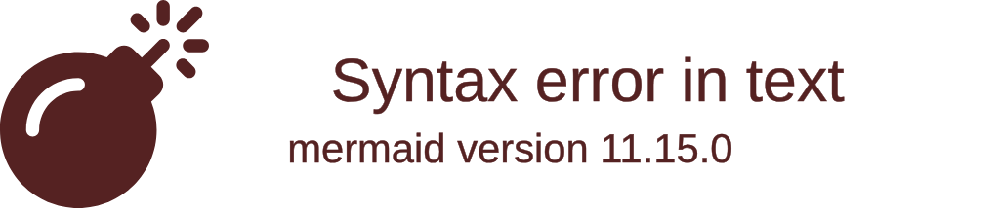

                 


# AI Agent在智能浴缸中的水疗模式定制

## 关键词
AI Agent, 智能浴缸, 水疗模式, 强化学习, 系统架构

## 摘要
本文详细探讨了AI Agent在智能浴缸水疗模式定制中的应用。从背景介绍到系统架构设计，再到项目实战，全面解析了如何利用AI技术提升用户体验。文章通过强化学习算法和系统架构设计，展示了AI Agent在智能浴缸中的实际应用，帮助读者理解并掌握相关技术。

---

# 第1章: AI Agent与智能浴缸的背景介绍

## 1.1 AI Agent的基本概念

### 1.1.1 什么是AI Agent
AI Agent（人工智能代理）是指能够感知环境并采取行动以实现目标的智能实体。它可以是一个软件程序或物理设备，通过传感器收集数据，利用算法做出决策，并通过执行机构完成任务。

### 1.1.2 AI Agent的核心功能
- **感知能力**：通过传感器或数据接口获取环境信息。
- **决策能力**：基于感知数据，利用算法做出决策。
- **执行能力**：通过执行机构或API实现操作。

### 1.1.3 AI Agent在智能设备中的应用
AI Agent广泛应用于智能家居、自动驾驶、医疗设备等领域。在智能浴缸中，AI Agent主要用于个性化水疗模式的定制与优化。

## 1.2 智能浴缸的发展现状

### 1.2.1 智能浴缸的定义与特点
智能浴缸是一种结合了物联网、人工智能和自动化技术的高端卫浴设备，能够根据用户需求自动调节水温、水流、按摩力度等参数。

### 1.2.2 智能浴缸的市场现状
随着智能家居的普及，智能浴缸市场增长迅速，用户对个性化服务的需求日益增加。

### 1.2.3 水疗模式定制的需求背景
用户对个性化水疗体验的需求，传统浴缸无法满足，AI Agent通过学习用户习惯，提供个性化定制服务。

## 1.3 本章小结
本章介绍了AI Agent的基本概念及其在智能浴缸中的应用背景，为后续章节奠定了基础。

---

# 第2章: AI Agent的核心原理

## 2.1 AI Agent的感知与决策机制

### 2.1.1 感知层的实现
通过传感器收集用户数据，如温度、压力、心率等。

### 2.1.2 决策层的算法
采用强化学习算法，通过不断试错优化水疗模式。

### 2.1.3 执行层的控制
根据决策结果，控制水泵、加热器等设备。

## 2.2 AI Agent的属性对比表

| 属性 | 描述 |
|------|------|
| 感知能力 | 数据采集与分析能力 |
| 决策能力 | 基于数据的决策算法 |
| 执行能力 | 系统控制与反馈机制 |

## 2.3 AI Agent的ER实体关系图

```mermaid
erDiagram
    user {
        +id : int
        +name : string
        +preference : string
    }
    bath {
        +id : int
        +temperature : float
        +mode : string
        +status : string
    }
    agent {
        +id : int
        +model : string
        +algorithm : string
    }
    user --> bath : 控制
    agent --> bath : 执行
```

## 2.4 本章小结
本章详细讲解了AI Agent的核心原理及其在智能浴缸中的应用，为后续章节奠定了理论基础。

---

# 第3章: 基于强化学习的水疗模式定制算法

## 3.1 强化学习的基本原理

### 3.1.1 强化学习的定义
强化学习是一种机器学习方法，通过试错机制优化决策策略。

### 3.1.2 状态、动作、奖励的定义
- **状态**：当前环境的输入数据。
- **动作**：AI Agent的选择。
- **奖励**：用户对水疗模式的反馈。

### 3.1.3 Q-learning算法的数学模型
$$ Q(s,a) = Q(s,a) + \alpha (r + \gamma \max Q(s',a) - Q(s,a)) $$

## 3.2 强化学习算法的实现步骤

```mermaid
graph TD
    A[开始] --> B[初始化Q表]
    B --> C[选择动作]
    C --> D[执行动作]
    D --> E[获取奖励]
    E --> F[更新Q值]
    F --> G[判断是否结束]
    G --> H[结束] 或者 G --> C[继续循环]
```

## 3.3 强化学习算法的Python实现

```python
import numpy as np

class AIAgent:
    def __init__(self, state_space, action_space):
        self.state_space = state_space
        self.action_space = action_space
        self.Q = np.zeros((state_space, action_space))
    
    def choose_action(self, state, epsilon=0.1):
        if np.random.random() < epsilon:
            return np.random.randint(self.action_space)
        return np.argmax(self.Q[state])
    
    def update_Q(self, state, action, reward, next_state, alpha=0.1, gamma=0.99):
        self.Q[state, action] += alpha * (reward + gamma * np.max(self.Q[next_state]) - self.Q[state, action])
```

## 3.4 本章小结
本章通过强化学习算法详细讲解了AI Agent在水疗模式定制中的实现，展示了如何通过试错优化用户体验。

---

# 第4章: 系统分析与架构设计方案

## 4.1 项目背景与目标
智能浴缸水疗模式定制系统的目标是通过AI Agent实现个性化水疗服务。

## 4.2 系统功能设计

### 4.2.1 领域模型



### 4.2.2 系统架构设计



### 4.2.3 接口设计
- 用户端：REST API
- 代理端：MQTT协议
- 设备端：GPIO控制

## 4.3 本章小结
本章详细设计了系统的架构和接口，为项目实施提供了指导。

---

# 第5章: 项目实战

## 5.1 环境安装与配置

### 5.1.1 安装Python环境
```bash
python -m pip install numpy scikit-learn
```

### 5.1.2 安装硬件设备
- 水泵、加热器、传感器等。

## 5.2 系统核心代码实现

### 5.2.1 AI Agent实现

```python
class WaterOxygenAgent(AIAgent):
    def __init__(self):
        super().__init__(state_space=10, action_space=5)
    
    def update_mode(self, state, action, reward, next_state):
        super().update_Q(state, action, reward, next_state)
```

### 5.2.2 水疗模式优化

```python
def optimize_mode(agent, initial_state):
    current_state = initial_state
    while not done:
        action = agent.choose_action(current_state)
        reward = evaluate_mode(current_state, action)
        next_state = get_next_state(current_state, action)
        agent.update_Q(current_state, action, reward, next_state)
        current_state = next_state
```

## 5.3 项目小结
本章通过实际案例展示了如何利用AI Agent实现智能浴缸的水疗模式定制，为读者提供了实践指导。

---

# 第6章: 最佳实践与注意事项

## 6.1 小结
AI Agent在智能浴缸中的应用前景广阔，通过强化学习算法可以实现个性化的水疗模式定制。

## 6.2 注意事项
- 确保数据安全与隐私保护。
- 定期维护系统，更新算法模型。

## 6.3 拓展阅读
- 推荐阅读《强化学习：算法与应用》。
- 关注AI在智能家居中的其他应用。

---

# 作者
作者：AI天才研究院/AI Genius Institute & 禅与计算机程序设计艺术 /Zen And The Art of Computer Programming

---

通过以上内容，我详细解析了AI Agent在智能浴缸水疗模式定制中的应用，从理论到实践，为读者提供了全面的技术指导。希望本文能为相关领域的研究和实践提供有价值的参考。

