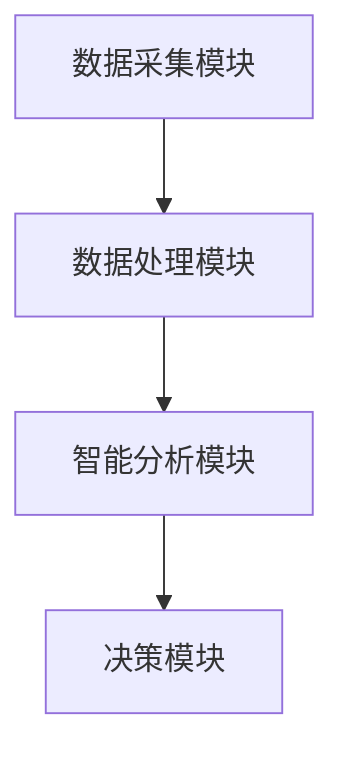

                 


# AI Agent在智能海洋资源勘探中的实践

## 关键词：
- AI Agent
- 海洋资源勘探
- 智能勘探系统
- 数据分析
- 机器学习

## 摘要：
本文探讨了AI Agent在智能海洋资源勘探中的应用，从背景、核心原理到技术实现和项目实战，详细分析了AI Agent如何提升海洋资源勘探的效率和准确性。通过具体案例和系统设计，展示了AI技术在海洋资源勘探中的巨大潜力。

---

# 第一部分: AI Agent与智能海洋资源勘探的背景与概述

## 第1章: AI Agent与智能海洋资源勘探的背景

### 1.1 AI Agent的基本概念

#### 1.1.1 AI Agent的定义
AI Agent（智能体）是能够感知环境并采取行动以实现目标的实体。它能够自主决策，适应环境变化，并与人类或其他系统进行交互。

#### 1.1.2 AI Agent的核心特征
- **自主性**：无需外部干预，自主决策。
- **反应性**：能够实时感知环境并做出反应。
- **主动性**：主动采取行动以实现目标。
- **社交能力**：能够与其他智能体或人类进行有效沟通与协作。

#### 1.1.3 AI Agent与传统自动化的区别
| 特性 | 传统自动化 | AI Agent |
|------|-------------|----------|
| 决策能力 | 无 | 自主决策 |
| 学习能力 | 无 | 可学习和适应 |
| 环境交互 | 单向 | 双向交互 |

### 1.2 智能海洋资源勘探的背景

#### 1.2.1 海洋资源的重要性
海洋蕴藏着丰富的资源，包括石油、天然气、矿产和生物资源。这些资源对全球经济至关重要。

#### 1.2.2 传统海洋资源勘探的局限性
- 数据量大，处理复杂。
- 成本高昂，效率低下。
- 人员依赖性强，难以实时调整策略。

#### 1.2.3 智能化勘探的必要性
通过AI技术提升勘探效率和准确性，降低成本，减少对人员的依赖。

## 第2章: AI Agent在海洋资源勘探中的应用现状

### 2.1 海洋资源勘探的主要领域

#### 2.1.1 石油与天然气勘探
AI Agent用于分析地震数据，预测储层分布，优化钻井位置。

#### 2.1.2 矿产资源勘探
利用AI分析海底地形和岩石样本，识别矿产分布。

#### 2.1.3 海洋生物资源勘探
通过AI识别和分类海洋生物，评估生物多样性。

### 2.2 AI Agent在勘探中的优势

#### 2.2.1 提高勘探效率
AI能够快速处理海量数据，发现潜在资源。

#### 2.2.2 降低勘探成本
通过数据驱动决策，减少不必要的勘探活动。

#### 2.2.3 提升数据处理能力
AI能够从复杂数据中提取有价值的信息，提高勘探准确性。

---

# 第二部分: AI Agent的核心原理与技术实现

## 第3章: AI Agent的核心原理

### 3.1 AI Agent的基本架构

#### 3.1.1 感知层
负责数据采集和环境感知。

#### 3.1.2 决策层
基于感知数据做出决策。

#### 3.1.3 执行层
执行决策并反馈结果。

### 3.2 AI Agent的核心算法

#### 3.2.1 机器学习算法
- **监督学习**：用于分类和回归任务。
- **无监督学习**：用于聚类和异常检测。
- **深度学习**：用于复杂模式识别。

#### 3.2.2 自然语言处理算法
用于处理和分析文本数据，如地质报告。

#### 3.2.3 计算机视觉算法
用于图像识别和处理，如卫星影像分析。

## 第4章: AI Agent在海洋资源勘探中的技术实现

### 4.1 数据采集与处理

#### 4.1.1 海洋传感器数据采集
通过传感器获取海洋环境数据，如温度、盐度和压力。

#### 4.1.2 数据预处理与清洗
去除噪声，标准化数据，确保数据质量。

#### 4.1.3 数据特征提取
提取关键特征，如地质构造和岩石类型。

### 4.2 算法模型的构建与训练

#### 4.2.1 神经网络模型的选择
选择适合任务的模型，如卷积神经网络（CNN）和循环神经网络（RNN）。

#### 4.2.2 模型训练与优化
使用训练数据训练模型，并通过调参优化性能。

#### 4.2.3 模型评估与调优
评估模型的准确性和鲁棒性，进行必要的调整。

---

# 第三部分: 海洋资源勘探系统的架构设计

## 第5章: 海洋资源勘探系统的整体架构

### 5.1 系统功能模块划分

#### 5.1.1 数据采集模块
负责采集海洋环境数据。

#### 5.1.2 数据处理模块
处理和预处理数据，提取特征。

#### 5.1.3 智能分析模块
应用AI算法进行资源预测和分析。

### 5.2 系统架构图


## 第6章: 系统功能设计与实现

### 6.1 数据采集与传输

#### 6.1.1 海洋传感器网络部署
部署传感器网络，实时采集海洋数据。

#### 6.1.2 数据传输
通过网络将数据传输到处理中心。

---

# 第四部分: 项目实战与案例分析

## 第7章: 项目实战

### 7.1 环境配置与安装

#### 7.1.1 系统环境
- 操作系统：Linux
- 语言：Python 3.8+
- 框架：TensorFlow 2.0+

### 7.2 系统核心实现

#### 7.2.1 数据预处理代码
```python
import numpy as np
import pandas as pd

# 读取数据
data = pd.read_csv('ocean_data.csv')

# 数据清洗
data.dropna(inplace=True)
data['label'] = data['label'].astype(int)
```

#### 7.2.2 神经网络模型实现
```python
import tensorflow as tf
from tensorflow.keras import layers

model = tf.keras.Sequential([
    layers.Dense(64, activation='relu', input_shape=(input_dim,)),
    layers.Dense(32, activation='relu'),
    layers.Dense(1, activation='sigmoid')
])

model.compile(optimizer='adam', loss='binary_crossentropy', metrics=['accuracy'])
```

### 7.3 实际案例分析

#### 7.3.1 案例介绍
分析海底油气田的勘探案例，使用AI Agent预测储层分布。

#### 7.3.2 数据分析与结果解读
展示AI Agent预测的结果，并与实际数据对比，评估准确性。

---

# 第五部分: 总结与展望

## 第8章: 总结与展望

### 8.1 全文总结
AI Agent在海洋资源勘探中发挥了重要作用，提高了效率和准确性。

### 8.2 未来展望
随着AI技术的发展，AI Agent在海洋资源勘探中的应用将更加广泛和深入。

---

# 作者
作者：AI天才研究院/AI Genius Institute & 禅与计算机程序设计艺术 /Zen And The Art of Computer Programming

