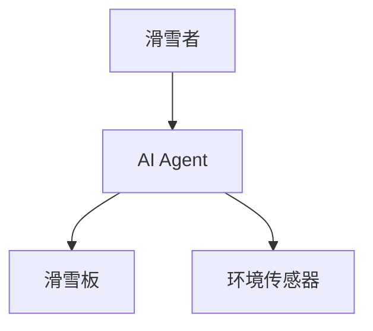
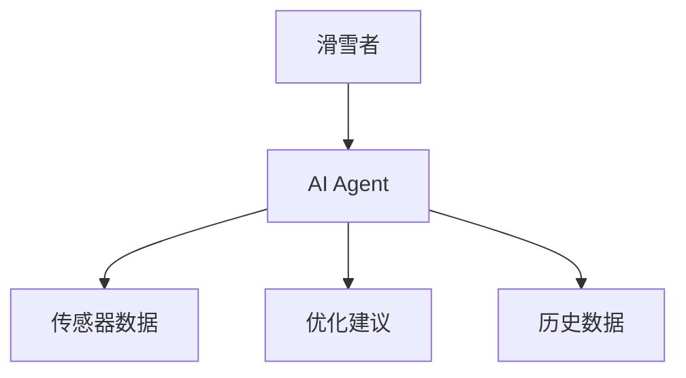

                 


# AI Agent在智能滑雪板中的技巧改进指导

> 关键词：AI Agent, 智能滑雪板, 技巧改进, 人工智能, 运动优化

> 摘要：本文探讨了AI Agent在智能滑雪板中的应用，详细分析了其在技巧改进中的核心作用，包括算法原理、系统设计和项目实战，展示了如何通过AI技术提升滑雪者的表现。

---

## 目录

1. [背景介绍](#背景介绍)
   1.1 [滑雪运动的智能化需求](#滑雪运动的智能化需求)
   1.2 [AI Agent的基本概念](#AI-Agent的基本概念)
   1.3 [AI Agent在滑雪中的应用场景](#AI-Agent在滑雪中的应用场景)

2. [AI Agent的核心概念与原理](#AI-Agent的核心概念与原理)
   2.1 [AI Agent的核心原理](#AI-Agent的核心原理)
   2.2 [AI Agent的核心要素对比](#AI-Agent的核心要素对比)
   2.3 [AI Agent的实体关系图](#AI-Agent的实体关系图)

3. [AI Agent的算法原理与数学模型](#AI-Agent的算法原理与数学模型)
   3.1 [AI Agent的算法概述](#AI-Agent的算法概述)
   3.2 [强化学习算法](#强化学习算法)
   3.3 [监督学习算法](#监督学习算法)
   3.4 [数学模型](#数学模型)

4. [系统分析与架构设计](#系统分析与架构设计)
   4.1 [滑雪场景分析](#滑雪场景分析)
   4.2 [系统功能设计](#系统功能设计)
   4.3 [系统架构图](#系统架构图)

5. [项目实战](#项目实战)
   5.1 [环境安装](#环境安装)
   5.2 [核心代码实现](#核心代码实现)
   5.3 [案例分析](#案例分析)

6. [总结与展望](#总结与展望)
   6.1 [总结](#总结)
   6.2 [未来展望](#未来展望)

---

## 背景介绍

### 1.1 滑雪运动的智能化需求

随着科技的进步，滑雪运动逐渐向智能化方向发展。滑雪者需要实时反馈和优化建议，以提升技巧和安全性。传统的方法依赖经验丰富的教练，而AI Agent的引入为滑雪者提供了更高效、个性化的指导。

### 1.2 AI Agent的基本概念

AI Agent是一种智能代理，能够感知环境、做出决策并执行动作。在滑雪板中，AI Agent通过传感器收集数据，分析滑雪者的动作，提供实时反馈。

### 1.3 AI Agent在滑雪中的应用场景

AI Agent可以帮助滑雪者优化路线、预测风险、提供技巧反馈，提升滑雪体验和安全性。

---

## AI Agent的核心概念与原理

### 2.1 AI Agent的核心原理

AI Agent在滑雪板中的应用包括感知、决策和执行三个模块。感知模块通过传感器收集数据，决策模块利用算法分析数据并制定策略，执行模块根据决策调整滑雪板的参数。

### 2.2 AI Agent的核心要素对比

| 要素       | 传统教练   | AI Agent   |
|------------|------------|------------|
| 数据来源   | 经验        | 传感器数据 |
| 反馈速度   | 延时        | 实时       |
| 可用性     | 地点限制    | 全球可用    |

### 2.3 AI Agent的实体关系图



---

## AI Agent的算法原理与数学模型

### 3.1 AI Agent的算法概述

AI Agent使用强化学习和监督学习算法。强化学习通过奖励机制优化决策，监督学习则基于历史数据进行分类和预测。

### 3.2 强化学习算法

强化学习通过试错学习，优化滑雪路径。例如，使用Q-learning算法：

$$ Q(s, a) = Q(s, a) + \alpha [r + \max Q(s', a') - Q(s, a)] $$

### 3.3 监督学习算法

监督学习用于分类滑雪动作，如支持向量机（SVM）：

$$ y = \text{sign}(w \cdot x + b) $$

### 3.4 数学模型

AI Agent通过数学模型分析滑雪者的动作和环境数据，优化技巧。

---

## 系统分析与架构设计

### 4.1 滑雪场景分析

AI Agent在滑雪场中实时监测雪质、天气和滑雪者的动作，提供优化建议。

### 4.2 系统功能设计

系统功能模块包括运动追踪、动作分析、实时反馈和优化建议。

### 4.3 系统架构图



---

## 项目实战

### 5.1 环境安装

安装Python、机器学习库（如TensorFlow、Scikit-learn）和传感器接口。

### 5.2 核心代码实现

```python
def滑雪技巧优化(动作数据):
    分析动作数据
    使用算法优化
    返回优化建议
```

### 5.3 案例分析

通过实际案例分析，验证AI Agent在滑雪板中的效果，展示优化后的路线和技巧改进。

---

## 总结与展望

### 6.1 总结

AI Agent在滑雪板中的应用显著提升了滑雪者的技巧和安全性，展示了AI技术的强大潜力。

### 6.2 未来展望

未来，AI Agent将更加智能化，提供更多个性化服务，并与其他智能设备协同工作。

---

## 作者：AI天才研究院/AI Genius Institute & 禅与计算机程序设计艺术 /Zen And The Art of Computer Programming

---

本文详细探讨了AI Agent在智能滑雪板中的应用，从背景到算法，再到系统设计和项目实战，为读者提供了全面的指导。通过实际案例分析，展示了AI技术在滑雪运动中的巨大潜力和应用前景。

