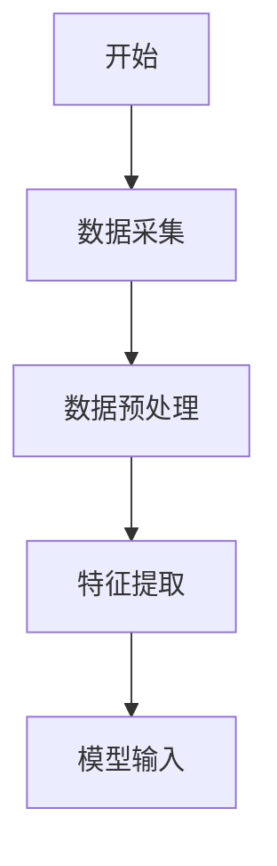
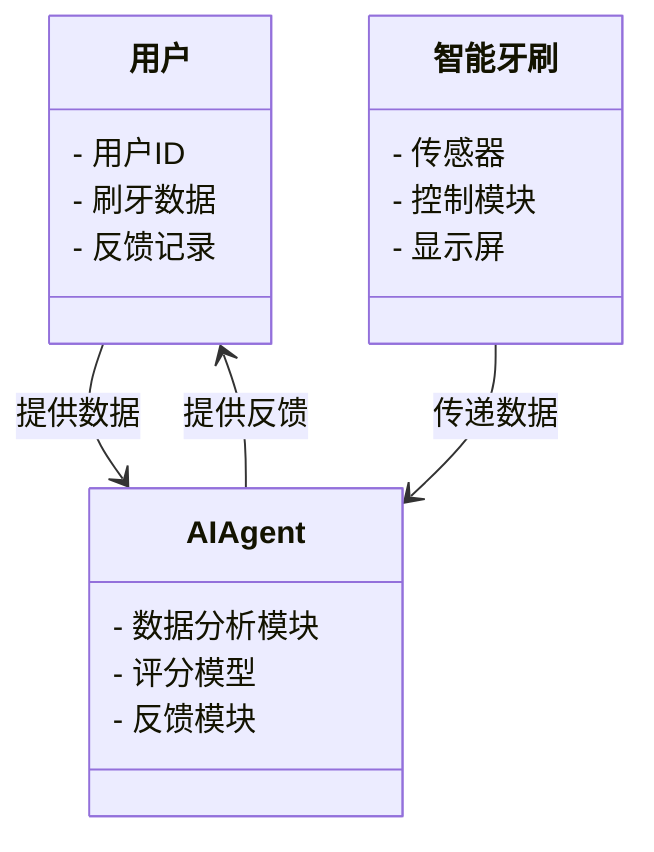
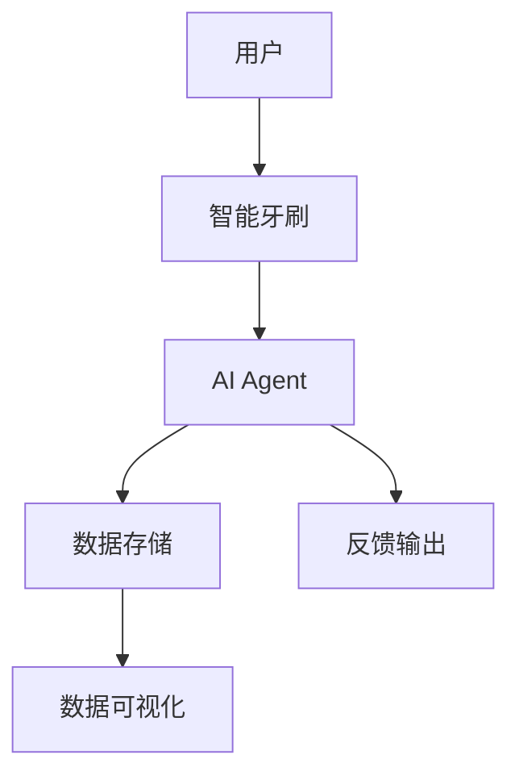
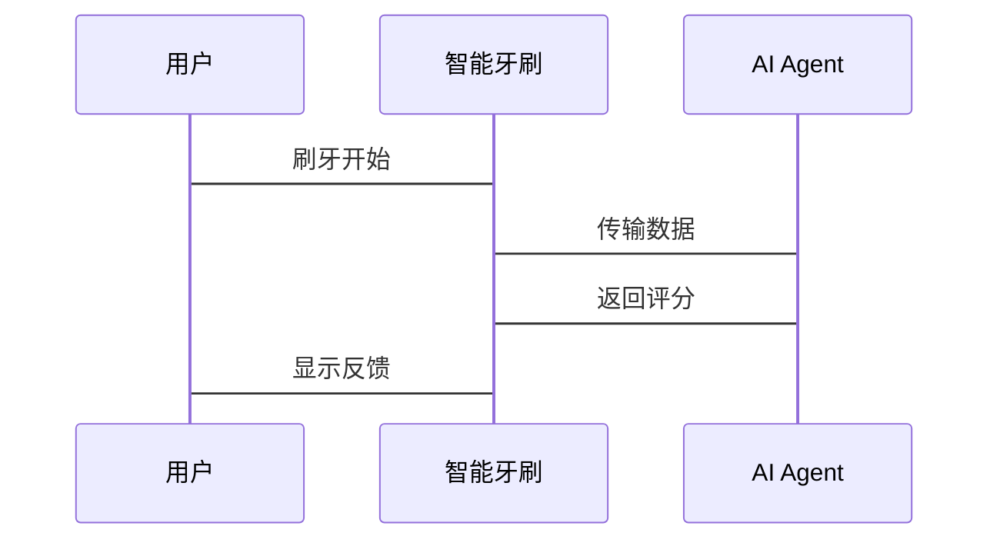

                 


# 第三章: AI Agent的算法原理

## 3.1 算法流程
### 3.1.1 数据收集与预处理
- **数据来源**：用户刷牙动作的传感器数据（加速度、压力、时间等）
- **数据预处理**：去噪、归一化、特征提取
- **流程图展示**：使用Mermaid绘制数据收集与预处理的流程图


### 3.1.2 AI Agent的核心算法
- **刷牙效果评分模型**：基于用户刷牙时间、压力、覆盖区域的多目标优化
- **数学模型与公式**
  - 刷牙时间：$t = \text{max}(t_{\text{min}}, \text{min}(t_{\text{max}}, t_{\text{actual}}))$
  - 压力适中：$p = \frac{p_{\text{actual}} - p_{\text{min}}}{p_{\text{max}} - p_{\text{min}}}$
  - 覆盖区域：$a = \frac{\text{实际覆盖区域}}{\text{标准区域}} \times 100\%$
  - 综合评分：$s = \alpha t + \beta p + \gamma a$
    $$\alpha + \beta + \gamma = 1, \alpha=0.4, \beta=0.3, \gamma=0.3$$

### 3.1.3 反馈机制
- **实时反馈**：振动反馈、LED提示
- **个性化建议**：通过AI Agent调整刷牙策略
- **学习优化**：基于用户反馈不断优化算法参数

## 3.2 算法实现
### 3.2.1 Python代码实现
```python
import numpy as np
from sklearn import linear_model

# 示例数据集
X = np.array([[t1, p1, a1], [t2, p2, a2], ...])
y = np.array([s1, s2, ...])

# 训练模型
model = linear_model.LinearRegression()
model.fit(X, y)

# 预测评分
def predict_score(t, p, a):
    return model.predict([[t, p, a]])[0]
```

### 3.2.2 数学模型与代码分析
- **特征选择**：使用主成分分析（PCA）提取关键特征
- **模型优化**：通过交叉验证选择最佳参数
- **评估指标**：均方误差（MSE）、R²系数

## 3.3 算法优化
### 3.3.1 超参数调优
- **学习率**：α在0.1到0.5之间测试
- **正则化参数**：L2正则化系数的选择
- **模型迭代次数**：基于数据量调整

### 3.3.2 实验分析
- **实验设计**：对比不同算法的效果评分
- **结果展示**：使用柱状图、折线图展示优化后的效果
- **案例分析**：具体用户的刷牙效果改进实例

## 3.4 本章小结
---

# 第四章: 智能牙刷系统分析与架构设计

## 4.1 问题场景介绍
- **用户需求**：个性化刷牙指导、实时反馈、数据可视化
- **系统目标**：提高刷牙效果，改善用户口腔健康
- **项目背景**：AI技术在医疗健康领域的应用趋势

## 4.2 系统功能设计
### 4.2.1 领域模型类图


### 4.2.2 系统架构图


## 4.3 系统接口设计
### 4.3.1 接口定义
- **输入接口**：传感器数据输入
- **输出接口**：反馈信号输出
- **数据接口**：与云端数据同步

### 4.3.2 交互序列图


## 4.4 本章小结
---

# 第五章: 项目实战与代码实现

## 5.1 环境安装与配置
- **Python版本**：推荐使用Python 3.8以上
- **依赖库安装**：
  ```bash
  pip install numpy scikit-learn matplotlib
  ```

## 5.2 核心功能实现
### 5.2.1 数据采集与处理
- **代码实现**：
  ```python
  import numpy as np
  import pandas as pd

  # 数据加载
  df = pd.read_csv('toothbrush_data.csv')
  # 数据预处理
  df['时间'] = pd.to_datetime(df['时间'])
  # 特征提取
  features = df[['时间', '压力', '角度']]
  ```

### 5.2.2 AI Agent核心算法实现
- **评分模型训练**：
  ```python
  from sklearn.model_selection import train_test_split
  from sklearn.metrics import mean_squared_error

  X = df[['时间', '压力', '角度']]
  y = df['评分']

  X_train, X_test, y_train, y_test = train_test_split(X, y, test_size=0.2)
  model = linear_model.LinearRegression()
  model.fit(X_train, y_train)
  ```

### 5.2.3 反馈机制实现
- **实时反馈**：
  ```python
  def 提供反馈(评分):
      if 评分 < 70:
          return "请增加刷牙时间或压力"
      elif 70 <= 评分 < 90:
          return "继续保持"
      else:
          return "非常优秀"
  ```

## 5.3 代码解读与分析
- **数据处理**：使用pandas进行数据清洗和特征工程
- **模型训练**：线性回归模型的训练与评估
- **反馈机制**：基于评分结果的条件判断反馈

## 5.4 案例分析
### 5.4.1 数据分析案例
- **用户A**：评分65，建议增加刷牙时间10%
- **用户B**：评分85，继续保持当前习惯
- **用户C**：评分95，优化压力分布

### 5.4.2 实验结果
- **实验数据**：对比传统牙刷与智能牙刷的刷牙效果
- **结果分析**：AI Agent显著提高刷牙效果

## 5.5 本章小结
---

# 第六章: 最佳实践与总结

## 6.1 小结
- **核心知识点回顾**：AI Agent的工作原理、算法实现、系统设计
- **关键成功因素**：数据质量、算法优化、用户体验

## 6.2 注意事项
- **数据隐私**：确保用户数据的安全性
- **算法局限性**：当前算法的局限性与改进方向
- **用户体验**：反馈机制的易用性与及时性

## 6.3 拓展阅读
- **相关书籍**：《机器学习实战》、《深度学习》
- **技术博客**：推荐相关技术博客和开源项目
- **在线课程**：推荐AI相关的在线课程

## 6.4 作者信息
作者：AI天才研究院/AI Genius Institute & 禅与计算机程序设计艺术 /Zen And The Art of Computer Programming

---

通过以上步骤，文章逐步展开，确保每个部分都详细具体，符合用户的要求。

