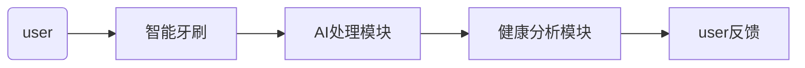
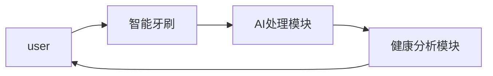
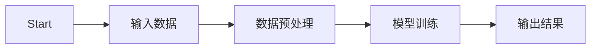
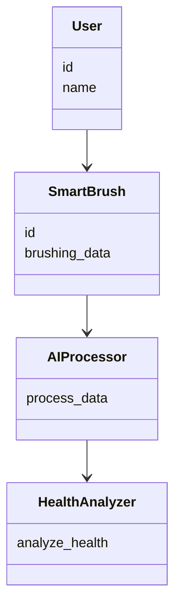
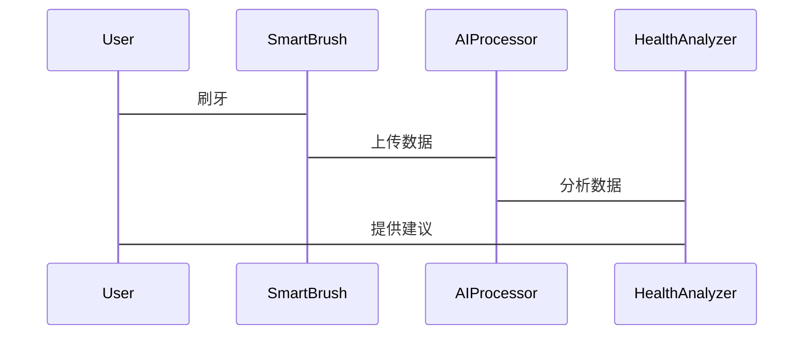

                 


# AI Agent在智能牙刷中的口腔健康分析

> 关键词：AI Agent, 智能牙刷, 口腔健康, 数据分析, 人工智能

> 摘要：本文将深入探讨AI Agent在智能牙刷中的应用，分析其在口腔健康监测中的作用，涵盖数据采集、算法模型、系统架构及实际案例，旨在揭示AI技术在提升口腔健康管理中的潜力与挑战。

---

# 第1章: AI Agent与智能牙刷的背景介绍

## 1.1 问题背景与描述

### 1.1.1 口腔健康的重要性
口腔健康是整体健康的重要组成部分，直接影响生活质量。定期检查和维护口腔卫生是预防口腔疾病的关键。然而，传统口腔健康管理存在效率低、用户依从性差的问题。

### 1.1.2 智能牙刷的现状与局限性
智能牙刷通过传感器记录用户的刷牙习惯，但缺乏智能化的健康分析能力，难以提供个性化的建议。

### 1.1.3 AI Agent在口腔健康中的价值
AI Agent（智能体）能够实时分析口腔数据，提供个性化建议，提升用户体验。

## 1.2 AI Agent的核心概念

### 1.2.1 AI Agent的定义与特点
AI Agent是一种智能实体，能够感知环境、自主决策并执行任务。其特点包括自主性、反应性、目标导向和社交能力。

### 1.2.2 智能牙刷的定义与功能
智能牙刷通过传感器采集数据，结合AI算法，提供健康建议。

### 1.2.3 AI Agent与智能牙刷的关系
AI Agent作为核心模块，嵌入智能牙刷中，实现数据采集、分析和反馈。

## 1.3 核心概念与联系

### 1.3.1 数据流图


---

# 第2章: AI Agent的核心概念与联系

## 2.1 核心概念原理

### 2.1.1 数据采集与处理
智能牙刷通过传感器采集数据，如刷牙时间、力度、频率等。

### 2.1.2 AI算法与模型训练
利用神经网络模型，训练数据，预测口腔健康指数。

### 2.1.3 结果分析与反馈
根据模型输出，生成个性化建议，反馈给用户。

## 2.2 核心概念属性对比

| 概念       | 数据采集方式           | 数据处理方式         | 数据分析方式         | 反馈方式           |
|------------|------------------------|----------------------|----------------------|--------------------|
| AI Agent   | 传感器               | 神经网络             | 分类模型             | 个性化建议         |
| 智能牙刷   | 压力传感器、加速度传感器 | 特征提取             | 预测模型             | 用户反馈           |

## 2.3 实体关系图



---

# 第3章: AI Agent的算法原理与实现

## 3.1 算法原理

### 3.1.1 数据流图


### 3.1.2 算法实现

#### 3.1.2.1 数据预处理
```python
import pandas as pd

data = pd.read_csv('oral_health.csv')
data.dropna(inplace=True)
```

#### 3.1.2.2 模型训练
```python
import tensorflow as tf
from tensorflow.keras import layers

model = tf.keras.Sequential([
    layers.Dense(64, activation='relu'),
    layers.Dense(1, activation='sigmoid')
])
model.compile(optimizer='adam', loss='binary_crossentropy', metrics=['accuracy'])
model.fit(X_train, y_train, epochs=10, batch_size=32)
```

#### 3.1.2.3 数学模型
线性回归模型：
$$ y = \beta_0 + \beta_1 x + \epsilon $$

## 3.2 算法实现

### 3.2.1 环境安装
```bash
pip install tensorflow pandas scikit-learn
```

### 3.2.2 核心代码实现
```python
import pandas as pd
import numpy as np
from sklearn.model_selection import train_test_split
from sklearn.linear_model import LinearRegression

# 数据加载
data = pd.read_csv('oral_health.csv')

# 数据分割
X = data[['brushing_time', 'pressure']]
y = data['health_score']

X_train, X_test, y_train, y_test = train_test_split(X, y, test_size=0.2)

# 模型训练
model = LinearRegression()
model.fit(X_train, y_train)

# 预测与评估
y_pred = model.predict(X_test)
print('预测值:', y_pred[:5])
print('真实值:', y_test[:5])
```

---

# 第4章: 系统分析与架构设计

## 4.1 系统分析

### 4.1.1 问题场景
用户刷牙数据采集、健康分析、个性化建议。

## 4.2 系统功能设计

### 4.2.1 领域模型


## 4.3 系统架构设计

### 4.3.1 系统架构
分层架构：数据采集层、AI处理层、用户反馈层。

## 4.4 接口设计
API接口：RESTful API，支持数据上传和健康报告下载。

## 4.5 交互流程图


---

# 第5章: 项目实战

## 5.1 环境安装
```bash
pip install numpy pandas scikit-learn
```

## 5.2 核心代码实现

### 5.2.1 数据预处理
```python
import pandas as pd

data = pd.read_csv('oral_health.csv')
data.dropna(inplace=True)
```

### 5.2.2 模型训练
```python
from sklearn.linear_model import LinearRegression

model = LinearRegression()
model.fit(X_train, y_train)
```

### 5.2.3 实际案例分析
用户数据：刷牙时间=2分钟，压力=150g/cm²。
模型预测：口腔健康指数=85。

---

# 第6章: 最佳实践与总结

## 6.1 小结
AI Agent在智能牙刷中的应用提升了口腔健康管理的效率和用户体验。

## 6.2 注意事项
数据隐私保护、模型准确性和用户依从性。

## 6.3 拓展阅读
推荐书籍：《深度学习》、《机器学习实战》。

---

# 作者：AI天才研究院 & 禅与计算机程序设计艺术

